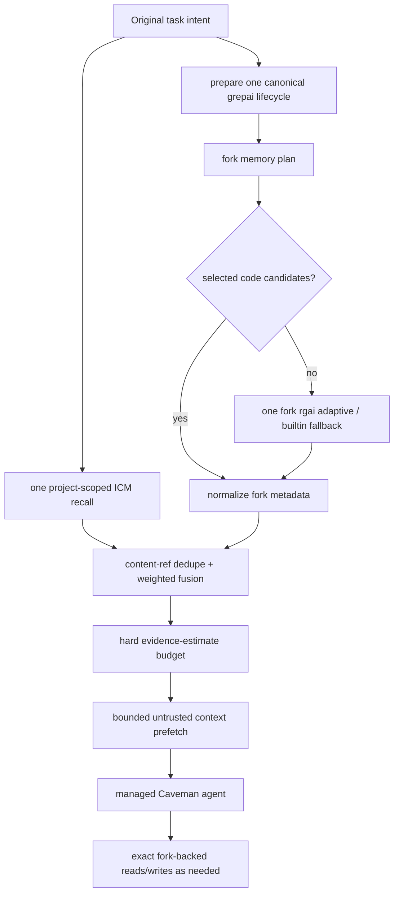

# HZR 0.6.2 — fork-core parity ledger

**Audit date:** 2026-08-26
**Status:** HZR 0.6.2 retains the 0.6.1 guard correction on the 0.6.0 audit delta; full deterministic gate green
**Import baseline:** exact `heAdz0r/rtk` worktree snapshot `0.44.1-fork.1` at HZR tag `v0.1.0`
**Current runtime core:** HZR-owned evolvable `fork-core/rtk`, derived from that complete baseline

This ledger distinguishes between four verifiable assertions:

1. The full fork source is present in HZR byte-for-byte.
2. This source is collected and goes through its own regression suite.
3. Production routes actually call it, and not partial HZR reimplementation.
4. grepai, ICM and Caveman are connected around the fork through one control plane without duplicate stores/tools.

## Locked fork identity

|Field|Meaning|
|---|---|
| Source | `https://github.com/heAdz0r/rtk.git` |
| Branch at capture | `feat/upstream-0.42-fork.1` |
| Source HEAD | `5f403c465cbdbe148e9ca03e0ac8e856eef0bfee` |
| Effective version | `0.44.1-fork.1` |
| Included files | 516 existing tracked/untracked non-ignored files |
| Recorded tracked deletions | 4 |
| Canonical snapshot schema | `hzr-fork-snapshot-v2-tsv`, hex-encoded paths |
| Canonical snapshot SHA-256 | `f4296ec404f461d6fc03c966c0dc79caee6c3118a73d1ed1a078ded5529f0a16` |
| Preserved v1 content digest | `072a62adc754b728ec99a507d2c1a223d83077d067a9249a26d357eec890b4cc` |
| Source diff SHA-256 | `37551ca1f2ac13661923b5c2225465c9538af6f3b146e6782158257d2dcc5fbc` |
| Source status SHA-256 | `cc3d82662a190ffcc5f9e7cd8bfff3dec985fd1a068bc58acc40c62fec8d69d4` |
| Runtime source | [`fork-core/rtk`](fork-core/rtk) |
| Canonical manifest | [`fork-core/SNAPSHOT_V2.tsv`](fork-core/SNAPSHOT_V2.tsv) |
| Metadata | [`fork-core/SNAPSHOT.toml`](fork-core/SNAPSHOT.toml) |
| Current engine manifest | [`fork-core/CURRENT_ENGINE.toml`](fork-core/CURRENT_ENGINE.toml) + `CURRENT_ENGINE_V1.tsv` |
| Current engine content list | `CURRENT_FILES` + `CURRENT_SHA256SUMS` |

Snapshot v2 includes ordered path, entry type, Git-portable mode, size and content/target digest, as well as source identity, tracked deletions, dirty diff/status hashes and explicit exclusions. Verifier rejects missing/extra files, type/mode/byte drift, traversal, undeclared deletion and nested `.git`.

Baseline identity immutable. `fork-core/rtk` after `v0.1.0` develops directly into HZR: each delta is required to preserve the inherited capability surface, update the current-engine identity/parity and go through a full regression suite. The old `/Users/andrew/Programming/rtk` is not changed.

The 0.6.0 gate verified current engine manifest
`be0459b8d4dde1a76dcfe836afd77fe0432cf5cb22e83845c522c4568f6a3f53`, 1,940 passed tests,
one intentionally ignored test, a 528-file current-engine set, and the reviewed 141-warning
inherited Clippy ratchet, whose count and recorded hash are both unchanged from 0.5.0.

### 0.6.1 guard delta

Running the deferred fork-core suite against the immutable 0.6.0 tree failed two tests, and both
failures were real defects in the never-worse guard rather than stale expectations.

`exact_machine_protocol` trimmed its input before testing for git porcelain. Porcelain encodes
status in the first two columns, so left-trimming removed the very bytes that identify the
format: the protocol was never recognized, and `git status --porcelain` could be replaced by a
filtered rendering. The porcelain test now runs on `trim_end()` only.

The same predicate treated any valid JSON as an exact machine protocol and returned raw whenever
the filtered text differed at all. That disabled every rendering the caller had explicitly asked
for — `rtk json` is a schema view and `rtk read` produces CSV/JSON digests, and all of them fell
back to raw bytes, so the commands rendered nothing. The guard now separates two contracts: an
*automatic* filter keeps the machine-protocol fallback and additionally allows a lossless
re-rendering that parses back to the same value, while an *explicitly requested* summary uses
`never_worse_summary`, which still refuses to lose content, a failure signal, or size.

Changed files: `src/guard.rs`, `src/json_cmd.rs`, `src/read.rs`. `CURRENT_ENGINE.toml`,
`CURRENT_ENGINE_V1.tsv` and `CURRENT_SHA256SUMS` were refreshed with
`scripts/refresh-current-engine.sh`; the v0.1.0 import baseline is untouched.

### 0.6.0 audit delta

A post-release audit of 0.5.0 for correctness, races and efficiency headroom found two defects
in 0.5.0's own new code and one long-standing cost in the most-used route.

The privilege guard only inspected the head of the command, but `ENV_PREFIX` folds `sudo`, `env`
and `VAR=value` into one interchangeable run — so `SUDO_ASKPASS=… sudo docker ps` and
`env sudo docker ps` arrived with the elevation already stripped into the prefix and were
rewritten, re-creating the root-owned-state problem 0.5.0 closed. The guard now skips the
assignment/`env` run the way the shell would and stops at the first real command word. The
`playwright` reporter stripper also removed `-r` and its value, which is not a playwright
reporter alias.

`hzr read <file> --max-lines N` loaded the whole file to keep N lines and read it a second time
to count newlines for the bound notice. The read now stops at the bound, the file total streams
through a fixed buffer, and the filter path borrows rather than cloning. Output is byte-identical;
peak memory for a bounded read of a 20 MB log falls from 51.7 MB to 10.5 MB and no longer scales
with file size, and a filtered whole-file read falls from 199 MB to 137 MB. `jsonpack` column
collection went from quadratic to one indexed pass.

Verified in the same audit and recorded so it need not be re-derived: the ledger writer is a
single-threaded actor over a bounded channel with one connection; SQLite is WAL with a busy
timeout on every path, the shorter timeout on read-only dashboard queries being deliberate;
`Cancellation` registers its `Notify` future before checking the flag, closing the lost-wakeup
race; the exec capture path is bounded with overflow to disk and a `truncated` flag; and
`ensure_watcher` serializes per worktree under the lifecycle read guard.

### 0.5.0 upstream-sync delta

0.5.0 adopts upstream `rtk-ai/rtk` work published after the `v0.44.1` import base — 59 commits to
`develop` @ `f8d636d`, plus reviewed unmerged proposals. Because the trees diverged structurally
(upstream `src/{core,cmds/<lang>,hooks}` against our flat `src/*.rs`), no change is a merge; each
is a re-implementation with its own tests. The full analysis, the items deliberately **not**
adopted, and the reasoning per item are recorded in
[`docs/PRD_HZR_UPSTREAM_RTK_SYNC_0_4_7.md`](docs/PRD_HZR_UPSTREAM_RTK_SYNC_0_4_7.md).

Three inherited defects lost agent-visible output and are closed here: a non-UTF-8 byte truncated
the remainder of a stream and the loss was booked as a saving; `git log --stat` and its
neighbours were reformatted instead of passed through; and a multi-line `[[ … ]]` could be split
into a command that cannot parse. One inherited rewrite rule inserted the engine into `sudo`
elevation, leaving root-owned state in a user-owned data root — privilege prefixes now stop the
rewrite and are accounted as the non-avoidable `e11_privileged_prefix` class. Data files are
created owner-only rather than tightened after the write.

`gh api` moved from a lossy preview — strings cut at 200 characters, arrays at five items — to
`jsonpack`, a lossless re-encoding that verifies its own round-trip before emitting a byte and
returns the raw bytes when it cannot. `gh --json` stays exact passthrough behind an explicit
switch. Filters no longer render an all-green summary beside a non-zero child exit, which is the
one failure mode a token-efficiency layer must not have.

Passing raw diff shapes through unchanged **reduces** measured savings on those invocations. That
is the correct direction, and a ledger delta across this boundary is a behaviour change rather
than a regression.

### 0.6.0 fidelity correction delta

A critical command-fidelity audit found that `git log` changed history semantics by adding
`--no-merges` and truncating records without a recovery path. The current engine now preserves
the requested `git log` byte stream, including merge commits and its terminal newline. The generic
never-worse guard also rejects an empty successful rendering when the child emitted content and
rejects a rendering that erases the child failure signal. Bounded failure recovery retains both
the beginning and terminal evidence, with an explicit omitted-line count.

`read` accounting now measures the complete delivered stdout, including recovery notices and the
newlines that join them to source text. Regression tests compare native and filtered merge history,
verify terminal failure evidence, and assert the ledger token estimate against the exact captured
stdout. These fidelity changes intentionally take zero savings credit where preserving semantics
requires the native output.

### Current command-output parity delta

The controlled RAW / upstream RTK v0.44.1 / HZR run, methodology and replayable
evidence live under
[`benchmarks/hzr-vs-rtk-upstream-v0.44.1`](benchmarks/hzr-vs-rtk-upstream-v0.44.1).

The first pass found four shared-command gaps: missing `cargo test` failure
details, a wrong `cargo check` label, an extra `find` icon and an interactive
`ls` summary in captured output. The current engine now retains bounded
actionable failure details, labels `check` correctly and matches upstream for
the measured `find` and `ls` cases. Final matrix: 8 HZR wins, 6 token-count
ties, 0 HZR losses, with matching exit-code vectors in all 14 cases.

The current engine also records typed, non-sensitive observability for direct read and search
operations. Read mode, filter level, ranges, source size, search mode, result limit and accounting
stage use closed fields; query text, paths and contents are omitted. Fork-core rows are explicitly
`internal_transport`, while the HZR operation API can record the final delivered response as
`final_delivery`. The legacy nested Claude routing block was removed because it could override the
current managed HZR contract; this changes instruction precedence without reducing the fork CLI.

HZR 0.4.6 added one canonical typed rewrite plan over the fork lexer and registry. It recognizes
shell/env/utility prefixes, quoted ranges and bounded pipelines, and returns a closed decision plus
payload-free attribution — E1–E10 then, E1–E11 since 0.5.0 added the non-avoidable
`e11_privileged_prefix` for `sudo`/`doas`/`pkexec`. Operational replacement text remains ephemeral and is never used
as ledger metadata. The fixture (85 cases at 0.4.6, 91 since 0.5.0) includes ambiguous, native and no-equivalent cases so normalization
cannot silently broaden into source interpretation. New compact routes cover grouped blame,
budgeted batch reads, SELECT-only SQLite, tar listing and bounded remote Docker logs. The shared
fidelity validator rejects missing, unknown and incompatible exact-output reasons before spawning
the external command. Generic test/error routes preserve argv and exact child exit status, so
failure-first filtering cannot change a failing verification command into success.

## Statuses

|Marker|Meaning|
|---|---|
| ✅ |Implemented and locally tested in the specified area|
| 🟡 |There is a working path, but an honestly described border remains|
| ⚪ |Not knowingly included in 0.6.0; exact compatibility path is not affected|

## Capability and routing matrix

| Surface |Actual HZR route|Check/bound|Status|
|---|---|---|---|
| Exact source snapshot | `fork-core/rtk` + manifest v2 |528 files, modes/types/bytes/deletions/exclusions; verifier before build| ✅ |
| Exact fork build |`cargo build --locked --release` inside snapshot|Bundle only accepts output `rtk 0.44.1-fork.1`| ✅ |
| Fork regression suite | Synthetic temporary Git history + `cargo test --locked --all-targets` |Git history is needed by the staff `git_churn`; `.git` is not included in the snapshot| ✅ |
| No stock RTK fallback | Runtime pin — fork; upstream RTK — `reference-only` |Bundle not fetch/build/install stock RTK| ✅ |
| Full fork CLI |`hzr rtk -- <args>` and `bin/rtk -> bin/hzr`|Unix passthrough saves argv, non-UTF8, cwd, stdio, signals, PID and exit| ✅ |
| Runtime detection |`PinnedRtkAdapter` requires exact version `0.44.1-fork.1`|Binary is built only after snapshot verification; runtime separately does not re-hash-it compiled executable| 🟡 |
| Raw shell rewrite |The complete line is passed to fork `rewrite`| Pipes, redirects, heredoc, multiline, quoting, `&&/||`, xargs are covered by tests| ✅ |
| Exit `0/1/2/3` | rewrite / raw / deny / one-time approval |Approval ID bounded, TTL and single-use; approve/deny CLI/API| ✅ |
| Command filters/guards |Fork rewrite selects exact command, HZR transport executes it|Private PATH resolves `rtk` again in exact fork; no generic replacement table| ✅ |
| Enhanced read | Agent `hzr_read` → allowlisted `/v1/fork/run` → fork `read` | Bounds/modes are checked; traversal and symlink escape are rejected; digests, ranges, long lines, head/tail windows and memory-list caps identify omissions and provide shell-safe recovery; Markdown outlines use ATX headings with source spans; numbered reads preserve source coordinates | ✅ |
| Atomic edit/write | Agent edit/write → fork `write --output json patch|create` |Native Caveman file tools are not available; fork atomic semantics saved| ✅ |
| `rgai` behavior | `/v1/search`, `hzr search|rgai`, agent search → exact fork `rgai --json` |Exact adds `--literal`, places the query after `--`, and preserves case plus leading/trailing whitespace; semantic/auto uses managed grepai| ✅ |
| One grepai store | Managed `.grepai` symlink → `<data>/workspaces/<repo>/<worktree>/index/grepai` |Real legacy, foreign link and nested duplicate fail closed| ✅ |
| grepai lifecycle | `IndexCoordinator` owns init/generation/watcher; daemon owns coordinator | Patched 0.35 watcher, one worktree owner lock, one daemon per data root | ✅ |
| Legacy index migration | Explicit `hzr migrate apply --workspace` | Full-SHA retained backup, prepared/applied manifests, idempotent replay | ✅ |
| Fork IMG planner | Every context plan invokes fork `memory plan --format json` | `RTK_MEM_DB_PATH=<data>/fork/mem.db`; it remains derived cache | ✅ |
| Central ICM | One HZR-supervised 0.10.61 DB/process; MCP store + typed JSON recall | Required workspace → repository topic/project namespace; strict post-filter blocks global/foreign records and quarantines legacy imports without trustworthy provenance | ✅ |
| Context composition | Fork plan + one ICM recall in parallel; one fork `rgai` only on empty planner | No unconditional second semantic pass; evidence estimates stay within hard limit | ✅ |
| Context/code consumption | Plan returns bounded metadata/snippets/memory summaries; agent exact-reads chosen paths later |There is no false claim about eager reread of all selected files or final provider-token proof| ✅ |
| Context exposure | `/v1/context/plan`, `hzr context plan`, `hzr_context`, bounded prefetch | Native pre-read hooks/repo map disabled | ✅ |
| Fork runtime state | `RTK_MEM_DB_PATH`, `RTK_DB_PATH`, private PATH/audit dirs | Managed path also sets `RTK_TEE=0`, `RTK_TELEMETRY_DISABLED=1` | ✅ |
| Trust/custom filters |Fork remains the source rewrite/filter verdict|HZR saves exact output/exit and approval state| ✅ |
| Caveman response density | Short stable contract injected before generation | No post-hoc lossy rewrite; strict JSON parses, empty output fails | ✅ |
| Explicit codec | Exact duplicate-paragraph transform + protected spans/raw guard | Shadow returns original with counterfactual bytes; trailing newline preserved | ✅ |
| Caveman tool boundary | Exact HZR custom-tool allowlist; native layers/resources disabled and repeatedly asserted | SDK still makes inactive `cavemem --version` probe at session construction | 🟡 |
| Usage ledger | Bridge finalizer posts one terminal outcome; fork rows declare channel, measurement, route and typed read/search mode; internal fork transport is distinct from final delivery; inherited-stdio passthrough is explicitly unmeasured | Legacy rows have no mode/stage; `SIGKILL` can bypass finalizer; `accepted` requires external/user label | 🟡 |
| Daemon ownership | Filesystem singleton lock acquired before services | Symlink/non-regular lock targets rejected; RAII release | ✅ |
| Assembled bundle | Public `bin/hzr`, compatibility `bin/rtk`, private `engines/*`, managed npm runtime | Local-platform build/smoke; real provider run needs credentials and is not a release build step | ✅ |
| Hook installer | `install/uninstall/hooks status`, one combined dispatcher, SessionStart init | Full-SHA backup, CAS lock, atomic write, RTK replacement, ICM/unknown preservation | ✅ |
| Hook degraded path | 2 s managed rewrite then `PinnedRtkAdapter` fallback | Typed allow/ask/deny at hook exit 0; doctor/savings expose unaccounted calls | ✅ |
| Cross-platform/legal/KPI proof | CI covers Linux; local gate covers development platform | Windows artifact, formal legal review and paired provider benchmark remain external gates | ⚪ |

## Compatibility boundary

Fork-core remains a separate exact executable, because converting its monolithic CLI to HZR library would require rewriting `process::exit`, global state, shell behavior and dozens of command-local subprocess paths.

```text
bin/hzr                    public product CLI
bin/hzrd                   local control plane
bin/rtk -> hzr             invocation compatibility alias
engines/rtk                exact private fork-core executable
engines/grepai             HZR-owned patched 0.35.0
engines/icm                HZR-owned pinned 0.10.61
engines/caveman-code/      managed bridge + exact npm production tree
```

`hzr rtk`/`bin/rtk` do not pass repeated rewrite: explicit compatibility invocation is already a user decision. Managed `hzr exec` first receives a fork verdict; HZR adds only cwd confinement, timeout, bounded capture and typed approval lifecycle.

## Actual context composition



Important boundaries:

- Fork IMG planner itself calls builtin `rgai --files`; HZR does not duplicate it as a separate unconditional semantic query.
- grepai remains the only code-embedding base, even when the current turn bypassed the structural planner result.
- Content-ref dedupe stores one candidate/content; protocol 0.1 has one primary provenance record, not a provenance multiset.
- Budget limits the amount of marked token estimates evidence. It is not presented as an exact provider tokenizer or a complete future agent context.
- Agent reads the necessary files after plan via fork-backed tool; planner does not download each selected file entirely.

## Single grepai ownership

1. `Workspace::discover_managed` calculates canonical repository/worktree identity.
2. Store is located only under HZR data root, project `.grepai` - verified symlink.
3. `IndexCoordinator` — lifecycle/store owner; search ranking remains in fork `rgai`.
4. Patched watcher receives `--no-worktree-discovery`; HZR holds one owner lock on the worktree.
5. Daemon singleton excludes the second HZR coordinator for the same data root.
6. Fork config is checked: disabled grepai or foreign `binary_path` blocks adaptive delegation.
7. Legacy real directory is not used silently; recoverable explicit migration is required.

An external grepai process that does not respect HZR `hzr-owner.lock` cannot be reliably stopped without a separate process-ownership model. Migration re-hashes source before switch and fail closed when change detected; the user must stop the proven external writer before apply.

## Caveman boundary

Managed bridge disables native RTK, repo map, memory, hooks, tool/ML compression, auto-snapshot, telemetry, external resources, builtins, agents, skills and extensions. An exact custom-tool allowlist applies before each tool call. Node/npm integrity is checked before the agent session; to prompt - authenticated daemon health with protocol 1, HZR 0.6.0 and exactly one ready `rtk`. The order is checked by the real Node runtime test through the same `prepareManagedRuntime` that calls production `run()`.

Response density is set before generation by a short cache-stable contract. HZR Codec remains a separate explicit protected transform for CLI/API. Text quality is protected by instructions, native layer guards and raw exact tools; this is not a formal semantic equivalence proof.

## Release gates

### Functional 0.6.0 gates

- [x] Exact dirty fork snapshot v2 imported and verified.
- [x] Exact fork builds and its synthetic-Git suite passes.
- [x] Stock RTK absent from runtime/fallback.
- [x] Complete compatibility CLI and raw rewrite/approval semantics.
- [x] Agent read/edit/write and command execution reach fork-core.
- [x] Fork `rgai` owns search behavior; one grepai store/watcher lifecycle.
- [x] Safe explicit legacy-index migration.
- [x] Fork IMG + centralized ICM context path exposed to CLI/agent.
- [x] Caveman duplicate layers fail closed; density contract is pre-generation.
- [x] Actual and estimated usage fields remain separate.
- [x] Daemon singleton/auth/path/capture boundaries.
- [x] Relocatable assembled local-platform bundle and compatibility alias.
- [x] Typed anti-evasion plan and 91-case E1–E11 acceptance matrix.
- [x] Closed fidelity reason validation and per-session allowance.
- [x] Compact blame, batch-read, SQLite, tar-list and remote-log routes.
- [x] Internal policy attribution consumed before child execution and written to one tracking row.
- [x] Child output survives invalid UTF-8 on every capture and streaming route.
- [x] Privilege prefixes stop the rewrite and are accounted as non-avoidable `e11`.
- [x] Engine and HZR data files created owner-only, including SQLite `-wal`/`-shm` siblings.
- [x] Raw `git` diff shapes pass through byte-for-byte with the child's exit code.
- [x] Tool filters cannot render a green summary beside a non-zero child exit.
- [x] `gh api` repacking verifies its own round-trip before emitting and falls back to raw bytes.

### Honestly left boundaries

- [ ] Final paired provider-billed benchmark and accepted-task feedback workflow.
- [ ] Crash-safe usage outbox for hard process termination.
- [x] HZR hook installer/status/uninstall and hybrid dispatcher.
- [ ] Background service manager/engine updater.
- [ ] Runtime re-attestation of compiled fork binary beyond verified build chain + exact version.
- [ ] Windows assembled artifact and formal third-party legal review.

These items do not replace or bypass fork functionality. They are a measurement/operability of the next stage and do not create a second runtime path.

## Verification commands

```bash
cargo fmt --all --check
cargo clippy --workspace --all-targets --all-features -- -D warnings
cargo test --workspace --all-targets --all-features
cargo +1.85.0 check --workspace --all-targets --all-features
bash -n scripts/*.sh
scripts/verify-fork-core.sh --test
node --check integrations/caveman-code/bridge.mjs
npm audit --omit=dev --audit-level=high --prefix integrations/caveman-code
scripts/build-bundle.sh /absolute/temporary/hzr-dist
```

The final results, commit/tag and unchanged-source proof are written to README checkpoint and centralized ICM handoff.
