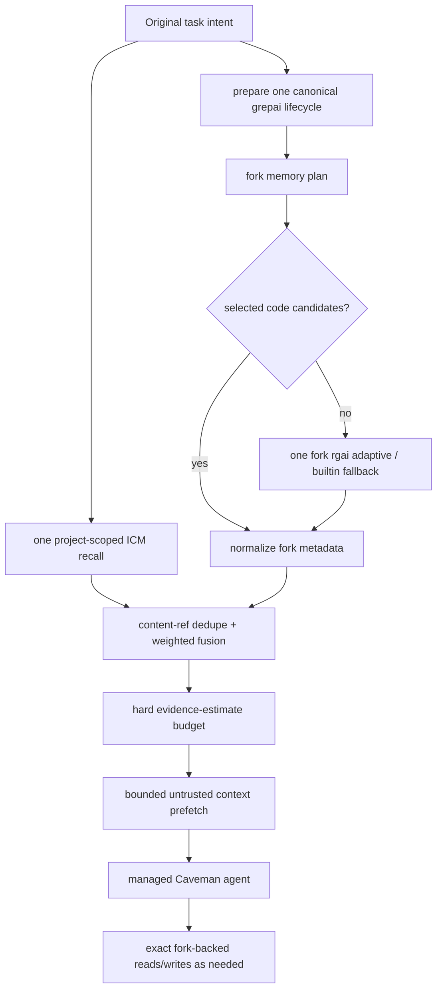

# HZR 0.3.2 — fork-core parity ledger

**Audit date:** 2026-08-01
**Status:** HZR 0.3.2 development; G1–G7/adoption implemented, functional all-gates green
**Import baseline:** exact `heAdz0r/rtk` worktree snapshot `0.44.1-fork.1` at HZR tag `v0.1.0`
**Current runtime core:** HZR-owned evolvable `fork-core/rtk`, derived from that complete baseline

This ledger distinguishes between four verifiable assertions:

1. The full fork source is present in HZR byte-for-byte.
2. This source is collected and goes through its own regression suite.
3. Production routes actually call it, and not partial HZR reimplementation.
4. grepai, ICM and Caveman are connected around the fork through one control plane without duplicate stores/tools.

## Locked fork identity

|Field|Meaning|
|---|---|
| Source | `https://github.com/heAdz0r/rtk.git` |
| Branch at capture | `feat/upstream-0.42-fork.1` |
| Source HEAD | `5f403c465cbdbe148e9ca03e0ac8e856eef0bfee` |
| Effective version | `0.44.1-fork.1` |
| Included files | 516 existing tracked/untracked non-ignored files |
| Recorded tracked deletions | 4 |
| Canonical snapshot schema | `hzr-fork-snapshot-v2-tsv`, hex-encoded paths |
| Canonical snapshot SHA-256 | `f4296ec404f461d6fc03c966c0dc79caee6c3118a73d1ed1a078ded5529f0a16` |
| Preserved v1 content digest | `072a62adc754b728ec99a507d2c1a223d83077d067a9249a26d357eec890b4cc` |
| Source diff SHA-256 | `37551ca1f2ac13661923b5c2225465c9538af6f3b146e6782158257d2dcc5fbc` |
| Source status SHA-256 | `cc3d82662a190ffcc5f9e7cd8bfff3dec985fd1a068bc58acc40c62fec8d69d4` |
| Runtime source | [`fork-core/rtk`](fork-core/rtk) |
| Canonical manifest | [`fork-core/SNAPSHOT_V2.tsv`](fork-core/SNAPSHOT_V2.tsv) |
| Metadata | [`fork-core/SNAPSHOT.toml`](fork-core/SNAPSHOT.toml) |
| Current engine manifest | [`fork-core/CURRENT_ENGINE.toml`](fork-core/CURRENT_ENGINE.toml) + `CURRENT_ENGINE_V1.tsv` |
| Current engine content list | `CURRENT_FILES` + `CURRENT_SHA256SUMS` |

Snapshot v2 includes ordered path, entry type, Git-portable mode, size and content/target digest, as well as source identity, tracked deletions, dirty diff/status hashes and explicit exclusions. Verifier rejects missing/extra files, type/mode/byte drift, traversal, undeclared deletion and nested `.git`.

Baseline identity immutable. `fork-core/rtk` after `v0.1.0` develops directly into HZR: each delta is required to preserve the inherited capability surface, update the current-engine identity/parity and go through a full regression suite. The old `/Users/andrew/Programming/rtk` is not changed.

### Current command-output parity delta

The controlled RAW / upstream RTK v0.44.1 / HZR run, methodology and replayable
evidence live under
[`benchmarks/hzr-vs-rtk-upstream-v0.44.1`](benchmarks/hzr-vs-rtk-upstream-v0.44.1).

The first pass found four shared-command gaps: missing `cargo test` failure
details, a wrong `cargo check` label, an extra `find` icon and an interactive
`ls` summary in captured output. The current engine now retains bounded
actionable failure details, labels `check` correctly and matches upstream for
the measured `find` and `ls` cases. Final matrix: 8 HZR wins, 6 token-count
ties, 0 HZR losses, with matching exit-code vectors in all 14 cases.

## Statuses

|Marker|Meaning|
|---|---|
| ✅ |Implemented and locally tested in the specified area|
| 🟡 |There is a working path, but an honestly described border remains|
| ⚪ |Not knowingly included in 0.3.2; exact compatibility path is not affected|

## Capability and routing matrix

| Surface |Actual HZR route|Check/bound|Status|
|---|---|---|---|
| Exact source snapshot | `fork-core/rtk` + manifest v2 |516 files, modes/types/bytes/deletions/exclusions; verifier before build| ✅ |
| Exact fork build |`cargo build --locked --release` inside snapshot|Bundle only accepts output `rtk 0.44.1-fork.1`| ✅ |
| Fork regression suite | Synthetic temporary Git history + `cargo test --locked --all-targets` |Git history is needed by the staff `git_churn`; `.git` is not included in the snapshot| ✅ |
| No stock RTK fallback | Runtime pin — fork; upstream RTK — `reference-only` |Bundle not fetch/build/install stock RTK| ✅ |
| Full fork CLI |`hzr rtk -- <args>` and `bin/rtk -> bin/hzr`|Unix passthrough saves argv, non-UTF8, cwd, stdio, signals, PID and exit| ✅ |
| Runtime detection |`PinnedRtkAdapter` requires exact version `0.44.1-fork.1`|Binary is built only after snapshot verification; runtime separately does not re-hash-it compiled executable| 🟡 |
| Raw shell rewrite |The complete line is passed to fork `rewrite`| Pipes, redirects, heredoc, multiline, quoting, `&&/||`, xargs are covered by tests| ✅ |
| Exit `0/1/2/3` | rewrite / raw / deny / one-time approval |Approval ID bounded, TTL and single-use; approve/deny CLI/API| ✅ |
| Command filters/guards |Fork rewrite selects exact command, HZR transport executes it|Private PATH resolves `rtk` again in exact fork; no generic replacement table| ✅ |
| Enhanced read | Agent `hzr_read` → allowlisted `/v1/fork/run` → fork `read` | Bounds/modes are checked; traversal and symlink escape are rejected; Markdown digests identify omitted content, include bounded semantic lead prose without HTML navigation/media noise, report source/section coverage and provide exact full/range recovery | ✅ |
| Atomic edit/write | Agent edit/write → fork `write --output json patch|create` |Native Caveman file tools are not available; fork atomic semantics saved| ✅ |
| `rgai` behavior | `/v1/search`, `hzr search|rgai`, agent search → exact fork `rgai --json` |Exact adds `--builtin`; semantic/auto uses managed grepai| ✅ |
| One grepai store | Managed `.grepai` symlink → `<data>/workspaces/<repo>/<worktree>/index/grepai` |Real legacy, foreign link and nested duplicate fail closed| ✅ |
| grepai lifecycle | `IndexCoordinator` owns init/generation/watcher; daemon owns coordinator | Patched 0.35 watcher, one worktree owner lock, one daemon per data root | ✅ |
| Legacy index migration | Explicit `hzr migrate apply --workspace` | Full-SHA retained backup, prepared/applied manifests, idempotent replay | ✅ |
| Fork IMG planner | Every context plan invokes fork `memory plan --format json` | `RTK_MEM_DB_PATH=<data>/fork/mem.db`; it remains derived cache | ✅ |
| Central ICM | One HZR-supervised 0.10.61 DB/process; MCP store + typed JSON recall | Required workspace → repository topic/project namespace; strict post-filter blocks global/foreign records | ✅ |
| Context composition | Fork plan + one ICM recall in parallel; one fork `rgai` only on empty planner | No unconditional second semantic pass; evidence estimates stay within hard limit | ✅ |
| Context/code consumption | Plan returns bounded metadata/snippets/memory summaries; agent exact-reads chosen paths later |There is no false claim about eager reread of all selected files or final provider-token proof| ✅ |
| Context exposure | `/v1/context/plan`, `hzr context plan`, `hzr_context`, bounded prefetch | Native pre-read hooks/repo map disabled | ✅ |
| Fork runtime state | `RTK_MEM_DB_PATH`, `RTK_DB_PATH`, private PATH/audit dirs | Managed path also sets `RTK_TEE=0`, `RTK_TELEMETRY_DISABLED=1` | ✅ |
| Trust/custom filters |Fork remains the source rewrite/filter verdict|HZR saves exact output/exit and approval state| ✅ |
| Caveman response density | Short stable contract injected before generation | No post-hoc lossy rewrite; strict JSON parses, empty output fails | ✅ |
| Explicit codec | Exact duplicate-paragraph transform + protected spans/raw guard | Shadow returns original with counterfactual bytes; trailing newline preserved | ✅ |
| Caveman tool boundary | Exact HZR custom-tool allowlist; native layers/resources disabled and repeatedly asserted | SDK still makes inactive `cavemem --version` probe at session construction | 🟡 |
| Usage ledger | Bridge finalizer posts one terminal outcome; daemon separates actual/estimated | `SIGKILL` can bypass finalizer; `accepted` requires external/user label | 🟡 |
| Daemon ownership | Filesystem singleton lock acquired before services | Symlink/non-regular lock targets rejected; RAII release | ✅ |
| Assembled bundle | Public `bin/hzr`, compatibility `bin/rtk`, private `engines/*`, managed npm runtime | Local-platform build/smoke; real provider run needs credentials and is not a release build step | ✅ |
| Hook installer | `install/uninstall/hooks status`, one combined dispatcher, SessionStart init | Full-SHA backup, CAS lock, atomic write, RTK replacement, ICM/unknown preservation | ✅ |
| Hook degraded path | 2 s managed rewrite then `PinnedRtkAdapter` fallback | Typed allow/ask/deny at hook exit 0; doctor/savings expose unaccounted calls | ✅ |
| Cross-platform/legal/KPI proof | CI covers Linux; local gate covers development platform | Windows artifact, formal legal review and paired provider benchmark remain external gates | ⚪ |

## Compatibility boundary

Fork-core remains a separate exact executable, because converting its monolithic CLI to HZR library would require rewriting `process::exit`, global state, shell behavior and dozens of command-local subprocess paths.

```text
bin/hzr                    public product CLI
bin/hzrd                   local control plane
bin/rtk -> hzr             invocation compatibility alias
engines/rtk                exact private fork-core executable
engines/grepai             HZR-owned patched 0.35.0
engines/icm                HZR-owned pinned 0.10.61
engines/caveman-code/      managed bridge + exact npm production tree
```

`hzr rtk`/`bin/rtk` do not pass repeated rewrite: explicit compatibility invocation is already a user decision. Managed `hzr exec` first receives a fork verdict; HZR adds only cwd confinement, timeout, bounded capture and typed approval lifecycle.

## Actual context composition



Important boundaries:

- Fork IMG planner itself calls builtin `rgai --files`; HZR does not duplicate it as a separate unconditional semantic query.
- grepai remains the only code-embedding base, even when the current turn bypassed the structural planner result.
- Content-ref dedupe stores one candidate/content; protocol 0.1 has one primary provenance record, not a provenance multiset.
- Budget limits the amount of marked token estimates evidence. It is not presented as an exact provider tokenizer or a complete future agent context.
- Agent reads the necessary files after plan via fork-backed tool; planner does not download each selected file entirely.

## Single grepai ownership

1. `Workspace::discover_managed` calculates canonical repository/worktree identity.
2. Store is located only under HZR data root, project `.grepai` - verified symlink.
3. `IndexCoordinator` — lifecycle/store owner; search ranking remains in fork `rgai`.
4. Patched watcher receives `--no-worktree-discovery`; HZR holds one owner lock on the worktree.
5. Daemon singleton excludes the second HZR coordinator for the same data root.
6. Fork config is checked: disabled grepai or foreign `binary_path` blocks adaptive delegation.
7. Legacy real directory is not used silently; recoverable explicit migration is required.

An external grepai process that does not respect HZR `hzr-owner.lock` cannot be reliably stopped without a separate process-ownership model. Migration re-hashes source before switch and fail closed when change detected; the user must stop the proven external writer before apply.

## Caveman boundary

Managed bridge disables native RTK, repo map, memory, hooks, tool/ML compression, auto-snapshot, telemetry, external resources, builtins, agents, skills and extensions. An exact custom-tool allowlist applies before each tool call. Node/npm integrity is checked before the agent session; to prompt - authenticated daemon health with protocol 1, HZR 0.3.2 and exactly one ready `rtk`. The order is checked by the real Node runtime test through the same `prepareManagedRuntime` that calls production `run()`.

Response density is set before generation by a short cache-stable contract. HZR Codec remains a separate explicit protected transform for CLI/API. Text quality is protected by instructions, native layer guards and raw exact tools; this is not a formal semantic equivalence proof.

## Release gates

### Functional 0.3.2 gates

- [x] Exact dirty fork snapshot v2 imported and verified.
- [x] Exact fork builds and its synthetic-Git suite passes.
- [x] Stock RTK absent from runtime/fallback.
- [x] Complete compatibility CLI and raw rewrite/approval semantics.
- [x] Agent read/edit/write and command execution reach fork-core.
- [x] Fork `rgai` owns search behavior; one grepai store/watcher lifecycle.
- [x] Safe explicit legacy-index migration.
- [x] Fork IMG + centralized ICM context path exposed to CLI/agent.
- [x] Caveman duplicate layers fail closed; density contract is pre-generation.
- [x] Actual and estimated usage fields remain separate.
- [x] Daemon singleton/auth/path/capture boundaries.
- [x] Relocatable assembled local-platform bundle and compatibility alias.

### Honestly left boundaries

- [ ] Final paired provider-billed benchmark and accepted-task feedback workflow.
- [ ] Crash-safe usage outbox for hard process termination.
- [x] HZR hook installer/status/uninstall and hybrid dispatcher.
- [ ] Background service manager/engine updater.
- [ ] Runtime re-attestation of compiled fork binary beyond verified build chain + exact version.
- [ ] Windows assembled artifact and formal third-party legal review.

These items do not replace or bypass fork functionality. They are a measurement/operability of the next stage and do not create a second runtime path.

## Verification commands

```bash
cargo fmt --all --check
cargo clippy --workspace --all-targets --all-features -- -D warnings
cargo test --workspace --all-targets --all-features
cargo +1.85.0 check --workspace --all-targets --all-features
bash -n scripts/*.sh
scripts/verify-fork-core.sh --test
node --check integrations/caveman-code/bridge.mjs
npm audit --omit=dev --audit-level=high --prefix integrations/caveman-code
scripts/build-bundle.sh /absolute/temporary/hzr-dist
```

The final results, commit/tag and unchanged-source proof are written to README checkpoint and centralized ICM handoff.
