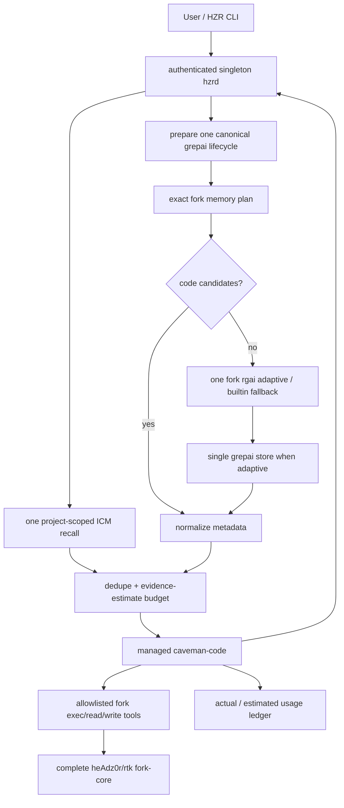

# PRD: HZR 0.2.0 — единая платформа эффективности LLM-агентов

**Продукт:** HZR — **h**eAdz0r's **Z**ero-**R**edundancy engine (`Z` = и ник автора, и принцип). Преемник RTK по смыслу: RTK убивал токены, HZR убивает избыточность — второй index, второй memory store, второй pre-read pack, повторно поданный в контекст файл, дублирующий compression layer агента
**Релиз:** 0.2.0
**Дата решения:** 2026-07-31
**Статус:** HZR 0.2.0 release candidate; G1–G7, adoption/control-plane path и self-contained release packaging реализованы, economic KPI ожидает paired provider benchmark
**Репозиторий:** новый самостоятельный продукт и Git history; фактический worktree `heAdz0r/rtk` целиком импортирован в `v0.1.0` как доказуемый baseline, после которого engine развивается только внутри HZR
**Главный критерий:** минимальная полная стоимость успешно решённой задачи при измеримом сохранении качества

## 1. Решение

HZR строится **вокруг доказавшего эффективность fork `heAdz0r/rtk` и 100% его кода**. Импортный baseline не заменяется RTK-compatible реализацией. После `v0.1.0` полный source становится развиваемым внутренним execution/context core HZR: fixes, refactors и extensions вносятся прямо в `fork-core/rtk`, сохраняя inherited surface, provenance и regression gates. HZR добавляет единый control plane, централизованные ICM и grepai, Caveman-контракт и managed caveman-code runtime.

### 1.1 Непереговорный fork-core contract

1. Источник baseline — фактическое состояние `/Users/andrew/Programming/rtk`, импортированное в tag `v0.1.0`, включая tracked modifications и относящиеся к проекту untracked files, а не только commit `HEAD` или stock upstream RTK. Источник текущей реализации после baseline — `fork-core/rtk` в HZR.
2. В HZR переносится весь source/product surface fork: command filters, rewrite/hooks, `rgai`, grepai adapter, memory layer, read/write pipeline, guards, trust/permissions, discovery, gain/economics, telemetry/tracking, benchmarks, fixtures, tests, scripts и документация.
3. HZR не реализует упрощённую замену этого поведения. Существующие `hzr-exec`, `hzr-context` и другие crates могут быть только adapters/orchestrators вокруг fork-core.
4. Snapshot исключает лишь заведомо генерируемые или локально-секретные данные: `.git`, `target`, `.grepai`, `__pycache__`, локальные DB/data и ignored machine-local settings. Исключения перечисляются явно и не могут скрывать source code.
5. Snapshot сопровождается машинно проверяемым manifest: source branch, source `HEAD`, dirty patch hash, список существующих файлов и SHA-256 каждого файла, а также список tracked deletions.
6. Engine собирается и проходит собственные тесты из HZR repository. CI отклоняет потерю baseline provenance, упрощённую замену поведения и изменение engine без обновлённого parity ledger и полного детерминированного regression gate.
7. Tag `v0.1.0` и snapshot v2 сохраняют byte-for-byte baseline. После baseline `fork-core/rtk` является HZR-owned evolvable engine: изменения вносятся прямо в его source внутри HZR, фиксируются Git history и обязаны пройти весь fork regression suite плюс HZR adapter contracts.
8. Stock RTK не является runtime fallback и не может подменить fork-core. Upstream RTK используется только как reference/base для diff и будущего осознанного backport.

Пользователь получает:

- один CLI `hzr`;
- один локальный daemon `hzrd`;
- один конфигурационный и data root;
- один versioned JSON protocol;
- один сквозной token budget;
- один quality gate и raw fallback;
- один usage/cost/outcome ledger;
- один lifecycle для каждого внешнего движка;
- один installer и один versioned self-contained bundle с hash-locked fork-core, patched grepai, ICM, caveman-code и bundled Node.js 22.17.1;
- один агентный entry point, где caveman-code отвечает за agent loop и provider UX, а HZR — за context, memory, execution, codec и учёт.

End-user установка не требует отдельных RTK, grepai, ICM, caveman-code, Node.js/npm, Go или Rust. Системный Git остаётся runtime prerequisite; installer также использует стандартные POSIX download/archive/checksum utilities. Release archive устанавливается в отдельный platform/version directory, а атомарно переключаемый `current` symlink задаёт активную версию. Публичные `hzr`, `hzrd` и compatibility alias `rtk -> hzr` указывают в этот единый bundle.

Каноническая формула обработки:

> preserve intent → retrieve once → fuse once → allocate once → encode once → execute safely → verify quality → account actual usage.

Fork-core остаётся целым, но его внешние зависимости и вызовы проходят через HZR ownership boundaries. Независимый запуск нескольких grepai watchers, ICM processes или caveman-code native RTK запрещён: он создаёт повторные scans, повторное сжатие и конкурирующие stores.

## 2. Product contract

HZR обязан уменьшать общую стоимость задачи, а не только размер stdout или ответа модели.

Оптимизируемая функция:

```text
cost_per_accepted_task =
  provider_input_cost
  + provider_output_cost
  + cache_write_cost
  + cache_read_cost
  + retries_cost
  + local_compute_cost
  + failure_penalty
```

Трансформация разрешена, только если ожидаемая выгода положительна после учёта overhead и вероятности retry:

```text
expected_value = saved_tokens_value - transform_overhead - retry_probability * retry_cost
```

Для code, patch, JSON, identifiers, commands, paths, URLs, enums, stack traces и security text применяется exact/lossless policy. При любой неопределённости HZR возвращает raw или content-addressed reference.

## 3. Evidence и выводы исследования

### 3.1 RTK

Обобщённый stock RTK полезен как детерминированный command rewrite и tool-output filter, но его локальная оценка `bytes / 4` не является provider bill. В независимом JetBrains A/B на 86 задачах и 425 billed trials median provider cost в 80 clean low-effort парах вырос на 7,6%, turns — на 13,8%, cache reads — на 14,3%; статистически значимой разницы качества не обнаружено. Узкий Claude Analyzer benchmark, напротив, показал оценочные −18,2% при 3/3 pass. Эти результаты нельзя переносить на текущий `heAdz0r/rtk`: у него значительно более широкий и уже проверенный пользователем pipeline — semantic search, memory planning, modular read, atomic write, guards и расширенные filters. Поэтому именно fork целиком остаётся execution/context core; HZR измеряет end-to-end outcome вокруг него и не заменяет его stock RTK.

Источники: [JetBrains RTK token-savings test](https://blog.jetbrains.com/ai/2026/07/rtk-claude-code-token-savings/), [Claude Analyzer results](https://analyzer.spec-kitty.ai/proof/results.html).

### 3.2 grepai/rgai

grepai даёт semantic/hybrid repository retrieval, symbol graph и call tracing. Maintainer benchmark на Excalidraw сообщает −27,5% billed cost, −55% tool calls и −97% fresh input; узкий независимый Claude Analyzer эксперимент — оценочные −14,5% при 3/3 pass. Оба набора слишком малы для SLA. Вывод: grepai становится единственным владельцем code embeddings/index; `rgai` остаётся stateless facade/router и никогда не создаёт собственную базу.

Источник: [grepai benchmark](https://yoanbernabeu.github.io/grepai/blog/benchmark-grepai-vs-grep-claude-code/).

### 3.3 ICM

ICM подходит для долговременной episodic/semantic memory, structured facts, transcripts и cross-session recall. Он не должен индексировать весь source tree и не должен запускаться отдельно каждым hook. В 0.10.61 HTTP API не имеет feature parity: HTTP store обходит MCP near-duplicate update, auto-link/backrefs и consolidation, а HTTP recall — graph expansion. MCP сохраняет полную write-семантику, но возвращает text-only `ToolResult`. Поэтому HZR держит один stdio MCP process для store, не парсит его human text и использует официальный `icm recall --format json` к той же БД для typed graph-aware recall. Это один store и одна семантика без fork ICM.

ICM не имеет first-class project/role columns: scope задаётся topic namespace, который навязывает HZR. При недоступном ONNX recall деградирует до FTS и обязан отображаться как degraded capability.

Источники: [ICM HTTP implementation](https://github.com/rtk-ai/icm/blob/c3a1bac7cfe401b55fd66af16dfc0c774c02167a/crates/icm-cli/src/http_api.rs), [ICM MCP tools](https://github.com/rtk-ai/icm/blob/c3a1bac7cfe401b55fd66af16dfc0c774c02167a/crates/icm-mcp/src/tools.rs), [ICM protocol](https://github.com/rtk-ai/icm/blob/c3a1bac7cfe401b55fd66af16dfc0c774c02167a/crates/icm-mcp/src/protocol.rs).

### 3.4 Caveman

Caveman v1.9.1 полезен как output contract и representation codec. Его документация указывает нулевую экономию input и overhead около 1–1,5k input tokens/turn. JetBrains на 82 paired coding tasks получил около −8,5% output и примерно −10% expected cost без обнаружимого ухудшения качества, но с большой дисперсией; в независимом 24-prompt тесте короткое `Be brief.` почти совпало с full Caveman. CAVEWOMAN показывает, что input compression часто повышает стоимость и снижает accuracy. Вывод: HZR не переписывает user intent, использует короткий cacheable response contract и безопасный protected codec.

Источники: [Caveman Honest Numbers](https://github.com/JuliusBrussee/caveman/blob/main/docs/HONEST-NUMBERS.md), [JetBrains Caveman study](https://blog.jetbrains.com/ai/2026/07/speak-to-ai-agents-like-cavemen-tosave-tokens/), [Max Taylor benchmark](https://www.maxtaylor.me/articles/i-benchmarked-caveman-against-two-words), [CAVEWOMAN preprint](https://arxiv.org/abs/2606.24083).

### 3.5 caveman-code

`JuliusBrussee/caveman-code` — полноценный TypeScript coding-agent runtime, а не только codec. В нём есть provider streaming, TUI, print/RPC/daemon modes, SDK, tools, sessions, checkpoints, subagents, worktrees, steering/follow-ups и architect/editor patterns. Это ускоряет создание HZR agent UX. Исполняемый npm 0.65.2 имеет source provenance `gitHead=4700b8fad23e45cedbb1a850f03ee9e2d4d49116`; более поздний main commit не является pin опубликованного tarball.

Одновременно runtime по умолчанию содержит собственные:

- RTK adapter;
- PageRank repo map, автоматически инжектируемый каждый turn;
- cavemem/files memory и memory tools;
- tool-result/cave-mode compression;
- session compaction и собственную usage presentation.

Без managed adapter эти функции конфликтуют с HZR. Extension API позволяет перехватывать tool calls и provider payload, но публичный extension context не предоставляет методы отключения repo map и memory. SDK-класс `AgentSession` предоставляет `setRepomapEnabled(false)` и `setMemoryEnabled(false)`. Поэтому HZR запускает caveman-code через SDK bridge, а не как непрозрачный CLI subprocess.

Managed HZR profile обязан:

1. вызвать `setRepomapEnabled(false)` до первого prompt;
2. вызвать `setMemoryEnabled(false)` до первого prompt;
3. установить native `rtk.enabled=false`;
4. отключить native tool-output compression и ML compression;
5. отключить native telemetry и automatic memory hooks;
6. зарегистрировать HZR search/context/memory/exec tools;
7. отправлять provider usage и outcome в HZR ledger;
8. прекратить запуск с понятной диагностикой, если версия SDK больше не гарантирует эти инварианты.

Published benchmark caveman-code рассматривается только как directional maintainer evidence: 25-task MicroBench сообщает около 524k fresh tokens и 14/25 pass против около 1.010m и 15/25 у сравниваемого Codex run. Он включает native RTK, repomap, memory и compression, которые HZR отключает, поэтому результат нельзя приписывать managed HZR и он не заменяет собственный paired benchmark.

Источники: [caveman-code repository](https://github.com/JuliusBrussee/caveman-code), [daemon reference](https://github.com/JuliusBrussee/caveman-code/blob/main/docs/reference/daemon.md).

## 4. Goals и guardrails

### 4.1 Goals для 0.2.x

- Один semantic index на `(workspace_id, canonical_root, embedder, model, dimension)`.
- 100% source/product surface текущего fork присутствует в hash-locked fork-core и доступно через HZR.
- Ноль упрощённых reimplementations в runtime-пути вместо fork-core.
- Ноль project-local index data: допустим только проверенный `.grepai` symlink/pointer на HZR-owned canonical store.
- Один ICM process и одна canonical ICM DB на HZR data root.
- Точный RTK rewrite contract, включая различие rewrite и auto-allow.
- Hard evidence budget по явно маркированной token estimate; никакой hook не добавляет скрытый второй pre-read pack.
- Короткий adaptive density-contract до generation и отдельный explicit codec: exact paragraph dedupe, protected spans, raw fallback и shadow counterfactual без изменения delivered content.
- caveman-code managed mode без native RTK/repo-map/memory/compression duplication.
- Actual provider usage хранится отдельно от estimates.
- Все engines проверяются по version/integrity до запуска.
- Offline local mode по умолчанию; telemetry выключена.

### 4.2 Product metrics

- median actual billed cost per accepted task: минимум −30% к baseline после набора репрезентативных задач;
- median turns: минимум −20%;
- uncached input tokens: минимум −35%;
- tool-result bytes в LLM context: минимум −60%;
- retrieval recall@20: не ниже 95% на gold set;
- task success non-inferiority margin: не хуже baseline более чем на 1 п.п.;
- p95 warm orchestration overhead без LLM latency: не более 250 мс;
- p90 cost отдельной задачи: не выше baseline более чем на 5%;
- stale-index incidents, приведшие к ошибочной правке: 0.

До появления статистически достаточного benchmark UI не имеет права показывать прогноз как доказанную экономию. Значения маркируются `actual`, `tokenizer` или `estimate`.

Managed bridge 0.2.0 фиксирует только наблюдаемые runtime outcomes `completed`, `invalid_response` и `failed`; он не объявляет собственный ответ «принятым». Метку `accepted` и task success задаёт внешний benchmark/harness или будущий явный user-feedback workflow, поэтому текущий `hzr savings` не выдаёт `cost_per_accepted_task` без таких данных.

### 4.3 Non-goals

- Сжатие скрытого chain-of-thought/reasoning провайдера.
- Regex-переписывание code, JSON Schema, enums или command arguments.
- Общая физическая SQLite-база для code index, memory и ledger.
- Облачный control plane по умолчанию.
- Автоматическое удаление найденных legacy/duplicate indexes.
- Копирование всего caveman-code в Rust.
- Переписывание или выборочный перенос текущего RTK fork.
- Замена fork-core на stock RTK при ошибке, version drift или несовпадении API.
- Обещание «нулевой потери качества» без проверяемого критерия.

## 5. Архитектура



### 5.1 Ownership matrix

| Concern | Единственный владелец | Derived/read-only consumers |
|---|---|---|
| orchestration, policy, budget | HZR Core | adapters, daemon, agent runtime |
| command surface, rewrite, filters, read/write, guards, trust, discovery | complete `heAdz0r/rtk` fork-core | HZR fork adapter, caveman-code tool bridge |
| fork memory planner и derived workspace cache | complete fork-core | HZR Context; это не durable ICM replacement |
| code embeddings/symbol graph | grepai v0.35.0 | HZR Index, rgai facade |
| exact lexical search и fallback | fork `rgai --builtin` | HZR Context transport |
| cross-session memory | ICM v0.10.61 | HZR Memory, agent runtime |
| transient workspace/git state | HZR Context | retrieval orchestrator |
| natural-language density | HZR Codec, Caveman-derived | prompt/response contracts |
| provider/agent loop | caveman-code managed bridge | HZR CLI |
| usage, cost, retry, outcome | HZR Ledger | reports and policy tuning |

### 5.2 End-to-end flow

1. Adapter передаёт исходный intent без телеграфного переписывания и canonicalizes workspace.
2. HZR подготавливает один managed grepai lifecycle/store, но не запускает отдельный unconditional semantic query.
3. Fork `memory plan --format json` строит основной structural plan; параллельно выполняется один ICM recall с repository-derived project scope.
4. Если planner выбрал code candidates, они используются напрямую. Только при пустом результате выполняется один fork `rgai`: adaptive через canonical grepai либо builtin exact при degradation.
5. Результаты нормализуются в `ContextCandidate` с primary provenance, content hash, generation и token source.
6. Fusion хранит один candidate на content ref, применяет diversity limits и hard limit к маркированным evidence estimates.
7. Agent получает bounded untrusted metadata/snippets/memory summaries и затем exact-читает нужные файлы через fork-backed tool; eager reread всех candidates отсутствует.
8. Перед generation HZR инжектирует короткий stable response-density contract. `hzr codec compile` остаётся отдельной explicit protected transform; ответ agent не проходит второй lossy post-processing.
9. Agent вызывает только HZR allowlisted tools; фактические routing/filter/read/write/guard операции выполняет полный fork-core.
10. Exact JSON дополнительно проходит parser validation, empty output отклоняется, provider usage и terminal outcome записываются в ledger.
11. ICM получает только явно сохранённые durable facts/decisions/handoffs, а не каждый сырой tool output.

## 6. Компоненты 0.2.0

### 6.1 `hzr-protocol`

Versioned envelopes, IDs, privacy/risk/fidelity, token source, intent, context candidate/pack, provenance, health и usage. Protocol type обязан разделять actual и estimated usage.

### 6.2 `hzr-core`

Canonical config/data layout, engine lock, fusion, hard budgets, policy, ledger и migration state. Все решения воспроизводимы по trace ID и policy version.

### 6.3 `fork-core` и `hzr-exec`

`fork-core/rtk` — HZR-owned engine, происходящий от полного hash-locked baseline текущего `heAdz0r/rtk`, включая его dirty worktree. Baseline остаётся доказуем через `v0.1.0` и snapshot v2; последующие исправления и расширения живут только в HZR Git history. Engine остаётся единственной реализацией command/search/read/write/memory-planning поведения. Публичное имя продукта — `hzr`; совместимый внутренний бинарь не публикуется как отдельный control plane.

`hzr-exec` — тонкий process/protocol adapter. Он не содержит собственной таблицы RTK rewrites и не повторяет fork filters. Его pipeline:

Typed pipeline:

```text
raw request → HZR policy/permission envelope → fork-core invocation
            → exact exit/stdout/stderr capture → HZR ledger/quality envelope
```

Exit code, stderr, error lines, test failures, paths и identifiers сохраняются. Raw/direct fallback использует предусмотренное самим fork поведение либо исходную команду по явной HZR policy; stock RTK fallback запрещён.

В fork-core сохраняются, среди прочего: полный CLI, все command-specific filters, `rgai_cmd.rs`, `grepai.rs`, `memory_layer/*`, modular read pipeline, atomic write/CAS/locks, hook rewrite/audit, guard/trust/permissions, tracking/gain/economics, discovery, benchmarks и regression tests. Полный перечень и статус находятся в `FORK_PARITY.md` и machine-readable snapshot manifest.

### 6.4 `hzr-index`

- normalizes workspace root through canonical paths and git common dir;
- computes stable workspace/worktree IDs;
- owns one grepai config, watcher and generation;
- checks installed version against `engines.lock.toml`;
- prepares the canonical grepai store for semantic/auto calls;
- exposes lifecycle, placement, generation and migration primitives, but no competing search ranker;
- detects nested/legacy indexes but never deletes them automatically;
- prevents a watcher from another workspace being accepted as healthy;
- rejects real legacy `.grepai` until explicit `hzr migrate apply`;
- invalidates freshness by generation and source content hash.

Stock grepai 0.35.0 не умеет выбирать arbitrary index path и его watcher автоматически обнаруживает linked worktrees. Поэтому HZR создаёт только проверенный `.grepai` symlink на central store и распространяет минимальный source patch `--no-worktree-discovery`. Runtime всегда probes capability и передаёт flag; непатченный watcher в multi-worktree блокируется до spawn, при этом exact search и чтение существующего semantic index продолжают работать.

`rgai` сохраняет реализацию, ranking, compact rendering и fallback chain из fork-core. `hzr search`, `hzr rgai`, context planner и agent tool делегируют ему один запрос; exact mode добавляет `--builtin`, semantic/auto сначала подготавливает managed grepai. `hzr-index` управляет binary/watcher/store/generation и не реализует конкурирующий ranker. `rgai` не владеет storage.

### 6.5 `hzr-memory`

- fixed DB under `<data_root>/memory/icm/memories.db`;
- singleton process lock и один managed stdio MCP process;
- полный MCP store path для near-dup, auto-link/backrefs и consolidation;
- typed official CLI JSON recall к той же DB для graph expansion без human parsing;
- repository-scoped topic namespace и ICM project filter поверх одной общей DB;
- pid/token/log files with private permissions;
- health, recall и store typed client, bounded JSON-RPC framing;
- circuit breaker и correctness-first CLI fallback;
- idempotent start/stop/restart;
- explicit release/version check;
- no automatic indexing of source code.

ICM topics глобальны по upstream design. Поэтому HZR принимает workspace в каждом memory request, вычисляет canonical `repository_id`, добавляет его как отдельный topic segment при store и принудительно применяет тот же project filter при recall. Клиент не может подменить project scope. Память разных репозиториев не смешивается, хотя lifecycle и физическая DB остаются едиными.

### 6.6 `hzr-codec`

Profiles: `off`, `safe`, `adaptive`, `compact`, `shadow`. В 0.2 codec не является универсальным paraphraser: он выбирает короткий density contract и как explicit transform удаляет только точные дубликаты абзацев. Protected spans cover code fences, inline code, paths, URLs, flags, hashes, versions, identifiers, enum-like values and structured payloads; любое нарушение возвращает raw byte-for-byte. `adaptive` checks economics before adding any contract. `shadow` возвращает исходный content без изменений и записывает counterfactual input/output/saved bytes и `would_change`. Завершающие newline сохраняются.

### 6.7 `hzr-agent`

Managed bridge to caveman-code:

- package version and npm integrity are pinned;
- isolated `agentDir` lives under HZR data root;
- native RTK, repo-map, memory, hooks, compression, external resources, builtin agents/skills and telemetry are disabled before first prompt and rechecked throughout generation;
- only an exact allowlist of HZR context/search/read/edit/write/memory/exec custom tools may execute;
- one bounded unified-context prefetch is injected as untrusted evidence before generation;
- text and strict JSON result modes are supported;
- provider credentials remain in the upstream auth storage or environment and are never copied into HZR ledger;
- daemon health must report protocol 1, HZR 0.2.0 and exactly one ready fork-core before launch;
- provider usage is posted once from the bridge finalizer with `completed`, `invalid_response` or `failed`; accounting failure never masks the primary result;
- managed launch fails closed on invariant mismatch; ordinary HZR tools continue to work.

Exact npm lock для caveman-code 0.65.2 разрешает `@juliusbrussee/caveman-agent`, `caveman-ai` и `caveman-tui` в 0.65.3. Сертифицированный source/development range остаётся Node `>=20.18.1,<26`: нижнюю границу задаёт transitive `undici`, а Node 26 блокируется из-за известной несовместимости `better-sqlite3` в upstream issue #46. End user не обязан предоставлять Node: release bundle содержит checksum-pinned official Node.js 22.17.1 и bridge всегда запускается через этот private runtime. TypeBox закреплён как explicit dependency из-за upstream issue #23. Vulnerable transitive `adm-zip<0.6.0` заменён exact npm override на 0.6.0; release gate требует `npm audit --omit=dev` без high/critical findings.

Остаточный upstream behavior 0.65.2: session construction выполняет неактивный `cavemem --version` probe и строит inactive builtin registry. Runtime guard не позволяет этим builtins выполняться. Полное устранение самого probe требует отдельного SDK patch; это не создаёт вторую memory DB или executable tool path в HZR.

### 6.8 `hzrd` и `hzr-cli`

Minimum daemon API:

```text
GET  /v1/health
GET  /v1/engines
POST /v1/search
POST /v1/context/plan
POST /v1/memory/recall
POST /v1/memory/store
POST /v1/exec/rewrite
POST /v1/exec/run
POST /v1/exec/approval
POST /v1/fork/run
POST /v1/codec/compile
POST /v1/usage
```

CLI surface:

```text
hzr init [--if-needed --quiet]
hzr install [--dry-run] [--force]
hzr uninstall [--keep-data] [--dry-run] [--force]
hzr hooks status
hzr mcp serve
hzr mcp config --client codex|claude-desktop
hzr doctor [--json]
hzr daemon serve|status|engines|service install|start|stop|restart|status
hzr engines status
hzr index status|init
hzr exec rewrite|run|approve|deny
hzr search <query>
hzr rgai <query>
hzr memory recall|store|status
hzr context plan <intent>
hzr codec compile <text>
hzr agent run [--json] <prompt>
hzr savings
hzr migrate scan|apply|history|memory
hzr rtk -- <fork arguments>
```

Installed hook runtime использует скрытый `hzr hooks dispatch`: один handler для `PreToolUse:Bash|Agent|Task`. Managed rewrite имеет hard timeout 2 s и преобразует fork decisions в typed Claude hook result с exit 0; при недоступном daemon вызывается тот же pinned `0.44.1-fork.1` adapter. `SessionStart` вызывает `hzr init --if-needed --quiet`. Adoption-команда удаляет известные RTK handlers поштучно, по умолчанию централизует ICM ownership, сохраняет unknown handlers, делает full-SHA backup, проверяет compare-and-swap под filesystem lock и атомарно заменяет settings только после `--force`. Тем же transactional pattern она устанавливает один HZR-owned block в Claude `CLAUDE.md` и Codex `AGENTS.md`, ссылающийся на canonical bundled `HZR.md`, и удаляет только machine-owned legacy `@RTK.md` imports.

`bin/rtk` является относительным compatibility alias на `bin/hzr`, а не вторым installation/control plane. По имени invocation HZR нормализует его в `hzr rtk --` и выполняет private exact `engines/rtk` с исходными argv/cwd/stdio/signals/exit status.

Repository-level `install.sh` и CLI `hzr install` имеют разные границы ответственности. Первый проверяет release checksum и внутренний manifest, устанавливает весь platform bundle в `versions/v<version>-<platform>` и атомарно переключает `current`. Вторая команда размещает durable public binaries и выполняет adoption hooks/instructions; она поддерживает preview через `--dry-run` и явное подтверждение через `--force`. Release installer вызывает обе стадии как одну пользовательскую операцию; `HZR_INSTALL_HOOKS=0` позволяет отложить adoption.

### 6.9 MCP surface (`hzr mcp serve`)

Клиенты без hook-механизма — Codex app-server и Claude desktop — могут получить memory только через MCP. До появления этой поверхности каждый из них регистрировал `icm serve` напрямую, что и есть запрещённый §6.5 второй durable memory layer. На реальной машине это дало 8 orphaned `icm serve`, оставленных мёртвыми Codex-сессиями, потому что Codex порождает по одному на сессию и не реапит их.

`hzr mcp serve` — stdio JSON-RPC adapter, а не второй control plane:

- **своего store нет.** Каждый вызов уходит в единственный `hzrd`, который владеет одним supervised ICM process и одной canonical DB. Поэтому N параллельных adapters безопасны: singular обязан быть store, а не труба;
- **orphan невозможен.** Процесс завершается по EOF на stdin, то есть в момент смерти родителя. Проверено SIGKILL-ом родителя: 0 утечек;
- **fake liveness запрещён.** При недоступном `hzrd` возвращается `isError: true` с текстом «nothing was read or written», а не успешный ответ. Мёртвый backend не может выглядеть как успешная запись;
- **scope не расширяем клиентом.** workspace берётся из launch directory сервера; клиент не может подменить репозиторий;
- **прямой engine control не экспонируется.** В surface нет `icm serve`, `grepai watch` или `rtk proxy`.

Tools 0.2.0: `hzr_memory_recall`, `hzr_memory_store`, `hzr_search`. Все имена в namespace `hzr_`, все аргументы bounded (`limit` clamped к 50).

`hzr mcp config --client codex|claude-desktop` остаётся read-only preview и печатает registration snippet. Подтверждённый `hzr install --force` транзакционно заменяет известные direct ICM registrations в client configs на HZR MCP, используя filesystem lock, content-addressed backup и compare-and-swap; неизвестные MCP servers сохраняются. `doctor` продолжает репортить оставшиеся unmanaged `icm serve` как `error` (§16.5.1).

## 7. Data layout и запрет дублей

```text
<hzr-data>/
  runtime/
    hzrd.token
    hzrd.token.lock
    hzrd.lock
  fork/
    mem.db                # fork derived IMG/cache, keyed by project
    history.db            # fork tracking/economics
    tee/                  # managed path sets RTK_TEE=0
    audit/
  workspaces/<repository-id>/<worktree-id>/index/grepai/
    config.yaml
    index.gob
    symbols.gob
    rpg.gob
    hzr-owner.lock
    hzr-runtime/
  migrations/<repository-id>/<worktree-id>/
    grepai-v1.prepared.json
    grepai-v1.json
  memory/icm/
    memories.db
    auth.token
    icm.log
    runtime/
      supervisor.lock
      icm.pid
      token.lock
  ledger/
    hzr.sqlite
  sessions/
```

Инварианты:

- source index и memory физически разделены, но имеют общую provenance model;
- HZR не создаёт project-local index data; `.grepai` может быть только проверенным symlink/pointer на canonical store;
- существующая real `.grepai` распознаётся как legacy и блокирует managed search/init до явной migration;
- legacy stores обнаруживаются read-only scan;
- migration выполняется только явной командой с retained full-SHA backup и двумя immutable manifests;
- duplicate/foreign indexes reportable, автоматическое удаление или quarantine запрещено;
- singleton `hzrd` lock плюс worktree owner lock исключают второго HZR watcher;
- один content hash не должен повторно попадать в context pack из разных источников.

## 8. Version и supply-chain policy

Release lock для 0.2.0:

| Engine | Версия | Pin |
|---|---:|---|
| Node.js runtime | 22.17.1 | official platform archives для macOS/Linux arm64/x64; SHA-256 каждого artifact зафиксирован в `engines.lock.toml` |
| grepai | 0.35.0 | tag `v0.35.0`, commit `65c345ca32122c17a39a5bbec2780c2eea773a12` |
| ICM | 0.10.61 | tag `icm-v0.10.61`, commit `c3a1bac7cfe401b55fd66af16dfc0c774c02167a` |
| HZR fork-core | 0.44.1-fork.1, current `heAdz0r/rtk` worktree | branch `feat/upstream-0.42-fork.1`, `HEAD=5f403c465cbdbe148e9ca03e0ac8e856eef0bfee`; 516 files + 4 tracked deletions; canonical snapshot v2 `f4296ec404f461d6fc03c966c0dc79caee6c3118a73d1ed1a078ded5529f0a16`; v1 content manifest `072a62adc754b728ec99a507d2c1a223d83077d067a9249a26d357eec890b4cc` |
| upstream RTK reference only | 0.44.1 | tag `v0.44.1`, commit `36591fb00d650bf987b57483c0b3a395a35a8dc1`; не runtime engine |
| Caveman prompt/codec reference | 1.9.1 | tag `v1.9.1`, commit `0d95a81d35a9f2d123a5e9430d1cfc43d55f1bb0` |
| caveman-code | 0.65.2 | npm integrity + exact lockfile; npm `gitHead=4700b8fad23e45cedbb1a850f03ee9e2d4d49116` |

Исполняемый caveman-code фиксируется npm version, tarball integrity, source `gitHead` и полным lockfile. Exact lock разрешает `caveman-agent`, `caveman-ai` и `caveman-tui` в 0.65.3 с отдельными integrity. Более поздний main не считается provenance tarball.

grepai собирается только из pinned commit после применения [patches/grepai/0.35.0-disable-worktree-discovery.patch](patches/grepai/0.35.0-disable-worktree-discovery.patch); patch должен проходить `git apply --check`, Go tests и capability smoke. ICM source требует отдельного минимального pinned patch, который синхронизирует только устаревшую версию `icm-cli` в upstream `Cargo.lock` с source package 0.10.61 и сохраняет сборку `--locked`. [scripts/build-bundle.sh](scripts/build-bundle.sh) собирает native local-platform bundle HZR + **fork-core** + patched grepai + patched ICM + exact caveman-code production tree + official Node.js 22.17.1. Сборка stock RTK вместо fork-core или зависимость release runtime от внешнего Node/RTK/grepai/ICM является release-blocking ошибкой.

`scripts/package-release.sh` добавляет internal `BUNDLE_MANIFEST.sha256` и создаёт `hzr-v0.2.0-<platform>.tar.gz`; `install.sh` отдельно проверяет release `SHA256SUMS`, внутренний manifest и обязательный bundle layout до атомарного переключения active version. Clean-install smoke запускает HZR с `PATH`, в котором отсутствуют внешние Node/RTK/grepai/ICM, и оставляет только системный Git. Release build проверяет checksum/integrity, license, executable version и protocol smoke test. Engine auto-update/sync отсутствует; будущая реализация не должна обновлять pins без явного подтверждения.

До переключения `current` installer re-attest-ит уже существующий same-version root по
byte-identical internal manifest, mandatory layout, modes, digests и разрешённым symlinks.
Любое расхождение fail-closed до переключения; smoke fixtures подтверждают rejection для
tampered, missing и symlink-injected roots, а чистый повторный install остаётся no-op.

Artifact tooling поддерживает `darwin-arm64`, `darwin-x64`, `linux-arm64` и `linux-x64`; каждый artifact должен собираться и smoke-test запускаться нативно. Текущий public CI assembled-bundle gate выполняется на Linux x86_64. Windows artifact не входит в 0.2.0, а остальные заявленные platform artifacts не считаются release-verified до native job/smoke.

## 9. Security и privacy

- loopback-only daemon по умолчанию;
- bearer token для локального API;
- non-loopback bind не поддерживается в 0.2.0;
- config, DB tokens и runtime secrets имеют private permissions;
- provider API keys не логируются и не сохраняются в ledger;
- managed fork path принудительно выставляет `RTK_TEE=0` и `RTK_TELEMETRY_DISABLED=1`;
- HZR telemetry и raw retention по умолчанию выключены;
- fork read/write API принимает только минимальный allowlist argument shapes и canonical workspace paths;
- shell сохраняется только там, где полная исходная shell-строка необходима для fork rewrite semantics;
- destructive commands требуют отдельного risk/permission verdict;
- daemon body/capture/time limits ограничены, path traversal и symlink escape отклоняются;
- usage ledger хранит счётчики, model/provider metadata и outcome, но не prompt/response body.

## 10. Failure modes

| Failure | Поведение |
|---|---|
| `hzrd` недоступен | managed agent/search/context/memory/exec блокируются; exact compatibility `hzr rtk`/`bin/rtk` остаётся прямым process path |
| grepai отсутствует/устарел | exact rg fallback; semantic status degraded |
| index stale | stale provenance, exact verification перед edit |
| legacy/duplicate/foreign index найден | typed migration-required/error; ничего не удаляется |
| ICM недоступен | context возвращает warning и code plan; прямой memory call сообщает unavailable; agent health сохраняет warning |
| codec invariant нарушен | raw content и failure telemetry |
| fork-core недоступен или version не совпал | managed agent/exec/search блокируются; context может вернуть только ICM с explicit warning; stock RTK не подставляется |
| fork filter выбрал raw/fail-open | сохраняется штатная семантика fork и HZR фиксирует outcome |
| provider usage отсутствует | estimate сохраняется только в estimated columns |
| caveman-code SDK drift | managed agent mode блокируется с remediation; остальные HZR команды работают |
| token budget исчерпан | evidence отклоняется с reason; лимит не расширяется скрыто |

## 11. Migration

`hzr migrate scan` read-only обнаруживает legacy/nested `.grepai`, внешние memory/config/wrapper/process markers и сообщает их без изменения данных.

`hzr migrate apply --workspace` в 0.2.0 намеренно имеет узкую и проверяемую область: он централизует ровно один legacy grepai store. Операция:

1. canonicalizes repository/worktree identity и отклоняет duplicates/foreign entries;
2. удерживает exclusive legacy HZR owner lock;
3. снимает ordered tree snapshot с bytes, Unix modes и safe symlink targets;
4. копирует его в staging и повторно сверяет полный SHA-256;
5. создаёт retained `.grepai.hzr-backup-<full-sha256>` и durable `prepared` manifest;
6. atomically устанавливает managed target и проверенный project `.grepai` symlink;
7. удерживает canonical owner при activation и записывает immutable `applied` manifest;
8. при повторном вызове проверяет manifests/backup/target и возвращает typed `already_applied`.

Escaping symlinks, special files, active HZR owner, source mutation, partial target/stage/manifest и unsafe path relationships блокируют migration. Backup никогда автоматически не удаляется. HZR не останавливает и не удаляет внешние процессы, конфиги, wrappers, hooks или ICM databases без отдельной явно заданной операции.

Старый `/Users/andrew/Programming/rtk` остаётся неизменяемым архивным источником baseline. Вся дальнейшая разработка унаследованного engine выполняется в `/Users/andrew/Programming/hzr/fork-core/rtk`; автоматической обратной синхронизации нет.

## 12. Verification strategy

### 12.1 Rust quality gates

```bash
cargo fmt --all --check
cargo clippy --workspace --all-targets --all-features -- -D warnings
cargo test --workspace --all-targets --all-features
```

### 12.2 Contract tests

- snapshot manifest воспроизводит 100% допустимого source set текущего fork, включая uncommitted/untracked code и tracked deletions;
- весь оригинальный fork test/benchmark harness присутствует и запускается из HZR;
- fork CLI/rewrite/read/write/rgai/memory/guard behavior проходит без функциональных потерь;
- stdout/stderr/exit preservation;
- grepai 0.35.0 JSON fixtures and version drift;
- root/worktree identity and duplicate index detection;
- ICM singleton race, stale PID, token permissions and circuit breaker;
- сумма token estimates выбранных evidence не превышает hard limit;
- protected spans survive codec byte-for-byte;
- estimates never increment actual totals;
- caveman-code duplicate layers are disabled before prompt;
- daemon body limit, timeout, auth and loopback binding;
- packaged bundle contains exact private engines, caveman production tree and Node.js 22.17.1 with complete manifest/provenance;
- clean installer succeeds without external Node.js, RTK, grepai or ICM and preserves system Git as prerequisite.

### 12.3 Paired benchmark

Каждая задача выполняется baseline и HZR с одинаковыми model, temperature, repository revision и max turns. Собираются provider usage, cache usage, turns, tool calls, latency, retries, task success и judge/harness outcome. Отчёт показывает median, p90, confidence intervals и список regressions, а не только суммарные проценты.

## 13. Release acceptance для 0.2.0

Релиз допускается, когда:

- fork-core импортирован целиком из фактического worktree и его manifest проверен независимо;
- `FORK_PARITY.md` не содержит `missing`, `reimplemented` или непроверенных runtime-подмен;
- stock RTK отсутствует в production execution path и bundle;
- все workspace crates компилируются без warnings;
- quality gates зелёные;
- `hzr doctor --json` проверяет все pins и ownership;
- ICM start/stop race test доказывает singleton;
- nested `.grepai` fixture обнаруживается и не удаляется;
- `hzr search` использует grepai 0.35.0 и exact fallback;
- `hzr rgai` использует ту же canonical generation;
- `hzr exec` делегирует полному fork-core и проходит весь fork regression suite плюс adapter contracts;
- codec сохраняет protected spans;
- managed caveman-code smoke test подтверждает отключение duplicate layers;
- CLI/daemon smoke test работает из чистого data root;
- README содержит установку, архитектурные инварианты и recovery;
- ICM содержит актуальный handoff для следующих LOOP-агентов;
- repository сохраняет `v0.1.0` baseline, имеет current-engine manifest и version `0.2.0`.
- `hzr install` idempotently заменяет RTK hooks, сохраняет чужие handlers и не пишет при `--dry-run`;
- `hzr init --if-needed` является filesystem no-op на уже зарегистрированном workspace;
- managed и degraded hook paths используют один typed decision contract, а degraded accounting виден в `doctor`/`savings`.
- один release installer проверяет artifact checksum и internal manifest, устанавливает version-scoped `v0.2.0-<platform>` bundle и атомарно переключает `current`;
- существующий same-version root re-attested по internal manifest либо installer fail closed до переключения `current`;
- установленный artifact содержит full fork-core, patched grepai, patched ICM, exact caveman-code production tree и bundled Node.js 22.17.1;
- clean-install smoke проходит без отдельных Node.js, RTK, grepai и ICM; системный Git остаётся prerequisite;
- Claude и Codex получают один managed HZR instruction block без дублирующего `@RTK.md` import.

### 13.1 Подтверждённые release blockers глобального adoption

Ниже зафиксирован read-only acceptance-аудит реальной машины на срезе 2026-08-01 00:09 MSK, source HEAD `c88d271`. Полностью прошли только 2 из 10 adoption-пунктов. Эти результаты имеют приоритет над прежними `LGTM`/«реализовано» в status-документах. `v0.2.0` нельзя публиковать или объявлять globally adopted, пока каждый blocker не закрыт кодом, regression test и повторным live-аудитом.

| ID | Severity | Подтверждённый дефект | Evidence | Обязательный acceptance |
|---|---|---|---|---|
| **RB-01** | **P0** | Глобальные инструкции не имеют единого HZR ownership | `~/.claude/CLAUDE.md` одновременно содержит legacy-блок, требующий прямые `rtk`/ICM, и добавленный HZR-блок. `~/.codex/config.toml` всё ещё запускает `icm serve` напрямую; HZR block в `AGENTS.md` только добавлен к старому contract | `hzr install --force` транзакционно удаляет только machine-owned legacy RTK/direct-ICM directives, оставляет ровно один HZR block для Claude и Codex, повторный install byte-for-byte no-op; fixture и live-проверка не находят `@RTK.md`, direct `rtk` mandate или direct ICM MCP command |
| **RB-02** | **P0** | Централизованная memory ownership фактически нарушена | В live process table обнаружены четыре внешних `icm` server и два Claude wrapper process; scanner сообщает шесть foreign owners. Одновременно существуют legacy `dev.icm.icm/memories.db` и canonical `dev.headz0r.hzr/memory/icm/memories.db` | После explicit adoption активен ровно один HZR-owned memory lifecycle; Claude/Codex не запускают ICM напрямую; `doctor --json` различает process и wrapper, показывает zero foreign active owners; legacy DB не удаляется, а migration/backup выполняется отдельной idempotent операцией с проверяемым manifest |
| **RB-03** | **P0** | `hzr install` не обеспечивает заявленный self-contained глобальный bundle | CLI installer копирует только `hzr`/`hzrd`, не устанавливает bundled engines/runtime, daemon service и полный instruction artifact. В clean HOME записывается ссылка на отсутствующий `~/.local/share/hzr/HZR.md` | Установка из release archive одной командой размещает version-scoped полный bundle, canonical `HZR.md`, engines и private runtime; public binaries указывают только на stable `current`; clean-HOME gate проверяет существование и SHA каждого referenced artifact, затем запускает CLI, hook, daemon, search, memory и managed bridge без внешних engine installations |
| **RB-04** | **P0** | Установленный global binary расходится с source/release candidate | Глобальный `hzr 0.2.0` доступен в PATH, но отвергает `hzr stats` и `hzr mcp`; source `target/debug/hzr` уже содержит обе команды. Публичного release artifact ещё нет | Installer никогда не маркирует dev/stale binary как актуальный release. После deployment SHA/version/provenance global `hzr` и `hzrd` совпадают с verified artifact и `current`; `hzr stats --json`, `hzr mcp --help`, hook dispatcher и doctor проходят из чистого shell |
| **RB-05** | **P0** | `hzr stats` падает на пустом canonical ledger | `target/debug/hzr stats --json` возвращает SQLite `Invalid column type Null` для aggregate `SUM(CASE WHEN outcome='accepted'...)`; aggregate columns читаются без `COALESCE` | Пустая, partial и populated DB возвращают schema-valid JSON/TTY с нулевыми totals и без panic/error; все nullable SQL aggregates используют явную семантику; добавлен regression test с новой пустой DB |
| **RB-06** | **P0** | Глобальная доказанная cumulative history не импортируется | Live legacy `rtk gain`: 22,859 commands и примерно 188.9M estimated saved tokens; DB `~/Library/Application Support/rtk/history.db` около 20.5 MB. Текущая migration ищет только `<HZR data>/fork/history.db` около 122 KB, поэтому `hzr stats` видел лишь 107 операций и нулевую экономию | Migration обнаруживает платформенные legacy RTK DB locations, сначала делает read-only snapshot/identity, затем idempotently импортирует каждую row ровно один раз в canonical ledger. Counts/gross/regressions/signed net сверяются с source snapshot; source не мутируется; повторный запуск ничего не добавляет; legacy и canonical sources не суммируются повторно |
| **RB-07** | **P0** | Нет единого production daemon/service ownership | Рабочий `target/debug/hzrd` является unmanaged dev process; release installer не ставит service. Ранее разные token/data-root давали 401, текущий debug pair отвечает, но это не durable global contract | Installer создаёт и запускает platform service/supervisor с единственными canonical binary, token и data root; start/stop/upgrade/restart idempotent; одновременно допускается один `hzrd`; CLI, hooks и MCP используют его endpoint/auth; test воспроизводит reboot/restart и исключает dev binary path |
| **RB-08** | **P1** | Codec не покрывает глобальный request/response path Claude и Codex | Caveman codec применяется в managed `hzr agent run`, но не доказан для всех глобальных запросов/ответов клиентов | Для каждого поддерживаемого клиента описан и протестирован реальный interception point. Request/response проходят HZR policy/codec либо явно маркируются `unintercepted`; HZR не начисляет saving без доставленного counterfactual. Целевой единый path — HZR MCP gateway из §14.1 |
| **RB-09** | **P1** | Документация и release status переоценивают готовность | Ранее status называл adoption, centralized ICM и installer реализованными, хотя live-аудит доказал RB-01—RB-08 | `PRD_STATUS_0.2.0.md`, README guarantees и release notes отражают фактический gate status. Любое `ready/LGTM` генерируется только после сохранённого отчёта clean-HOME + live adoption + upgrade + process/store uniqueness |
| **RB-10** | **P0** | `hzr doctor` выдаёт ложный PASS для конфликтующих инструкций | `claude_instructions=pass` и `codex_instructions=pass`, потому что diagnostics проверяет только наличие BEGIN marker. При этом Claude содержит активные legacy RTK/ICM mandates, Codex запускает direct ICM, а referenced `HZR.md` может отсутствовать | Doctor проверяет readable canonical contract asset, отсутствие известных legacy imperative blocks, отсутствие direct client ICM registration, global binary/bundle provenance и единственность owners. Наличие HZR marker рядом с конфликтом всегда `fail`, а не `pass` |
| **RB-11** | **P0** | Глобальный runtime не использует pinned self-contained engines | Live installation использует внешний Node 25.2.1 и ICM 0.10.57 вместо pinned ICM 0.10.61/private Node 22.17.1; системные RTK/grepai остаются доступными runtime dependencies, Caveman bridge отсутствует | После artifact install `doctor --json` доказывает paths, versions и digests всех engines/runtime внутри immutable active bundle; PATH poisoning fixture с чужими Node/RTK/grepai/ICM не меняет выбранные binaries; managed Caveman smoke проходит private Node |
| **RB-12** | **P0 release** | Повторная установка той же версии не re-attest-ит существующий version root | `install.sh` может переиспользовать уже существующий `versions/v0.2.0-<platform>` без повторной проверки internal manifest перед переключением `current` | Same-version install полностью сверяет manifest, mandatory layout, modes и digests существующего root либо fail closed. Tampered/missing/symlink-injected fixture никогда не становится `current`; clean root остаётся idempotent |

Уже подтверждённые свойства, которые не нужно чинить повторно: `hzr` присутствует в global PATH; Claude hooks сведены к одному HZR dispatcher плюс `SessionStart` (`RTK=0`, direct ICM hooks `=0`); текущая пара source CLI/debug daemon проходит auth без прежнего HTTP 401. Эти PASS не отменяют конфликт текстовых инструкций, direct Codex MCP и отсутствие production service.

### 13.2 Обязательный handoff/gate для агента исправления

Агент исправления должен вернуть по каждому `RB-*`: changed files, автоматический test, clean-HOME evidence, live evidence и остаточный риск. Stable hook path уже подтверждён отдельно: запуск CLI install из temp HOME ссылается на `<prefix>/bin/hzr`, а не на `current_exe`; его требуется сохранить E2E-тестом для debug, release bundle и временной extraction. Минимальный финальный gate обязан:

1. установить release archive в полностью пустые HOME/data/install roots без внешних RTK/grepai/ICM/Node;
2. выполнить upgrade поверх предыдущего version root и доказать re-attestation + atomic `current` switch;
3. применить global adoption к синтетическим конфликтующим Claude/Codex configs дважды и доказать idempotence;
4. импортировать fixture большой legacy gain DB дважды и доказать сохранение signed totals без double counting;
5. запустить production daemon/service, hooks, MCP, memory, search, managed agent smoke и `hzr stats --json`;
6. проверить один index, одну memory DB, один daemon owner, один hook на событие и отсутствие прямых bundled-engine commands в client configs;
7. повторить read-only live audit до commit/tag/push. Публикация и deployment блокируются при любом `P0` или недоказанном пункте.

### 13.3 Closure record перед публикацией

Аудит §13.1 сохраняется как evidence исходного состояния. После него release candidate закрыл source/isolated gates следующим образом:

| Blocker | Состояние | Closure evidence |
|---|---|---|
| RB-01 | source closed | fixture-тесты legacy instruction migration и transactional Codex/Claude Desktop MCP migration; повторный install — no-op |
| RB-02 | live closed | direct client ownership снят installer-ом; два точно идентифицированных legacy `icm serve` завершены `SIGTERM`, повторный doctor не находит foreign owners |
| RB-03 | closed | свежий native archive проходит clean-HOME CLI, hook, daemon, search, memory, MCP и stats без внешних engines/runtime |
| RB-04 | live closed | verified artifact установлен; global public binaries и bundled engines повторно сверены с release root |
| RB-05 | closed | empty-ledger `COALESCE` regression test и clean-install `hzr stats --json` |
| RB-06 | source closed | platform legacy discovery, SQLite Online Backup snapshot, content-addressed manifest и double-import idempotence test |
| RB-07 | live closed on Darwin | `launchd` service активен через stable `current/bin/hzrd`; source также содержит и тестирует `systemd --user` lifecycle |
| RB-08 | accepted boundary | codec гарантирован для managed `hzr agent run`; hooks не объявляются provider request/response interception и не начисляют несуществующую экономию |
| RB-09 | closed | README, PRD, adoption/status и release notes синхронизированы с доказанными gates и честными KPI |
| RB-10 | source closed | doctor проверяет contract asset, legacy directives, direct client ICM, bundle provenance и service ownership |
| RB-11 | live closed on Darwin | private pinned paths/versions, PATH-poisoning clean smoke, Caveman private Node и live equality после public install подтверждены |
| RB-12 | closed | same-version clean root re-attested; tampered, missing и symlink-injected roots fail closed |

Source tree не имеет незакрытого P0, мешающего первичному push. Live adoption на Darwin закрывает RB-02/RB-04/RB-07/RB-11; tag/release для всей заявленной platform matrix разрешены только после зелёного public CI/native matrix.

## 14. Delivery status и следующий этап

В source tree 0.2.0 реализованы исправления RB-01—RB-12: transactional instruction/client migration, раздельный process/wrapper audit, idempotent ICM и RTK-history imports, self-contained bundle, production service, bundle attestation и same-version re-attestation. Clean-HOME artifact smoke пройден на `darwin-arm64`. RB-08 закрыт честной границей: глобальные response paths Claude/Codex явно маркируются `unintercepted`, и HZR не начисляет им codec savings. Platform-wide release status остаётся ограничен native artifact matrix и paired KPI benchmark, а live process uniqueness требует перезапуска уже открытых клиентов после миграции их конфигов.

Прежнее исключение фонового daemon/service lifecycle признано несовместимым с требованием global-by-default и теперь является RB-07. Automatic engine sync и destructive cleanup legacy data остаются non-goals. Hook installation — explicit preview/confirmation operation; он не запускается при build/test и не восстанавливает RTK молча при uninstall. Полный fork surface остаётся доступен через compatibility passthrough.

После functional release 0.2.0 следующий измеримый этап:

1. paired baseline-vs-HZR benchmark на одинаковых model/repository revision/task/max-turn settings;
2. provider-billed input/output/cache, turns, retries, latency и harness success в одном отчёте;
3. regression corpus для fork filters, context recall и accepted task quality;
4. только после данных — adaptive policy tuning, crash-safe usage outbox и расширение базового production service supervisor;
5. развитие реализованного HZR-owned MCP gateway: versioned schema negotiation, дополнительные typed tools и сквозной accounting.

### 14.1 Реализованный MCP layer и дальнейшее развитие

MCP layer реализован в 0.2.0 командой `hzr mcp serve` как stateless stdio JSON-RPC gateway для Codex, Claude Desktop и других MCP-клиентов. Он публикует HZR-owned memory recall/store и search tools поверх существующих HZR Core, policy и daemon API. Gateway не открывает внутренние engine lifecycle operations, не имеет собственной БД и завершается по EOF родительского клиента.

Непереговорные инварианты:

- один MCP gateway принадлежит HZR и маршрутизирует запросы через тот же policy/ownership слой, что CLI, hooks и daemon API;
- MCP не создаёт второй code index, memory store, savings ledger, codec pipeline или daemon owner;
- search/rgai используют только canonical HZR Index generation, memory — только canonical HZR Memory DB, execution — только полный current fork-core;
- Claude и Codex не запускают ICM, grep watcher или другие bundled engines напрямую: все client configs указывают на HZR MCP entrypoint;
- tool calls, model-usage evidence, degradation и counterfactual estimates получают общий trace ID и попадают в canonical HZR ledger без смешивания actual и estimated данных;
- request/response codec применяется по той же policy, с exact/shadow режимами и protected spans; отсутствие безопасного перехвата не маскируется как экономия;
- gateway сохраняет local-first модель, минимальные filesystem permissions, явную auth boundary и fail-closed mutation semantics;
- lifecycle, singleton lock, version pinning, health и upgrade управляются HZR installer/supervisor, а не конфигурацией отдельного клиента;
- внешний MCP server может быть подключён только как явно зарегистрированный adapter; он не получает ownership над canonical HZR данными.

В 0.2.0 confirmed installer транзакционно мигрирует direct ICM registrations Codex и Claude Desktop на HZR MCP, а production `hzrd` получает platform user service на stable `current/bin/hzrd`. `hzr mcp config` остаётся read-only preview/snippet surface. Следующий MCP increment должен определить расширенную versioned schema/capability negotiation, backpressure/cancellation, approval flow для новых mutation tools и сквозной trace до `hzr stats`. Acceptance включает Claude/Codex contract tests и доказательство отсутствия duplicate processes/stores.

## 15. Decision log

- HZR — самостоятельный продукт и репозиторий, не RTK fork.
- Полный импорт `heAdz0r/rtk` — неизымаемый baseline HZR; текущий `fork-core/rtk` развивается внутри HZR без упрощённой замены унаследованной функциональности.
- `/Users/andrew/Programming/rtk` после baseline не является рабочим репозиторием HZR и не получает обратные изменения.
- Новый Git history и имя продукта не дают права удалять, выборочно переносить или переписывать fork functionality.
- grepai — единственный semantic code index.
- rgai — facade, не база.
- ICM — единственная durable agent memory.
- Caveman — адаптивный codec/contract, не обязательный длинный prompt.
- caveman-code — optional managed agent runtime, не второй control plane.
- HZR Core — единственный владелец budget, policy, lifecycle и ledger.
- HZR MCP gateway — единый protocol facade над HZR Core; он не является новым владельцем данных или вторым control plane.
- Один release installer поставляет весь versioned runtime; отдельные engine/Node installations не входят в end-user contract, системный Git остаётся prerequisite.
- Actual provider billing — истина; estimates не смешиваются с actual.
- Duplicate stores обнаруживаются безопасно и не удаляются автоматически.
- Quality проверяется task outcome и invariants, а не только количеством токенов.
