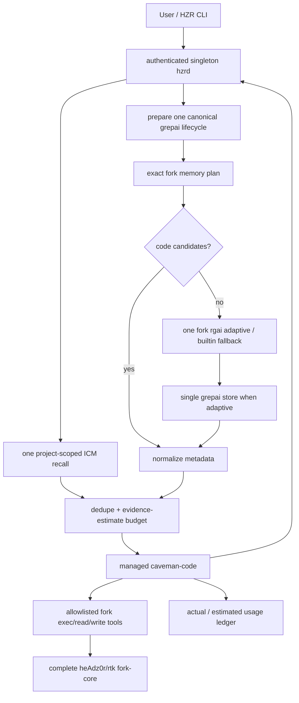

# PRD: HZR 0.3.0 - a single platform for the efficiency of LLM agents

**Product:** HZR - **h**eAdz0r's **Z**ero-**R**edundancy engine (`Z` = both author's nickname and principle). The successor of RTK in meaning: RTK killed tokens, HZR killed redundancy - the second index, the second memory store, the second pre-read pack, the file re-submitted to the context, duplicating the compression layer of the agent
**Release:** 0.3.0
**Date of decision:** 2026-07-31
**Status:** HZR 0.3.0 release candidate; G1–G7, adoption/control-plane path and self-contained release packaging are implemented, economic KPI awaits paired provider benchmark
**Repository:** new standalone product and Git history; the actual worktree `heAdz0r/rtk` is imported entirely into `v0.1.0` as a provable baseline, after which the engine is developed only within HZR
**Main criterion:** minimum total cost of a successfully solved problem while maintaining measurable quality

## 1. Solution

HZR is built **around the proven fork `heAdz0r/rtk` and 100% of its code**. The imported baseline is not replaced by the RTK-compatible implementation. After `v0.1.0`, the full source becomes developed by the internal execution/context core HZR: fixes, refactors and extensions are added directly to `fork-core/rtk`, preserving the inherited surface, provenance and regression gates. HZR adds a single control plane, centralized ICM and grepai, Caveman-contract and managed caveman-code runtime.

### 1.1 Non-negotiable fork-core contract

1. The baseline source is the actual state `/Users/andrew/Programming/rtk` imported into tag `v0.1.0`, including tracked modifications and project-related untracked files, and not just commit `HEAD` or stock upstream RTK. The source of the current implementation after baseline is `fork-core/rtk` in HZR.
2. The entire source/product surface fork is transferred to HZR: command filters, rewrite/hooks, `rgai`, grepai adapter, memory layer, read/write pipeline, guards, trust/permissions, discovery, gain/economics, telemetry/tracking, benchmarks, fixtures, tests, scripts and documentation.
3. HZR does not implement a lightweight replacement for this behavior. The existing `hzr-exec`, `hzr-context` and other crates can only be adapters/orchestrators around the fork-core.
4. Snapshot excludes only obviously generated or locally secret data: `.git`, `target`, `.grepai`, `__pycache__`, local DB/data and ignored machine-local settings. Exceptions are listed explicitly and cannot hide the source code.
5. Snapshot is accompanied by a machine-checked manifest: source branch, source `HEAD`, dirty patch hash, list of existing files and SHA-256 of each file, as well as a list of tracked deletions.
6. The Engine is built and runs its own tests from the HZR repository. CI rejects the loss of baseline provenance, simplified behavior replacement and engine changes without an updated parity ledger and a full deterministic regression gate.
7. Tag `v0.1.0` and snapshot v2 save byte-for-byte baseline. After baseline, `fork-core/rtk` is a HZR-owned evolvable engine: changes are made directly to its source inside HZR, committed to Git history and required to go through the entire fork regression suite plus HZR adapter contracts.
8. Stock RTK is not a runtime fallback and cannot replace the fork-core. Upstream RTK is used only as a reference/base for diff and future conscious backport.

The user receives:

- one CLI `hzr`;
- one local daemon `hzrd`;
- one configuration and data root;
- one versioned JSON protocol;
- one end-to-end token budget;
- one quality gate and raw fallback;
- one usage/cost/outcome ledger;
- one lifecycle for each external engine;
- one installer and one versioned self-contained bundle with hash-locked fork-core, patched grepai, ICM, caveman-code and bundled Node.js 22.17.1;
- one agent entry point, where caveman-code is responsible for the agent loop and provider UX, and HZR is responsible for context, memory, execution, codec and accounting.

End-user installation does not require separate RTK, grepai, ICM, caveman-code, Node.js/npm, Go or Rust. System Git remains a runtime prerequisite; installer also uses the standard POSIX download/archive/checksum utilities. The release archive is installed in a separate platform/version directory, and the atomically switchable `current` symlink sets the active version. Public `hzr`, `hzrd` and compatibility alias `rtk -> hzr` point to this single bundle.

Canonical processing formula:

> preserve intent → retrieve once → fuse once → allocate once → encode once → execute safely → verify quality → account actual usage.

The fork-core remains intact, but its external dependencies and calls go through the HZR ownership boundaries. Independently running multiple grepai watchers, ICM processes or caveman-code native RTK is prohibited: it creates repeated scans, re-compression and competing stores.

## 2. Product contract

HZR is required to reduce the overall cost of the task, not just the size of the model's stdout or response.

Optimized function:

```text
cost_per_accepted_task =
  provider_input_cost
  + provider_output_cost
  + cache_write_cost
  + cache_read_cost
  + retries_cost
  + local_compute_cost
  + failure_penalty
```

Transformation is allowed only if the expected benefit is positive after taking into account overhead and the probability of retry:

```text
expected_value = saved_tokens_value - transform_overhead - retry_probability * retry_cost
```

For code, patch, JSON, identifiers, commands, paths, URLs, enums, stack traces and security text, an exact/lossless policy is applied. If there is any uncertainty, HZR returns raw or content-addressed reference.

## 3. Evidence and conclusions of the study

### 3.1 RTK

The generalized stock RTK is useful as a deterministic command rewrite and tool-output filter, but its local evaluation `bytes / 4` is not a provider bill. In the independent JetBrains A/B on 86 tasks and 425 billed trials median provider cost in 80 clean low-effort pairs increased by 7.6%, turns - by 13.8%, cache reads - by 14.3%; no statistically significant difference in quality was found. The narrow Claude Analyzer benchmark, on the contrary, showed an estimated -18.2% with 3/3 pass. These results cannot be transferred to the current `heAdz0r/rtk`: it has a much wider and already user-tested pipeline - semantic search, memory planning, modular read, atomic write, guards and extended filters. Therefore, fork remains entirely execution/context core; HZR measures the end-to-end outcome around it and does not replace its stock RTK.

Sources: [JetBrains RTK token-savings test](https://blog.jetbrains.com/ai/2026/07/rtk-claude-code-token-savings/), [Claude Analyzer results](https://analyzer.spec-kitty.ai/proof/results.html).

### 3.2 grepai/rgai

grepai provides semantic/hybrid repository retrieval, symbol graph and call tracing. Maintainer benchmark on Excalidraw reports -27.5% billed cost, -55% tool calls and -97% fresh input; narrow independent Claude Analyzer experiment - estimated -14.5% with 3/3 pass. Both sets are too small for SLA. Conclusion: grepai becomes the sole owner of code embeddings/index; `rgai` remains a stateless facade/router and never creates its own database.

Source: [grepai benchmark](https://yoanbernabeu.github.io/grepai/blog/benchmark-grepai-vs-grep-claude-code/).

### 3.3 ICM

ICM is suitable for long-term episodic/semantic memory, structured facts, transcripts and cross-session recall. It should not index the entire source tree or run separately for each hook. In 0.10.61, the HTTP API lacks feature parity: HTTP store bypasses MCP near-duplicate updates, auto-link/backrefs and consolidation, while HTTP recall omits graph expansion. MCP retains full write semantics but returns a text-only `ToolResult`. HZR therefore keeps one stdio MCP process for store operations, does not parse its human-readable text, and uses the official `icm recall --format json` against the same database for typed, graph-aware recall. This preserves one store and one semantic model without forking ICM.

ICM has no first-class project or role columns; HZR enforces scope through topic namespaces. If ONNX is unavailable, recall degrades to FTS and must be reported as a degraded capability.

Sources: [ICM HTTP implementation](https://github.com/rtk-ai/icm/blob/c3a1bac7cfe401b55fd66af16dfc0c774c02167a/crates/icm-cli/src/http_api.rs), [ICM MCP tools](https://github.com/rtk-ai/icm/blob/c3a1bac7cfe401b55fd66af16dfc0c774c02167a/crates/icm-mcp/src/tools.rs), [ICM protocol](https://github.com/rtk-ai/icm/blob/c3a1bac7cfe401b55fd66af16dfc0c774c02167a/crates/icm-mcp/src/protocol.rs).

### 3.4 Caveman

Caveman v1.9.1 is useful as an output contract and representation codec. Its documentation indicates zero input savings and overhead of about 1–1.5k input tokens/turn. JetBrains on 82 paired coding tasks received about -8.5% output and about -10% expected cost without detectable degradation in quality, but with large variance; in an independent 24-prompt test, the short `Be brief.` almost coincided with the full Caveman. CAVEWOMAN shows that input compression often increases cost and reduces accuracy. Conclusion: HZR does not rewrite the user intent, uses a short cacheable response contract and a secure protected codec.

Sources: [Caveman Honest Numbers](https://github.com/JuliusBrussee/caveman/blob/main/docs/HONEST-NUMBERS.md), [JetBrains Caveman study](https://blog.jetbrains.com/ai/2026/07/speak-to-ai-agents-like-cavemen-tosave-tokens/), [Max Taylor benchmark](https://www.maxtaylor.me/articles/i-benchmarked-caveman-against-two-words), [CAVEWOMAN preprint](https://arxiv.org/abs/2606.24083).

### 3.5 caveman-code

`JuliusBrussee/caveman-code` is a full-fledged TypeScript coding-agent runtime, not just codec. It has provider streaming, TUI, print/RPC/daemon modes, SDK, tools, sessions, checkpoints, subagents, worktrees, steering/follow-ups and architect/editor patterns. This speeds up the creation of HZR agent UX. The npm executable 0.65.2 has source provenance `gitHead=4700b8fad23e45cedbb1a850f03ee9e2d4d49116`; the later main commit is not the pin of the published tarball.

At the same time, the default runtime contains its own:

- RTK adapter;
- PageRank repo map, automatically injected every turn;
- cavemem/files memory and memory tools;
- tool-result/cave-mode compression;
- session compaction and own usage presentation.

Without a managed adapter, these functions conflict with HZR. Extension API allows you to intercept tool calls and provider payload, but the public extension context does not provide methods for disabling repo map and memory. The SDK class `AgentSession` provides `setRepomapEnabled(false)` and `setMemoryEnabled(false)`. Therefore, HZR runs caveman-code through the SDK bridge, and not as an opaque CLI subprocess.

Managed HZR profile must:

1. call `setRepomapEnabled(false)` before the first prompt;
2. call `setMemoryEnabled(false)` before the first prompt;
3. set native `rtk.enabled=false`;
4. disable native tool-output compression and ML compression;
5. disable native telemetry and automatic memory hooks;
6. register HZR search/context/memory/exec tools;
7. send provider usage and outcome to HZR ledger;
8. stop running with clear diagnostics if version SDK no longer guarantees these invariants.

Published benchmark caveman-code is considered only as directional maintainer evidence: 25-task MicroBench reports about 524k fresh tokens and 14/25 pass versus about 1.010m and 15/25 for the compared Codex run. It includes native RTK, repomap, memory and compression, which HZR disables, so the result cannot be attributed to managed HZR and it does not replace the native paired benchmark.

Sources: [caveman-code repository](https://github.com/JuliusBrussee/caveman-code), [daemon reference](https://github.com/JuliusBrussee/caveman-code/blob/main/docs/reference/daemon.md).

## 4. Goals and guardrails

### 4.1 Goals for 0.2.x

- One semantic index on `(workspace_id, canonical_root, embedder, model, dimension)`.
- 100% of the source/product surface of the current fork is present in the hash-locked fork-core and is accessible through HZR.
- Zero simplified reimplementations in the runtime path instead of the fork-core.
- Zero project-local index data: only verified `.grepai` symlink/pointer on HZR-owned canonical store is allowed.
- One ICM process and one canonical ICM DB on HZR data root.
- Exact RTK rewrite contract, including the difference between rewrite and auto-allow.
- Hard evidence budget based on clearly marked token estimate; no hook adds a hidden second pre-read pack.
- Short adaptive density-contract to generation and separate explicit codec: exact paragraph dedupe, protected spans, raw fallback and shadow counterfactual without changing delivered content.
- caveman-code managed mode without native RTK/repo-map/memory/compression duplication.
- Actual provider usage is stored separately from estimates.
- All engines are checked by version/integrity before launch.
- Offline local mode by default; telemetry is turned off.

### 4.2 Product metrics

- median actual billed cost per accepted task: minimum −30% to baseline after a set of representative tasks;
- median turns: minimum −20%;
- uncached input tokens: minimum −35%;
- tool-result bytes in LLM context: minimum −60%;
- retrieval recall@20: not lower than 95% on gold set;
- task success non-inferiority margin: no worse than baseline by more than 1 percentage point;
- p95 warm orchestration overhead without LLM latency: no more than 250 ms;
- p90 cost of an individual task: not higher than baseline by more than 5%;
- stale-index incidents that led to erroneous editing: 0.

Until a statistically sufficient benchmark appears, the UI has no right to show the forecast as proven savings. Values ​​are labeled `actual`, `tokenizer`, or `estimate`.

Managed bridge 0.3.0 records only observed runtime outcomes `completed`, `invalid_response` and `failed`; it doesn't declare its own answer "accepted". The `accepted` and task success label are set by an external benchmark/harness or future explicit user-feedback workflow, so the current `hzr savings` does not produce `cost_per_accepted_task` without such data.

### 4.3 Non-goals

- Compression of the hidden chain-of-thought/reasoning provider.
- Regex rewriting of code, JSON Schema, enums or command arguments.
- Common physical SQLite database for code index, memory and ledger.
- Cloud control plane by default.
- Automatic removal of found legacy/duplicate indexes.
- Copying all caveman-code into Rust.
- Rewrite or selective migration of the current RTK fork.
- Replacing fork-core with stock RTK in case of error, version drift or mismatch API.
- Promising “zero quality loss” with no verifiable criterion.

## 5. Architecture



### 5.1 Ownership matrix

| Concern |Sole owner| Derived/read-only consumers |
|---|---|---|
| orchestration, policy, budget | HZR Core | adapters, daemon, agent runtime |
| command surface, rewrite, filters, read/write, guards, trust, discovery | complete `heAdz0r/rtk` fork-core | HZR fork adapter, caveman-code tool bridge |
|fork memory planner and derived workspace cache| complete fork-core |HZR Context; it is not durable ICM replacement|
| code embeddings/symbol graph | grepai v0.35.0 | HZR Index, rgai facade |
|exact lexical search and fallback| fork `rgai --builtin` | HZR Context transport |
| cross-session memory | ICM v0.10.61 | HZR Memory, agent runtime |
| transient workspace/git state | HZR Context | retrieval orchestrator |
| natural-language density | HZR Codec, Caveman-derived | prompt/response contracts |
| provider/agent loop | caveman-code managed bridge | HZR CLI |
| usage, cost, retry, outcome | HZR Ledger | reports and policy tuning |

### 5.2 End-to-end flow

1. Adapter transmits the original intent without telegraphic rewriting and canonicalizes workspace.
2. HZR prepares one managed grepai lifecycle/store, but does not run a separate unconditional semantic query.
3. Fork `memory plan --format json` builds the main structural plan; one ICM recall with repository-derived project scope is executed in parallel.
4. If the planner has selected code candidates, they are used directly. Only if the result is empty, one fork `rgai` is executed: adaptive via canonical grepai or builtin exact with degradation.
5. The results are normalized to `ContextCandidate` with primary provenance, content hash, generation and token source.
6. Fusion stores one candidate per content ref, applies diversity limits and hard limits to marked evidence estimates.
7. Agent receives bounded untrusted metadata/snippets/memory summaries and then exactly reads the necessary files through a fork-backed tool; eager reread of all candidates missing.
8. Before generation HZR injects a short stable response-density contract. `hzr codec compile` remains separate explicit protected transform; agent response does not pass the second lossy post-processing.
9. Agent calls only HZR allowlisted tools; the actual routing/filter/read/write/guard operations are performed by the full fork-core.
10. Exact JSON additionally undergoes parser validation, empty output is rejected, provider usage and terminal outcome are written to the ledger.
11. ICM receives only explicitly saved durable facts/decisions/handoffs, and not every raw tool output.

## 6. Components 0.3.0

### 6.1 `hzr-protocol`

Versioned envelopes, IDs, privacy/risk/fidelity, token source, intent, context candidate/pack, provenance, health and usage. Protocol type must separate actual and estimated usage.

### 6.2 `hzr-core`

Canonical config/data layout, engine lock, fusion, hard budgets, policy, ledger and migration state. All solutions are reproducible by trace ID and policy version.

### 6.3 `fork-core` and `hzr-exec`

`fork-core/rtk` is a HZR-owned engine, derived from the full hash-locked baseline of the current `heAdz0r/rtk`, including its dirty worktree. Baseline remains provable via `v0.1.0` and snapshot v2; subsequent fixes and extensions live only in HZR Git history. Engine remains the only implementation of command/search/read/write/memory-planning behavior. The public name of the product is `hzr`; a compatible internal binary is not published as a separate control plane.

`hzr-exec` - thin process/protocol adapter. It does not contain its own RTK rewrites table and does not repeat fork filters. Its pipeline:

Typed pipeline:

```text
raw request → HZR policy/permission envelope → fork-core invocation
            → exact exit/stdout/stderr capture → HZR ledger/quality envelope
```

Exit code, stderr, error lines, test failures, paths and identifiers are saved. Raw/direct fallback uses the behavior provided by the fork itself or the original command using an explicit HZR policy; stock RTK fallback is prohibited.

The fork-core stores, among other things: full CLI, all command-specific filters, `rgai_cmd.rs`, `grepai.rs`, `memory_layer/*`, modular read pipeline, atomic write/CAS/locks, hook rewrite/audit, guard/trust/permissions, tracking/gain/economics, discovery, benchmarks and regression tests. The full list and status are in `FORK_PARITY.md` and machine-readable snapshot manifest.

### 6.4 `hzr-index`

- normalizes workspace root through canonical paths and git common dir;
- computes stable workspace/worktree IDs;
- owns one grepai config, watcher and generation;
- checks installed version against `engines.lock.toml`;
- prepares the canonical grepai store for semantic/auto calls;
- exposes lifecycle, placement, generation and migration primitives, but no competing search ranker;
- detects nested/legacy indexes but never deletes them automatically;
- prevents a watcher from another workspace being accepted as healthy;
- rejects real legacy `.grepai` until explicit `hzr migrate apply`;
- invalidates freshness by generation and source content hash.

Stock grepai 0.35.0 does not know how to select an arbitrary index path and its watcher automatically detects linked worktrees. Therefore, HZR creates only the verified `.grepai` symlink on the central store and distributes the minimal source patch `--no-worktree-discovery`. Runtime always probes capability and passes flag; The unpatched watcher in multi-worktree is blocked until spawn, while exact search and reading the existing semantic index continue to work.

`rgai` preserves the implementation, ranking, compact rendering and fallback chain from fork-core. `hzr search`, `hzr rgai`, context planner and agent tool delegate one request to it; exact mode adds `--builtin`, semantic/auto prepares managed grepai first. `hzr-index` manages binary/watcher/store/generation and does not implement a competing ranker. `rgai` does not own storage.

### 6.5 `hzr-memory`

- fixed DB under `<data_root>/memory/icm/memories.db`;
- singleton process lock and one managed stdio MCP process;
- full MCP store path for near-dup, auto-link/backrefs and consolidation;
- typed official CLI JSON recall to the same DB for graph expansion without human parsing;
- repository-scoped topic namespace and ICM project filter on top of one common DB;
- pid/token/log files with private permissions;
- health, recall and store typed client, bounded JSON-RPC framing;
- circuit breaker and correctness-first CLI fallback;
- idempotent start/stop/restart;
- explicit release/version check;
- no automatic indexing of source code.

ICM topics are global by upstream design. Therefore, HZR takes a workspace in each memory request, evaluates the canonical `repository_id`, adds it as a separate topic segment on store, and forces the same project filter on recall. The client cannot change the project scope. The memory of different repositories does not mix, although the lifecycle and physical DB remain the same.

#### 6.5.1 Two namespaces: project and global

One physical store, two reachable namespaces. Preferences and architectural rules are properties of the *user*, not of one repository — with a project-only namespace, a preference learned in one project was invisible in every other, which forced the same fact to be restated per repository.

| Namespace | Topic form | Reached by |
|---|---|---|
| project | `<kind>-<repository_id>` | `--scope project`, and by default on store |
| global | `<kind>-global` | `--scope global` |
| both | — | `--scope project-and-global`, the default on recall |

Invariants:

- **The namespaces cannot collide.** `global` is a fixed literal, not a second hash: a repository identity is 64 lowercase hex characters and `global` is not hex, so no project can present itself as the global namespace or the reverse.
- **Cross-repository isolation is unchanged.** The filter is positive — a record is kept only because it provably belongs to *this* repository or to the global namespace. Another repository's record is unreachable from either scope, and so is a bare un-namespaced topic written by a tool outside HZR.
- **A write targets exactly one namespace.** `project_and_global` is meaningless for a store and is not accepted there; allowing it would duplicate one fact into two namespaces.
- Recall defaults to `project_and_global` because an agent should see standing preferences alongside this project's history; store defaults to `project` because a fact is repository-scoped unless the caller deliberately states otherwise.

### 6.6 `hzr-codec`

Profiles: `off`, `safe`, `adaptive`, `compact`, `shadow`. In 0.2 codec is not a universal paraphraser: it selects a short density contract and, like an explicit transform, removes only exact duplicate paragraphs. Protected spans cover code fences, inline code, paths, URLs, flags, hashes, versions, identifiers, enum-like values ​​and structured payloads; any violation returns raw byte-for-byte. `adaptive` checks economics before adding any contract. `shadow` returns the original content unchanged and writes counterfactual input/output/saved bytes and `would_change`. The ending newlines are saved.

### 6.7 `hzr-agent`

Managed bridge to caveman-code:

- package version and npm integrity are pinned;
- isolated `agentDir` lives under HZR data root;
- native RTK, repo-map, memory, hooks, compression, external resources, builtin agents/skills and telemetry are disabled before first prompt and rechecked throughout generation;
- only an exact allowlist of HZR context/search/read/edit/write/memory/exec custom tools may execute;
- one bounded unified-context prefetch is injected as untrusted evidence before generation;
- text and strict JSON result modes are supported;
- provider credentials remain in the upstream auth storage or environment and are never copied into HZR ledger;
- daemon health must report protocol 1, HZR 0.3.0 and exactly one ready fork-core before launch;
- provider usage is posted once from the bridge finalizer with `completed`, `invalid_response` or `failed`; accounting failure never masks the primary result;
- managed launch fails closed on invariant mismatch; ordinary HZR tools continue to work.

Exact npm lock for caveman-code 0.65.2 resolves `@juliusbrussee/caveman-agent`, `caveman-ai` and `caveman-tui` into 0.65.3. The certified source/development range remains Node `>=20.18.1,<26`: the lower bound is set by the transitive `undici`, and Node 26 is blocked due to the known incompatibility `better-sqlite3` in upstream issue #46. End user is not required to provide Node: the release bundle contains checksum-pinned official Node.js 22.17.1 and the bridge always runs through this private runtime. TypeBox is fixed as an explicit dependency due to upstream issue #23. Vulnerable transitive `adm-zip<0.6.0` replaced exact npm override with 0.6.0; release gate requires `npm audit --omit=dev` without high/critical findings.

Residual upstream behavior 0.65.2: session construction executes the inactive `cavemem --version` probe and builds the inactive builtin registry. Runtime guard prevents these builtins from executing. Complete removal of the probe itself requires a separate SDK patch; this does not create a second memory DB or executable tool path in HZR.

### 6.8 `hzrd` and `hzr-cli`

Minimum daemon API:

```text
GET  /v1/health
GET  /v1/engines
POST /v1/search
POST /v1/context/plan
POST /v1/memory/recall
POST /v1/memory/store
POST /v1/exec/rewrite
POST /v1/exec/run
POST /v1/exec/approval
POST /v1/fork/run
POST /v1/codec/compile
POST /v1/usage
```

CLI surface:

```text
hzr init [--if-needed --quiet]
hzr install [--dry-run] [--force]
hzr uninstall [--keep-data] [--dry-run] [--force]
hzr hooks status
hzr mcp serve
hzr mcp config --client codex|claude-desktop
hzr mcp status
hzr doctor [--json]
hzr daemon serve|status|engines|service install|start|stop|restart|status
hzr engines status
hzr index status|init
hzr exec rewrite|run|approve|deny
hzr search <query>
hzr rgai <query>
hzr memory recall [--scope project|global|project-and-global] <query>
hzr memory store [--scope project|global] <topic> <content>
hzr memory status
hzr context plan <intent>
hzr codec compile <text>
hzr agent run [--json] <prompt>
hzr tdd
hzr stats
hzr release [--dry-run] [--force] [--skip-service] [--install-root DIR]
hzr build <project build arguments>
hzr migrate scan|apply|history|memory
hzr rtk -- <fork arguments>
```

**`release` and `build` are deliberately distinct verbs.** `hzr release` builds *this
source tree* into a bundle, installs it version-scoped, switches `current` atomically,
restarts the daemon and then verifies the reported version of all four engines — checking
only `hzr --version` is what previously let a stale bundle look current (RB-04).
`hzr build` forwards verbatim to the inherited fork `build`, which is a token-optimized
wrapper for building *the user's project*; the fork already used that verb, so muscle
memory carries over instead of the two meanings colliding under one name.

The installed hook runtime uses the hidden `hzr hooks dispatch`: one handler for `PreToolUse:Bash|Agent|Task`. Managed rewrite has a hard timeout of 2 s and converts fork decisions into a typed Claude hook result with exit 0; when the daemon is unavailable, it invokes the same pinned `0.44.1-fork.1` adapter. `SessionStart` invokes `hzr init --if-needed --quiet`. The adoption command removes known RTK handlers individually, centralizes ICM ownership by default, preserves unknown handlers, creates a full-SHA backup, verifies compare-and-swap under a filesystem lock, and atomically replaces settings only after `--force`. Using the same transactional pattern, it installs one HZR-owned block in Claude `CLAUDE.md` and Codex `AGENTS.md`, references the canonical bundled `HZR.md`, and removes only machine-owned legacy `@RTK.md` imports.

`bin/rtk` is a relative compatibility alias to `bin/hzr`, and not a second installation/control plane. Given the name invocation HZR normalizes it to `hzr rtk --` and executes the private exact `engines/rtk` with the original argv/cwd/stdio/signals/exit status.

Repository-level `install.sh` and CLI `hzr install` have different boundaries of responsibility. The first one checks the release checksum and internal manifest, sets the entire platform bundle to `versions/v<version>-<platform>` and atomically switches `current`. The second command places durable public binaries and executes adoption hooks/instructions; it supports preview via `--dry-run` and explicit confirmation via `--force`. The release installer calls both stages as one user operation; `HZR_INSTALL_HOOKS=0` allows you to defer adoption.

### 6.9 MCP surface (`hzr mcp serve`)

Clients without a hook mechanism - Codex app-server and Claude desktop - can only get memory through MCP. Before this surface appeared, each of them registered `icm serve` directly, which is the forbidden §6.5 second durable memory layer. On a real machine this resulted in 8 orphaned `icm serve` left behind by dead Codex sessions because Codex spawns one per session and doesn't respawn them.

`hzr mcp serve` is a stdio JSON-RPC adapter, not a second control plane:

- **there is no store.** Each call goes to a single `hzrd`, which owns one supervised ICM process and one canonical DB. Therefore N parallel adapters are safe: the singular must be a store, not a pipe;
- **lifecycle is native to the client.** `hzr init` never starts MCP. The confirmed `hzr install --force` writes the native Codex/Claude Desktop registration; the client launches `hzr mcp serve` on connection and closes it through stdin EOF. `hzr mcp status` audits this state without mutation;
- **orphan is not possible.** The process terminates at EOF on stdin, that is, at the moment of the death of the parent. Tested by SIGKILL parent: 0 leaks;
- **fake liveness is prohibited.** If `hzrd` is not available, `isError: true` is returned rather than a successful response. HZR never routes to a fallback store. Validation and connection failures happen before dispatch; if a store response is lost after dispatch, the result explicitly reports unknown completion and tells the caller to recall before retrying;
- **scope is not expandable by the client.** workspace is taken from the launch directory of the server; the client cannot change the repository;
- **Direct engine control is not exposed.** The surface provides no `icm serve`, `grepai watch` or `rtk proxy` commands.

Current tools: `hzr_context_plan`, `hzr_search`, `hzr_memory_recall`,
`hzr_memory_store`. All names use the `hzr_` namespace. The gateway
negotiates stable MCP `2025-11-25` or a compatible older revision, publishes
JSON Schema 2020-12 input/output contracts, rejects unknown fields and invalid
types/enums, validates limits at 1–50, and returns both `structuredContent` and
backward-compatible text.

The surface is intentionally model-oriented. Health, statistics, engine lifecycle
and unrestricted execution remain operator CLI/API concerns. Adding them as tools
would increase selection ambiguity or mutation authority without improving context
retrieval.

`hzr mcp config --client codex|claude-desktop` remains a read-only preview and prints a registration snippet. Confirmed `hzr install --force` transactionally replaces known direct ICM registrations in client configs with HZR MCP, using a filesystem lock, content-addressed backup, and compare-and-swap; unknown MCP servers are preserved. `doctor` continues to report remaining unmanaged `icm serve` processes as an `error` (§16.5.1).

## 7. Data layout and prohibition of duplicates

```text
<hzr-data>/
  runtime/
    hzrd.token
    hzrd.token.lock
    hzrd.lock
  fork/
    mem.db                # fork derived IMG/cache, keyed by project
    history.db            # fork tracking/economics
    tee/                  # managed path sets RTK_TEE=0
    audit/
  workspaces/<repository-id>/<worktree-id>/index/grepai/
    config.yaml
    index.gob
    symbols.gob
    rpg.gob
    hzr-owner.lock
    hzr-runtime/
  migrations/<repository-id>/<worktree-id>/
    grepai-v1.prepared.json
    grepai-v1.json
  memory/icm/
    memories.db
    auth.token
    icm.log
    runtime/
      supervisor.lock
      icm.pid
      token.lock
  ledger/
    hzr.sqlite
  sessions/
```

Invariants:

- source index and memory are physically separated, but have a common provenance model;
- HZR does not create project-local index data; `.grepai` can only be a verified symlink/pointer on the canonical store;
- existing real `.grepai` is recognized as legacy and blocks managed search/init until explicit migration;
- legacy stores are detected by read-only scan;
- migration is performed only by an explicit command with retained full-SHA backup and two immutable manifests;
- duplicate/foreign indexes reportable, automatic deletion or quarantine prohibited;
- singleton `hzrd` lock plus worktree owner lock exclude the second HZR watcher;
- one content hash should not be re-entered into the context pack from different sources.

## 8. Version and supply-chain policy

Release lock for 0.3.0:

| Engine |Version| Pin |
|---|---:|---|
| Node.js runtime | 22.17.1 |official platform archives for macOS/Linux arm64/x64; SHA-256 of each artifact is recorded in `engines.lock.toml`|
| grepai | 0.35.0 | tag `v0.35.0`, commit `65c345ca32122c17a39a5bbec2780c2eea773a12` |
| ICM | 0.10.61 | tag `icm-v0.10.61`, commit `c3a1bac7cfe401b55fd66af16dfc0c774c02167a` |
| HZR fork-core | 0.44.1-fork.1, current `heAdz0r/rtk` worktree | branch `feat/upstream-0.42-fork.1`, `HEAD=5f403c465cbdbe148e9ca03e0ac8e856eef0bfee`; 516 files + 4 tracked deletions; canonical snapshot v2 `f4296ec404f461d6fc03c966c0dc79caee6c3118a73d1ed1a078ded5529f0a16`; v1 content manifest `072a62adc754b728ec99a507d2c1a223d83077d067a9249a26d357eec890b4cc` |
| upstream RTK reference only | 0.44.1 |tag `v0.44.1`, commit `36591fb00d650bf987b57483c0b3a395a35a8dc1`; not runtime engine|
| Caveman prompt/codec reference | 1.9.1 | tag `v1.9.1`, commit `0d95a81d35a9f2d123a5e9430d1cfc43d55f1bb0` |
| caveman-code | 0.65.2 | npm integrity + exact lockfile; npm `gitHead=4700b8fad23e45cedbb1a850f03ee9e2d4d49116` |

The executable caveman-code is fixed by npm version, tarball integrity, source `gitHead` and full lockfile. Exact lock resolves `caveman-agent`, `caveman-ai` and `caveman-tui` to 0.65.3 with separate integrity. A later main is not considered a provenance tarball.

grepai is built only from pinned commit after applying [patches/grepai/0.35.0-disable-worktree-discovery.patch](patches/grepai/0.35.0-disable-worktree-discovery.patch); patch must pass `git apply --check`, Go tests and capability smoke. ICM source requires a separate minimal pinned patch that syncs only the legacy version of `icm-cli` in the upstream `Cargo.lock` with the source package 0.10.61 and preserves the build `--locked`. [scripts/build-bundle.sh](scripts/build-bundle.sh) builds native local-platform bundle HZR + **fork-core** + patched grepai + patched ICM + exact caveman-code production tree + official Node.js 22.17.1. Building stock RTK instead of fork-core or dependency of release runtime on external Node/RTK/grepai/ICM is a release-blocking error.

`scripts/package-release.sh` adds internal `BUNDLE_MANIFEST.sha256` and creates `hzr-v0.3.0-<platform>.tar.gz`; `install.sh` separately checks release `SHA256SUMS`, internal manifest and mandatory bundle layout before atomically switching active version. Clean-install smoke runs HZR with `PATH`, which lacks external Node/RTK/grepai/ICM, and leaves only the system Git. Release build checks checksum/integrity, license, executable version and protocol smoke test. Engine auto-update/sync is missing; a future implementation should not update pins without explicit confirmation.

Before switching `current` installer re-attests the already existing same-version root by
byte-identical internal manifest, mandatory layout, modes, digests and allowed symlinks.
Any discrepancy fail-closed before switching; smoke fixtures confirm rejection for
tampered, missing and symlink-injected roots, and a clean re-install remains a no-op.

Artifact tooling supports `darwin-arm64`, `darwin-x64`, `linux-arm64` and `linux-x64`; Each artifact must be built and smoke-test run natively. The current public CI assembled-bundle gate runs on Linux x86_64. Windows artifact is not included in 0.3.0, and the rest of the declared platform artifacts are not considered release-verified to native job/smoke.

## 9. Security and privacy

- loopback-only daemon by default;
- bearer token for local API;
- non-loopback bind is not supported in 0.3.0;
- config, DB tokens and runtime secrets have private permissions;
- provider API keys are not logged and not saved in the ledger;
- managed fork path forces `RTK_TEE=0` and `RTK_TELEMETRY_DISABLED=1`;
- HZR telemetry and raw retention are disabled by default;
- fork read/write API accepts only the minimum allowlist argument shapes and canonical workspace paths;
- shell is saved only where the full original shell line is needed for fork rewrite semantics;
- destructive commands require a separate risk/permission verdict;
- daemon body/capture/time limits are limited, path traversal and symlink escape are rejected;
- usage ledger stores counters, model/provider metadata and outcome, but not prompt/response body.

## 10. Failure modes

| Failure |Behavior|
|---|---|
|`hzrd` unavailable|managed agent/search/context/memory/exec are blocked; exact compatibility `hzr rtk`/`bin/rtk` remains straight process path|
|grepai is missing/outdated| exact rg fallback; semantic status degraded |
| index stale |stale provenance, exact verification before edit|
|legacy/duplicate/foreign index found|typed migration-required/error; nothing is deleted|
|ICM unavailable|context returns warning and code plan; direct memory call reports unavailable; agent health saves warning|
|codec invariant broken|raw content and failure telemetry|
|fork-core is not available or the version does not match|managed agent/exec/search are blocked; context can only return ICM with explicit warning; stock RTK is not substituted|
|fork filter selected raw/fail-open|the standard fork semantics are preserved and HZR records the outcome|
|provider usage missing|estimate is stored only in estimated columns|
| caveman-code SDK drift |managed agent mode is blocked with remediation; the rest HZR commands work|
|token budget is exhausted|evidence is rejected with reason; the limit does not expand hidden|

## 11. Migration

`hzr migrate scan` read-only detects legacy/nested `.grepai`, external memory/config/wrapper/process markers and reports them without changing the data.

`hzr migrate apply --workspace` in 0.3.0 is intentionally narrow and auditable: it centralizes exactly one legacy grepai store. Operation:

1. canonicalizes repository/worktree identity and rejects duplicates/foreign entries;
2. holds exclusive legacy HZR owner lock;
3. takes an ordered tree snapshot with bytes, Unix modes and safe symlink targets;
4. copies it to staging and re-checks the full SHA-256;
5. creates retained `.grepai.hzr-backup-<full-sha256>` and durable `prepared` manifest;
6. atomically installs managed target and verified project `.grepai` symlink;
7. holds canonical owner upon activation and writes immutable `applied` manifest;
8. When called again, it checks manifests/backup/target and returns typed `already_applied`.

Escaping symlinks, special files, active HZR owner, source mutation, partial target/stage/manifest and unsafe path relationships block migration. Backup is never automatically deleted. HZR does not stop or delete external processes, configs, wrappers, hooks, or ICM databases without a separate explicit operation.

The old `/Users/andrew/Programming/rtk` remains the unchanged archived baseline source. All further development of the legacy engine is done in `/Users/andrew/Programming/hzr/fork-core/rtk`; There is no automatic reverse synchronization.

## 12. Verification strategy

### 12.1 Rust quality gates

`hzr tdd` exposes the canonical HZR Red-Green-Refactor contract in text and
typed JSON. It is derived from upstream RTK's project skill, but makes evidence
explicit: a relevant focused test must be observed failing before production
changes, then the identical command must pass. Post-hoc passing tests remain
regression coverage and are never reported as TDD. The release bundle ships the
canonical skill under `share/hzr/skills/hzr-tdd/`.

```bash
cargo fmt --all --check
cargo clippy --workspace --all-targets --all-features -- -D warnings
cargo test --workspace --all-targets --all-features
```

### 12.2 Contract tests

- snapshot manifest reproduces 100% of the valid source set of the current fork, including uncommitted/untracked code and tracked deletions;
- all original fork test/benchmark harness is present and launched from HZR;
- fork CLI/rewrite/read/write/rgai/memory/guard behavior occurs without functional losses;
- stdout/stderr/exit preservation;
- grepai 0.35.0 JSON fixtures and version drift;
- root/worktree identity and duplicate index detection;
- ICM singleton race, stale PID, token permissions and circuit breaker;
- the sum of token estimates of the selected evidence does not exceed the hard limit;
- protected spans survive codec byte-for-byte;
- estimates never increment actual totals;
- caveman-code duplicate layers are disabled before prompt;
- daemon body limit, timeout, auth and loopback binding;
- packaged bundle contains exact private engines, caveman production tree and Node.js 22.17.1 with complete manifest/provenance;
- clean installer succeeds without external Node.js, RTK, grepai or ICM and preserves system Git as prerequisite.

### 12.3 Paired benchmark

Each task runs baseline and HZR with the same model, temperature, repository revision and max turns. Provider usage, cache usage, turns, tool calls, latency, retries, task success and judge/harness outcome are collected. The report shows median, p90, confidence intervals and a list of regressions, not just total percentages.

## 13. Release acceptance for 0.3.0

Release is allowed when:

- fork-core is imported entirely from the actual worktree and its manifest is independently verified;
- `FORK_PARITY.md` does not contain `missing`, `reimplemented` or unverified runtime substitutions;
- stock RTK is missing from the production execution path and bundle;
- all workspace crates are compiled without warnings;
- quality gates green;
- `hzr doctor --json` checks all pins and ownership;
- ICM start/stop race test proves singleton;
- nested `.grepai` fixture is detected and not removed;
- `hzr search` uses grepai 0.35.0 and exact fallback;
- `hzr rgai` uses the same canonical generation;
- `hzr exec` delegates to the full fork-core and goes through the entire fork regression suite plus adapter contracts;
- codec saves protected spans;
- managed caveman-code smoke test confirms disabling duplicate layers;
- CLI/daemon smoke test works from a clean data root;
- README contains installation, architectural invariants and recovery;
- ICM contains the current handoff for the following LOOP agents;
- the repository saves `v0.1.0` baseline, has a current-engine manifest and version `0.3.0`.
- `hzr install` idempotently replaces RTK hooks, saves other people's handlers and does not write to `--dry-run`;
- `hzr init --if-needed` is filesystem no-op on an already registered workspace;
- managed and degraded hook paths use the same typed decision contract, and degraded accounting is visible in `doctor`/`savings`.
- one release installer checks artifact checksum and internal manifest, installs version-scoped `v0.3.0-<platform>` bundle and atomically switches `current`;
- existing same-version root re-certified by internal manifest or installer fail closed before switching `current`;
- the installed artifact contains full fork-core, patched grepai, patched ICM, exact caveman-code production tree and bundled Node.js 22.17.1;
- clean-install smoke works without separate Node.js, RTK, grepai and ICM; system Git remains prerequisite;
- Claude and Codex receive one managed HZR instruction block without a duplicate `@RTK.md` import.

### 13.1 Confirmed release blockers of global adoption

Below is a read-only acceptance audit of a real machine on the cut 2026-08-01 00:09 MSK, source HEAD `c88d271`. Only 2 out of 10 adoption points were completely passed. These results take precedence over the previous `LGTM`/“implemented” in the status documents. `v0.3.0` cannot be published or declared globally adopted until each blocker is closed with code, regression test and live re-audit.

| ID | Severity |Confirmed defect| Evidence |Mandatory acceptance|
|---|---|---|---|---|
| **RB-01** | **P0** |Global instructions do not have a single HZR ownership|`~/.claude/CLAUDE.md` simultaneously contains a legacy block that requires direct `rtk`/ICM, and an added HZR block. `~/.codex/config.toml` still runs `icm serve` directly; HZR block in `AGENTS.md` is just added to the old contract|`hzr install --force` transactionally deletes only machine-owned legacy RTK/direct-ICM directives, leaves exactly one HZR block for Claude and Codex, re-install byte-for-byte no-op; fixture and live check do not find `@RTK.md`, direct `rtk` mandate or direct ICM MCP command|
| **RB-02** | **P0** |Centralized memory ownership is actually broken|Four external `icm` servers and two Claude wrapper processes were detected in the live process table; scanner reports six foreign owners. Legacy `dev.icm.icm/memories.db` and canonical `dev.headz0r.hzr/memory/icm/memories.db` exist at the same time|After explicit adoption, exactly one HZR-owned memory lifecycle is active; Claude/Codex do not run ICM directly; `doctor --json` distinguishes between process and wrapper, shows zero foreign active owners; legacy DB is not deleted, and migration/backup is performed as a separate idempotent operation with the manifest being checked|
| **RB-03** | **P0** |`hzr install` does not provide the declared self-contained global bundle|CLI installer copies only `hzr`/`hzrd`, does not install bundled engines/runtime, daemon service and full instruction artifact. In clean HOME a reference to the missing `~/.local/share/hzr/HZR.md` is written|Installing from the release archive with one command places the version-scoped full bundle, canonical `HZR.md`, engines and private runtime; public binaries point only to stable `current`; clean-HOME gate checks the existence and SHA of each referenced artifact, then runs CLI, hook, daemon, search, memory and managed bridge without external engine installations|
| **RB-04** | **P0** |The installed global binary diverges from the source/release candidate|The global `hzr 0.3.0` is available in PATH, but overrides `hzr stats` and `hzr mcp`; source `target/debug/hzr` already contains both commands. There is no public release artifact yet|Installer never marks the dev/stale binary as a current release. After deployment SHA/version/provenance global `hzr` and `hzrd` match verified artifact and `current`; `hzr stats --json`, `hzr mcp --help`, hook dispatcher and doctor are passed from a clean shell|
| **RB-05** | **P0** |`hzr stats` crashes on an empty canonical ledger|`target/debug/hzr stats --json` returns SQLite `Invalid column type Null` for aggregate `SUM(CASE WHEN outcome='accepted'...)`; aggregate columns are read without `COALESCE`|Empty, partial and populated DB return schema-valid JSON/TTY with zero totals and no panic/error; all nullable SQL aggregates use explicit semantics; added regression test with new empty DB|
| **RB-06** | **P0** |Global proven cumulative history is not imported|Live legacy `rtk gain`: 22,859 commands and approximately 188.9M estimated saved tokens; DB `~/Library/Application Support/rtk/history.db` about 20.5 MB. The current migration only looks for `<HZR data>/fork/history.db` about 122 KB, so `hzr stats` only saw 107 operations and zero savings|Migration detects platform legacy RTK DB locations, first makes a read-only snapshot/identity, then idempotently imports each row exactly once into the canonical ledger. Counts/gross/regressions/signed net are checked against the source snapshot; source is not mutated; restarting does not add anything; legacy and canonical sources are not re-summed|
| **RB-07** | **P0** |There is no single production daemon/service ownership|The worker `target/debug/hzrd` is an unmanaged dev process; release installer does not install service. Previously, different token/data-roots gave 401, the current debug pair responds, but this is not a durable global contract|Installer creates and launches a platform service/supervisor with a single canonical binary, token and data root; start/stop/upgrade/restart idempotent; one `hzrd` is allowed at a time; CLI, hooks and MCP use its endpoint/auth; test plays reboot/restart and excludes dev binary path|
| **RB-08** | **P1** |Codec does not cover global request/response path Claude and Codex|Caveman codec applies in managed `hzr agent run`, but not proven for all global client requests/responses|For each supported client, a real interception point is described and tested. Request/response pass HZR policy/codec or are explicitly marked `unintercepted`; HZR does not accrue saving without a delivered counterfactual. The target single path is HZR MCP gateway from §14.1|
| **RB-09** | **P1** |Documentation and release status overestimate readiness|Previously, status called adoption, centralized ICM and installer implemented, although the live audit proved RB-01—RB-08|`PRD_STATUS_0.3.0.md`, README guarantees and release notes reflect the actual gate status. Any `ready/LGTM` is generated only after the saved report clean-HOME + live adoption + upgrade + process/store uniqueness|
| **RB-10** | **P0** |`hzr doctor` produces false PASS for conflicting instructions|`claude_instructions=pass` and `codex_instructions=pass`, because diagnostics only checks for the presence of BEGIN marker. At the same time, Claude contains active legacy RTK/ICM mandates, Codex runs direct ICM, and referenced `HZR.md` may be missing|Doctor checks readable canonical contract asset, absence of known legacy imperative blocks, absence of direct client ICM registration, global binary/bundle provenance and uniqueness of owners. The presence of HZR marker next to the conflict is always `fail`, and not `pass`|
| **RB-11** | **P0** |Global runtime does not use pinned self-contained engines|Live installation uses external Node 25.2.1 and ICM 0.10.57 instead of pinned ICM 0.10.61/private Node 22.17.1; system RTK/grepai runtime dependencies remain available, Caveman bridge is missing|After artifact install `doctor --json` proves the paths, versions and digests of all engines/runtimes inside the immutable active bundle; PATH poisoning fixture with foreign Node/RTK/grepai/ICM does not change the selected binaries; managed Caveman smoke passes private Node|
| **RB-12** | **P0 release** |Re-installing the same version does not re-attest the existing version root|`install.sh` can reuse an existing `versions/v0.3.0-<platform>` without re-checking the internal manifest before switching `current`|Same-version install completely checks the manifest, mandatory layout, modes and digests of the existing root or fail closed. Tampered/missing/symlink-injected fixture never becomes `current`; clean root remains idempotent|

Already confirmed properties that do not need to be repaired again: `hzr` is present in global PATH; Claude hooks are reduced to one HZR dispatcher plus `SessionStart` (`RTK=0`, direct ICM hooks `=0`); the current pair source CLI/debug daemon passes auth without the previous HTTP 401. These PASS do not cancel the conflict of text instructions, direct Codex MCP and the lack of production service.

### 13.2 Mandatory handoff/gate for remediation agent

The remediation agent must return for each `RB-*`: changed files, automatic test, clean-HOME evidence, live evidence and residual risk. Stable hook path has already been confirmed separately: running CLI install from temp HOME references `<prefix>/bin/hzr`, not `current_exe`; it needs to be saved by E2E test for debug, release bundle and temporary extraction. The minimum final gate must:

1. install the release archive into completely empty HOME/data/install roots without external RTK/grepai/ICM/Node;
2. perform an upgrade over the previous version root and prove re-attestation + atomic `current` switch;
3. apply global adoption to synthetic conflicting Claude/Codex configs twice and prove idempotence;
4. import the fixture large legacy gain DB twice and prove the preservation of signed totals without double counting;
5. run production daemon/service, hooks, MCP, memory, search, managed agent smoke and `hzr stats --json`;
6. check one index, one memory DB, one daemon owner, one hook per event and the absence of direct bundled-engine commands in client configs;
7. repeat read-only live audit to commit/tag/push. Publishing and deployment are blocked for any `P0` or unproven clause.

### 13.3 Closure record before publication

Audit §13.1 is retained as evidence of the original state. After this, the release candidate closed the source/isolated gates as follows:

| Blocker |State| Closure evidence |
|---|---|---|
| RB-01 | source closed |fixture tests legacy instruction migration and transactional Codex/Claude Desktop MCP migration; re-install - no-op|
| RB-02 | live closed |direct client ownership was removed by the installer; two clearly identified legacy `icm serve` completed `SIGTERM`, repeated doctor does not find foreign owners|
| RB-03 | closed |fresh native archive passes clean-HOME CLI, hook, daemon, search, memory, MCP and stats without external engines/runtime|
| RB-04 | live closed |verified artifact installed; global public binaries and bundled engines re-checked with release root|
| RB-05 | closed |empty-ledger `COALESCE` regression test and clean-install `hzr stats --json`|
| RB-06 | source closed |platform legacy discovery, SQLite Online Backup snapshot, content-addressed manifest and double-import idempotence test|
| RB-07 | live closed on Darwin |`launchd` service is active via stable `current/bin/hzrd`; source also contains and tests `systemd --user` lifecycle|
| RB-08 | accepted boundary |codec is guaranteed for managed `hzr agent run`; hooks are not declared by provider request/response interception and do not accrue non-existent savings|
| RB-09 | closed |README, PRD, adoption/status and release notes are synchronized with proven gates and honest KPI|
| RB-10 | source closed |doctor checks contract asset, legacy directives, direct client ICM, bundle provenance and service ownership|
| RB-11 | live closed on Darwin |private pinned paths/versions, PATH-poisoning clean smoke, Caveman private Node and live equality after public install confirmed|
| RB-12 | closed |same-version clean root re-certified; tampered, missing and symlink-injected roots fail closed|

The source tree has no open P0 blocking the initial push. Live adoption on Darwin closes RB-02/RB-04/RB-07/RB-11; tagging and releasing the full declared platform matrix are allowed only after the public CI/native matrix is green.

## 14. Delivery status and next stage

The source tree 0.3.0 implements fixes RB-01—RB-12: transactional instruction/client migration, separate process/wrapper audit, idempotent ICM and RTK-history imports, self-contained bundle, production service, bundle attestation and same-version re-attestation. Clean-HOME artifact smoke completed on `darwin-arm64`. RB-08 is closed by a fair border: global response paths Claude/Codex are explicitly marked with `unintercepted`, and HZR does not assign codec savings to them. Platform-wide release status remains limited to the native artifact matrix and paired KPI benchmark, and the live process uniqueness requires restarting already open clients after migrating their configs.

The former background daemon/service lifecycle exception was found to be incompatible with the global-by-default requirement and is now RB-07. Automatic engine sync and destructive cleanup legacy data remain non-goals. Hook installation - explicit preview/confirmation operation; it doesn't run on build/test and doesn't silently restore RTK on uninstall. The full fork surface remains available through the compatibility passthrough.

After functional release 0.3.0 the next measurable stage is:

1. paired baseline-vs-HZR benchmark on the same model/repository revision/task/max-turn settings;
2. provider-billed input/output/cache, turns, retries, latency and harness success in one report;
3. regression corpus for fork filters, context recall and accepted task quality;
4. only after the data - adaptive policy tuning, crash-safe usage outbox and extension of the basic production service supervisor;
5. completion of MCP cancellation/backpressure and end-to-end trace accounting after
   stable schema negotiation and the typed context-planning surface.

### 14.1 Implemented MCP layer and further development

The MCP layer is implemented through `hzr mcp serve`, a stateless stdio JSON-RPC gateway for Codex, Claude Desktop and other MCP clients. It exposes HZR-owned context planning, search and memory recall/store through the existing HZR Core, policy and daemon API. The gateway does not expose internal engine lifecycle operations, has no database of its own, and terminates when the parent client closes stdin.

Non-negotiable invariants:

- one MCP gateway belongs to HZR and routes requests through the same policy/ownership layer as CLI, hooks and daemon API;
- MCP does not create a second code index, memory store, savings ledger, codec pipeline or daemon owner;
- search/rgai use only canonical HZR Index generation, memory - only canonical HZR Memory DB, execution - only full current fork-core;
- Claude and Codex do not run ICM, grep watcher or other bundled engines directly: all client configs point to HZR MCP entrypoint;
- tool calls, model-usage evidence, degradation and counterfactual estimates receive a common trace ID and enter the canonical HZR ledger without mixing actual and estimated data;
- request/response codec is applied according to the same policy, with exact/shadow modes and protected spans; the lack of secure interception is not disguised as savings;
- gateway preserves the local-first model, minimal filesystem permissions, explicit auth boundary and fail-closed mutation semantics;
- lifecycle, singleton lock, version pinning, health and upgrade are controlled by HZR installer/supervisor, and not by individual client configuration;
- external MCP server can only be connected as an explicitly registered adapter; it does not gain ownership over canonical HZR data.

The current gateway negotiates the stable `2025-11-25` revision with compatible
older clients, exposes strict JSON Schema 2020-12 contracts, returns typed
`structuredContent`, and includes graph-first `hzr_context_plan`. The 2026-07-28
revision remains a release candidate and is not advertised as production support.
Confirmed installer behavior transactionally migrates direct ICM registrations in
Codex and Claude Desktop to HZR MCP, and production `hzrd` receives a platform user
service at stable `current/bin/hzrd`. `hzr mcp config` remains a read-only
preview/snippet surface.

The next MCP increment is bounded to cancellation/backpressure, an approval flow
before any future mutation tool beyond additive memory store, and a common trace
through `hzr stats`. Acceptance includes Claude/Codex contract tests and proof of
the absence of duplicate processes/stores.

## 15. Decision log

- HZR is an independent product and repository, not RTK fork.
- Full import `heAdz0r/rtk` - non-removable baseline HZR; the current `fork-core/rtk` is developed within HZR without lightweight replacement of legacy functionality.
- `/Users/andrew/Programming/rtk` after baseline is not a working repository of HZR and does not receive back changes.
- The new Git history and product name do not give the right to delete, selectively migrate or rewrite fork functionality.
- grepai is the only semantic code index.
- rgai - facade, not base.
- ICM is the only durable agent memory.
- Caveman - adaptive codec/contract, optional long prompt.
- caveman-code is an optional managed agent runtime, not a second control plane.
- HZR Core is the sole owner of budget, policy, lifecycle and ledger.
- HZR MCP gateway — a single protocol facade over HZR Core; it neither owns data nor creates a second control plane.
- One release installer delivers the entire versioned runtime; individual engine/Node installations are not included in the end-user contract; system Git remains prerequisite.
- Actual provider billing - true; estimates do not mix with actual.
- Duplicate stores are detected safely and are not removed automatically.
- Quality is checked by task outcome and invariants, and not just by the number of tokens.
