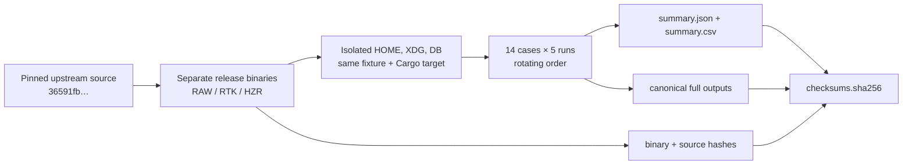
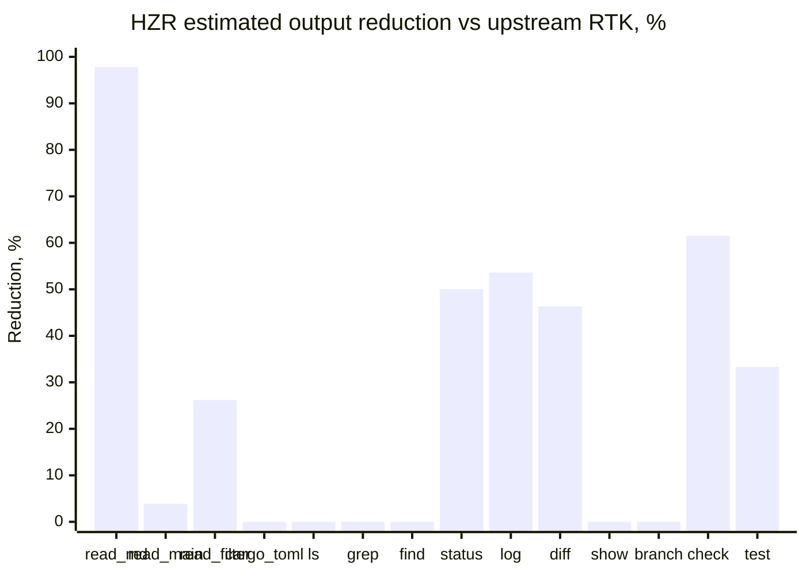
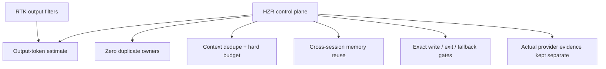

# PRD: RAW vs upstream RTK v0.44.1 vs HZR

**Status:** measured, regressions fixed, reproducible evidence committed

**Benchmark date:** 2026-08-01, Europe/Moscow

**Fixture:** `rtk-ai/rtk` commit `36591fb00d650bf987b57483c0b3a395a35a8dc1`

**Compared binaries:** RAW native tools; upstream `rtk 0.44.1`; `hzr 0.3.0` routing to `rtk 0.44.1-fork.1`

**Token estimator:** `ceil(UTF-8 bytes / 4)`; approximate output metric, not a provider tokenizer or billing measurement

## 1. Decision summary

On 14 identical command cases, executed five times each with rotating order:

| Result | RAW | RTK upstream | HZR | HZR vs RAW | HZR vs upstream |
|---|---:|---:|---:|---:|---:|
| All 14 cases | 287,124 | 58,102 | **44,263** | **−84.6%** | **−23.8%** |
| 13 successful cases | 238,988 | 57,850 | **44,095** | **−81.5%** | **−23.8%** |

After remediation, HZR has **8 wins, 6 exact token-count ties and 0 losses** against upstream on the measured shared-command cases. All three paths preserve the same exit-code vector; `cargo test` consistently returns `101` because the pinned upstream fixture has three failing curl-filter tests in this environment.

The measured claim approved by this PRD is:

> On the pinned RTK v0.44.1 fixture and the 14 documented command cases, HZR emitted 23.8% fewer estimated output tokens than upstream RTK and 84.6% fewer than RAW. This is a local command-output benchmark, not provider-billed cost or answer-fidelity evidence.

The complete machine-readable run, canonical outputs, binary hashes and checksums live in [`benchmarks/hzr-vs-rtk-upstream-v0.44.1/runs/2026-08-01`](benchmarks/hzr-vs-rtk-upstream-v0.44.1/runs/2026-08-01).

## 2. Proof chain



Verification entry points:

- methodology and rerun command: [`benchmarks/hzr-vs-rtk-upstream-v0.44.1/README.md`](benchmarks/hzr-vs-rtk-upstream-v0.44.1/README.md);
- executable harness: [`benchmark.py`](benchmarks/hzr-vs-rtk-upstream-v0.44.1/benchmark.py) and [`run.sh`](benchmarks/hzr-vs-rtk-upstream-v0.44.1/run.sh);
- every repetition's latency, exit code, bytes, token estimate and output digest: [`summary.json`](benchmarks/hzr-vs-rtk-upstream-v0.44.1/runs/2026-08-01/summary.json);
- compact data table: [`summary.csv`](benchmarks/hzr-vs-rtk-upstream-v0.44.1/runs/2026-08-01/summary.csv);
- allowlisted environment and binary identity: [`environment.json`](benchmarks/hzr-vs-rtk-upstream-v0.44.1/runs/2026-08-01/environment.json);
- full captured output per case and participant: [`outputs/`](benchmarks/hzr-vs-rtk-upstream-v0.44.1/runs/2026-08-01/outputs);
- integrity manifest: [`checksums.sha256`](benchmarks/hzr-vs-rtk-upstream-v0.44.1/runs/2026-08-01/checksums.sha256).

## 3. Method

1. Upstream was built from exact commit `36591fb…` in a disposable directory.
2. HZR and its fork-core were built from the current project worktree; their binary SHA-256 values and the worktree diff SHA-256 are recorded.
3. RAW, upstream and HZR ran in the same pinned upstream checkout.
4. Each participant received a separate empty `HOME`, `XDG_CONFIG_HOME` and tracking DB. `RTK_TEE=0`, `RTK_TELEMETRY_DISABLED=1`, `NO_COLOR=1`, `CI=1`, `LC_ALL=C`, `COLUMNS=120`.
5. Cargo cases shared one target directory to reduce order bias. Participant order rotated on every repetition.
6. Each case ran five times. Tables report p50 bytes/tokens and p50 wall time.
7. Stdout and stderr were captured, concatenated in that order and retained as evidence.
8. Exit-code mismatch invalidates a case regardless of output size. No mismatch occurred.
9. Full environment dumps are forbidden; `environment.json` contains a safe allowlist only.

## 4. Three-way results

| Case | RAW tok | Upstream tok | HZR tok | HZR vs upstream | RAW p50 | Upstream p50 | HZR p50 |
|---|---:|---:|---:|---:|---:|---:|---:|
| `read README.md` | 6,046 | 6,046 | **132** | **−97.8%** | 12.5 ms | 14.2 ms | 42.9 ms |
| `read src/main.rs` | 30,457 | 30,457 | **29,280** | **−3.9%** | 7.3 ms | 13.3 ms | 42.9 ms |
| `read src/core/filter.rs` | 4,471 | 4,471 | **3,298** | **−26.2%** | 4.8 ms | 9.2 ms | 31.7 ms |
| `read Cargo.toml` | 426 | 426 | 426 | parity | 4.0 ms | 8.2 ms | 29.9 ms |
| `ls src` | **16** | 20 | 20 | parity | 4.0 ms | 12.3 ms | 31.5 ms |
| `grep -rn "fn run" src` | 5,175 | 4,435 | 4,435 | parity | 25.9 ms | 35.0 ms | 50.8 ms |
| `find . -name "*.rs" -type f` | 847 | 184 | 184 | parity | 9.4 ms | 10.6 ms | 29.4 ms |
| `git status` | 17 | 12 | **6** | **−50.0%** | 11.1 ms | 24.0 ms | 41.5 ms |
| `git log -30` | 2,881 | 1,276 | **592** | **−53.6%** | 8.0 ms | 13.2 ms | 30.9 ms |
| `git diff HEAD~5` | 185,931 | 10,325 | **5,540** | **−46.3%** | 25.7 ms | 53.2 ms | 73.0 ms |
| `git show HEAD` | 76 | 76 | 76 | parity | 7.8 ms | 30.1 ms | 48.5 ms |
| `git branch -a` | 1,557 | 96 | 96 | parity | 7.8 ms | 12.5 ms | 30.2 ms |
| `cargo check` | 1,088 | 26 | **10** | **−61.5%** | 31.23 s | 31.19 s | 36.74 s |
| `cargo test` | 48,136 | 252 | **168** | **−33.3%** | 35.96 s | 35.93 s | 34.36 s |
| **Total** | **287,124** | **58,102** | **44,263** | **−23.8%** | — | — | — |

`ls src` is the only case where both filters exceed RAW: they add useful size/type metadata to an already tiny native listing. It is an absolute-output trade-off, not an HZR regression against upstream.

For the 12 non-Cargo cases, median HZR control-path overhead is `+19.0 ms` versus upstream. Cargo timings are cold/local build timings and are reported, not promoted as a speed claim.

### 4.1 HZR reduction relative to upstream



## 5. Upstream wins found and fixed

The first controlled run exposed three token/diagnostic regressions and one correctness-label defect. All were traced to exact code paths and fixed before the final run.

| Command | Before | Root cause | Change | Final proof |
|---|---|---|---|---|
| `cargo test` | HZR emitted only a 22-token aggregate and hid failing test names/assertions; upstream emitted actionable details | fork default used an older buffered summary; tests explicitly asserted that failure names were absent | preserve up to 10 bounded failure blocks, remove duplicated test name from panic line, retain panic location/assertion and compact aggregate | HZR 168 vs upstream 252 tokens; both show the same 3 failures and exit `101` |
| `cargo check` | HZR output said `cargo build` | non-JSON `run_check` reused the build-labelled filter | route through exit-aware filter with label `check` | canonical output is `✓ cargo check (136 crates compiled)` |
| `find` | HZR was one estimated token larger than upstream | emoji prefix in the grouped header | use the upstream-compatible ASCII `NF ND:` header | exact 184/184 token parity |
| `ls` | HZR 28 vs upstream 20 tokens in captured output | fork always appended an interactive summary; upstream suppresses it when stdout is not a TTY | make summary conditional on `stdout.is_terminal()` | exact 20/20 token parity |

The final HZR failure evidence remains shorter without deleting the useful fact:

```text
FAILURES (3):
1. ---- ...test_filter_curl_long_output_truncated stdout ----
panicked at src/cmds/cloud/curl_cmd.rs:183:9:
assertion failed: result.content.contains("bytes total")
...
✗ cargo test: 2503 passed, 3 failed, 8 ignored (1 suite, 0.73s)
```

Regression coverage was added for failure detail retention/capping, captured `ls` summary suppression and the ASCII `find` header.

## 6. Command-surface comparison

The recorded `--help` outputs prove the current top-level surfaces. Excluding `help` itself:

| Surface | Count |
|---|---:|
| Upstream RTK commands | 78 |
| HZR fork-core commands | 65 |
| Shared | 57 |
| Upstream-only | 21 |
| HZR-only | 8 |

**HZR-only:** `build`, `bun`, `lsof`, `memory`, `ps`, `rgai`, `ssh`, `write`.

**Upstream-only:** `dotnet`, `ecs`, `glab`, `gradlew`, `hook`, `jest`, `mvn`, `paratest`, `pest`, `php`, `phpstan`, `phpunit`, `pint`, `rake`, `rspec`, `rubocop`, `run`, `sbt`, `session`, `telemetry`, `uv`.

The 21 upstream-only commands are a coverage advantage and are not counted as HZR wins. The present benchmark evaluates 14 cases from the 57-command intersection; it is not a full semantic parity proof for all shared subcommands.

## 7. HZR-only USP metrics

RTK measures filtered command output. HZR additionally owns the index, memory, context plan, lifecycle, safety policy and usage ledger. These metrics expose value or risk that stock RTK does not model.

### 7.1 Current observational snapshot

| HZR-only KPI | 2026-08-01 snapshot | Why it matters |
|---|---:|---|
| Net avoided-token estimate | 189,035,985 | gross estimate minus measured negative-output regressions |
| Negative-saving rate | 0.109% | makes output growth visible instead of hiding it |
| Attribution by subsystem | search 77.81%; write 16.95%; execution 4.08%; read 1.16% | shows where the estimate originates |
| Provider-observed / accepted tasks | 0 / 0 | prevents an unsupported cost claim |
| `economic_claim_ready` | `false` | explicitly blocks estimate → billing marketing drift |
| Degraded rewrites | 59 | lifetime accounting is incomplete and labelled as such |
| Managed hook purity | HZR 2/2; direct RTK 0; external ICM 0 | one control-plane entry point |
| Duplicate grepai index dirs | 0 | one canonical index owner |
| Unmanaged engine processes | 1 ICM at snapshot time | prevents a false zero-redundancy health claim |

This lifetime slice covers 24,589 heterogeneous operations. It is observational telemetry, not part of the controlled three-way token total.

### 7.2 Required differentiating KPIs

| Metric | Definition | Gate |
|---|---|---:|
| Zero-redundancy runtime rate | runs without unmanaged engines, duplicate indexes/stores or competing hooks | 100% |
| Context dedupe rate | `1 − unique delivered content refs / candidate refs before fusion` | report-only until calibrated |
| Evidence budget compliance | context packs within configured hard estimate | 100% |
| Retrieval recall@20 | gold targets in top 20 / all gold targets | ≥95% |
| Exactness pass rate | exit/checksum/required-fact invariants passed / exact-class cases | 100% |
| Atomic write idempotency | repeated identical writes with unchanged content/timestamp / repeat fixtures | 100% |
| Search-hop reduction | median calls to first gold hit vs exact-filter baseline | ≥25% after calibration |
| Memory reuse yield | accepted tasks where durable recall removed repeated reads | report-only, then calibrated target |
| Provider evidence coverage | accepted tasks with actual usage/cost / accepted tasks | 100% before economic claim |



## 8. Product requirements from this benchmark

1. Keep the pinned, reproducible three-way harness under `benchmarks/` and regenerate only when command behavior, fixture, model/tokenizer method or measurement logic changes.
2. A common-command result is valid only when exit code and required diagnostic facts match.
3. No HZR shared-command case may exceed upstream output by more than 1% without an explicit utility justification and regression issue.
4. Failure compression must retain test identity, failure location and assertion/error text under a documented cap.
5. `cargo build`, `cargo check` and `cargo test` labels must reflect the invoked command.
6. Command-surface gaps remain separate from performance wins; absent upstream-only commands are never represented as parity.
7. Approximate output tokens, total session tokens, actual provider tokens and billing/cost remain separate fields.
8. A provider-cost claim requires paired accepted-task evidence; this command benchmark alone cannot set `economic_claim_ready=true`.

## 9. Limitations

- The fixture is one large Rust repository, not a multi-language corpus.
- Five repetitions support a local p50 comparison but not stable p95 confidence intervals.
- `bytes/4` is approximate and language/tokenizer dependent.
- Canonical output stores one representative sample; `summary.json` retains hashes and metrics for all five repetitions.
- The working tree contained concurrent development changes; `environment.json` records HEAD, status and diff hash instead of pretending it was clean.
- The benchmark measures tool output, not answer correctness after an agent consumes it.
- The upstream-only 21-command surface remains unimplemented in HZR and requires separate demand/parity prioritization.
- Provider-billed savings and accepted-task non-inferiority remain unmeasured.

## 10. Acceptance state

- [x] Exact upstream v0.44.1 pin and binary identity recorded.
- [x] RAW / upstream / HZR run on the same fixture.
- [x] Five repetitions with rotating order.
- [x] Full command outputs, per-run hashes/metrics and aggregate CSV/JSON saved.
- [x] Evidence integrity manifest verifies.
- [x] Exit-code parity across all 14 cases.
- [x] Upstream diagnostic/token regressions investigated and fixed.
- [x] Final measured HZR losses against upstream: zero.
- [x] HZR-only USP metrics defined separately.
- [ ] Full correctness matrix for all 57 shared top-level commands.
- [ ] Multi-language fixture suite and stable p95/CI run.
- [ ] Paired provider-billed accepted-task benchmark.

## 11. References

- [Benchmark documentation and reproduction](benchmarks/hzr-vs-rtk-upstream-v0.44.1/README.md)
- [Recorded results](benchmarks/hzr-vs-rtk-upstream-v0.44.1/runs/2026-08-01/summary.json)
- [Fork parity ledger](FORK_PARITY.md)
- [Historical v0.42.4 comparison](fork-core/rtk/tasks/benchmark-fork-vs-upstream-0.42.4.md)
- [Main product PRD](PRD.md)
