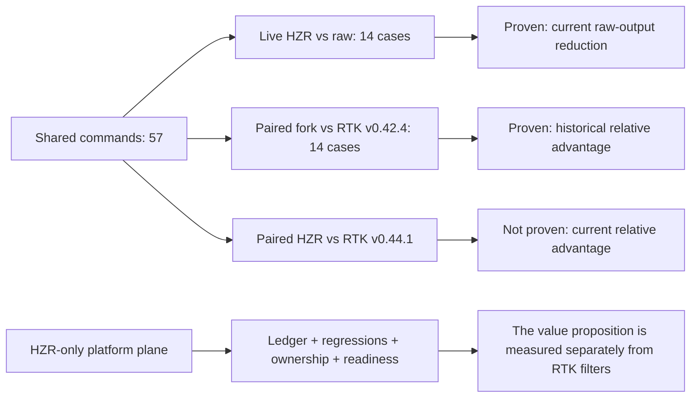
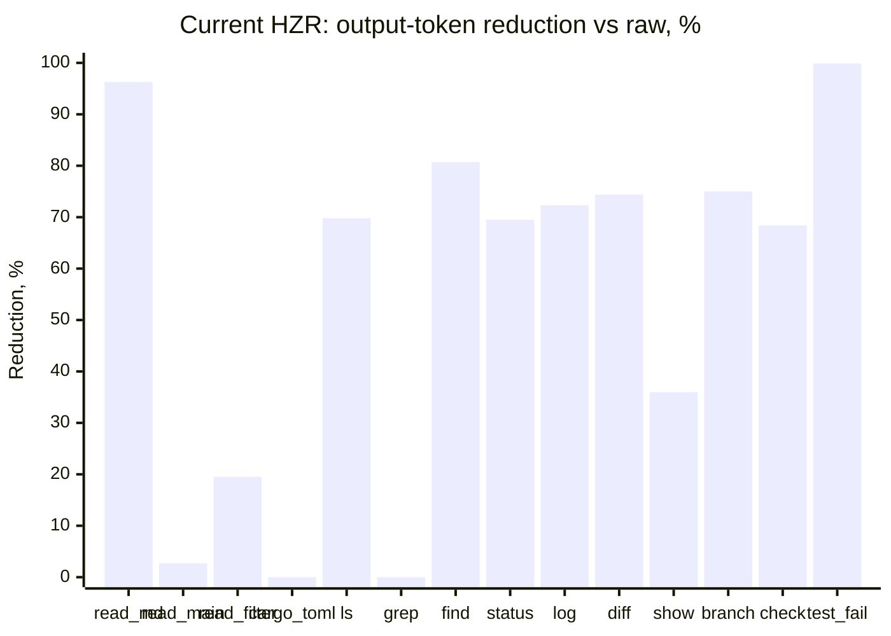
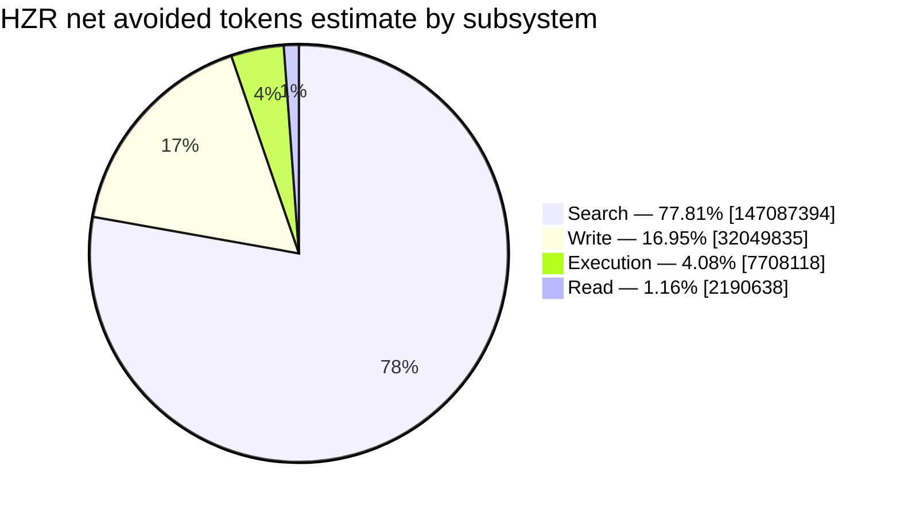

# PRD: HZR benchmark vs upstream RTK

**Status:** baseline + requirements for reproducible benchmark gate

**Snapshot date:** 2026-08-01, Europe/Moscow

**HZR:** `0.2.0`, commit `7c9aa523d4bf27bdfb84e9911697a09671e6f552`

**Runtime fork-core:** `0.44.1-fork.1`

**Upstream reference:** RTK `v0.44.1`, commit `36591fb00d650bf987b57483c0b3a395a35a8dc1`

**Historical paired baseline:** fork `0.42.0-fork.2` vs upstream RTK `v0.42.4`, 2026-06-13

## 1. Solution

HZR must be compared to upstream RTK in two independent layers:

1. **Common command plane:** identical commands, fixture, exit code and correctness criterion; output tokens and latency are compared.
2. **HZR-only platform plane:** single ledger, negative economy, singleton ownership, semantic retrieval, memory, context fusion, exactness and readiness of economic claims.

The current isolated run of 14 common cases yielded `95,857 → 42,499` estimated output tokens, or **−55.7% against the raw baseline**. One case, `cargo test`, returned code `101` for both raw and HZR. Excluding it from the success-only aggregate leaves 13 successful cases at `62,926 → 42,459`, or **−32.5%**.

This is not a measurement of the current advantage over upstream RTK `v0.44.1`: its stock binary was not launched because the HZR contract prohibits creating a second RTK control plane and independent tracking store. The latest saved strictly paired run used upstream `v0.42.4`: **76% reduction for the fork versus 64% for upstream**, meaning the fork delivered 33.2% fewer tokens than upstream on that fixture.

Before passing the new paired gate, the product formulation should be as follows:

> On the current general fixture, HZR reduces raw tool output by 55.7%; historical paired benchmark against RTK v0.42.4 showed 76% versus 64%. The advantage over RTK v0.44.1 has not yet been measured.

This statement must not be replaced with the lifetime estimate from `hzr stats`, and estimated output reduction must not be presented as actual provider cost savings.

## 2. What exactly is being compared

### 2.1 Versions and provenance

| Artifact | Pin | Role |
|---|---|---|
| HZR | `0.2.0` | single public control plane |
| HZR fork-core | `0.44.1-fork.1` | runtime for `hzr rtk -- ...` |
| upstream RTK | [`v0.44.1`](https://github.com/rtk-ai/rtk/releases/tag/v0.44.1), `36591fb...` | reference-only comparator |
| Historical upstream | `v0.42.4` | only saved paired performance baseline |
| Token estimate | `ceil(UTF-8 bytes / 4)` |approximate, non-provider-billed metric|

Upstream `v0.44.1` contains 78 top-level commands and HZR fork-core contains 65. Their intersection is **57 commands**: 73.1% of the upstream surface and 87.7% of the fork-core surface.

**Fork-only commands:** `build`, `bun`, `lsof`, `memory`, `ps`, `rgai`, `ssh`, `write`.

**Upstream-only commands:** `dotnet`, `ecs`, `glab`, `gradlew`, `hook`, `jest`, `mvn`, `paratest`, `pest`, `php`, `phpstan`, `phpunit`, `pint`, `rake`, `rspec`, `rubocop`, `run`, `sbt`, `session`, `telemetry`, `uv`.

The benchmark below covers 14 representative cases from the 57 shared commands. It does not prove parity across the entire intersection.

### 2.2 Evidence Map

## 3. Live benchmark method

- Working directory: `fork-core/rtk`.
- For each case, both the raw command and `hzr rtk -- ...` were executed.
- `RTK_DB_PATH` pointed to a separate temporary directory; `RTK_TEE=0`, `RTK_TELEMETRY_DISABLED=1`, `NO_COLOR=1`, `CI=1`.
- Each case ran three times; the table reports median output bytes and p50 wall time.
- Output tokens are estimated as `ceil(bytes / 4)` separately for each case.
- Exit code is part of the correctness contract. A case with mismatched exit codes is invalid regardless of apparent savings.
- Empty or short error output does not count as a saving when the command was executed incorrectly.
- The run was performed in a local macOS environment and does not replace a cross-platform CI matrix.

## 4. Live results: current HZR vs raw

| Case | Raw tok | HZR tok | Reduction | Raw p50 | HZR p50 | Exit raw/HZR |
|---|---:|---:|---:|---:|---:|---:|
| `read README.md` | 5,475 | 200 | 96.3% | 3.8 ms | 18.5 ms | 0/0 |
| `read src/main.rs` | 29,075 | 28,294 | 2.7% | 4.1 ms | 19.9 ms | 0/0 |
| `read src/filter.rs` | 3,408 | 2,743 | 19.5% | 3.8 ms | 18.7 ms | 0/0 |
| `read Cargo.toml` | 508 | 508 | 0.0% | 3.7 ms | 19.0 ms | 0/0 |
| `ls -la src` | 1,869 | 564 | 69.8% | 5.9 ms | 23.2 ms | 0/0 |
| `grep -rn "fn run" src` | 3,934 | 3,934 | 0.0% | 21.0 ms | 38.3 ms | 0/0 |
| `find ... '*.rs'` | 844 | 163 | 80.7% | 40.9 ms | 22.2 ms | 0/0 |
| `git status` | 118 | 36 | 69.5% | 9.6 ms | 32.7 ms | 0/0 |
| `git log -30` | 687 | 190 | 72.3% | 8.0 ms | 24.1 ms | 0/0 |
| `git diff HEAD~5` | 9,673 | 2,477 | 74.4% | 9.3 ms | 32.1 ms | 0/0 |
| `git show HEAD` | 3,189 | 2,040 | 36.0% | 7.2 ms | 38.3 ms | 0/0 |
| `git branch -a` | 8 | 2 | 75.0% | 7.7 ms | 22.4 ms | 0/0 |
| `cargo check` | 4,138 | 1,308 | 68.4% | 62.2 ms | 73.2 ms | 0/0 |
| `cargo test` | 32,931 | 40 | 99.9% | 1,236.3 ms | 1,252.0 ms | 101/101 |
| **All 14** | **95,857** | **42,499** | **55.7%** | — | — | 13 success, 1 failed |
| **13 successful cases** | **62,926** | **42,459** | **32.5%** | — | — | 0/0 |

Median case p50 increased from `7.9 ms` to `23.7 ms`; median paired overhead for the HZR control path was **+15.8 ms**. This is startup and orchestration overhead, not LLM latency.

The exact `grep` path intentionally preserved all native output and produced 0% reduction. This matches the current exactness policy; historical aggressive grep compression cannot be preferred without a fidelity gate. `cargo test` preserved the failing exit code and compressed `1698 passed, 1 failed, 1 ignored` into a short failure summary, but the case is excluded from the success-only KPI.

### 4.1 Output-token reduction

## 5. Comparison with a saved upstream benchmark

The table below compares three measurements on similar commands. `Current HZR` ran on the current tree; the historical fork and upstream `v0.42.4` were strictly paired in the same environment. Differences between these columns cannot be interpreted as version-to-version regressions without an identical fixture.

|Case| Current HZR vs raw | Historical fork vs raw | Upstream v0.42.4 vs raw |
|---|---:|---:|---:|
| `read README.md` | 96.3% | 96% | 0% |
| `read src/main.rs` | 2.7% | 3% | 0% |
| `read src/filter.rs` | 19.5% | 20% | 0% |
| `read Cargo.toml` | 0% | 0% | 0% |
| `ls src` | 69.8% | 69% | 69% |
| grep | 0% exact parity | 71% | 2% |
| find Rust files | 80.7% | 70% | 71% |
| `git status` | 69.5% | 80% | 20% |
| `git log -30` | 72.3% | 88% | 66% |
| `git diff HEAD~5` | 74.4% | 98% | 91% |
| `git show HEAD` | 36.0% | 76% | 16% |
| `git branch -a` | 75.0% on raw=8 tok | 6% | 93% |
| `cargo check` | 68.4% | 71% | 2% |
| `cargo test` | 99.9%, exit 101 | 100% | 100% |
| **Aggregate** | **55.7%**, mixed outcome | **76%** | **64%** |

Historical paired total: raw `153,136`, fork `36,613`, and upstream `54,777` estimated tokens. The fork delivered `(54,777 − 36,613) / 54,777 = 33.2%` fewer output tokens than upstream `v0.42.4`.

## 6. HZR-only metrics for USP

RTK primarily answers “how much shorter is one command's output?” HZR must also answer whether it created duplicate work, whether output grew, which subsystem produced the effect, whether provider evidence exists, and whether an economic claim is publishable.

### 6.1 Implemented metrics and current slice

Source: `hzr stats --json`, `hzr doctor --json`, `hzr hooks status --json`, `hzr index status --json`, `hzr memory status --json`.

| HZR-only KPI | Formula/source | 2026-08-01 snapshot | Interpretation |
|---|---|---:|---|
| Net avoided tokens estimate | `gross_avoided − regression` | `189,035,985` | estimated as bytes/4, not billed tokens |
| Negative-saving rate | `regression / baseline` | `231,397 / 211,604,092 = 0.109%` | exposes cases where HZR emitted more output than the baseline |
| Savings attribution | `net by subsystem / total net` | search 77.81%; write 16.95%; execution 4.08%; read 1.16% | identifies where the estimated effect originates |
| Provider evidence coverage | observed tasks / accepted tasks | `0 / 0` |cost claim has not yet been proven|
| Economic claim readiness | `economic_claim_ready` | `false` |prohibits turning estimate into marketing fact|
| Runtime accounting completeness | `degraded_rewrites == 0` | `false`; degraded rewrites `59` |lifetime accounting is incomplete|
| Hook control-plane purity | HZR / all managed hook entries | `2 / 2 = 100%`; RTK `0`, external ICM `0` |no duplicate hook entry points|
| Duplicate index count | `duplicate_index_dirs.len()` | `0` |one canonical grepai index|
| Index provenance | generation + config fingerprint | generation present |the result can be associated with a specific index state|
| Unmanaged engine processes | doctor foreign-process audit | `1` unmanaged ICM | current health does not support a zero-runtime-redundancy claim |
| Memory ownership state | typed memory health | degraded, singleton FTS-only |memory works without embeddings; the state is not hidden|

The lifetime snapshot includes 24,589 heterogeneous operations. It is useful for observability but is not a controlled HZR-vs-RTK experiment.

### 6.2 Sources of the lifetime estimate

### 6.3 Metrics that benchmark gate should add

| Metric | Definition | Product value | Acceptance threshold |
|---|---|---|---|
| Zero-redundancy runtime rate | share of runs without unmanaged engines, duplicate indexes/stores or competing hooks | RTK does not manage the complete retrieval, memory and agent system | 100% |
| Context dedupe rate | `1 − unique delivered content refs / candidate refs before fusion` | measures elimination of repeated context across code, memory and retrieval | report-only until the first gold baseline |
| Evidence budget compliance | share of context packs within the hard token estimate | demonstrates bounded orchestration, not only stdout filtering | 100% |
| Retrieval recall@20 | gold targets found in top 20 / all gold targets | verifies that semantic compression does not trade search recall for brevity | ≥95% |
| Exactness pass rate | parser/checksum/exit-code/fixture invariants passed / exact-class cases | protects code, JSON, commands, paths and errors | 100% |
| Atomic write no-op rate | repeated identical writes that preserve inode and content timestamp / repeated writes | measures HZR `write` idempotency, which upstream lacks | 100% on the idempotency fixture |
| Search-hop reduction | median tool calls to first gold hit: HZR context/search vs RTK exact filters | demonstrates the value of `rgai` plus the canonical index | at least −25% after gold calibration |
| Memory reuse yield | accepted tasks where a durable remembered fact eliminated repeated reading / tasks with eligible memory | demonstrates cross-session value absent from stock RTK | report-only, then target from paired data |
| Safety fallback correctness | fallback cases preserving exit/status/exact spans / all fallback cases | demonstrates graceful degradation without silent semantic drift | 100% |
| Provider evidence coverage | accepted tasks with actual usage and cost / all accepted tasks | separates economic evidence from the bytes/4 estimate | 100% for an economic claim |

These fields must appear in machine-readable results even when the denominator is unavailable; `null` plus a reason is more accurate than a fictitious zero.

## 7. Requirements for paired HZR vs RTK v0.44.1 gate

### 7.1 Harness

1. Pin the comparator to upstream RTK `v0.44.1` / `36591fb...` and HZR to the release artifact plus its internal manifest.
2. Stock upstream runs only in a disposable isolated runner, without access to HZR canonical ledger/index/memory and without installation in user `PATH`.
3. The same immutable fixtures, environment variables, locale, terminal width, cache state and command arguments are used for both sides.
4. Minimum 30 warm repetitions and 5 cold repetitions per case; raw samples, median, p90, p95 and bootstrap 95% CI are saved.
5. First, exit code, required facts, stable identifiers and parser/checksum invariants are checked; performance sample with failed correctness is excluded and remains visible as failure.
6. Output tokens are measured simultaneously by the target model’s tokenizer and bytes/4 estimate; fields do not mix.
7. Mutating commands are executed only in the disposable fixture copy and are checked against the resulting tree hash.
8. The result is saved as JSON/CSV + human PRD section with source commit, OS, CPU, versions, repetitions and timestamp.

### 7.2 Required groups

- All 57 common top-level commands: at least smoke/correctness case.
- Deep output benchmark: `read`, `ls`, `find`, `grep`, `rg`, `git`, `cargo`, `test`, `json`, `deps`, `env`, `log`, `summary`, `docker`, `kubectl`.
- Upstream-only coverage gap: 21 commands are reported separately and are not counted as HZR wins.
- HZR-only value plane: eight fork-only commands and HZR-native `doctor`, `index`, `search`, `context`, `memory`, `codec`, `agent`, `mcp`, `stats`.
- Failure fixtures: malformed JSON, missing files, failing tests, stale index, daemon unavailable, duplicate index, unmanaged process, denied destructive command.

### 7.3 Release criteria

- 100% exit-code and required-fact parity for common exact-class cases.
- Not a single silent empty-output success.
- Median common-command output tokens are no more than 1% worse than upstream; regressions are published per command.
- p95 warm HZR orchestration overhead without child-command and LLM latency ≤250 ms.
- `runtime_accounting_complete=true` for benchmark run.
- `economic_claim_ready=true` only after a paired provider benchmark with at least 200 accepted tasks, 100% actual-usage coverage, and a success non-inferiority margin no worse than 1 percentage point.
- Main product target from `PRD.md`: median actual billed cost per accepted task at least 30% below baseline. Until then, the UI shows only a clearly labeled estimate.

## 8. Risks and limitations of the current cut

- Current HZR was not run alongside stock RTK `v0.44.1`; no current relative advantage has been proven.
- Live fixture is `fork-core/rtk` itself, not a multi-language corpus.
- Three repetitions are not enough for stable tail-latency output.
- `cargo test` has one product/test failure and is not included in the success-only aggregate.
- bytes/4 is an approximate token estimate; billed cost was not measured.
- Lifetime ledger contains legacy/imported and heterogeneous commands; 59 degraded rewrites make accounting incomplete.
- `hzr doctor` detected one unmanaged ICM process, so this snapshot does not support a zero-redundancy runtime claim.
- The 21 upstream-only commands show that HZR currently has a narrower command surface. Its differentiated value must be demonstrated through platform metrics, not filter count.

## 9. Sources

- [Main HZR PRD](PRD.md), §4.2 and §8.
- [Historical paired benchmark](fork-core/rtk/tasks/benchmark-fork-vs-upstream-0.42.4.md).
- [Fork-core provenance](fork-core/README.md).
- [HZR stats implementation](crates/hzr-cli/src/stats.rs).
- [HZR ledger schema](crates/hzr-core/src/ledger.rs).
- [Upstream RTK v0.44.1 release](https://github.com/rtk-ai/rtk/releases/tag/v0.44.1).
- [Pinned upstream RTK command source](https://github.com/rtk-ai/rtk/blob/36591fb00d650bf987b57483c0b3a395a35a8dc1/src/main.rs).
