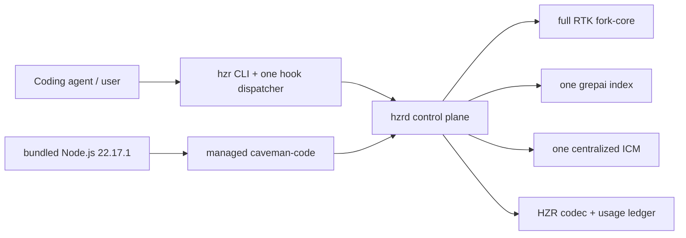

# HZR

> **heAdz0r's Zero-Redundancy engine** — авторский local-first control plane и unified efficiency engine для coding-агентов.


[](Cargo.toml)
[](https://github.com/heAdz0r/hzr/actions/workflows/ci.yml)
[](https://github.com/heAdz0r/hzr/releases)
[](LICENSE)

HZR — самостоятельный продукт heAdz0r, который превращает разрозненные слои оптимизации агента в один управляемый execution path. Единый control plane владеет поиском, памятью, контекстным бюджетом, выполнением, плотностью ответов и учётом usage — без повторной работы и конкурирующих контуров.

**Главный инвариант дистрибутива 0.2.0:** один installer ставит весь versioned self-contained runtime. Отдельные установки внутренних движков и их runtime dependencies не нужны. Единственным внешним runtime prerequisite остаётся системный Git.

> HZR не заявляет неподтверждённый процент экономии. Functional и supply-chain gates определены и проходят повторную release-проверку; end-to-end экономический эффект ещё должен быть измерен paired provider-billed benchmark на одинаковых задачах.

## Зачем HZR

Независимо установленные инструменты оптимизации часто повторяют одну и ту же работу: сканируют repository, строят параллельные индексы, вспоминают одинаковый контекст, сжимают его несколько раз и записывают несовместимые telemetry estimates. HZR назначает одного владельца каждому concern.

## Архитектура: один владелец на каждый concern

Внутри HZR полный проверенный fork-core и pinned специализированные engines работают за единым protocol, lifecycle и policy boundary:

| Concern | Единственный владелец в HZR |
|---|---|
| command rewrite, filters, `rgai`, IMG planner, read/write, guards | полный HZR fork-core RTK |
| semantic code index и watcher | patched grepai 0.35.0 |
| durable cross-session memory | один HZR-supervised ICM 0.10.61 |
| policy, lifecycle, auth, hard budget, usage ledger | HZR / `hzrd` |
| provider-aware agent loop | managed caveman-code 0.65.2 |
| response-density contract и protected spans | HZR Codec + Caveman-derived contract |



«Все инструменты как единое целое» не означает обязательный вызов каждого engine на каждом turn. HZR выбирает минимальный достаточный путь, дедуплицирует evidence по content hash и не оплачивает лишний semantic pass.

## Установка

### Готовый release bundle

Поддерживаемые форматы artifact:

| OS | Архитектура | Artifact tooling | Текущий уровень проверки |
|---|---:|---|---|
| Linux | x86_64 | есть | native release workflow + clean-install smoke |
| Linux | ARM64 | есть | native release workflow + clean-install smoke |
| macOS | Apple Silicon | есть | native release workflow + clean-install smoke |
| macOS | Intel | есть | native release workflow + clean-install smoke |

Windows artifact в 0.2.0 отсутствует. Скрипты собирают native artifact, а не выполняют cross-compilation.

Скачайте и проверьте installer перед запуском:

```bash
curl --proto '=https' --tlsv1.2 -fL \
  https://raw.githubusercontent.com/heAdz0r/hzr/v0.2.0/install.sh \
  -o /tmp/hzr-install.sh
less /tmp/hzr-install.sh
sh /tmp/hzr-install.sh
```

Installer скачивает platform artifact и `SHA256SUMS` из GitHub Releases, проверяет внешний checksum и внутренний bundle manifest, затем создаёт:

```text
~/.local/share/hzr/
  versions/v0.2.0-<platform>/   # version-scoped self-contained bundle
  current -> versions/...

~/.local/bin/
  hzr
  hzrd
  rtk -> hzr                    # compatibility alias, не второй RTK
```

По умолчанию installer также выполняет `hzr init` и подтверждённую adoption-настройку: один Claude `PreToolUse` dispatcher, idempotent `SessionStart`, HZR-managed blocks в `CLAUDE.md` и `AGENTS.md`. Перед изменением существующих файлов создаются content-addressed backups.

Если сначала нужна только установка файлов без hooks и agent instructions:

```bash
HZR_INSTALL_HOOKS=0 sh /tmp/hzr-install.sh
hzr install --dry-run
hzr install --force
```

Доступные installer overrides: `HZR_INSTALL_ROOT`, `HZR_BIN_DIR`, `HZR_INSTALL_HOOKS=0`, `HZR_INSTALL_SERVICE=0`, `HZR_FORCE=1` и `HZR_VERSION`. Для скачивания нужны обычные POSIX utilities: `sh`, `tar`, `curl` или `wget`, а также `shasum` или `sha256sum`. Для работы HZR требуется системный `git`; внешние Node.js, npm, Go, Rust и отдельные engine binaries не требуются.

### Что входит в один bundle

| Компонент | Pin | Поставка |
|---|---:|---|
| HZR | 0.2.0 | public CLI + daemon |
| HZR fork-core RTK | 0.44.1-fork.1 | private native engine; весь inherited surface |
| grepai | 0.35.0 + ownership patch | private native engine |
| ICM | 0.10.61 + lockfile patch | private native engine |
| caveman-code | 0.65.2 + exact production lock | managed JS runtime |
| Node.js | 22.17.1 | bundled official runtime |
| Caveman | 1.9.1 | design/reference, не отдельный runtime |

Точные commits, archive checksums, npm integrity и patch digests находятся в [`engines.lock.toml`](engines.lock.toml). Bundle сохраняет source provenance, applied patches и применимые license texts.

## Быстрый старт

В Git repository:

```bash
hzr doctor --workspace .
hzr daemon service status
hzr daemon status
```

Release installer создаёт user service (`launchd` на macOS, `systemd --user` на Linux)
и привязывает его к stable `current/bin/hzrd`. Для source-only разработки foreground
режим остаётся доступен как `hzr daemon serve`. Daemon слушает только loopback.

```bash
hzr index status --workspace .
hzr search "where is command policy" --workspace .
hzr context plan "change command policy" --workspace .
hzr exec rewrite 'cargo test 2>&1 | tail -80'
hzr agent run "Implement the requested change" --workspace .
hzr stats
```

Полный fork CLI сохранён:

```bash
hzr rtk -- --version
rtk --version
```

Обе команды доходят до приватного `engines/rtk`; alias `rtk` не создаёт второй control plane и не использует stock RTK fallback.

## Как собирается контекст

1. HZR сохраняет исходный intent и строит один structural plan полным fork IMG planner.
2. Одновременно выполняется один project-scoped recall из централизованного ICM.
3. Evidence нормализуется, дедуплицируется и помещается под hard token budget.
4. Fork `rgai` fallback вызывается только при пустом code plan; semantic search использует тот же canonical grepai store.
5. Managed caveman-code получает bounded context один раз и работает только через allowlisted HZR tools.
6. Перед generation добавляется короткий cache-stable response contract; code, JSON, commands, paths, identifiers, numbers и diagnostics защищены от lossy rewrite.

Native memory, repo-map, RTK, hooks, compression, skills и tools caveman-code отключаются до первой model session и проверяются runtime-тестом. Это сохраняет caveman-code как agent loop, не превращая его во второй control plane.

## Один index и одна memory

```text
<hzr-data>/
  runtime/                              # daemon token + singleton locks
  fork/                                 # derived fork caches, не embeddings DB
  workspaces/<repo>/<worktree>/index/grepai/
  memory/icm/                           # одна DB/process
  ledger/hzr.sqlite                    # единый usage + efficiency ledger
  migrations/<repo>/<worktree>/
```

- `.grepai` в project может быть только проверенным symlink на managed store.
- Один worktree owner lock исключает второй grepai watcher.
- ICM имеет один lifecycle и одну physical DB; repository namespace задаётся HZR, а не клиентом.
- Fork `mem.db` остаётся derived structural cache. Он не является вторым embedding index или durable agent memory.
- Legacy, nested и foreign stores обнаруживаются, но никогда автоматически не удаляются.

Безопасная миграция начинается с read-only scan:

```bash
hzr migrate scan --workspace .
hzr migrate apply --workspace .
hzr migrate history --dry-run
hzr migrate history --force
```

`apply` требует явного запуска, сохраняет full-SHA backup и проверяет immutable prepared/applied manifests. Unsafe symlinks, special files, partial targets и active foreign owner блокируют операцию.
`history` снимает SQLite Online Backup platform RTK history в read-only режиме,
импортирует каждую source row один раз и сохраняет content-addressed snapshot с JSON manifest.

## Основные команды

```text
hzr init
hzr install|uninstall                 adoption, hooks и agent instructions
hzr hooks status
hzr mcp serve                         stdio MCP для клиентов без hooks
hzr mcp config --client codex|claude-desktop
hzr doctor
hzr daemon serve|status|engines
hzr daemon service install|start|stop|restart|status
hzr engines status
hzr index status|init
hzr search|rgai
hzr context plan
hzr memory recall|store|status
hzr exec rewrite|run|approve|deny
hzr codec compile
hzr agent run
hzr stats                              global cumulative efficiency ledger
hzr migrate scan|apply|history|memory
hzr rtk -- <fork arguments>
```

Важно различать два уровня установки:

- repository-level `install.sh` устанавливает весь versioned self-contained release bundle,
  re-attest-ит same-version root и запускает production user service;
- CLI-команда `hzr install` настраивает durable PATH entry, hooks, agent instructions
  и HZR-owned MCP registrations. Она поддерживает `--dry-run`, требует `--force`
  для изменений и не запускается во время build/test.

## MCP для клиентов без hooks

Claude Code получает HZR через hooks и `CLAUDE.md`. Codex app-server и Claude desktop hooks не имеют, и memory у них доступна только по MCP — поэтому раньше каждый регистрировал `icm serve` напрямую. Это ровно тот второй memory layer, который запрещает §6.5, и именно он оставил 8 orphaned `icm serve` от мёртвых Codex-сессий.

```bash
hzr mcp config --client codex           # печатает [mcp_servers.hzr] блок
hzr mcp config --client claude-desktop  # печатает mcpServers блок
```

`hzr install --dry-run` показывает транзакционную замену direct ICM registrations,
а подтверждённый `hzr install --force` применяет её с full-SHA backup/CAS. Команда
`hzr mcp config` остаётся read-only способом получить snippet для ручной интеграции.

Tools: `hzr_memory_recall`, `hzr_memory_store`, `hzr_search` — та же единственная БД и тот же индекс, что у CLI. Полный контракт для агентов — в [HZR.md](HZR.md).

MCP layer реализован в 0.2.0 как stateless stdio gateway: он не хранит собственные
данные и не порождает внутренние engines. Каждый клиентский process завершается по EOF,
а durable ownership остаётся у production `hzrd`; installer мигрирует direct ICM
registrations и service lifecycle проверяется `hzr doctor`.

Legacy durable memory переносится отдельно и без удаления исходной DB:

```bash
hzr migrate memory --workspace "$PWD" --dry-run
hzr daemon service stop
hzr migrate memory --workspace "$PWD" --force
hzr daemon service start
```

Операция делает SQLite-consistent content-addressed snapshots legacy и canonical DB,
импортирует durable memory rows в repository namespace, пишет проверяемый manifest и
на повторном запуске является no-op. Hook telemetry, raw pending extractions и derived
code-area observations остаются только в сохранённом snapshot.

Глобальные тексты запросов/ответов Claude и Codex помечаются doctor как
`unintercepted`: эти hosts не предоставляют безопасный global response hook. HZR не
начисляет codec savings для этого пути; codec применяется только в managed `hzr agent`.

Почему параллельные `hzr mcp serve` безопасны, а параллельные `icm serve` — нет: adapter не имеет своего store (всё уходит в единственный `hzrd`) и завершается по EOF на stdin, то есть не может пережить родителя. `hzr doctor` продолжает репортить любые оставшиеся unmanaged `icm serve`/`grepai watch` как `error`, но никогда не убивает их сам.

## Сборка из исходников

Для contributors нужны Rust 1.85+, Go (CI pin 1.24.2), Git, Bash, curl и стандартные Unix build utilities. Системный Node/npm не нужен для bundle build: скрипт скачивает checksum-pinned Node.js 22.17.1 и использует его для production npm tree.

```bash
scripts/build-bundle.sh "$PWD/dist"
scripts/package-release.sh "$PWD/dist" "$PWD/dist-release"
HZR_RELEASE_ARCHIVE="$(find "$PWD/dist-release" -maxdepth 1 \
  -name 'hzr-v0.2.0-*.tar.gz' -print -quit)"
scripts/smoke-install.sh "$HZR_RELEASE_ARCHIVE" "$PWD/dist-release/SHA256SUMS"
```

Последнее имя artifact зависит от нормализованной платформы (`darwin-arm64`, `darwin-x64`, `linux-arm64`, `linux-x64`); используйте фактическое имя из `dist-release/`.

Поддерживаемые gates:

```bash
cargo fmt --all --check
cargo clippy --workspace --all-targets --all-features -- -D warnings
cargo test --workspace --all-targets --all-features
cargo +1.85.0 check --workspace --all-targets --all-features
PATH="$PWD/dist/runtime/node/bin:$PATH" \
  "$PWD/dist/runtime/node/bin/npm" ci --prefix integrations/caveman-code
"$PWD/dist/runtime/node/bin/node" --test integrations/caveman-code/bridge.test.mjs
PATH="$PWD/dist/runtime/node/bin:$PATH" \
  "$PWD/dist/runtime/node/bin/npm" audit --omit=dev --audit-level=high \
  --prefix integrations/caveman-code
scripts/verify-fork-core.sh --test
```

Не запускайте `cargo test` напрямую внутри `fork-core/rtk`: официальный gate создаёт synthetic Git history, нужную унаследованному test suite, и одновременно проверяет immutable baseline плюс current-engine manifest.

## Проверяемые гарантии и честные границы

| Гарантия | Состояние 0.2.0 |
|---|---|
| Полный fork baseline и current engine имеют проверяемую identity | реализовано |
| Stock RTK отсутствует в production path | реализовано |
| Release bundle работает без внешних Node/RTK/grepai/ICM | native clean-install smoke проходит и входит в release gate |
| Actual usage не смешивается с estimates | реализовано |
| Paired provider-billed savings benchmark | ещё не выполнен; 0/9 product metrics |
| Windows release artifact | отсутствует |

Дополнительные границы:

- ICM по умолчанию работает в FTS-only режиме, поэтому первая запись не запускает
  скрытую загрузку модели и не падает по timeout; после provisioning модели можно
  включить `engines.icm_embeddings = true`, а health явно различает оба режима.
- До запуска `hzrd` hook использует тот же pinned fork-core, но daemon-free rewrite не попадает в SQLite ledger; `doctor` и `stats` помечают accounting incomplete.
- Жёсткий `SIGKILL` может прервать финальный usage POST; crash-safe outbox оставлен для следующей версии.
- caveman-code создаёт неактивный upstream `cavemem --version` probe. HZR блокирует builtin resources/tools; устранение самого probe требует отдельного SDK patch.
- Fresh install и повторная установка той же версии проверяют внешний checksum, внутренний manifest, mandatory layout, digests и отсутствие symlink injection. Повреждённый root никогда не становится `current`.

## Дальнейшее развитие

После стабилизации 0.2.0 развитие MCP surface сосредоточится на versioned schema negotiation, дополнительных безопасных HZR tools и сквозном trace от client request до `hzr stats`. Инвариант остаётся прежним: MCP — protocol facade над HZR Core, а не новый index, memory store или control plane.

## Документация

- [`CHANGELOG.md`](CHANGELOG.md) — история публичных релизов.
- [`PRD.md`](PRD.md) — архитектура, требования и acceptance criteria 0.2.0.
- [`PRD_STATUS_0.2.0.md`](PRD_STATUS_0.2.0.md) — текущий release status и открытые измерения.
- [`PRD_ADOPTION.md`](PRD_ADOPTION.md) — hooks, degraded path и безопасная adoption-модель.
- [`FORK_PARITY.md`](FORK_PARITY.md) — provenance полного fork и regression contract.
- [`HZR.md`](HZR.md) — короткий tool contract для coding-агентов.
- [`THIRD_PARTY_NOTICES.md`](THIRD_PARTY_NOTICES.md) — pins, patches и лицензии.
- [`NOTICE`](NOTICE) — copyright и ссылка на bundled attribution.

## Происхождение и лицензии

HZR — новый самостоятельный repository и продукт, не fork history. `v0.1.0` зафиксировал byte-for-byte baseline фактического `heAdz0r/rtk` worktree: 516 entries, четыре tracked deletions и canonical snapshot v2 `f4296ec4…`. Начиная с 0.2.0 полный engine развивается только в `fork-core/rtk` внутри HZR; baseline остаётся неизменяемым доказательством происхождения.

HZR control plane распространяется под Apache-2.0. Fork-core и bundled engines сохраняют собственные лицензии и provenance; подробности — в [`THIRD_PARTY_NOTICES.md`](THIRD_PARTY_NOTICES.md).
