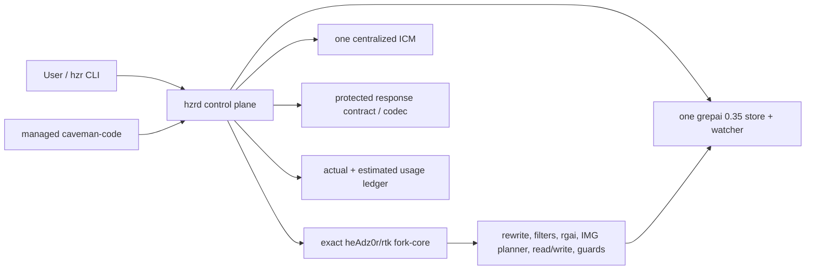

# HZR — heAdz0r's Zero-Redundancy engine

**HZR** = **h**eAdz0r + **Z**ero **R**edundancy. Буква `Z` работает дважды: это и ник автора, и главный технический принцип продукта. Если `RTK` = Rust Token Killer, то `HZR` — его преемник по смыслу: **RTK убивал токены, HZR убивает избыточность.**

Избыточность и есть потраченные деньги: второй semantic index, второй memory store, второй pre-read pack, повторно попавший в контекст один и тот же файл, дублирующий compression layer агента. Поэтому «zero redundancy» — не слоган, а буквальное содержание [PRD](PRD.md): один index, один ICM process, один владелец на каждый concern (§5.1), дедупликация по content hash (§5.2), запрет дублей в data layout (§7) и ноль упрощённых reimplementations в runtime-пути (§4.1).

HZR 0.1.0 — самостоятельная local-first платформа для экономии токенов coding-агентов. Она построена **вокруг полного текущего `heAdz0r/rtk` fork**, а не вместо него: 516 файлов фактического worktree перенесены byte-for-byte как закрытое от изменений ядро, а HZR добавляет снаружи единый control plane, централизованные ICM и grepai, Caveman-derived response contract и managed caveman-code agent.

> Release 0.1.0: функциональные gates, exact fork suite и assembled local-platform bundle прошли; экономический KPI требует отдельного paired provider benchmark.

Подробные продуктовые требования и обоснования находятся в [PRD.md](PRD.md), доказательство сохранности fork — в [FORK_PARITY.md](FORK_PARITY.md).

## Главный инвариант

`fork-core/rtk` — полный immutable snapshot доказавшего эффективность fork версии `0.44.1-fork.1`. HZR не переносит его возможности выборочно и не содержит упрощённой «RTK-compatible» замены.

- canonical snapshot v2: `f4296ec404f461d6fc03c966c0dc79caee6c3118a73d1ed1a078ded5529f0a16`;
- source: ветка `feat/upstream-0.42-fork.1`, `HEAD 5f403c465cbdbe148e9ca03e0ac8e856eef0bfee`;
- 516 включённых файлов и 4 зафиксированных tracked deletion;
- paths, types, modes, sizes, bytes, dirty diff, source status и exclusions входят в проверяемую identity;
- stock RTK не собирается и не используется как fallback.

Интеграция выполняется только через process, environment, storage и typed API adapters. Исходный репозиторий `/Users/andrew/Programming/rtk` HZR не изменяет.

## Единая архитектура



| Область | Единственный владелец |
|---|---|
| rewrite, command filters, `rgai`, IMG planner, read/write, guards, полный compatibility CLI | exact fork-core |
| orchestration, policy, hard budget, lifecycle, auth | HZR |
| code embeddings, symbols и graph index | grepai 0.35.0 |
| ranking/rendering semantic search | сохранённый fork `rgai` |
| durable cross-session memory | один HZR-supervised ICM 0.10.61 |
| agent loop и provider UX | managed caveman-code 0.65.2 |
| response density и protected spans | HZR Codec + короткий Caveman-derived contract |
| actual/estimated usage | HZR Ledger, в разных полях |

«Все инструменты как единое целое» означает один ownership graph, а не обязательный повторный вызов каждого движка на каждом turn. Лишний semantic pass сам расходует tokens и latency.

### Контекст задачи

1. Исходный intent остаётся неизменным.
2. Fork `memory plan` строит основной structural context; одновременно выполняется ровно один project-scoped ICM recall.
3. HZR нормализует provenance, дедуплицирует candidates и применяет hard budget к оценке evidence; источник счётчика явно маркируется как estimate.
4. Только когда fork planner не вернул code candidates, выполняется один fork `rgai` fallback.
5. Semantic/auto search заранее подготавливает единственный HZR-owned grepai store; exact mode вызывает fork `rgai --builtin`.
6. В prompt передаются компактные references и evidence metadata. Выбранные файлы агент читает exact fork-backed tool через HZR, а не через второй native file layer.

Внутренняя semantic stage fork IMG planner использует сохранённый builtin `rgai --files`. HZR не запускает поверх неё ещё один безусловный grepai query: это уменьшает дублирование и сохраняет доказанный pipeline fork. Отдельные `hzr search`, agent search и пустой-plan fallback используют актуальный canonical grepai через fork `rgai`.

### Выполнение и ответы

- Полная shell-строка, включая pipes, redirects, heredoc, multiline, `&&`, `||` и xargs, передаётся в fork `rtk rewrite` без реконструкции.
- Exit `0/1/2/3` сохраняет fork semantics: rewritten / raw / deny / explicit approval.
- `hzr exec approve|deny` использует одноразовый decision ID с TTL.
- Agent read/edit/write идут через allowlisted fork API; path traversal и symlink escape блокируются.
- `RTK_TEE=0` и `RTK_TELEMETRY_DISABLED=1` выставляются для managed path.
- Короткий стабильный density contract задаётся до model generation. Code, JSON, commands, paths, identifiers, numbers и diagnostics не подвергаются lossy rewrite.
- Provider usage записывается один раз как `completed`, `invalid_response` или `failed`; actual и estimates никогда не смешиваются.

## Зафиксированные компоненты

| Компонент | Версия / роль |
|---|---|
| HZR | 0.1.0 |
| heAdz0r fork-core | 0.44.1-fork.1, runtime |
| upstream RTK | 0.44.1, provenance reference only |
| grepai | 0.35.0 + минимальный watcher patch |
| ICM | 0.10.61 + минимальный upstream lockfile patch |
| Caveman | 1.9.1, design/reference |
| caveman-code | npm 0.65.2, managed runtime |

Точные commits, integrity и patch digests находятся в [engines.lock.toml](engines.lock.toml). Notices и причины двух минимальных patches описаны в [THIRD_PARTY_NOTICES.md](THIRD_PARTY_NOTICES.md).

## Bundle

Собранный local-platform bundle имеет один публичный продукт и приватные engines:

```text
hzr-dist/
  bin/
    hzr
    hzrd
    rtk -> hzr              compatibility alias, не второй RTK
  engines/
    rtk                     exact private fork-core binary
    grepai
    icm
    caveman-code/
      bridge.mjs
      package*.json
      node_modules/
  share/hzr/                pins, snapshot metadata и exact patches
  licenses/
```

`bin/rtk <args>` нормализуется в `hzr rtk -- <args>` и затем `exec`-заменяется приватным `engines/rtk`, сохраняя argv, cwd, stdin/stdout/stderr, signals и exit code.

Сборка из исходников требует Rust 1.85+, Go, Git, Node `>=20.18.1,<26`, npm и доступ к pinned upstream sources:

```bash
scripts/build-bundle.sh /absolute/path/to/hzr-dist
```

Скрипт проверяет snapshot, patches, upstream versions, fork release build, npm integrity/audit, HZR release build и assembled smoke.

## Быстрый старт

В распакованном bundle:

```bash
./bin/hzr init
./bin/hzr doctor --workspace .
```

Запустите singleton daemon в отдельном terminal:

```bash
./bin/hzr daemon serve
```

После этого доступны, например:

```bash
./bin/hzr index status --workspace .
./bin/hzr search "where is command policy" --workspace .
./bin/hzr context plan "change command policy" --workspace .
./bin/hzr exec rewrite 'cargo test 2>&1 | tail -80'
./bin/hzr agent run "Implement the requested change" --workspace .
./bin/rtk --version
```

Если `doctor` или `index status` сообщает о real legacy `.grepai`, сначала выполните read-only scan, затем явную миграцию:

```bash
./bin/hzr migrate scan --workspace .
./bin/hzr migrate apply --workspace .
```

Migration не удаляет исходные данные. Она создаёт full-SHA backup `.grepai.hzr-backup-<sha256>`, immutable `prepared`/`applied` manifests, canonical copy и проверенный `.grepai` symlink. Foreign links, nested duplicates, active HZR owner, escaping symlinks, special files и partial targets блокируют операцию.

## Фактический CLI 0.1.0

```text
hzr init
hzr doctor
hzr daemon serve|status|engines
hzr engines status
hzr index status|init
hzr search|rgai
hzr context plan
hzr memory recall|store|status
hzr exec rewrite|run|approve|deny
hzr codec compile
hzr agent run
hzr savings
hzr migrate scan|apply
hzr rtk -- <fork arguments>
```

Daemon `start/stop`, engine auto-update/sync и hook installer не входят в 0.1.0. Foreground supervision и explicit migration дают проверяемую lifecycle boundary; совместимый fork CLI остаётся полностью доступен через `hzr rtk`/`bin/rtk`.

## Data root и отсутствие дублей

```text
<hzr-data>/
  runtime/{hzrd.token,hzrd.token.lock,hzrd.lock}
  fork/{mem.db,history.db,tee/,audit/}
  workspaces/<repository-id>/<worktree-id>/index/grepai/
  migrations/<repository-id>/<worktree-id>/{grepai-v1.prepared.json,grepai-v1.json}
  memory/icm/{memories.db,auth.token,icm.log,runtime/}
  ledger/usage.sqlite
  sessions/<session-id>/
```

- Один `hzrd` владеет data root через filesystem lock.
- Один watcher на worktree удерживает canonical owner lock.
- `.grepai` содержит только symlink на managed store; real directory требует migration.
- Fork `mem.db` — derived structural cache с project keys, не второй code-embedding index и не замена ICM.
- ICM использует одну DB/process, а HZR namespace/project filter изолирует память репозиториев.
- Backup migration не считается активным index и никогда автоматически не удаляется.

## Проверки

```bash
cargo fmt --all --check
cargo clippy --workspace --all-targets --all-features -- -D warnings
cargo test --workspace --all-targets --all-features
cargo +1.85.0 check --workspace --all-targets --all-features
bash -n scripts/*.sh
scripts/verify-fork-core.sh --test
node --check integrations/caveman-code/bridge.mjs
npm audit --omit=dev --audit-level=high --prefix integrations/caveman-code
```

CI отдельно проверяет Rust, MSRV, exact fork suite, Caveman bridge, patched grepai и полную assembled bundle.

## Честные границы 0.1.0

- HZR функционально собирает все движки в один control plane, но целевые проценты экономии остаются KPI для парного provider-billed benchmark, а не заявленным результатом этой сборки.
- ICM может работать без ONNX в FTS-only режиме; health явно показывает degradation.
- Caveman-code 0.65.2 при создании session выполняет неактивный `cavemem --version` probe. HZR блокирует builtin tools/resources и их выполнение, но полное удаление самого probe потребует upstream SDK patch.
- Жёсткий `SIGKILL` способен прервать финальный usage POST; crash-safe exactly-once потребует daemon outbox в следующей версии.
- Local release gate выполняется на текущей платформе; Windows paths покрыты cfg/tests, но Windows artifact 0.1.0 локально не проверен.

## Handoff для LOOP-агентов

Checkpoint релиза `v0.1.0`:

- HZR является новым Git repository на `main`, а не fork history;
- immutable core: source `HEAD 5f403c465cbdbe148e9ca03e0ac8e856eef0bfee`, 516 files, 4 deletions, snapshot v2 `f4296ec404f461d6fc03c966c0dc79caee6c3118a73d1ed1a078ded5529f0a16`;
- исходный `/Users/andrew/Programming/rtk` после работы сохранил тот же HEAD, diff digest `37551ca1…` и full status digest `cc3d8266…`;
- workspace Rust gate: 160 tests passed, fmt/clippy `-D warnings` green, Rust 1.85.0 MSRV check green;
- exact fork synthetic-Git gate: 1699 passed, 1 ignored; snapshot verification green;
- Caveman bridge SHA-256 `ef96d21b0745b1885bab9c05f9af88ce6419debd63dbe9d5d70c211533817f74`, 23 agent tests, npm audit — 0 vulnerabilities;
- assembled bundle smoke доказал versions, licenses/provenance, `hzr rtk`, direct `bin/rtk`, daemon auth/health/singleton и clean shutdown;
- HZR workspace index мигрирован в canonical store без дублей; retained backup: `.grepai.hzr-backup-034bc104400e6c66ad32c367ed5628181e29565ebc3b5b67d78f3eefa13240ad`;
- centralized ICM handoff хранится project-scoped под kind `loop-handoff`; глобальный legacy topic `hzr` не является managed source.

Перед продолжением прочитайте [AGENTS.md](AGENTS.md), [PRD.md](PRD.md), этот README, [FORK_PARITY.md](FORK_PARITY.md), текущий `git status` и выполните `hzr memory recall "HZR current checkpoint" --topic loop-handoff --workspace .`. Не изменяйте `fork-core/rtk` и исходный `/Users/andrew/Programming/rtk`.

Следующий измеримый этап один: paired baseline-vs-HZR benchmark на одинаковых repositories, revisions, models и max-turn settings с provider-billed input/output/cache, task success и regression list. Не заменять его estimated percentage.

## Лицензии

HZR control plane распространяется под Apache-2.0. Fork-core и остальные engines сохраняют собственные licenses и provenance; bundle включает применимые полные license texts и [THIRD_PARTY_NOTICES.md](THIRD_PARTY_NOTICES.md).
