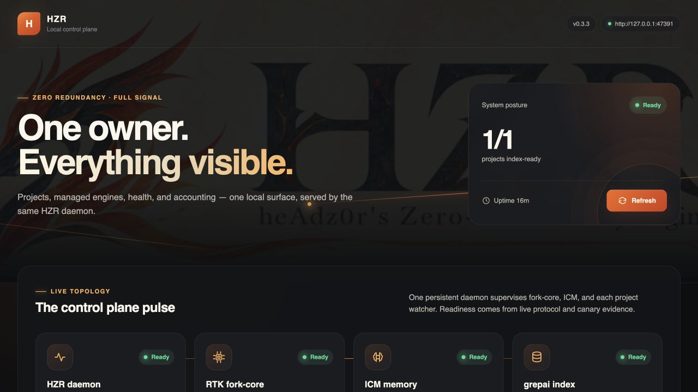
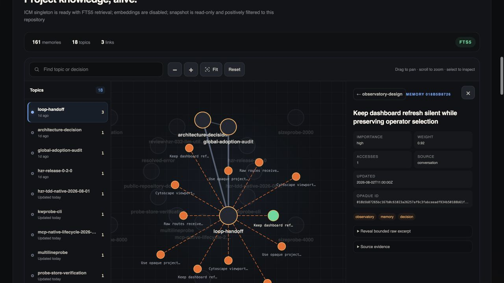
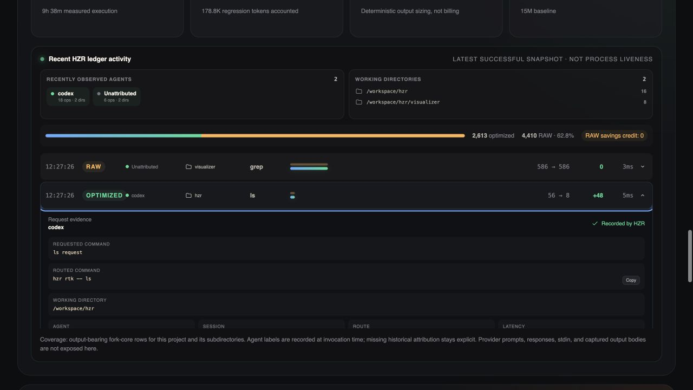

# HZR

> **heAdz0r's Zero-Redundancy engine** — an original local-first control plane and unified efficiency engine for coding agents.


[](Cargo.toml)
[](https://github.com/heAdz0r/hzr/actions/workflows/ci.yml)
[](https://github.com/heAdz0r/hzr/releases)
[](LICENSE)

HZR is an independent product from heAdz0r that turns disparate layers of agent optimization into one controlled execution path. A single control plane handles search, memory, context budget, execution, response density, and usage accounting—without rework or competing loops.

**The core invariant of the 0.5.0 distribution:** one installer deploys the entire versioned, self-contained runtime. Internal engines and their runtime dependencies require no separate installation. The only external runtime prerequisite is system Git.

> HZR does not claim unverified percentage savings. Functional and supply-chain gates are defined and repeatedly tested before release; the end-to-end economic effect must still be measured through paired, provider-billed benchmarks on identical tasks.

## Agent-useful output first

HZR optimizes for an agent reaching the correct next action, not for the smallest output in isolation. A bounded response must say what it represents, what was omitted, how much source it covers, and how to recover exact evidence. Mutations need the same discipline: exact preconditions, atomic replacement, idempotent retries, dry-run, and structured outcomes.

| Agent need | RAW tools | RTK upstream `v0.44.1` | HZR `0.5.0` |
|---|---|---|---|
| Understand a large Markdown file quickly | no common bounded contract | full file in the recorded case | self-described digest: bounded lead prose, omitted-content marker, source lines/bytes, section coverage, exact recovery hint |
| Recover authoritative content | command-specific full output | full output | `--level none` preserves complete text; `--from`/`--to` gives an exact focused range; arbitrary binary fidelity remains explicit RAW |
| Make one safe edit | tool/shell-specific behavior | no `write` command | `replace`, `patch`, JSON/TOML `set`, and idempotent `create`; lock + atomic rename, durable by default |
| Apply an edit plan | scripts or repeated processes | no `write batch` command | ordered JSON plan, grouped per-file I/O, dry-run, CAS/retry options, JSON v1 outcome |
| Know whether the answer is complete | varies by command | command-dependent filters | explicit mode, coverage, exit state and recovery path; exact-class invariants remain testable |
| Avoid duplicate optimization state | each tool owns itself | command filter only | one owner for execution, semantic index, memory, context budget, lifecycle and ledger |

The deterministic [LLM utility contract](benchmarks/hzr-llm-utility-v0.3.1/README.md) passes **9/9 gates**: **6/6 read-clarity signals**, byte-exact full/range recovery, **4/4 single-write operations**, **4/4 batch operations**, idempotent create, dry-run, and JSON schema v1. This proves the observable contract, not comprehension by every model or accepted-task quality. Batch atomicity is per file, not a transaction across all files in a plan.

Independently installed optimization tools often repeat the same work: scan the repository, build parallel indexes, remember the same context, compress it several times and write incompatible telemetry estimates. HZR assigns one owner to each concern.

## Secondary metric: measured command-output size

The reproducible 2026-08-01 development run compares identical commands through
RAW tools, upstream RTK `v0.44.1` and HZR with fork-core `0.44.1-fork.1` on the
same pinned upstream checkout. Each of 14 cases ran five times with rotating
order and isolated participant state.

| Case | RAW | RTK upstream | HZR | HZR vs upstream |
|---|---:|---:|---:|---:|
| `read README.md` | 6,046 | 6,046 | **265** | **−95.6%** |
| `git diff HEAD~5` | 185,931 | 10,325 | **5,540** | **−46.3%** |
| `cargo check` | 18 | 25 | **9** | **−64.0%** |
| `cargo test` (same exit `101`) | 47,075 | 252 | **168** | **−33.3%** |
| **All 14 cases** | **284,996** | **58,107** | **44,400** | **−23.6%** |

HZR won 8 measured cases and tied upstream on 6, with no remaining measured
losses and matching exit codes after fixing `cargo test` diagnostics, the
`cargo check` label, and captured `find`/`ls` output. Across the matrix HZR also
emitted 84.4% fewer estimated output tokens than RAW.

Tokens use `ceil(UTF-8 bytes / 4)`: this is a command-output estimate, not a
provider tokenizer, total-session measurement, answer-fidelity result or billing
claim. Read the [methodology and reproduction guide](benchmarks/hzr-vs-rtk-upstream-v0.44.1/README.md)
or inspect the [recorded result](benchmarks/hzr-vs-rtk-upstream-v0.44.1/runs/2026-08-01-v2/RESULTS.md).

## Architecture: one owner per concern

HZR combines the complete, proven fork-core with pinned specialized engines behind one protocol, lifecycle, and policy boundary:

| Concern | Sole owner in HZR |
|---|---|
| command rewrite, filters, `rgai`, IMG planner, read/write, guards | full HZR fork-core RTK |
| semantic code index and watcher | patched grepai 0.35.0 |
| durable cross-session memory | one HZR-supervised ICM 0.10.61 |
| policy, lifecycle, auth, hard budget, usage ledger | HZR / `hzrd` |
| provider-aware agent loop | managed caveman-code 0.65.2 |
| response-density contract and protected spans | HZR Codec + Caveman-derived contract |

“All tools as one system” does not mean invoking every engine on every turn. HZR selects the smallest sufficient path, deduplicates evidence by content hash, and avoids unnecessary semantic passes.

## Installation

### Release bundle

Published artifacts:

| OS | Architecture | Availability | Verification |
|---|---:|---|---|
| Linux | x86_64 | Available | native release workflow + clean-install smoke |
| Linux | ARM64 | Available | native release workflow + clean-install smoke |
| macOS | Apple Silicon | Available | native release workflow + clean-install smoke |
| macOS | Intel | Available | native release workflow + clean-install smoke |

No Windows artifact is provided in 0.5.0. Release scripts build native artifacts rather than cross-compiling them.

Download the installer, review it, then run it:

```bash
curl --proto '=https' --tlsv1.2 -fL \
  https://raw.githubusercontent.com/heAdz0r/hzr/v0.5.0/install.sh \
  -o /tmp/hzr-install.sh
sh /tmp/hzr-install.sh
```

Open `/tmp/hzr-install.sh` in any editor or pager before the second command if you
want to see what it does first. The installer reports each step, prints where every
file was placed, and ends with the exact commands to run next.

The installer downloads the platform artifact and `SHA256SUMS` from GitHub Releases, verifies the external checksum and internal bundle manifest, then creates:

```text
~/.local/share/hzr/
  versions/v0.5.0-<platform>/   # version-scoped self-contained bundle
  current -> versions/...

~/.local/bin/
  hzr
  hzrd
  rtk -> hzr                    # compatibility alias, not a second RTK
```

By default, the installer also runs `hzr init`, registers the current workspace, starts the
single `hzrd` user service and its bundled visualizer, and applies the confirmed adoption
configuration: one Claude `PreToolUse` dispatcher, an idempotent `SessionStart`, and
HZR-managed blocks in `CLAUDE.md` and `AGENTS.md`. Content-addressed backups are created
before existing files are modified.

To install only the files first, without hooks or agent instructions:

```bash
HZR_INSTALL_HOOKS=0 sh /tmp/hzr-install.sh
hzr install --dry-run
hzr install --force
```

Available installer overrides: `HZR_INSTALL_ROOT`, `HZR_BIN_DIR`, `HZR_INSTALL_HOOKS=0`,
`HZR_INSTALL_SERVICE=0`, `HZR_PROJECT_ONLY=1`, `HZR_FORCE=1`, and `HZR_VERSION`.
`HZR_PROJECT_ONLY=1` installs the same single service and global no-op-capable hook, but writes
agent instructions only into the current project and removes HZR-owned global MCP registrations.
Installation requires standard POSIX utilities: `sh`, `tar`, `curl` or `wget`, and `shasum` or
`sha256sum`. HZR requires system `git`; external Node.js, npm, Go, Rust, and separate engine
binaries are not required.

### What one bundle contains

| Component | Pin | Distribution role |
|---|---:|---|
| HZR | 0.5.0 | public CLI + daemon |
| HZR fork-core RTK | 0.44.1-fork.1 | private native engine; complete inherited surface |
| grepai | 0.35.0 + ownership patch | private native engine |
| ICM | 0.10.61 + lockfile patch | private native engine |
| caveman-code | 0.65.2 + exact production lock | managed JS runtime |
| Node.js | 22.17.1 | bundled official runtime |
| Vue visualizer | Vue 3.5.40 | Bun-built static operator UI served by `hzrd` |
| Caveman | 1.9.1 | design/reference, not a separate runtime |

The exact commits, archive checksums, npm integrity values, and patch digests are recorded in [`engines.lock.toml`](engines.lock.toml). The bundle preserves source provenance, applied patches, and applicable license texts.

## Quick start

Inside a Git repository:

```bash
hzr doctor --workspace .
hzr doctor --fix --workspace .  # safely migrate one unambiguous legacy .grepai
hzr daemon service status
hzr daemon status
```

`hzr doctor` is read-only by default. It verifies that the active global or project-local managed
blocks exactly match the running HZR contract and reports legacy local RTK/ICM directives that
would override it. `hzr init --if-needed` refreshes those owned regions while preserving project
rules. `doctor --fix` is limited to the transactional index migration used by `hzr migrate apply`:
it retains a byte-verified backup and refuses duplicate or conflicting indexes without mutation.

Release installer creates a user service (`launchd` on macOS, `systemd --user` on Linux)
and binds it to stable `current/bin/hzrd`. For source-only foreground development
the mode remains available as `hzr daemon serve`. Daemon only listens to loopback.

Open the local visualizer after installation:

```text
http://127.0.0.1:47391/
```

The visualizer is a Bun-built Vue application shipped as static bundle assets and served
by the existing `hzrd`; it is not a second service or control plane. It shows registered
projects, HZR/RTK fork-core/ICM/grepai state, versions, an interactive Cytoscape memory
explorer, grepai artifact/watcher readiness and ledger-backed routed search activity, provider receipts,
separately labeled estimates, and copyable diagnostic commands. Background synchronization is
quiet: it preserves scroll, graph camera, topic selection, and expanded activity while the manual
Refresh control stays under operator control. The public loopback dashboard exposes bounded,
redacted project-scoped memory topology; full record content is available only from the
bearer-authenticated memory-detail API. Operation activity exposes typed family, route, latency,
closed host identity and keyed agent/session pseudonyms; commands, arguments, queries, paths,
environment values, SQL and heredocs are scrubbed before persistence. Historical attribution
remains explicitly `Unattributed`.
RAW operations are visible, receive zero savings credit, and show a first-class HZR replacement
when one exists. `hzr init` refreshes the active managed instruction scope, migrates a detected
legacy local RTK block, updates the current project's private `workspace.json` registration, and ensures the production
service is running when invoked from an installed bundle. Source builds never install a
user service implicitly; use `hzr daemon serve`. `HZR_INSTALL_SERVICE=0` remains the explicit
opt-out for release installation.



<p align="center">
  
  
</p>

The screenshots use sanitized project paths and synthetic memory detail content against a live
HZR dashboard contract. Provider records, secrets, captured output, and canonical memory bodies
are intentionally excluded from the public assets.

```bash
hzr index status --workspace .
hzr search "where is command policy" --workspace .
hzr context plan "change command policy" --workspace .
hzr read README.md --outline
hzr write patch README.md --old @/tmp/old.txt --new @/tmp/new.txt --dry-run
hzr exec rewrite 'cargo test 2>&1 | tail -80'
hzr agent run "Implement the requested change" --workspace .
hzr stats
hzr stats --workspace .
hzr stats --since 7d
hzr stats --evasion --since 7d
```

The complete fork CLI remains available:

```bash
hzr rtk -- --version
rtk --version
```

Both commands reach private `engines/rtk`; alias `rtk` does not create a second control plane and does not use stock RTK fallback.

## How the context is assembled

1. HZR preserves the original intent and builds one structural plan with the complete fork IMG planner.
2. One project-scoped recall runs concurrently against the centralized ICM.
3. Evidence is normalized, deduplicated and placed under a hard token budget.
4. The fork `rgai` fallback is called only when the code plan is empty; semantic search uses the same canonical grepai store.
5. Managed caveman-code receives bounded context once and works only through allowlisted HZR tools.
6. A short cache-stable response contract is added before generation; code, JSON, commands, paths, identifiers, numbers and diagnostics are protected from lossy rewrite.

Native memory, repo-map, RTK, hooks, compression, skills, and tools in caveman-code are disabled before the first model session and verified by a runtime test. This preserves caveman-code as an agent loop without turning it into a second control plane.

## Activation modes

The default installation keeps the original all-projects behavior. Its installed `SessionStart`
hook runs `hzr init --if-needed --quiet`, so a project becomes HZR-backed on first use with no
manual step. Workspace identity has two bases:

| Project state | Identity basis | `init` outcome |
|---|---|---|
| Git repository | git common dir | `initialized` |
| Plain directory | canonical directory path | `initialized_without_git` |
| Directory that later gets `git init` | migrates to the git basis | `relocated_to_git_identity` |

Supporting plain directories matters because that is how most projects start. The trade-off
is explicit: a path-derived identity changes if the directory is renamed or moved. So
`git init` is handled as a migration — HZR moves its own store to the git-derived identity
and re-points the symlink, keeping any index already built. That relocation only ever
touches a store inside HZR's own `workspaces/` subtree; a symlink pointing anywhere else
stays foreign and is still refused.

Note that `init` registers the workspace and creates the symlink but does **not** build the
index. The first semantic query starts the watcher, and while that first scan runs, search
degrades to exact mode with a visible `fallback_reason` rather than blocking.

For a controlled comparison, install or switch to project-only activation from the project that
should use HZR:

```bash
HZR_PROJECT_ONLY=1 sh /tmp/hzr-install.sh
# or, after installing the bundle:
hzr install --project-only --dry-run
hzr install --project-only --force

hzr enable --workspace /path/to/another/project
hzr disable --workspace /path/to/project
hzr stats --workspace /path/to/project
```

Project-only activation is fail-closed:

- the one global Claude hook remains installed, but both `SessionStart` and `PreToolUse` are no-ops
  outside explicitly enabled repository/worktree identities;
- managed `CLAUDE.md` and `AGENTS.md` blocks are project-local, not user-global;
- HZR-owned global Codex and Claude Desktop MCP registrations are removed, because a client-global
  registration cannot prove which open project issued a call;
- MCP refuses uninitialized and unselected workspace bindings before any project-scoped read or
  write; `hzr_codec` remains workspace-independent;
- `disable` removes only the local managed instruction blocks and activation entry. It preserves
  the project's index and memory for a later re-enable.

The implementation and threat boundary are specified in
[`PRD_HZR_PROJECT_ACTIVATION.md`](docs/PRD_HZR_PROJECT_ACTIVATION.md).

## One index and one memory

```text
<hzr-data>/
  runtime/                              # daemon token + singleton locks
  fork/                                 # derived fork caches, not an embeddings DB
  workspaces/<repo>/<worktree>/index/grepai/
  workspaces/<repo>/<worktree>/workspace.json       # private visualizer registration
  memory/icm/                           # one DB/process
  ledger/hzr.sqlite                    # unified usage + efficiency ledger
  migrations/<repo>/<worktree>/
```

- `.grepai` in a project can only be a verified symlink to the managed store.
- One worktree owner lock prevents a second grepai watcher.
- ICM has one lifecycle and one physical DB; the repository namespace is set by HZR, not by the client.
- Fork `mem.db` remains derived structural cache. It is not a second embedding index or durable agent memory.
- Legacy, nested and foreign stores are detected but never automatically removed. Dormant nested
  stores are reported as a `doctor` warning but do not block canonical search; HZR never launches a
  watcher for them. An active nested writer, conflicting root placement, and ambiguous explicit
  migration still fail closed.

Safe migration begins with a read-only scan:

```bash
hzr migrate scan --workspace .
hzr migrate apply --workspace .
hzr migrate history --dry-run
hzr migrate history --force
```

`apply` requires explicit invocation, saves a full-SHA backup, and verifies immutable prepared/applied manifests. Unsafe symlinks, special files, partial targets, and an active foreign owner block the operation.
`history` snapshots platform RTK history through SQLite Online Backup in read-only mode,
imports each source row once, and saves the content-addressed snapshot with a JSON manifest.

## Basic commands

```text
hzr init                              workspace data + managed instructions + visualizer service
hzr enable|disable                    project-only activation for one workspace
hzr activation status                 list activation mode and enabled workspaces
hzr install|uninstall                 adoption, hooks, instructions, and service startup
hzr hooks status
hzr mcp serve                         stdio MCP for clients without hooks
hzr mcp config [--apply] --client …   print or apply a pinned MCP registration
hzr mcp status                        native registration and lifecycle status
hzr doctor
hzr daemon serve|status|engines
hzr daemon service install|start|stop|restart|status
hzr engines status
hzr index status|init
hzr search|rgai
hzr context plan
hzr memory recall|store|forget|update|prune|status
                                      --scope project|global|project-and-global
hzr exec rewrite|run|approve|deny
hzr codec compile
hzr agent run
hzr tdd                                optional; strict RED → GREEN → REFACTOR when selected
hzr test <command...>                  run tests through failure-first output
hzr stats                              global cumulative efficiency ledger
hzr build <args>                       build YOUR project (token-optimized output)
hzr release --force                    rebuild and reinstall HZR itself
hzr update [--check]                   install a newer published HZR release; `--check` reports only
hzr migrate scan|apply|history|memory
hzr rtk -- <fork arguments>
```

`hzr exec run '<shell command>'` is the default route for agent-originated shell work. It sends
the complete command through canonical policy so existing filters for `ssh`, `curl`, `bun`,
`git`, `find`, `rg`, and other supported tools are selected automatically. Quotes, verified
system paths, environment prefixes and nested POSIX shell launchers are normalized before routing;
ambiguous interpreters, redirects or mixed pipelines return `Ask` instead of silently becoming a
raw proxy. `hzr exec rewrite '<shell command>'` previews that decision without executing it.
Byte-for-byte recovery requires both `HZR_RAW_FIDELITY=1` and a compatible closed
`HZR_RAW_FIDELITY_REASON`; missing, contradictory or over-budget requests require approval.
Unmarked managed RAW wrappers are routed again and are never the normal wrapper for a shell command.

`hzr tdd` is HZR's optional, executable form of the upstream RTK project skill.
Use it when explicitly requested, required by repository-local policy, or worth
the test-first overhead for a risky change. Agents may skip it when token or time
efficiency matters, while still running proportionate verification and every
repository-required quality gate. Once selected, it requires an observed relevant
RED, the identical focused command passing at GREEN, and refactoring while green.
Release bundles also ship the canonical `share/hzr/skills/hzr-tdd/SKILL.md` asset
for agent integrations.

`build` and `release` are separate verbs deliberately. `hzr build` forwards to the
inherited fork wrapper that builds **your project** — the same verb RTK used, so existing
habits keep working. `hzr release` rebuilds **HZR itself**: it assembles the bundle,
installs it version-scoped, switches `current` atomically, restarts the daemon and then
verifies the reported version of all four engines, because checking `hzr --version` alone
previously allowed a stale bundle to look current.

`hzr update` queries the repository's published GitHub releases, selects a newer native
bundle for the current platform, verifies it against the release `SHA256SUMS`, and installs
it through HZR's versioned, atomic `current` switch. `hzr update --check` performs the same
release query and cache write without downloading or installing; it exits 0 when the check
succeeds (already current or update available) and non-zero only when the check itself fails. A check that finds no update is cached for
one hour, so a release published later that day is not hidden until tomorrow; a known newer
release remains cached for 24 hours. Claude SessionStart emits both a visible UI message and
agent context. Codex's mandatory `HZR.md` bootstrap performs the same bounded check and writes
the notice separately from byte-exact file output. The agent is told to inform the user once and
never install without explicit approval. Missing network access never blocks workspace startup
or tool use.

### Read, write, and batch write

Default Markdown reads are bounded overviews. They explicitly identify the output as a digest,
report source and section coverage, and tell the agent how to recover exact evidence:

```bash
hzr read README.md                                # self-described bounded overview
HZR_EXACT_FIDELITY=1 hzr read README.md --level none  # complete text content
hzr read README.md --from 120 --to 180            # exact focused range
hzr read README.md --outline                       # Markdown heading tree + source spans
hzr read src/main.rs -n                            # exact content + source coordinates
hzr read README.md --max-lines 40                  # exact first 40 lines
hzr read --batch --max-tokens 1200 README.md src/main.rs
```

`--outline` is format-aware: Markdown uses ATX headings (`#` through `######`), while
supported source files use their symbol extractor. Default `-n` reads exact content, and
ranges or tails preserve the original source coordinates instead of restarting at line 1.
`--max-lines N` is an exact head operation; it does not replace omitted lines with a smart
truncation marker. Batch reads preserve caller order and source coordinates, enforce one shared
budget plus an optional per-file budget, and emit exact range recovery commands.

File mutations use one predictable contract with concise, quiet, or JSON v1 output:

```bash
hzr write --output json replace app.rs --from old --to new --dry-run
hzr write patch app.rs --old @/tmp/old.txt --new @/tmp/new.txt --cas --retry 2
hzr write set config.json --key agent.enabled --value true --value-type bool
hzr write create notes.md --content @/tmp/notes.md
hzr write batch --plan '[{"op":"replace","file":"a.txt","from":"old","to":"new"}]'
```

`batch` applies operations for the same file in plan order and performs one atomic file commit
for that group. Independent file groups can succeed or fail separately; use the per-operation
result instead of assuming an all-files transaction.

## Memory: one store, two scopes

Memory lives in one supervised database, reachable through two namespaces:

```bash
hzr memory store --scope global preferences "always prefer exact output for parsers"
hzr memory recall "budget planning"                # project + global (default)
hzr memory recall --scope global "preferences"     # only user-wide facts
```

Use `project` (the store default) for facts about this repository, and `global` for facts
about **you** — a preference or standing rule that should apply everywhere instead of being
restated in every project. Recall defaults to project + global so standing preferences
arrive alongside this project's history.

Another repository's memory is never reachable from any scope. The filter is positive: a
record is returned only because it provably belongs to this repository or to the global
namespace, so one physical database cannot leak between projects.

Records imported from the pre-namespace legacy store have no trustworthy project provenance.
HZR retains them for audit/migration but quarantines them from automatic project recall; it
never guesses that the repository performing the import owns every legacy record.

It is important to distinguish between two levels of installation:

- repository-level `install.sh` installs the entire versioned self-contained release bundle,
  re-attests the same-version root, and starts the production user service;
- the `hzr install` CLI command configures a durable PATH entry, hooks, agent instructions,
  HZR-owned MCP registrations, and ensures the installed daemon/visualizer service is running.
  It supports `--dry-run`, requires `--force` for changes, and accepts `--skip-service` for
  controlled installation/test environments. That opt-out is also written into the managed
  `SessionStart` hook, so a later project initialization cannot silently install the service;
  rerun confirmed `hzr install` without `--skip-service` to re-enable automatic startup.
  `--project-only` instead installs project-local instructions, enables the current workspace,
  gates the hook by repository/worktree identity, and removes HZR-owned global MCP registrations.

## MCP for clients without hooks

Claude Code receives HZR through hooks and `CLAUDE.md`. Codex app-server and Claude Desktop expose no equivalent hooks, so memory is available to them through MCP. Previously, each client registered `icm serve` directly. That created the second memory layer prohibited by §6.5 and left 8 orphaned `icm serve` processes after Codex sessions ended.

```bash
hzr mcp config --client codex           # prints the [mcp_servers.hzr] block
hzr mcp config --client claude-desktop  # prints the mcpServers block
```

`hzr install --dry-run` shows the transactional replacement of direct ICM registrations,
and the confirmed `hzr install --force` applies it with full-SHA backup/CAS. The
`hzr mcp config` command remains a read-only way to obtain a snippet for manual integration.
`hzr mcp status` reports the native registration for each supported client.

In project-only mode HZR deliberately does not install a client-global MCP registration. A manual
`--workspace` pin is safe at the HZR boundary — uninitialized or unselected projects are refused —
but the registration itself is still visible to every session using that client profile. Use a
separate client profile when MCP availability must also be invisible outside the experiment.

`hzr init` does not start an MCP process. It initializes configuration and the
current workspace, refreshes its visualizer registration, and is intentionally safe to run from every Claude
`SessionStart`. Codex or Claude Desktop natively launches `hzr mcp serve` on
connection from the registration written by `hzr install --force`, then closes
the child through stdio EOF. Starting a persistent MCP process from `init` would
create one wrapper per session and defeat HZR's ownership model. The only persistent
service is `hzrd`; installed-bundle `init` and `install` ensure that same service is running.

The model-facing surface is deliberately small:

| Tool | Purpose |
|---|---|
| `hzr_context_plan` | Graph-first evidence planning across code structure, canonical search and durable memory. |
| `hzr_search` | Targeted semantic or exact repository search, with optional path and bounded snippets. |
| `hzr_memory_recall` | Recall project and explicitly global durable context. |
| `hzr_memory_store` | Add one durable decision, preference, resolved error or completed handoff. |

Daemon health, statistics, engine lifecycle and unrestricted command execution are
not model tools. They remain CLI/operator surfaces, avoiding unnecessary tool-choice
ambiguity and mutation authority. The gateway negotiates stable MCP `2025-11-25`
with compatible older clients, validates JSON Schema 2020-12 inputs, and returns
typed `structuredContent` plus text for backward compatibility. The full agent
contract is in [HZR.md](HZR.md).

Standards baseline: [MCP 2025-11-25 lifecycle](https://modelcontextprotocol.io/specification/2025-11-25/basic/lifecycle)
and [tool contracts](https://modelcontextprotocol.io/specification/2025-11-25/server/tools).

The MCP layer in 0.5.0 is a stateless stdio gateway: it stores no data of its own
and does not spawn internal engines. Each client process terminates at EOF,
while durable ownership remains with production `hzrd`; the installer migrates direct ICM
registrations, and `hzr doctor` verifies the service lifecycle.

An `isError: true` result confirms that no fallback engine or store was used,
not that a dispatched network write was rolled back. Validation and daemon
connection failures happen before dispatch. If a store response is lost after
dispatch, recall before retrying because completion is unknown.

Legacy durable memory is transferred separately and without deleting the original DB:

```bash
hzr migrate memory --workspace "$PWD" --dry-run
hzr daemon service stop
hzr migrate memory --workspace "$PWD" --force
hzr daemon service start
```

The operation creates SQLite-consistent, content-addressed snapshots of the legacy and canonical databases,
imports durable memory rows into the repository namespace, writes a verifiable manifest, and
becomes a no-op on subsequent runs. Hook telemetry, raw pending extractions, and derived
code-area observations remain only in the saved snapshot.

Global Claude and Codex request/response paths are marked by `hzr doctor` as
`unintercepted`: these hosts do not provide a secure global response hook. HZR does not
credit codec savings for this path; the codec applies only to managed `hzr agent` runs.

Parallel `hzr mcp serve` processes are safe while parallel `icm serve` processes are not: the adapter has no store of its own, routes everything to the single `hzrd`, and terminates at EOF on stdin, so it cannot outlive its parent. `hzr doctor` reports any remaining unmanaged `icm serve` or `grepai watch` process as an `error`, but never kills it automatically.

## Build from source

Contributors need Rust 1.85+, Go (CI pin 1.24.2), Git, Bash, curl and standard Unix build utilities. System Node/npm is not needed for bundle build: the script downloads checksum-pinned Node.js 22.17.1 and uses it for production npm tree.

```bash
scripts/build-bundle.sh "$PWD/dist"
scripts/package-release.sh "$PWD/dist" "$PWD/dist-release"
HZR_RELEASE_ARCHIVE="$(find "$PWD/dist-release" -maxdepth 1 \
  -name 'hzr-v0.5.0-*.tar.gz' -print -quit)"
scripts/smoke-install.sh "$HZR_RELEASE_ARCHIVE" "$PWD/dist-release/SHA256SUMS"
```

The last artifact name depends on the normalized platform (`darwin-arm64`, `darwin-x64`, `linux-arm64`, `linux-x64`); use the actual name from `dist-release/`.

Supported gates:

```bash
cargo fmt --all --check
cargo clippy --workspace --all-targets --all-features -- -D warnings
cargo test --workspace --all-targets --all-features
cargo +1.85.0 check --workspace --all-targets --all-features
PATH="$PWD/dist/runtime/node/bin:$PATH" \
  "$PWD/dist/runtime/node/bin/npm" ci --prefix integrations/caveman-code
"$PWD/dist/runtime/node/bin/node" --test integrations/caveman-code/bridge.test.mjs
PATH="$PWD/dist/runtime/node/bin:$PATH" \
  "$PWD/dist/runtime/node/bin/npm" audit --omit=dev --audit-level=high \
  --prefix integrations/caveman-code
scripts/verify-fork-core.sh --test
```

Do not run `cargo test` directly inside `fork-core/rtk`: the official gate creates the synthetic Git history needed by the legacy test suite, and simultaneously checks the immutable baseline plus the current-engine manifest.

## Verifiable guarantees and fair boundaries

|Guarantee|Status 0.5.0|
|---|---|
|Full fork baseline and current engine have verifiable identity|implemented|
|Stock RTK is missing from the production path|implemented|
|Release bundle works without external Node/RTK/grepai/ICM|native clean-install smoke passes and enters the release gate|
|Actual usage does not mix with estimates|implemented|
|Anti-evasion probe matrix covers shell, quote, path, interpreter, nested-reader and fidelity routes|release-gated|
|Current telemetry persists no command, path, query, session ID or agent ID payload|implemented|
| Paired provider-billed savings benchmark |not yet completed; 0/9 product metrics|
| Windows release artifact |absent|

Additional boundaries:

- ICM runs in FTS-only mode by default, so the first write does not trigger a hidden model load or fail on timeout. After provisioning the model, enable `engines.icm_embeddings = true`; health output clearly distinguishes the two modes.
- Before `hzrd` starts, the hook uses the same pinned fork-core, but daemon-free rewrites do not enter the SQLite ledger; `doctor` and `stats` mark accounting as incomplete.
- A hard `SIGKILL` can interrupt the final usage POST; a crash-safe outbox remains future work.
- caveman-code creates an inactive upstream `cavemem --version` probe. HZR blocks built-in resources and tools; fixing the probe itself requires a separate SDK patch.
- Fresh installation and reinstallation of the same version verify the external checksum, internal manifest, mandatory layout, digests, and absence of symlink injection. A damaged root never becomes `current`.

## Further development

After stable schema negotiation and typed context planning, MCP development focuses
on cancellation/backpressure and end-to-end trace from client request to
`hzr stats`. The invariant remains the same: MCP is a client-launched protocol
facade over HZR Core, and not a new service, index, memory store or control plane.

## Documentation

- [`RELEASE_NOTES.md`](RELEASE_NOTES.md) — what the current release changes, and why. Start here before upgrading.
- [`CHANGELOG.md`](CHANGELOG.md) — public release history.
- [`docs/releases/`](docs/releases/) — the notes each earlier release shipped with.
- [`CONTRIBUTING.md`](CONTRIBUTING.md) — development workflow and quality gates.
- [`SECURITY.md`](SECURITY.md) — supported versions and vulnerability reporting.
- [Benchmark methodology](benchmarks/hzr-vs-rtk-upstream-v0.44.1/README.md) — reproducible RAW / upstream RTK / HZR comparison.
- [`FORK_PARITY.md`](FORK_PARITY.md) — fork provenance and regression contract.
- [`HZR.md`](HZR.md) — tool contract for coding agents.
- [`THIRD_PARTY_NOTICES.md`](THIRD_PARTY_NOTICES.md) and [`NOTICE`](NOTICE) — bundled-engine attribution.

## Origin and licenses

HZR is a new independent repository and product, not a fork of history. `v0.1.0` captured the byte-for-byte baseline of the actual `heAdz0r/rtk` worktree: 516 entries, four tracked deletions and canonical snapshot v2 `f4296ec4…`. Starting from 0.2.0 the complete engine is developed only in `fork-core/rtk` inside HZR; baseline remains an immutable proof of origin.

The HZR control plane is distributed under Apache-2.0. Fork-core and bundled engines retain their own licenses and provenance; details are in [`THIRD_PARTY_NOTICES.md`](THIRD_PARTY_NOTICES.md).
