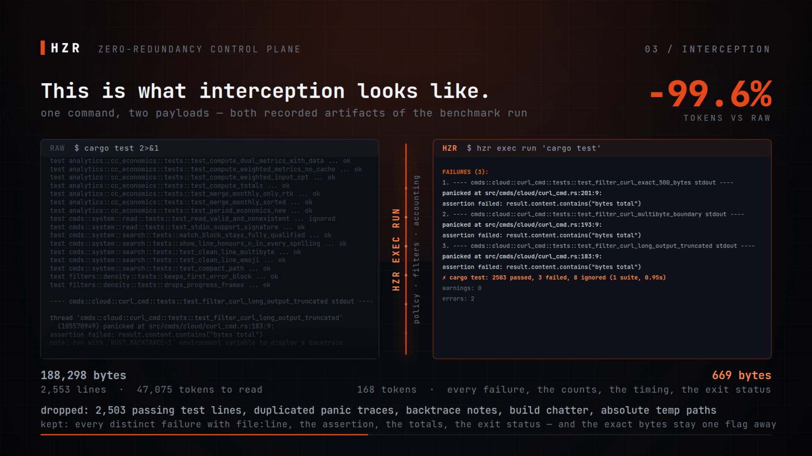
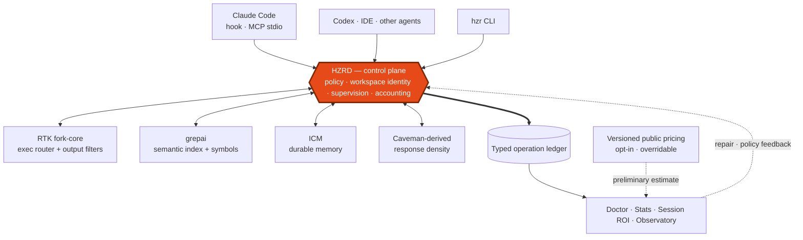

# HZR

<p align="center">
  
</p>

<p align="center">
  <a href="docs/assets/hzr-promo-1080p.mp4"></a><br>
  <sub><a href="docs/assets/hzr-promo-1080p.mp4"><strong>&#9654; HZR in 58 seconds</strong></a> &mdash; the recorded benchmark, what interception actually removes, the control plane, and the opt-in public-list cost estimate</sub>
</p>

<p align="center">
  <strong>One local control plane for efficient coding agents.</strong><br>
  Search once. Remember once. Execute through policy. Measure what actually happened.
</p>

<p align="center">
<a href="Cargo.toml"></a>
  <a href="https://github.com/heAdz0r/hzr/actions/workflows/ci.yml"></a>
  <a href="https://github.com/heAdz0r/hzr/releases"></a>
  <a href="LICENSE"></a>
</p>

HZR — **heAdz0r's Zero-Redundancy engine** — turns RTK fork-core, grepai, ICM,
Caveman-derived response density, policy, and observability into one coherent system.
It is local-first, project-scoped, and designed to reduce repeated work without hiding
what was filtered, estimated, or left unmeasured.

> The product is not “another wrapper around tools.” HZR is the ownership boundary that
> prevents those tools from building competing indexes, memories, caches, and accounting.

## The shift

Most agent stacks optimize isolated steps. Each layer scans the same repository, stores
its own context, compresses output again, and reports a different idea of savings. The
result may look efficient while consuming more work and losing observability.

HZR assigns one owner to each concern:

| Before | With HZR | What you get |
|---|---|---|
| independent command wrappers | one policy-aware execution route | bounded output and explicit exact recovery |
| duplicate semantic stores | one grepai index per worktree | no competing scans or watchers |
| per-client memory processes | one supervised ICM store | durable context without orphan processes |
| disconnected counters | one typed operation ledger | actual usage kept separate from estimates |
| opaque background failures | doctor + lifecycle + local observatory | degraded state is visible and actionable |

## Architecture



This architecture gives HZR three properties that a loose tool collection cannot:

1. **A single decision point.** Agent shell work enters through `hzr exec run`; known
   routes are filtered, unsupported paths are tracked, and ambiguous bypasses fail closed.
2. **A single project identity.** Search, memory, traces, and UI selection use the same
   repository/worktree boundary. One project cannot become another project's fallback.
3. **A single operational truth.** Engine health, exclusions, estimates, fidelity requests,
   and incomplete accounting remain visible instead of becoming false savings.

HZR does not invoke every engine on every turn. It selects the smallest sufficient path,
deduplicates evidence by identity, and supervises long-lived components centrally.

## Evidence, not slogans

The reproducible 2026-08-01 command-output benchmark ran 14 identical cases five times
against RAW tools, upstream RTK `v0.44.1`, and HZR fork-core `0.44.1-fork.1`.

| Case | RAW | RTK upstream | HZR | HZR vs RTK |
|---|---:|---:|---:|---:|
| `read README.md` | 6,046 | 6,046 | **265** | **−95.6%** |
| `git diff HEAD~5` | 185,931 | 10,325 | **5,540** | **−46.3%** |
| `cargo check` | 18 | 25 | **9** | **−64.0%** |
| `cargo test` with exit `101` | 47,075 | 252 | **168** | **−33.3%** |
| **All 14 cases** | **284,996** | **58,107** | **44,400** | **−23.6%** |

HZR won eight cases and tied six in that pinned matrix. The deterministic
[LLM utility contract](benchmarks/hzr-llm-utility-v0.3.1/README.md) passes 9/9
observable gates for bounded reads, exact recovery, and safe writes.

These values use `ceil(UTF-8 bytes / 4)`. They measure delivered command-output size,
not provider billing, total-session savings, or generic semantic equivalence. HZR keeps
provider receipts and public-list estimates separate. See the
[methodology](benchmarks/hzr-vs-rtk-upstream-v0.44.1/README.md)
and [recorded run](benchmarks/hzr-vs-rtk-upstream-v0.44.1/runs/2026-08-01-v2/RESULTS.md).

## Install

HZR 0.7.1 ships self-contained native bundles for Linux x86_64/ARM64 and macOS
Apple Silicon. Intel macOS is no longer supported. System Git is the only engine prerequisite; Node.js, RTK,
grepai, and ICM are bundled. Windows is not currently published.

Download, inspect, then run the installer:

```bash
curl --proto '=https' --tlsv1.2 -fL \
  https://raw.githubusercontent.com/heAdz0r/hzr/v0.7.1/install.sh \
  -o /tmp/hzr-install.sh
sh /tmp/hzr-install.sh
```

The installer verifies the release checksum and internal manifest, installs into a
versioned root, atomically switches `current`, initializes the workspace, and configures
the single user service. To separate file installation from agent adoption:

```bash
HZR_INSTALL_HOOKS=0 sh /tmp/hzr-install.sh
hzr install --dry-run
hzr install --force
```

Useful controls include `HZR_INSTALL_ROOT`, `HZR_BIN_DIR`, `HZR_INSTALL_HOOKS=0`,
`HZR_INSTALL_SERVICE=0`, `HZR_PROJECT_ONLY=1`, `HZR_FORCE=1`, and `HZR_VERSION`.

One bundle contains pinned HZR, RTK fork-core, grepai, ICM, caveman-code, Node.js,
and the Vue operator UI. Exact commits, archive checksums, patch digests, and npm
integrity values live in [`engines.lock.toml`](engines.lock.toml).

## First minute

Inside a repository:

```bash
hzr doctor --workspace .
hzr init --if-needed --workspace .
hzr daemon status
hzr search "where is command policy" --workspace .
hzr context plan "change command policy" --workspace .
hzr stats --workspace .
```

Open the local observatory at [http://127.0.0.1:47391/](http://127.0.0.1:47391/).
It shows the selected project's engine lifecycle, grepai readiness, anonymous memory
topology, command routes, exclusions, latency, traces, and accounting posture. Public
loopback views are bounded and pseudonymized; authenticated detail remains project-scoped.

## Daily control plane

```bash
hzr read README.md --outline
hzr read README.md --from 120 --to 180
hzr search "authorization boundary" --mode auto
hzr context plan "change authorization boundary"
hzr write patch app.rs --old @/tmp/old.txt --new @/tmp/new.txt --cas
hzr memory recall "release decision"
hzr exec run 'cargo test 2>&1 | tail -80'
hzr stats --evasion --since 7d
```

Bounded reads retain exact-range recovery; writes are atomic and confined. `hzr build` is an
inherited fork-core command, so build projects through `hzr exec run '<project build command>'`.

## Session ROI where the agent can see it

HZR does not wait for someone to open a dashboard. At the end of a session it turns the same
accounting model behind `hzr stats` into a compact ROI card:

```text
HZR session ROI
Saved (estimated net): 8000 tokens (66.7%; gross 8000, regression 0; 12000 -> 4000)
Measured commands: 7 | Top: hzr read <arguments omitted> x5
Policy: prevented 5 (1 native denial); asked 0; avoidable leakage 0 ops / 0 tokens
Evidence: prevented output not estimated | top evasion e10-capability-gap | hook events 464
Shadow guard: T3 observe-only | limit 40 ops / 250000 tokens
```

The first line is the measured local reduction from commands that actually ran. The policy line
is different evidence: a prevented bypass has no output to count, so HZR celebrates the catch
without inventing savings. Zero leakage therefore reads as the good result it is; an unavailable
ledger reads `unknown`, never a reassuring fake zero. Top commands are privacy-safe families,
not paths, queries, or arguments.

The same session boundary can now translate potentially avoided model-input tokens into a
**preliminary public-list price estimate**. It is opt-in, labels the exact catalog identity and
pricing method, and is never presented as a provider invoice:

```toml
[billing]
public_estimate_enabled = true
harness = "codex"
provider = "openai"
model = "gpt-5.6-terra"
method = "standard_short_context_lte_272k"
request_input_tokens = 100000
pricing_basis = "input"
# pricing_file = "/absolute/path/to/private-pricing.json"
```

Run `hzr billing catalog` before selecting a model. The built-in, versioned catalog covers
current public API prices from OpenAI, Anthropic, Google, DeepSeek, Qwen, Mistral, and xAI.
`request_input_tokens` is the actual priced request/session input, not the model's maximum
context capacity; tiered prices fail closed when that evidence is absent or outside the method.
Set `pricing_file` to an absolute JSON path to merge strict overrides by exact pricing key.
HZR fails closed on an unknown model, method, currency, or expired price; it performs no FX
conversion. Receipt imports remain a separate evidence class and are labelled user-supplied
unless a trusted adapter verifies their provenance. Public prices never turn an estimate into a
provider bill.

## Make the efficient path the easy path

Having a good filter is not enough if an agent can reach a familiar RAW command faster. HZR 0.6
closes that incentive gap: the normal route needs less judgment than the bypass.

```text
effective managed route exists  → use it; RAW is forbidden
no equivalent route exists      → tracked fallback; no invented savings
exact bytes are truly required  → explicit reason + bounded fidelity allowance
native bypass is still observed → E10 finding + zero credit + named replacement
```

`hzr exec run` accepts the original shell string and chooses the first-class implementation. It
looks through common shell and environment wrappers, so wrapping `rg`, `git`, `curl`, or another
managed command does not turn it into an invisible escape hatch. If `hzr exec rewrite` proves an
`allow_rewrite` decision, an unfiltered route cannot override it.

This is more than a warning in a prompt. Avoidable bypass is recorded outside the optimized
bucket, contributes zero reduction, lowers visible coverage, and returns the HZR command that
should replace it. A genuinely unsupported operation remains available and auditable instead of
being falsely called optimized.

## Exactness is a controlled capability

Bounded output must identify what it represents, what was omitted, and how to recover
authoritative evidence. Exact ranges and structured recovery stay first-class. Fully
unfiltered execution requires an explicit fidelity marker and one closed reason:

```bash
HZR_RAW_FIDELITY=1 \
HZR_RAW_FIDELITY_REASON=machine_protocol \
hzr exec run '<command>'
```

Allowed reasons are `binary`, `checksum`, `machine_protocol`, `complete_log`,
`full_patch`, and `verbatim_source`. Requests are budgeted before execution; uncertain
post-execution state stays visible for operator reconciliation. RAW receives zero savings
credit. If a managed equivalent exists, the direct bypass remains forbidden.

## One workspace, one index, one memory plane

HZR derives identity from the Git common directory and worktree, or from the canonical path
before `git init`. It owns one grepai store per worktree, one centrally supervised ICM database,
and one typed ledger with positive project/global namespace checks.

Legacy and foreign stores are diagnosed, never silently adopted. `doctor` is read-only by
default; `doctor --fix` only applies bounded, unambiguous repair paths with backups and CAS.
Fleet reconciliation can migrate one unambiguous root store transactionally. Ambiguous nested
duplicates require an explicit `hzr migrate archive-index --dry-run`, followed by `--force`
after reviewing the source, hash manifest, and retained backup. If a source is recreated at the
same path, HZR reports an explicit conflict and makes no mutation; an old manifest cannot hide it.

Use `hzr install --project-only --dry-run` when global activation is undesirable; explicit
`hzr enable` and `hzr disable` keep that scope visible.

## MCP without a second control plane

Clients without hooks launch the stateless stdio gateway:

```bash
hzr init                                                # exact Codex project pin
hzr mcp config --client claude-code --workspace "$PWD" # worktree .mcp.json
hzr mcp config --client claude-desktop --workspace "$PWD" --apply
hzr mcp status
```

Codex and Claude Code support exact project scopes. For linked Claude Code worktrees, use the
generated `.mcp.json`/`-s project` registration; HZR never retargets shared local state. Claude
Desktop is different: it has one selected workspace. In every other project doctor reports
`unavailable_for_this_workspace` with a retarget-or-CLI action instead of pretending one global
pin can serve the whole fleet. Every mismatched MCP session still fails closed.

The user-level Codex entry is only a dynamic fallback; every initialized repository keeps its
exact pin in `.codex/config.toml`. A global install preserves an existing valid Claude Desktop
selection instead of silently retargeting it. Change that singleton deliberately with
`hzr mcp config --client claude-desktop --workspace "$PWD" --apply`, then reconnect the client.

The gateway exposes 13 schema-validated tools for context, search, confined read/write,
memory lifecycle, managed execution, observability, doctor, and codec operations. It owns
no database and starts no internal engine; every project-scoped operation goes through the
same `hzrd` boundary. The executable contract is
[`contracts/agent-capabilities.json`](contracts/agent-capabilities.json).

| Capability | MCP tools |
|---|---|
| context and code | `hzr_context_plan`, `hzr_search`, `hzr_read` |
| confined mutation and execution | `hzr_write`, `hzr_exec` |
| durable memory | `hzr_memory_recall`, `hzr_memory_store`, `hzr_memory_update`, `hzr_memory_forget`, `hzr_memory_prune` |
| operations | `hzr_observability`, `hzr_doctor`, `hzr_codec` |

`hzr_codec` distinguishes four coverage states: `applied`, `shadow_measured`, `instructed`, and
`unavailable`. A transformed tool/CLI payload is observable and may receive estimated token
credit. Claude and Codex cannot let HZR replace every final assistant response, so managed
instructions and SessionStart expose the action while global-response coverage receives zero
credit until a trusted host confirms replacement. Provider-billed `$` is never inferred from it.

## Keeping a fleet of projects current

Every registered workspace carries a managed contract block. When the contract moves, those
blocks go stale, and a report that can only name 158 stale files across 79 projects is a chore,
not a fix. One command repairs them:

```bash
hzr doctor --reconcile-fleet --dry-run   # exact files first
hzr doctor --reconcile-fleet
```

It refreshes stale blocks and creates missing managed Claude/Codex instruction surfaces and
Codex project MCP pins for already registered workspaces. Claude Code `.mcp.json` remains an
explicit project registration. HZR does not register arbitrary directories. Canonical-root
and symlink-confinement checks keep every write inside its intended workspace, while user-authored
directives outside the block are preserved and reported. Run it from an installed HZR: a binary
started inside a source checkout would hand every other project a contract path only that checkout
has, so the command refuses instead.

Doctor also validates the runtime path, not just the presence of index files. A typed semantic
readiness probe catches an incompatible grepai configuration, supervised ICM failures stay
visible, and a stale cache cannot masquerade as a healthy search plane. Completed global install
journals become global facts only after their schema, exact terminal stage receipts, and state
validate; incomplete recovery remains bound to its owning
workspace. The same auditable waiver rules apply to both current-workspace and fleet checks.

SessionStart uses the same audit for the current project and user-global Claude/Codex surfaces.
If it repairs drift or finds a conflict it cannot safely rewrite, the agent receives an immediate
alert to run `hzr doctor` before continuing. A fleet cannot depend on someone remembering to open
doctor after the instructions have already diverged.

## When a project genuinely cannot route through HZR

Some repositories have to name an engine directly: a benchmark whose measured subject *is*
RTK, or the engine's own source tree. Rewriting those instructions would destroy the thing
they measure. Such a project declares a waiver instead of being quietly skipped:

```toml
# .hzr/policy.toml
schema_version = 1

[[exemption]]
rule = "direct-rtk"
reason = "benchmark-subject"
justification = "This checkout is the upstream RTK baseline that HZR measures itself against."
```

A waiver covers only the named instruction rule, requires an auditable justification, and is
reported under `fleet_instruction_exemptions`. It never waives the managed block or execution
policy: no repository file can buy an exception to a bypass HZR could replace at runtime.

## Honest boundaries

| Guarantee | 0.7.1 posture |
|---|---|
| one versioned control plane and pinned engine bundle | implemented |
| one canonical index owner per worktree | implemented |
| actual provider usage separated from preliminary public-list estimates | implemented |
| fidelity bypasses receive zero savings credit | implemented |
| commands, paths, queries, and raw identifiers excluded from public telemetry | implemented |
| provider-verified invoice attribution | **not inferred from public prices** |
| Windows release artifact | **not available** |

HZR never upgrades an estimate into a billing claim. A daemon-free fallback can preserve
command policy but cannot invent a missing ledger receipt; `doctor` and `stats` report the
accounting gap. Generic semantic equivalence is not inferred merely because output became
smaller.

Since 0.6.5 those completeness contracts are executable rather than editorial. Every filtered
route declares what it may never drop — exit status, failure lines, warnings, changed files — and
`fork-core/rtk/tests/must_keep_contract.rs` proves it by running the real filters against output
carrying each class. Exact recovery remains available when a proof is absent.

The delivered-byte benchmark above measures output size, not what a provider bills. The paired
[billed-input benchmark](benchmarks/hzr-billed-input-prefix-cache-v0.6.5/README.md) tests the
strongest objection to it — that a mid-turn filter invalidates a cached request prefix, so billed
input can rise while delivered bytes fall. That harness ships in 0.6.5 and **has not been run**;
it refuses to report a figure without paired provider receipts.

## Built from practical RTK experience

HZR is built by **heAdz0r, an RTK contributor** who has worked directly with the filtering
techniques this system extends. The fork is not a reduced reimplementation: HZR preserves
the complete imported engine, its provenance, and a deterministic parity contract while
evolving it behind a broader architecture.

The immutable `v0.1.0` baseline records the original RTK worktree. Current fork development
lives in `fork-core/rtk`; provenance and regression rules are documented in
[`FORK_PARITY.md`](FORK_PARITY.md).

## Build and contribute

Source builds require Rust 1.85+, Go, Git, Bash, curl, and standard Unix tools:

```bash
scripts/build-bundle.sh "$PWD/dist"
scripts/package-release.sh "$PWD/dist" "$PWD/dist-release"
```

See [`CONTRIBUTING.md`](CONTRIBUTING.md), [`RELEASE_NOTES.md`](RELEASE_NOTES.md),
[`CHANGELOG.md`](CHANGELOG.md), [`SECURITY.md`](SECURITY.md), and the immutable
[`release archive`](docs/releases/).

The HZR control plane is Apache-2.0. Fork-core and bundled engines retain their own
licenses and provenance; see [`NOTICE`](NOTICE) and [`THIRD_PARTY_NOTICES.md`](THIRD_PARTY_NOTICES.md).
