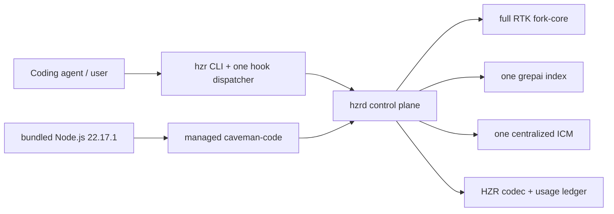

# HZR

> **heAdz0r's Zero-Redundancy engine** — an original local-first control plane and unified efficiency engine for coding agents.


[](Cargo.toml)
[](https://github.com/heAdz0r/hzr/actions/workflows/ci.yml)
[](https://github.com/heAdz0r/hzr/releases)
[](LICENSE)

HZR is an independent product from heAdz0r that turns disparate layers of agent optimization into one controlled execution path. A single control plane handles search, memory, context budget, execution, response density, and usage accounting—without rework or competing loops.

**The core invariant of the 0.2.0 distribution:** one installer deploys the entire versioned, self-contained runtime. Internal engines and their runtime dependencies require no separate installation. The only external runtime prerequisite is system Git.

> HZR does not claim unverified percentage savings. Functional and supply-chain gates are defined and repeatedly tested before release; the end-to-end economic effect must still be measured through paired, provider-billed benchmarks on identical tasks.

## Why HZR

Independently installed optimization tools often repeat the same work: scan the repository, build parallel indexes, remember the same context, compress it several times and write incompatible telemetry estimates. HZR assigns one owner to each concern.

## Architecture: one owner per concern

HZR combines the complete, proven fork-core with pinned specialized engines behind one protocol, lifecycle, and policy boundary:

| Concern | Sole owner in HZR |
|---|---|
| command rewrite, filters, `rgai`, IMG planner, read/write, guards | full HZR fork-core RTK |
| semantic code index and watcher | patched grepai 0.35.0 |
| durable cross-session memory | one HZR-supervised ICM 0.10.61 |
| policy, lifecycle, auth, hard budget, usage ledger | HZR / `hzrd` |
| provider-aware agent loop | managed caveman-code 0.65.2 |
| response-density contract and protected spans | HZR Codec + Caveman-derived contract |



“All tools as one system” does not mean invoking every engine on every turn. HZR selects the smallest sufficient path, deduplicates evidence by content hash, and avoids unnecessary semantic passes.

## Installation

### Release bundle

Published artifacts:

| OS | Architecture | Availability | Verification |
|---|---:|---|---|
| Linux | x86_64 | Available | native release workflow + clean-install smoke |
| Linux | ARM64 | Available | native release workflow + clean-install smoke |
| macOS | Apple Silicon | Available | native release workflow + clean-install smoke |
| macOS | Intel | Available | native release workflow + clean-install smoke |

No Windows artifact is provided in 0.2.0. Release scripts build native artifacts rather than cross-compiling them.

Download and inspect the installer before running it:

```bash
curl --proto '=https' --tlsv1.2 -fL \
  https://raw.githubusercontent.com/heAdz0r/hzr/v0.2.0/install.sh \
  -o /tmp/hzr-install.sh
less /tmp/hzr-install.sh
sh /tmp/hzr-install.sh
```

The installer downloads the platform artifact and `SHA256SUMS` from GitHub Releases, verifies the external checksum and internal bundle manifest, then creates:

```text
~/.local/share/hzr/
  versions/v0.2.0-<platform>/   # version-scoped self-contained bundle
  current -> versions/...

~/.local/bin/
  hzr
  hzrd
  rtk -> hzr                    # compatibility alias, not a second RTK
```

By default, the installer also runs `hzr init` and applies the confirmed adoption configuration: one Claude `PreToolUse` dispatcher, an idempotent `SessionStart`, and HZR-managed blocks in `CLAUDE.md` and `AGENTS.md`. Content-addressed backups are created before existing files are modified.

To install only the files first, without hooks or agent instructions:

```bash
HZR_INSTALL_HOOKS=0 sh /tmp/hzr-install.sh
hzr install --dry-run
hzr install --force
```

Available installer overrides: `HZR_INSTALL_ROOT`, `HZR_BIN_DIR`, `HZR_INSTALL_HOOKS=0`, `HZR_INSTALL_SERVICE=0`, `HZR_FORCE=1`, and `HZR_VERSION`. Installation requires standard POSIX utilities: `sh`, `tar`, `curl` or `wget`, and `shasum` or `sha256sum`. HZR requires system `git`; external Node.js, npm, Go, Rust, and separate engine binaries are not required.

### What one bundle contains

| Component | Pin | Distribution role |
|---|---:|---|
| HZR | 0.2.0 | public CLI + daemon |
| HZR fork-core RTK | 0.44.1-fork.1 | private native engine; complete inherited surface |
| grepai | 0.35.0 + ownership patch | private native engine |
| ICM | 0.10.61 + lockfile patch | private native engine |
| caveman-code | 0.65.2 + exact production lock | managed JS runtime |
| Node.js | 22.17.1 | bundled official runtime |
| Caveman | 1.9.1 | design/reference, not a separate runtime |

The exact commits, archive checksums, npm integrity values, and patch digests are recorded in [`engines.lock.toml`](engines.lock.toml). The bundle preserves source provenance, applied patches, and applicable license texts.

## Quick start

Inside a Git repository:

```bash
hzr doctor --workspace .
hzr daemon service status
hzr daemon status
```

Release installer creates a user service (`launchd` on macOS, `systemd --user` on Linux)
and binds it to stable `current/bin/hzrd`. For source-only foreground development
the mode remains available as `hzr daemon serve`. Daemon only listens to loopback.

```bash
hzr index status --workspace .
hzr search "where is command policy" --workspace .
hzr context plan "change command policy" --workspace .
hzr exec rewrite 'cargo test 2>&1 | tail -80'
hzr agent run "Implement the requested change" --workspace .
hzr stats
```

The complete fork CLI remains available:

```bash
hzr rtk -- --version
rtk --version
```

Both commands reach private `engines/rtk`; alias `rtk` does not create a second control plane and does not use stock RTK fallback.

## How the context is assembled

1. HZR preserves the original intent and builds one structural plan with the complete fork IMG planner.
2. One project-scoped recall runs concurrently against the centralized ICM.
3. Evidence is normalized, deduplicated and placed under a hard token budget.
4. The fork `rgai` fallback is called only when the code plan is empty; semantic search uses the same canonical grepai store.
5. Managed caveman-code receives bounded context once and works only through allowlisted HZR tools.
6. A short cache-stable response contract is added before generation; code, JSON, commands, paths, identifiers, numbers and diagnostics are protected from lossy rewrite.

Native memory, repo-map, RTK, hooks, compression, skills, and tools in caveman-code are disabled before the first model session and verified by a runtime test. This preserves caveman-code as an agent loop without turning it into a second control plane.

## One index and one memory

```text
<hzr-data>/
  runtime/                              # daemon token + singleton locks
  fork/                                 # derived fork caches, not an embeddings DB
  workspaces/<repo>/<worktree>/index/grepai/
  memory/icm/                           # one DB/process
  ledger/hzr.sqlite                    # unified usage + efficiency ledger
  migrations/<repo>/<worktree>/
```

- `.grepai` in a project can only be a verified symlink to the managed store.
- One worktree owner lock prevents a second grepai watcher.
- ICM has one lifecycle and one physical DB; the repository namespace is set by HZR, not by the client.
- Fork `mem.db` remains derived structural cache. It is not a second embedding index or durable agent memory.
- Legacy, nested and foreign stores are detected but never automatically removed.

Safe migration begins with a read-only scan:

```bash
hzr migrate scan --workspace .
hzr migrate apply --workspace .
hzr migrate history --dry-run
hzr migrate history --force
```

`apply` requires explicit invocation, saves a full-SHA backup, and verifies immutable prepared/applied manifests. Unsafe symlinks, special files, partial targets, and an active foreign owner block the operation.
`history` snapshots platform RTK history through SQLite Online Backup in read-only mode,
imports each source row once, and saves the content-addressed snapshot with a JSON manifest.

## Basic commands

```text
hzr init
hzr install|uninstall                 adoption, hooks, and agent instructions
hzr hooks status
hzr mcp serve                         stdio MCP for clients without hooks
hzr mcp config --client codex|claude-desktop
hzr doctor
hzr daemon serve|status|engines
hzr daemon service install|start|stop|restart|status
hzr engines status
hzr index status|init
hzr search|rgai
hzr context plan
hzr memory recall|store|status
hzr exec rewrite|run|approve|deny
hzr codec compile
hzr agent run
hzr stats                              global cumulative efficiency ledger
hzr migrate scan|apply|history|memory
hzr rtk -- <fork arguments>
```

It is important to distinguish between two levels of installation:

- repository-level `install.sh` installs the entire versioned self-contained release bundle,
  re-attests the same-version root, and starts the production user service;
- the `hzr install` CLI command configures a durable PATH entry, hooks, agent instructions,
  and HZR-owned MCP registrations. It supports `--dry-run`, requires `--force`
  for changes, and does not run during build/test.

## MCP for clients without hooks

Claude Code receives HZR through hooks and `CLAUDE.md`. Codex app-server and Claude Desktop expose no equivalent hooks, so memory is available to them through MCP. Previously, each client registered `icm serve` directly. That created the second memory layer prohibited by §6.5 and left 8 orphaned `icm serve` processes after Codex sessions ended.

```bash
hzr mcp config --client codex           # prints the [mcp_servers.hzr] block
hzr mcp config --client claude-desktop  # prints the mcpServers block
```

`hzr install --dry-run` shows the transactional replacement of direct ICM registrations,
and the confirmed `hzr install --force` applies it with full-SHA backup/CAS. The
`hzr mcp config` command remains a read-only way to obtain a snippet for manual integration.

Tools: `hzr_memory_recall`, `hzr_memory_store`, and `hzr_search` — backed by the same single database and index as the CLI. The full agent contract is in [HZR.md](HZR.md).

The MCP layer in 0.2.0 is a stateless stdio gateway: it stores no data of its own
and does not spawn internal engines. Each client process terminates at EOF,
while durable ownership remains with production `hzrd`; the installer migrates direct ICM
registrations, and `hzr doctor` verifies the service lifecycle.

Legacy durable memory is transferred separately and without deleting the original DB:

```bash
hzr migrate memory --workspace "$PWD" --dry-run
hzr daemon service stop
hzr migrate memory --workspace "$PWD" --force
hzr daemon service start
```

The operation creates SQLite-consistent, content-addressed snapshots of the legacy and canonical databases,
imports durable memory rows into the repository namespace, writes a verifiable manifest, and
becomes a no-op on subsequent runs. Hook telemetry, raw pending extractions, and derived
code-area observations remain only in the saved snapshot.

Global Claude and Codex request/response paths are marked by `hzr doctor` as
`unintercepted`: these hosts do not provide a secure global response hook. HZR does not
credit codec savings for this path; the codec applies only to managed `hzr agent` runs.

Parallel `hzr mcp serve` processes are safe while parallel `icm serve` processes are not: the adapter has no store of its own, routes everything to the single `hzrd`, and terminates at EOF on stdin, so it cannot outlive its parent. `hzr doctor` reports any remaining unmanaged `icm serve` or `grepai watch` process as an `error`, but never kills it automatically.

## Build from source

Contributors need Rust 1.85+, Go (CI pin 1.24.2), Git, Bash, curl and standard Unix build utilities. System Node/npm is not needed for bundle build: the script downloads checksum-pinned Node.js 22.17.1 and uses it for production npm tree.

```bash
scripts/build-bundle.sh "$PWD/dist"
scripts/package-release.sh "$PWD/dist" "$PWD/dist-release"
HZR_RELEASE_ARCHIVE="$(find "$PWD/dist-release" -maxdepth 1 \
  -name 'hzr-v0.2.0-*.tar.gz' -print -quit)"
scripts/smoke-install.sh "$HZR_RELEASE_ARCHIVE" "$PWD/dist-release/SHA256SUMS"
```

The last artifact name depends on the normalized platform (`darwin-arm64`, `darwin-x64`, `linux-arm64`, `linux-x64`); use the actual name from `dist-release/`.

Supported gates:

```bash
cargo fmt --all --check
cargo clippy --workspace --all-targets --all-features -- -D warnings
cargo test --workspace --all-targets --all-features
cargo +1.85.0 check --workspace --all-targets --all-features
PATH="$PWD/dist/runtime/node/bin:$PATH" \
  "$PWD/dist/runtime/node/bin/npm" ci --prefix integrations/caveman-code
"$PWD/dist/runtime/node/bin/node" --test integrations/caveman-code/bridge.test.mjs
PATH="$PWD/dist/runtime/node/bin:$PATH" \
  "$PWD/dist/runtime/node/bin/npm" audit --omit=dev --audit-level=high \
  --prefix integrations/caveman-code
scripts/verify-fork-core.sh --test
```

Do not run `cargo test` directly inside `fork-core/rtk`: the official gate creates the synthetic Git history needed by the legacy test suite, and simultaneously checks the immutable baseline plus the current-engine manifest.

## Verifiable guarantees and fair boundaries

|Guarantee|Status 0.2.0|
|---|---|
|Full fork baseline and current engine have verifiable identity|implemented|
|Stock RTK is missing from the production path|implemented|
|Release bundle works without external Node/RTK/grepai/ICM|native clean-install smoke passes and enters the release gate|
|Actual usage does not mix with estimates|implemented|
| Paired provider-billed savings benchmark |not yet completed; 0/9 product metrics|
| Windows release artifact |absent|

Additional boundaries:

- ICM runs in FTS-only mode by default, so the first write does not trigger a hidden model load or fail on timeout. After provisioning the model, enable `engines.icm_embeddings = true`; health output clearly distinguishes the two modes.
- Before `hzrd` starts, the hook uses the same pinned fork-core, but daemon-free rewrites do not enter the SQLite ledger; `doctor` and `stats` mark accounting as incomplete.
- A hard `SIGKILL` can interrupt the final usage POST; a crash-safe outbox remains future work.
- caveman-code creates an inactive upstream `cavemem --version` probe. HZR blocks built-in resources and tools; fixing the probe itself requires a separate SDK patch.
- Fresh installation and reinstallation of the same version verify the external checksum, internal manifest, mandatory layout, digests, and absence of symlink injection. A damaged root never becomes `current`.

## Further development

After stabilization of 0.2.0, development of MCP surface will focus on versioned schema negotiation, additional secure HZR tools and end-to-end trace from client request to `hzr stats`. The invariant remains the same: MCP is a protocol facade over HZR Core, and not a new index, memory store or control plane.

## Documentation

- [`CHANGELOG.md`](CHANGELOG.md) — history of public releases.
- [`PRD.md`](PRD.md) — architecture, requirements, and acceptance criteria for 0.2.0.
- [`PRD_STATUS_0.2.0.md`](PRD_STATUS_0.2.0.md) — current release status and open dimensions.
- [`PRD_ADOPTION.md`](PRD_ADOPTION.md) — hooks, degraded path, and safe adoption model.
- [`FORK_PARITY.md`](FORK_PARITY.md) — provenance of complete fork and regression contract.
- [`HZR.md`](HZR.md) — short tool contract for coding agents.
- [`THIRD_PARTY_NOTICES.md`](THIRD_PARTY_NOTICES.md) — pins, patches and licenses.
- [`NOTICE`](NOTICE) — copyright and link to bundled attribution.

## Origin and licenses

HZR is a new independent repository and product, not a fork of history. `v0.1.0` captured the byte-for-byte baseline of the actual `heAdz0r/rtk` worktree: 516 entries, four tracked deletions and canonical snapshot v2 `f4296ec4…`. Starting from 0.2.0 the complete engine is developed only in `fork-core/rtk` inside HZR; baseline remains an immutable proof of origin.

The HZR control plane is distributed under Apache-2.0. Fork-core and bundled engines retain their own licenses and provenance; details are in [`THIRD_PARTY_NOTICES.md`](THIRD_PARTY_NOTICES.md).
