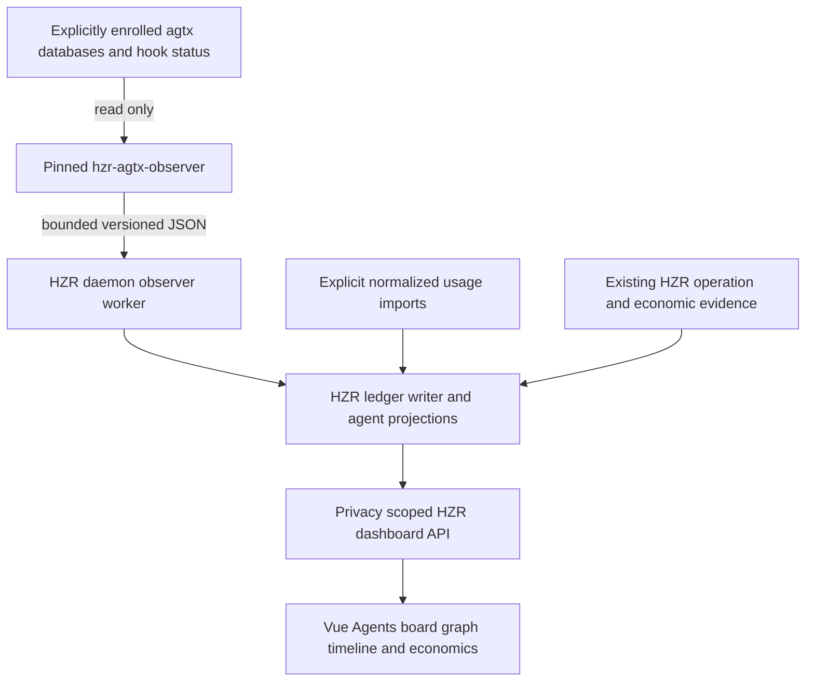

# PRD: Opt-in agtx Agent Observatory for HZR

Status: ready for implementation planning; no implementation performed.
Date: 2026-09-07.
Priority: P0 for the complete monitoring slice described below.
Audience: implementation agent; follow the sequence and acceptance tests literally.
Document language: English, matching HZR's documentation contract.

## 1. Product decision and scope

Add agtx as an optional, pinned, HZR-managed monitoring component. Add an **Agents** workspace to the existing HZR visualizer with a board, dependency graph, observed timeline, session attribution, spending, and efficiency evidence.

HZR remains the only owner of its policy, component lifecycle, workspace registration, ledger writes, pricing, public API, and dashboard. agtx supplies its real task/session model and read-only snapshots through an adapted component. Do not build an unrelated board and call that agtx integration.

The first release observes existing, explicitly enrolled agtx projects. It does not create tasks, start coding agents, advance workflow phases, send terminal input, create worktrees, merge branches, or answer permission prompts. A running external agtx application remains the author of its own workflow state; HZR neither duplicates its scheduler nor launches it implicitly. This is a monitoring integration, not an orchestration takeover.

The entire P0 includes installation/enable/disable, real snapshot ingestion, correlation, normalized usage import, economics, UI, fixtures, packaging and regression verification. A mock board alone is not completion.

The request authorizes this PRD only. The next agent implements when instructed. Do not install agtx, alter agent configuration, or touch production databases while preparing the implementation.

## 2. Verified baseline and evidence

HZR inspected HEAD: `1326c755ac3df30f6a79ff7746780a49e2bbaa55`.
Workspace version: `0.8.6` in root `Cargo.toml`; visualizer package version is independently `0.8.0`.
agtx inspected HEAD: `d307c4c182dff19a65370a50403185cb826f7f49`.
agtx package version at that commit: `1.0.4`. This is a source snapshot, not a verified release artifact.

At inspection, unrelated local modifications existed in:
- `crates/hzr-cli/src/activation.rs`
- `crates/hzr-cli/src/diagnostics.rs`

Recheck current HEAD, instructions and worktree before implementation. Preserve these changes; do not assume this PRD describes subsequent commits.

### HZR sources that must be reused

| Existing source | Observed responsibility / integration instruction |
| --- | --- |
| `crates/hzr-core/src/config.rs` | Configuration and validation. Add integration configuration here; do not create a second configuration loader. |
| `crates/hzr-core/src/billing.rs` | Pricing catalog, token dimensions, economic receipts, provenance, integer money arithmetic. Reuse pricing validation and catalog identity. |
| `crates/hzr-core/src/ledger.rs` and `ledger/fleet.rs` | Durable ledger, scoped economic queries, privacy and session attribution. New agent projections belong to this ownership boundary. |
| `crates/hzr-daemon/src/ledger_writer.rs` | Existing ledger write ownership. Extend its typed write path where applicable. |
| `crates/hzr-daemon/src/state.rs`, `server.rs`, `shutdown.rs` | Lifecycle, routing and shutdown. Component work must be cancellable and owned here. |
| `crates/hzr-daemon/src/api.rs` | Existing dashboard composition and session ROI. Avoid another independent economic calculation. |
| `crates/hzr-daemon/src/observability.rs` | Bounded trace/lifecycle store and project/session pseudonyms. Task history needs durable storage; this transient store alone is insufficient. |
| `crates/hzr-protocol/src/api.rs` | Typed API DTOs. Add explicit schemas rather than untyped JSON throughout the daemon. |
| `visualizer/src/App.vue`, `types.ts`, `detail-request.ts` | Existing Vue shell, API types, request handling. Preserve selection and cancellation semantics. |
| `visualizer/src/components/SessionRoi.vue`, `EvidenceOverview.vue` | Existing distinction between operation estimates, imported claims and economic evidence. Reuse labels and evidence presentation. |
| `engines.lock.toml`, `scripts/build-bundle.sh`, `generate-bundle-manifest.sh`, `package-release.sh` | Immutable component provenance, build and distribution. Extend these mechanisms, not a parallel downloader. |
| `NOTICE`, `THIRD_PARTY_NOTICES.md` | Component attribution and licensing. |
| `.github/workflows/ci.yml`, `scripts/complete-gate.sh` | Actual verification gates. See section 14. |

Existing routes include authenticated `POST /v1/billing/receipts`, `POST /v1/usage`, and public read-only `GET /v1/dashboard`, `/v1/dashboard/projects`, `/v1/dashboard/observability`. Public dashboard routes must receive only privacy-approved projections.

The existing `ProviderEconomicReceipt` requires baseline and delivered token usage; actual costs must also be a pair. Its provenance currently includes `user_supplied`, not independently verified provider billing. **Do not invent a baseline to insert single-session spending into this type.**

### agtx source evidence, pinned links

- [Package manifest](https://github.com/fynnfluegge/agtx/blob/d307c4c182dff19a65370a50403185cb826f7f49/Cargo.toml): Rust library and application dependencies; optional `serve` feature; manifest declares MIT.
- [License file](https://github.com/fynnfluegge/agtx/blob/d307c4c182dff19a65370a50403185cb826f7f49/LICENSE): Apache License 2.0. This conflicts with package metadata; preserve both facts.
- [Database models](https://github.com/fynnfluegge/agtx/blob/d307c4c182dff19a65370a50403185cb826f7f49/src/db/models.rs): task status, project, running agent, transition request, notification and runtime snapshot.
- [Database implementation](https://github.com/fynnfluegge/agtx/blob/d307c4c182dff19a65370a50403185cb826f7f49/src/db/schema.rs): central index and per-project SQLite databases; `AGTX_DATA_DIR`; ordinary opens create directories, migrate and initialize schema.
- [Hook status](https://github.com/fynnfluegge/agtx/blob/d307c4c182dff19a65370a50403185cb826f7f49/src/agent/hook_status.rs): task-local lifecycle records, session ID, transcript path, status freshness and blocked guard.
- [Dependency graph](https://github.com/fynnfluegge/agtx/blob/d307c4c182dff19a65370a50403185cb826f7f49/src/tui/dep_graph.rs): referenced task parsing and graph behavior.
- [MCP implementation](https://github.com/fynnfluegge/agtx/blob/d307c4c182dff19a65370a50403185cb826f7f49/src/mcp/server.rs): includes mutating workflow tools. Do not expose this server wholesale.
- [Web routes](https://github.com/fynnfluegge/agtx/blob/d307c4c182dff19a65370a50403185cb826f7f49/src/web/routes.rs): application routes include more than read-only monitoring. Do not proxy these into HZR.

The inspected task/runtime models provide workflow and lifecycle data, not a complete provider billing ledger. No claim is made that all upstream modules lack cost-related code. No agtx runtime or provider integration was executed for this PRD.

## 3. User stories and non-goals

1. As an HZR user, I enable monitoring for one existing agtx project and see its tasks without giving HZR permission to operate its agents.
2. I distinguish working, waiting for input, idle heuristic, stale, stopped and unknown.
3. I inspect task dependencies and observed handoffs without mistaking simultaneous activity for communication.
4. I select a task and see its linked sessions, costs and HZR operation reduction, including coverage gaps.
5. I compare agents/models only within the same evidence basis and see missing or partial data.
6. I disable the integration and all monitoring stops; existing agtx sessions and stored history remain intact.

Non-goals for P0: a second scheduler, chat transcript viewer, terminal control, mobile pairing, public tunnels, automatic agent trust, automatic model choice, invoice reconciliation, guessed subscription costs, full monitoring of arbitrary external agents, autonomous provider API calls, quality scoring by an LLM, upstream TUI redesign.

The board dependency graph is not a universal trace of all messages exchanged between agents. Subagent activity not explicitly reported remains outside measured coverage.

## 4. Architecture decision: adapted read-only component

Use a separate optional executable, proposed name `hzr-agtx-observer`, built from the pinned agtx source plus a small auditable patch series. Keep it outside the main Cargo dependency graph. It reuses upstream database/task/hook models and dependency parsing, but exposes only a bounded read-only snapshot command.

Reason: HZR uses `rusqlite 0.36`, while inspected agtx uses `0.34`; importing the full library directly risks incompatible SQLite native-link dependencies, pulls TUI/MCP functionality into the daemon, and complicates MSRV. This is a design risk inferred from manifests, not a reproduced build failure.

Do not launch upstream `main`, `App::new`, `mcp-serve`, `serve`, or normal database initialization for monitoring. The patch must add an explicit read-only database constructor and DTO export. Preserve upstream source and a reproducible delta; do not replace upstream behavior with a reduced implementation.

Proposed source layout:
- `integrations/agtx/README.md`: ownership, build, compatibility, safety and source map.
- `integrations/agtx/PROVENANCE.json`: repository, commit, license discrepancy, source digest, patch digests and toolchain.
- `integrations/agtx/fixtures/`: sanitized upstream-compatible fixture definitions and JSON wire fixtures.
- `patches/agtx/<pinned-version>-readonly-observer.patch`: read-only constructor, observer entrypoint, tests.
- `crates/hzr-daemon/src/agent_observer.rs`: worker and helper protocol.
- `crates/hzr-core/src/ledger/agents.rs`: durable projections and scoped queries.
- `crates/hzr-protocol/src/agents.rs`: new DTOs, re-exported through protocol crate.

These are proposed files, not existing functionality. Integrate into existing modules and exports.



HZR owns helper spawning, timeout, version validation, restart/backoff, configuration, diagnostics and accounting. No separately registered agtx MCP server is installed. No helper may start RTK, ICM, grepai, a coding agent or a tmux server.

### Helper protocol

Proposed command: `hzr-agtx-observer snapshot --request-stdin`.
One bounded JSON request on stdin, exactly one JSON response on stdout; stderr is diagnostic codes only. Use argv-based spawning without a shell.

Request: `schema_version=1`, `request_id`, explicit `data_root`, canonical allowed project path, pagination cursor and limits. Input paths come from trusted enrollment configuration, never from browser-provided paths.

Response envelope: `schema_version`, `request_id`, `upstream_commit`, `patch_identity`, `source_instance_id`, `observed_at_ms`, `snapshot_id`, `snapshot_consistency`, `tasks`, `edges`, `runtime`, `next_cursor`, `complete`, `warnings`.
Snapshot consistency is `per_project_transaction`; the global index and separate project DBs are not one atomic snapshot.

Protocol constants: request maximum 64 KiB; response maximum 2 MiB; 200 tasks/page; 1,000 edges/page; 1,000 tasks/project/cycle. Exceeding a cap returns continuation and `complete=false`, never silent omission. A single oversize row is quarantined with a code and count, never echoed.
Default helper timeout: 3 seconds; SQLite busy timeout: 250 ms; one helper in flight per enrolled project, at most two globally.
Unknown protocol major or unexpected producer identity: reject ingestion, expose `incompatible`; retain previous snapshot as stale. Additive optional fields may be ignored.

Read databases with SQLite read-only flags, query-only mode and extension loading disabled. Do not call constructors that create directories, set journal mode, chmod or migrate. Do not use `immutable=1` on a live WAL database. Keep read transactions short. Check required table/column signatures with read-only introspection; reject unsupported layouts. Optional missing runtime tables yield reduced capabilities.

Upstream stores databases under `Database::data_root()`: `index.db` and `projects/<path-hash>.db`. Reuse the pinned SHA-256 path-hash behavior; do not approximate it with Rust's DefaultHasher. Do not rename legacy databases. A legacy-only store requires a separately authorized upstream migration.

Hook files may be read only under the enrolled task's canonical worktree and fixed `.agtx/status` directory, with bounded regular-file/symlink checks. Never follow `transcript_path`; never export message/tool/prompt text. Raw session IDs are private correlation data, not public DTO fields.

## 5. Optional installation, configuration and lifecycle

Optional means all of the following:
- Default HZR install does not download or run agtx, query its stores, register hooks, or open new listeners.
- Default daemon startup with the integration absent behaves exactly as before.
- Enabling a project is explicit and independent from installing the component.
- Missing/incompatible optional component degrades Agents only, not HZR health for core operations.
- No check-for-update network traffic from the helper. HZR controls upgrades by immutable identity.

Proposed CLI contract; these commands must be implemented and tested:
- `hzr agents component install`: install the pinned observer through HZR's component distribution, verify hashes before activation.
- `hzr agents enable --project <absolute-path> --agtx-data-dir <absolute-path>`: validate existing enrollment and component, atomically save opt-in.
- `hzr agents status --json`: component identity, enrolled project pseudonyms, state, last success, lag and typed errors.
- `hzr agents sync --project <absolute-path> --json`: one bounded observation through the daemon, no bypass path.
- `hzr agents disable --project <absolute-path>`: stop further reads/import scheduling for that enrollment.
- `hzr agents usage import --file <absolute-json-path>`: bounded normalized spending import, see section 9.
- `hzr agents link --project <absolute-path> --task <source-task-id> --session <host-session-id> --host <host>`: explicit link when automatic evidence is absent.

Configuration proposal within the existing HZR configuration file:

```toml
[integrations.agtx]
enabled = false
poll_interval_ms = 5000
stale_after_ms = 30000
history_retention_days = 30

[[integrations.agtx.projects]]
project_path = "/absolute/existing/worktree"
data_dir = "/absolute/existing/agtx/data"
enabled = true
```

Both global and enrollment flags must be true. Global enabled becomes true on the first successful explicit enable. Disabling the last project stops the worker. Default polling is 5 s, backoff on failure 5/10/20/40/60 s with bounded jitter, reset after success. Schedule next poll after completion, not overlapping fixed ticks. No per-browser collector.

Settings UI for P0 shows installation/enrollment state and exact CLI instructions; it does not put the daemon's bearer token into browser storage or add unauthenticated configuration mutations. Installing or enabling via a browser is deferred until HZR has a suitable authenticated settings flow.

Disable must cancel/reap HZR-owned helpers within 5 s and discard late results for the revoked enrollment generation. Do not kill upstream agtx, tmux or coding-agent processes. Retain historical HZR data; re-enable resumes observation with a new enrollment generation. Data deletion/uninstall is a separate explicit command and scope.

First successful scan establishes a baseline snapshot, not historical transitions. A restarted worker reconciles against durable projections. A missing row on a failed/truncated scan does not mean deletion. Source recreation generates a new source instance; never merge same-looking IDs across replacement stores without evidence.

Platform gate: implement and test helper monitoring on the native platforms actually shipped by HZR; inspect release.yml and bundle manifest rather than assuming a matrix. Upstream interactive tmux workflows are not promised on native Windows. Windows core HZR must still build/run with monitoring absent; a Windows observer can be marked unavailable until verified. Upstream's toolchain requirement must not silently raise HZR's 1.85 MSRV.

## 6. State, correlation and interactions

Keep separate:
1. Board status: `backlog | planning | running | review | done | unknown`.
2. Upstream runtime phase: `working | blocked | idle | ready | exited | unknown`.
3. Hook state: `working | blocked | waiting | ended | unknown`.
4. Freshness: `fresh | stale | unavailable`.
5. Integration state: `disabled | missing_component | incompatible | connecting | ready | partial | stale | error`.

Do not collapse these into one boolean. A task in Running with stale runtime is not a confirmed active agent. Preserve upstream hook semantics: Working has a 300 s stale threshold; Blocked is not silently cleared by age. HZR still labels the age of all source evidence. A fresh helper read of an old runtime record does not refresh the runtime timestamp.

Canonical identities:
- `source_instance_id`: HZR enrollment UUID plus persisted source-generation identity; recreated DBs must be detected conservatively.
- `project_hash` and `session_hash`: existing HZR privacy/attribution mechanism, not a new unsalted hash convention.
- `task_key`: unique tuple (source_instance_id, source_project_id, source_task_id).
- `run_id`: HZR UUID for an observed session/agent/cycle association. A phase change alone does not imply a new provider session.
- `session_link`: host + session identity + canonical worktree + task_key + evidence + validity interval.

Link priority: explicit user link or captured task-local hook session ID with validated worktree binding. Ambiguous matches remain unlinked. Never match using title, shortened ID, model name, timestamp proximity alone, or an upstream tmux display name.

Store link provenance as `explicit_user` or `agtx_hook`; neither certifies provider billing. Host session identity is namespaced by host and workspace. A session covering multiple tasks requires explicit non-overlapping interval/request allocation; otherwise show shared/unallocated spend once at session/project scope.

Dependencies come from upstream comma-separated `referenced_tasks` parsing. Render A → B when B depends on A. Unknown referenced tasks appear as unresolved nodes. Cycles show a warning; they must not crash layout or trigger scheduling.

Only emit these interaction kinds when evidence exists:
- `depends_on`: explicit task reference.
- `session_linked`: validated link.
- `agent_changed`: a changed agent assignment observed on one task.
- `phase_changed`: consecutive observed board states differ.
- `phase_completed` / `task_stuck`: structured upstream notification kinds, read without consuming/clearing upstream notifications.
- `handoff_observed`: explicit old/new run association plus a phase or assignment event; label as workflow handoff.
- `snapshot_gap`: timeout, suspension, pagination inconsistency, source reset or extended outage.

Do not manufacture a "message sent" event or infer a causal handoff merely because two agents worked in sequence. Upstream snapshots are not a lossless event journal: changes between polls may be missed. Show "Observed since …" and gap intervals; exact historical durations are unavailable before observation.

## 7. Persistence, ordering and privacy

Add versioned tables to the existing HZR ledger through its migration pattern. Proposed logical tables:
- `agent_sources`: enrollment, source generation, cursor, last success, capabilities and error code.
- `agent_tasks`: unique task_key, pseudonymous project, current statuses, cycle, first/last observation, source update time, generation, revision and tombstone.
- `agent_runs`: task association, agent/host/model if observed, session hash, observed start/end, linkage provenance.
- `agent_edges`: unique source/target/kind with evidence revision.
- `agent_events`: monotonically increasing local sequence, deterministic event key, task_key, kind, source timestamp (nullable), observed timestamp and evidence quality.
- `agent_session_links`: mapping and validity interval, conflict state.
- `agent_usage_receipts`: normalized one-sided usage records, see section 9.

Keep raw local source paths and raw session IDs in private enrollment/correlation storage only as necessary. Default public task labels are pseudonymous (for example "Task 7ac3"); no source title, description, branch, PR URL, worktree path, pane content, notification prose or transcript path is returned. P0 does not include raw-text reveal. Models/agents must pass bounded display validation; arbitrary source strings are never HTML.

Use one transaction to apply a snapshot page, its deduped events and continuation cursor. A complete traversal watermark permits missing-task reconciliation; only two consecutive complete reconciliations may tombstone a missing task. Tombstone means "no longer present in source", not Done or Accepted.

Idempotency key for an observed change includes source generation, task identity, previous projection revision and normalized new state hash. Persist projection and event together. Identical replay adds zero events; A→B→A remains three observed states, not a deduped loss of the last transition. Stable upstream notification IDs are separately deduped.

Index by (project_hash, observed_at_ms, sequence), (task_key, observed_at_ms, sequence), and unique source receipt key. Paginated reads have stable cursors bound to filters and a snapshot watermark. Expired cursors return a typed reset requirement. Do not allocate an unbounded graph or scan the complete ledger for each browser poll.

Retention: 30 days of observed events by default, configurable 1–365 days. Preserve latest task projection and usage receipt IDs/deduplication hashes beyond event pruning so replay cannot rebill old usage. Billing retention follows the existing ledger policy; do not delete economic evidence as a side effect of agent-event retention. Expose earliest available history and gap reason after pruning.

Operational metadata must not create savings credit or synthetic grepai/tool usage. Track observer execution duration/bytes/errors in its own component metrics. Monitoring-generated observations are not optimized agent work.

## 8. Dashboard API

All endpoints below are proposed additions. Keep existing endpoints and old clients compatible.

Read-only public, redacted endpoints:
- `GET /v1/dashboard/agents?project_id=<opaque>&limit=50&cursor=<opaque>`
- `GET /v1/dashboard/agents/tasks/<opaque-task-id>`
- `GET /v1/dashboard/agents/events?project_id=<opaque>&task_id=<opaque>&cursor=<opaque>&limit=100`
- `GET /v1/dashboard/agents/economics?project_id=<opaque>&task_id=<opaque>&from_ms=<n>&to_ms=<n>`

No request accepts an arbitrary filesystem path. IDs resolve only within HZR's enrolled workspace registry; unknown/out-of-scope IDs return 404. Global aggregate is restricted to opted-in projects and explicitly labeled as such.

Common fields: `schema_version`, `generated_at_ms`, `state`, `source_observed_at_ms`, `lag_ms`, `coverage`, `warnings`, `truncated`, `next_cursor`.
Coverage includes observed task count, linked/unlinked session counts, usage-covered runs, gap count and history start. A percentage without a defined denominator must be null.

Limits: tasks default 50/max 200; events default 100/max 500; graph max 200 nodes/1,000 edges per response; window max 31 days; response max 2 MiB. Invalid filters/limits return 400, unknown scope 404, expired cursor 409, oversize mutation 413. A valid disabled read returns 200 with `state=disabled` and empty arrays. Component failure returns 200 with stale cached data and typed warning; first observation failure returns unavailable data, not fabricated zeros.

Existing public dashboard GETs must not spawn the helper, mutate the upstream DB, import usage or refresh source state. Background observation and authenticated CLI actions own writes.

Mutation routes for enrollment, session links and normalized import use the existing authenticated daemon routing. Define typed request/response DTOs and body caps. The public UI never receives the daemon secret. Maintain CSP, same-origin connections, no-store responses and text-only rendering.

## 9. Spending, billing and efficiency

### 9.1 Evidence layers shown separately

| Label | Source | Permitted claim |
| --- | --- | --- |
| Observed activity | agtx status/snapshot | Task/session state was observed. |
| Reported usage | normalized imported provider/host export | Source reports these token counts; provenance is visible. |
| Reported cost | explicit cost amount in imported record | Imported source reports this amount; not independently verified. |
| Estimated API cost | reported usage × matching catalog | Preliminary price-based estimate, not an invoice. |
| Estimated HZR reduction | existing operation baseline/delivery estimates | Reduction of measured operation payload estimates, not total provider spend. |
| Reported paired savings | existing valid paired receipt | Imported baseline/delivered comparison with existing provenance. |

No automatic provider verification is introduced. No paid provider API calls are needed for P0. Any future verified integration must have a distinct trust path; callers cannot set `externally_verified=true`.

### 9.2 Normalized one-sided usage import: required P0

Add a dedicated `AgentUsageReceiptV1`, separate from `ProviderEconomicReceipt`.
Fields:
- schema_version=1; receipt_id; source; source_record_id; observed_at_ms.
- canonical project identity, host, session_id; optional task_id and request_id.
- provider, exact model, billing_method, currency, optional request_input_tokens.
- usage_kind=`request_delta`; normalized `ProviderTokenUsage` dimensions.
- optional reported_cost_microunits; optional original_source_hash.
- ingestion provenance assigned by HZR as `user_supplied`; externally_verified always false.

P0 accepts individual request deltas only. Reject cumulative session snapshots with `unsupported_usage_kind`; summing them double-counts. Native transcript readers/cumulative-to-delta adapters are a future extension and must be fixture-tested separately. Never crawl home directories or follow upstream transcript paths automatically.

Default file cap 1 MiB; maximum 1,000 receipts per import, bounded strings and timestamps consistent with existing receipt validation. Validate the entire batch first and commit atomically; response returns accepted, replayed, rejected/conflict counts and safe reason codes. On validation/conflict failure write nothing. Use unique (source, project identity, host, session_id, source_record_id), canonical payload hash and explicit replay/conflict semantics. A new receipt_id must not bypass deduplication of the same source_record_id.

Reuse `ProviderTokenUsage` normalization: non-cached input excludes cache reads/writes; output includes reasoning, so reasoning must never be added again. Exporters must map provider-inclusive counters before import and declare schema; unknown semantics are rejected. Imports with an unlinked session can be stored but task spend remains unavailable until a valid link exists.

Cross-path reconciliation: preserve original provider/source request identity when an existing HZR usage receipt represents the same request. Build a deduplicated economic projection; do not sum legacy and new tables blindly. Where legacy data lacks join evidence, show it in a separate "unreconciled existing receipts" bucket excluded from combined task totals.

### 9.3 Money and formulas

All money arithmetic is checked integer/fixed-point, no floating point accumulation. Currency is explicit; do not convert or sum different currencies. Reuse the catalog and pricing rules from billing.rs. Refactor a pure single-usage pricing function if necessary while preserving all existing paired-receipt behavior; do not fake a zero baseline.

For each normalized token dimension:
`estimated_cost = sum(tokens[dimension] × rate_microunits_per_million[dimension]) / 1_000_000`.
Use checked wide intermediate arithmetic and the existing documented rounding policy; if none exists, define floor once after summing request numerators and test it. Preserve exact request-level results for reproducible aggregation.

Unknown model, provider, billing method, nonzero dimension with no rate, missing context tier evidence, stale/expired catalog or arithmetic overflow => unavailable estimate with reason, never zero. Store catalog identity and effective entry version with priced evidence. Repricing is an explicit separate view/version, never silent historical mutation.

Required task panel metrics:
- reported token totals by dimension, with coverage count;
- reported spending by currency, if present;
- estimated API spending by currency, shown separately;
- existing linked HZR operation baseline/delivered estimates and signed net reduction;
- observed wall time, blocked/idle time only over observed intervals, with gaps;
- accepted-task count only from explicit acceptance evidence.

`net_avoided_tokens_estimated = baseline_tokens_estimated - delivered_tokens_estimated`.
`reduction_pct = 100 × net / baseline`, null when baseline is zero.
Negative reduction is retained. Do not sum successive internal stages as independent avoided tokens; preserve current HZR accounting/delivery classification.

`cost_per_accepted_task = comparable spend for the selected accepted-task cohort / accepted task count in that same cohort`.
Only compute with nonzero denominator and complete comparable spend for that cohort; otherwise show null or a clearly labeled partial cohort with numerator and denominator.
Done, Review, phase Ready and process exit are not acceptance. P0 may reuse existing explicit accepted evidence if it has an unambiguous task link; otherwise acceptance metrics are unavailable.

Do not publish a composite "efficiency score" or claim causal dollar savings from activity. Subscription/request-based plans can show reported spending where supplied but cannot be priced as actual per-token billing. Imported actual/reported amount and catalog estimate for one request are alternatives, never additive.

Budget limits, forecast and alerts are not P0. Total session overhead caused by monitoring must not be hidden if measured later.

### 9.4 Required arithmetic fixtures

Use a synthetic catalog, explicitly not market pricing: USD input=2,000,000 and output=8,000,000 microunits per million tokens.
Request R1: 1,000 non-cached input + 200 output (50 reasoning already included) => 3,600 microunits.
Request R2: 500 input + 100 output => 1,800 microunits.
Same task, distinct sessions => estimated task spend 5,400 microunits.
Replay R1 => still 5,400; R1 same source_record_id with different content => conflict, unchanged total.
R1 also has reported cost 4,000 => reported subtotal 4,000 with partial coverage 1/2, estimated subtotal 5,400 with coverage 2/2. Never 9,400.
Missing output rate with nonzero output => unavailable estimate.
Second currency => separate subtotal.
HZR baseline=1,000/delivered=1,200 => net=-200 and reduction=-20%, not clamped to zero.
No receipt => unknown cost; explicit zero-cost receipt => zero reported cost.
No explicit acceptance => cost per accepted task unavailable.

## 10. UI requirements

Add an Agents navigation item in the existing Vue shell. Keep HZR typography, color tokens, cards, focus treatment, project selection and status language. Use existing Cytoscape dependency for graph layout; do not add another graph framework or embed upstream web UI in an iframe.

Top area: selected project, integration state, "Observed since", "Last source update", source lag, observed tasks, linked sessions, usage coverage. Provide Board / Dependencies / Timeline views and a task detail panel. Economics is visible inside task details and as a project summary, not buried in diagnostics.

Board columns use the five upstream task states. Cards show pseudonymous task label, agent, cycle, separately tagged board/runtime state, source age, session-link status and cost coverage. Read-only columns: no drag-and-drop affordance. Unknown states have a separate clearly labeled group.

Graph: tasks are primary nodes; dependency edges are explicit. Optional linked run nodes use a distinct shape. Edge legend separates dependency, workflow handoff and session association. Clicking selects a task without changing project. Unresolved nodes and cycles remain inspectable. Provide an accessible list/table equivalent.

Timeline: order by observation sequence, show source time separately where present. Label observed transitions and missed intervals. First snapshot is "First observed", not "Task created". Do not animate a continuous message flow without events.

Task detail: phases/cycles, current agent and previous observed assignments, linked sessions and provenance, dependency list, observed history, usage/cost metrics with basis labels, missing-data reasons. All status color meanings have text. Unknown is an em dash plus explanation, not green or zero.

Required states: disabled, component absent, connecting, first sync, empty source, ready, partial page, stale source, incompatible schema, corrupt source, unlinked session, no usage, price unavailable, negative reduction, mixed currencies, disconnected browser, expired cursor.

Refresh every 5 s while visible, suspend browser polling in background and abort stale requests on project/task change or unmount. Server polling is independent of browser visibility. Use stable selection and do not redraw graph layout on unchanged snapshots. Respect reduced motion and keyboard navigation. At 390 px width use a single-column list and full-width detail; no page-level horizontal overflow.

Settings empty state explains the two steps (install component; enroll project), shows the proposed exact CLI commands, and clarifies that monitoring does not start agents.

## 11. Work packages in execution order

### WP0 — verify boundaries and establish fixtures

Read root AGENTS.md/CLAUDE.md and relevant contribution instructions; inspect status/HEAD. Confirm pinned upstream files and hashes, license discrepancy, current HZR component installer and ledger ownership. Create an ADR recording the separate helper decision and field ownership. Obtain sanitized fixture schemas from pinned upstream without running its normal app against real config.

Exit: source/provenance matrix, schema compatibility fixture, planned changes list. No production installation.

### WP1 — optional component and read-only export

Add pin/patch/build metadata; implement upstream read-only constructor and observer entrypoint. Test no directory creation/migration/schema writes, WAL reads, missing store, unsupported schema, bounds and safe stderr. Build separately from HZR Cargo workspace. Preserve existing agtx behavior and run upstream tests for touched modules.

Exit: helper exports real fixture data, repeated snapshots leave source logical state and schema unchanged; absence does not affect HZR build/start.

### WP2 — HZR opt-in worker and projections

Implement config/CLI, component lookup and validation, worker ownership, cancellation/backoff, identity generation, durable tables and snapshot reconciliation. Ensure daemon GET paths only read projections. Add source capability and error diagnostics.

Exit: enable → sync → disable works on fixtures; source remains read-only; restarts/replays preserve exact counts.

### WP3 — identity, usage and economics

Implement hook session correlation, explicit link path, conflict detection, normalized one-sided import, deduplication and scoped economic projection. Reuse pricing primitives and existing HZR reduction policy. Add arithmetic fixtures in 9.4.

Exit: two tasks and three sessions in two projects produce exact isolated totals; ambiguity stays visible; old billing tests pass.

### WP4 — typed API and native UI

Add protocol DTOs/routes and frontend types, board, graph, timeline and economics detail. Wire real API state, not only mock fixtures. Test XSS, stale response cancellation, pagination, redaction and unknown values.

Exit: local fixture-backed daemon → browser walkthrough demonstrates the full flow, including change observation and cost replay.

### WP5 — distribution, documentation and release evidence

Extend bundle and optional artifact checks, license notices/SBOM, checksums and platform build jobs. Document install/disable, data boundaries, source compatibility, upgrades and limitations. Run complete HZR gates and helper gates separately, then native artifact smoke.

Exit: evidence report with exact commands, exit codes, counts, platform coverage and remaining failures. No release-ready claim until all required gates pass.

Do not skip WP3 because the board looks complete. Do not add orchestration actions to compensate for missing usage evidence.

## 12. Acceptance scenarios

| ID | Scenario | Required result |
| --- | --- | --- |
| A01 | Fresh HZR install, no opt-in | No agtx download/process/store read/network/listener; existing features work. |
| A02 | Enable enrolled existing project | Real tasks appear within two successful poll periods. |
| A03 | Missing helper | Typed missing_component; search/memory/exec still work. |
| A04 | Read-only fixture store | No schema change, row mutation, migration or rewritten status file. Account for filesystem access times separately. |
| A05 | Existing live WAL writer | Reads succeed or degrade within bounds; no long blocking transaction. |
| A06 | Same snapshot after restart | No duplicate tasks/events/usage. |
| A07 | Partial traversal loses a task | No tombstone until two complete reconciliations. |
| A08 | Running runtime stops updating | Stale age visible; not displayed as verified live. |
| A09 | Hook Blocked then Working within guard | Pinned upstream blocked behavior preserved; HZR does not clear it based on a generic timer. |
| A10 | A→B→A observed phases | Both transitions retained with observation timestamps. |
| A11 | Task references cycle/unresolved ID | Graph remains usable; explicit warnings, no scheduler actions. |
| A12 | Two worktrees / same session text | No cross-worktree data or money join. |
| A13 | One session ambiguously spans two tasks | Spend remains shared/unallocated, never doubled. |
| A14 | R1 replay/conflict arithmetic fixture | Exact results from 9.4, atomic failure. |
| A15 | Subscription method / missing price | Reported source values may show; API estimate unavailable unless explicitly a hypothetical basis. |
| A16 | Done without acceptance | No accepted-task quality claim. |
| A17 | Malicious title/path/transcript/ANSI | No HTML execution, path traversal, transcript read or private text leakage. |
| A18 | Disable while helper active | HZR helper reaped ≤5 s; no late ingestion; upstream sessions unaffected. |
| A19 | Component crash / invalid JSON / wrong SHA | Bounded retry, safe codes, previous data stale; no fallback to arbitrary PATH binary. |
| A20 | GET dashboard repeated 100 times | No helper spawning, source writes or new savings ledger records. |
| A21 | Toggle project while request delayed | Old response cannot replace current selection. |
| A22 | 390 px / desktop / keyboard / reduced motion | Usable list/graph alternative/detail, no hidden controls or overflow. |
| A23 | Source reset / history retention | New generation/gap visible; no fabricated historical continuity or rebilling. |
| A24 | Same receipt via legacy and agent path | Reconciled once; unresolved duplicates excluded from combined totals. |
| A25 | Unsupported platform with feature absent | HZR core unaffected; capability reported honestly. |
| A26 | Catalog update after import | Original estimate reproducible; any repriced view explicitly versioned. |
| A27 | New source status / column removed | Unknown or incompatible state, never silently mapped to Done/Working. |

## 13. Resource budgets and security boundaries

Targets below are proposed acceptance budgets, not measured performance claims.
Fixture scale: 1,000 tasks, 5,000 edges, 10,000 runs and 100,000 historical events across 10 projects. Pagination is required; graph renders only the selected bounded subset.
On a documented reference host: warm cached API p95 ≤250 ms over 100 requests, response ≤2 MiB, helper snapshot ≤3 s, unchanged projection ≤1 KiB durable application data growth over 100 polls excluding bounded operational logs. Measure helper RSS and CPU; initial target peak RSS ≤128 MiB/helper, average idle monitoring ≤2% of one core at that fixture scale. Record if exceeded and fix or explicitly revise with evidence.
Disabled integration: zero scheduled helper invocations and zero agtx source reads. Do not claim literally zero binary size overhead for dormant HZR adapter code.

Treat DB contents, hooks, IDs and status strings as untrusted. Never execute source config init/cleanup scripts, copy .env files, read tmux panes, accept permission requests or trust URLs from source. Do not use upstream loopback web access as an authorization boundary.

No content is sent to an external service. Source input sizes, SQL result counts, JSON nesting and string lengths are bounded. Errors returned publicly use stable codes; local private diagnostics may include paths only under existing HZR diagnostic policy, never secrets or content.

A monitor failure must not fail the host agent's startup. Integration availability is independent of evidence coverage and economic claims.

## 14. Verification and delivery checklist

Use HZR-managed execution routes for shell work. Do not run installers against real agent configuration. Fixtures use temporary config/data/project paths; upstream tests require temporary `AGTX_DATA_DIR`, `AGTX_CONFIG_DIR` and `AGTX_AGENT_HOME`, with stub agent/tmux executables where tests might launch commands.

Required HZR commands (run from repository root through `hzr exec run`):
- `cargo fmt --all --check`
- `cargo clippy --locked --workspace --all-targets --all-features -- -D warnings`
- `cargo test --locked --workspace --all-targets --all-features`
- `scripts/complete-gate.sh --source` (includes fork regression verification; avoid redundantly rerunning passing constituent commands without a reason).
- MSRV CI equivalent: Rust 1.85 `cargo check --locked --workspace --all-targets --all-features`.
- In `visualizer/`: `bun install --frozen-lockfile`, `bun test`, `bun run typecheck`, `bun run build`.
- Separate helper workspace: locked build, read-only observer tests and upstream tests for touched db/hook/graph modules using the recorded toolchain.
- Optional artifact enabled and absent bundle smoke; inspect real release matrix before claiming native support.
- Browser fixture walkthrough with screenshots for required states, desktop and mobile. Unit tests alone do not establish visual QA.

Current CI actually has complete-gate, assembled-bundle, msrv, caveman-bridge, visualizer and grepai-patch jobs. Add explicit observer builds/tests; current CI does not already cover this integration.

Do not run paid model benchmarks or provider calls for this change. Test economics using deterministic synthetic prices and sanitized receipts. Do not claim external provider billing verification.

Final implementation handoff must list canonical files, upstream patch/provenance, generated distribution assets, tests/counts/exit codes, artifacts/hashes, unsupported platforms, compatibility range and remaining release actions. Failed/skipped gates remain visible.

## 15. License and upgrade gate

The inspected LICENSE and package metadata disagree (Apache-2.0 vs MIT). Both labels are recorded as source evidence, not resolved legal advice. Before publishing adapted binaries, establish the applicable upstream licensing provenance at the chosen immutable commit, retain the applicable license text and notices, mark modifications, and correct derivative manifest/SBOM metadata consistently. Do not claim dual licensing solely from this mismatch.

The discrepancy does not prevent writing this PRD or developing isolated fixtures. It is a distribution gate; the next agent should obtain upstream clarification or documentary repository evidence and record the resolution, rather than silently selecting the convenient label.

No tracking of main/latest. Every upgrade changes the exact commit/source/patch hashes, reruns compatibility, privacy, upstream regression, economic and native smoke tests, and retains the previous verified component for rollback. Changing the component must not rewrite agtx user databases. HZR projection migrations are additive; rollback disables observation if the older reader cannot consume the new projection.

## 16. Definition of done and future scope

P0 is done only when a user can explicitly install and enable the pinned adapted component, monitor a real fixture-backed agtx project in the HZR UI, correlate sessions without guessing, import and deduplicate spending, see separated reported/estimated economics and gaps, disable cleanly, and pass the documented source/helper/UI/distribution gates.

Known limits must remain in the shipped UI/docs:
- polling observes transitions, not every inter-agent message;
- missing/unlinked usage is unknown spending;
- imported reported costs are not independently verified invoices;
- monitoring does not improve answer quality by itself;
- source state may be stale without agtx runtime publication.

Future PRDs may add native provider usage adapters, a durable upstream event export, human-authenticated private task titles, or HZR-owned workflow actions. Those must preserve the same ownership and evidence boundaries. They are not required to call this monitoring slice complete.

## 17. Instruction for the implementation agent

Implement WP0–WP5 in order. Start with actual source state and tests, not the older PRDs in this repository. Treat every command/DTO/path described as proposed unless section 2 marks it existing. Preserve unrelated work. Do not import the entire agtx library into HZR, start upstream services, or synthesize provider receipts.

If a pinned upstream interface cannot support the planned behavior, make the smallest traced upstream patch and test it; do not silently downgrade a required scenario. Record genuinely blocked gates and continue independent authorized work. Deliver the monitoring and economic vertical slice with evidence, not a demonstration-only UI.
