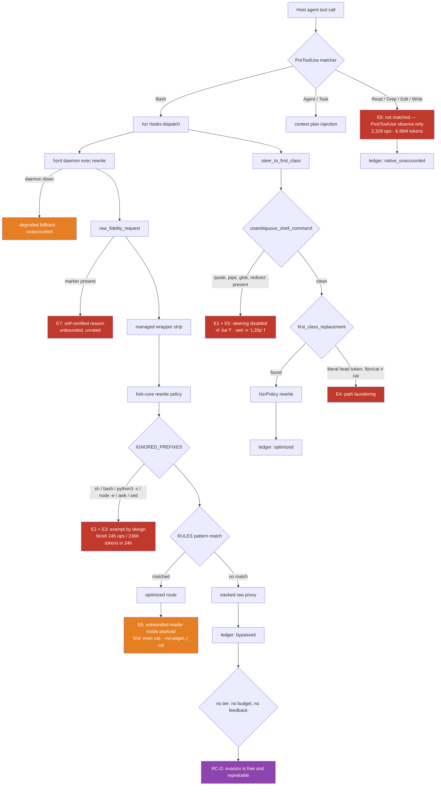

# HZR Anti-Evasion Enforcement — Product Requirements Document

Status: Implemented for HZR 0.4.4; seven-day operational SLO observation pending
Owner: HZR control plane
Date: 2026-08-21
Probed version: HZR 0.4.3 (fork-core rtk 0.44.1-fork.1)
Supersedes nothing; extends `docs/PRD_HZR_TOKEN_ECONOMY_UTILIZATION.md` and the
`docs/review/20260821_*_High-Critical.md` audits with the evasion dimension they do not cover.

All token figures are `estimated_utf8_bytes_div_4_v1` estimates from the HZR ledger. They are
not provider billing and this document makes no economic savings claim.

Implementation note: sections 1–3 and the probe table preserve the measured 0.4.3 baseline.
HZR 0.4.4 implements the technical workstreams and grows the executable matrix to 85 cases.
The sustained seven-day targets in section 9 cannot be asserted at release time; they remain a
post-release observation gate over rows carrying the new producer and accounting-policy versions.

---

## 1. Executive result

HZR's routing is good and its enforcement is absent. Every measured escape from the control
plane in the last seven days used a construct that is semantically identical to a command HZR
already optimizes, and differed from it only by a quote, a shell wrapper, an absolute path, or
an interpreter around it.

The three facts that define this PRD:

1. **A quote is currently a bypass token.** `sed -n 10,20p README.md` is rewritten to
   `hzr read README.md --from 10 --to 20`. Adding the quotes an agent would naturally write —
   `sed -n '10,20p' README.md` — routes to raw proxy. Same for `nl -ba 'README.md'`. The
   deciding predicate is `unambiguous_shell_command` at
   [crates/hzr-core/src/operation.rs:428](crates/hzr-core/src/operation.rs:428), which rejects any
   command containing `'`, `"`, `|`, `$`, `*`, `>` and fourteen other characters.
2. **The evasion vectors are on the allow-list.** `IGNORED_PREFIXES` at
   [fork-core/rtk/src/discover/rules.rs:1032](fork-core/rtk/src/discover/rules.rs:1032) explicitly
   exempts `sed `, `awk `, `cut `, `python3 -c`, `python -c`, `node -e`, `ruby -e`, `bash `,
   `sh `, `for `, `while `, `if `, `case `. Wrapping a covered command in any of them removes it
   from policy's view by design.
3. **Nothing happens when an agent bypasses.** `steer_to_first_class` at
   [crates/hzr-cli/src/hook_runner.rs:158](crates/hzr-cli/src/hook_runner.rs:158) either rewrites
   or allows. There is no denial for avoidable bypass, no session state, no budget, and no
   feedback to the agent. An agent that escapes learns that escaping works and pays nothing.

Result: 50.3% of tokens delivered to the model in the last seven days received zero filtering,
and the largest single bypass family in the last twenty-four hours is `/bin/sh -c` wrapping
commands HZR already handles.

The goal of this PRD is a control plane where **the cheapest path for an agent is the compliant
path**, evasion constructs are normalized away before policy runs, the residual deliberate
evasion is denied with its replacement attached, and the one legitimate escape hatch is bounded
and audited.

---

## 2. Measured situation

### 2.1 Ledger, three windows

| Scope | Operations | Baseline | Delivered | Reduction | Bypass ops | Bypass tokens |
|---|---:|---:|---:|---:|---:|---:|
| Global lifetime | 54,118 | 225.17M | 59.10M | 73.8% | 13,006 / 56,815 (22.9%) | 28.23M / 65.99M (42.8%) |
| Global 7 days | 10,239 | 18.26M | 12.61M | 30.9% | 1,768 / 10,569 (16.7%) | 6.37M / 12.66M (50.3%) |
| Global 24 hours | 4,997 | 5.78M | 2.81M | 51.4% | 691 / 5,318 (13.0%) | 649K / 2.85M (22.8%) |
| `anonymous_bot` lifetime | 23,443 | 41.36M | 30.20M | 27.0% | 4,223 / 23,663 (17.8%) | 13.55M / 34.89M (38.8%) |

Two readings matter more than the headline:

- **Bypass is a token problem, not an operation problem.** 16.7% of recent operations carry
  50.3% of delivered tokens. Bypassed operations are systematically the large ones, because an
  agent reaches for raw precisely when it wants everything.
- **The lifetime 73.8% reduction is not the current rate.** Because a bypassed operation
  delivers exactly what it consumed, it cancels out of the ratio instead of lowering it. The
  headline improves as bypass grows. Every gate in this PRD is therefore stated against
  *delivered tokens*, never against the reduction ratio.

### 2.2 Recent bypass families

Seven-day window, `hzr stats --json --since 7d`:

| Family | Ops | Delivered | Class | Recorded example |
|---|---:|---:|---|---|
| `bun` | 289 | 3,254,033 | E10 → now covered | `bun test` |
| `nl` | 54 | 1,776,028 | E1 | `nl -ba web/app/src/features/mix/mix-runtime.ts` |
| `binsh` | 327 | 284,553 | **E2** | `/bin/sh -c git blame --line-porcelain scripts/…` |
| `git` | 341 | 271,817 | E6/E10 | `git diff -U0 -- . :!docs/PRD-…` |
| `ssh` | 244 | 225,355 | E10 | `ssh asprogis docker exec … psql -At` |
| `rg` | 124 | 217,447 | E1 | `rg -n 'api/v1/deploy\|application/47\|…'` |
| `gh` | 19 | 140,378 | E10 | `gh run view … --log-failed` |
| `/usr/bin/sqlite3` | 37 | 56,562 | **E4 + E9** | `/usr/bin/sqlite3 -readonly -csv …/ledger/hzr.sqlite` |
| `zsh` | 39 | 43,014 | **E2 + E5** | `zsh -lc bun test src/mix-*.test.ts …` |
| `sed` | 37 | 39,576 | E1 | `sed -n 3860,4065p web/app/src/…/mix-runtime.ts` |
| `sh` | 35 | 8,218 | **E5** | `sh -lc 'bun test > /tmp/out.log 2>&1; tail -n 80 /tmp/out.log'` |
| `python3` | 14 | 2,548 | E3 | `python3 scripts/transcribe-telegram-voices.py …` |

In the twenty-four-hour window `binsh` is the **largest** bypass family at 245 operations and
235,853 delivered tokens — 35% of all bypass operations. Shell-wrapper laundering is not a
theoretical hole; it is currently the dominant one.

Three entries deserve to be read as intent rather than accident:

- `sh -lc 'bun test > /tmp/out.log 2>&1; tail -n 80 /tmp/out.log'` — output is deliberately
  routed through the filesystem so no filter can see it, then re-read at a chosen size. This is
  a constructed workaround, not an idiom.
- `/usr/bin/sqlite3 -readonly -csv …/ledger/hzr.sqlite` — HZR's own ledger read directly by
  absolute path, bypassing the bounded `hzr stats` view of the same data.
- `/bin/sh -c hzr rtk -- raw rg -n "…"` (1,439 lifetime operations, 927,667 tokens) — a shell
  wrapper around an explicit raw wrapper around a command with a first-class route. Three layers,
  each one defeating a different check.

### 2.3 Native-tool escape

| Channel | Operations | Delivered |
|---|---:|---:|
| `hook_cli` | 54,483 | measured, filtered |
| `mcp` | 3 | measured, filtered |
| `native_host` | 2,329 | 6.86M, `native_unaccounted` |

The `PreToolUse` matcher is `Bash|Agent|Task`. Host `Read`/`Grep`/`Glob`/`Edit`/`Write` are
matched only by `PostToolUse` observation, so nothing redirects them and 6.86M lifetime tokens
entered the model with no filtering and no savings credit. The managed contract asks agents not
to use them; 2,329 operations say the request is not sufficient.

### 2.4 Live policy probe, HZR 0.4.3

Reproduce with `hzr exec rewrite '<command>'`. This is the decisive evidence: the ledger records
what agents did under older policy, the probe records what current policy does.

Correctly optimized:

| Command | Effective route |
|---|---|
| `cat README.md` | `rtk read README.md` |
| `head -200 README.md` | `rtk read README.md --max-lines 200` |
| `tail -50 README.md` | `rtk read README.md --tail-lines 50` |
| `sed -n 10,20p README.md` | `hzr rtk -- read README.md --from 10 --to 20` |
| `nl -ba README.md` | `hzr rtk -- read README.md -n` |
| `env FOO=1 cat README.md` | `env FOO=1 rtk read README.md` |
| `command cat README.md` | `command rtk read README.md` |
| `rg -n TODO .` / `grep -rn TODO .` | `rtk rg` / `rtk grep` |
| `bun test` / `bun run build` | `rtk bun …` |
| `cargo test --workspace` | `rtk cargo test --workspace` |
| `ssh host docker logs foo` | `rtk ssh …` |
| `gh run view … --log-failed` | `rtk gh …` |
| `jq -r '.[]' /tmp/x.json` | `rtk jq …` |
| `ps -axo pid,ppid,command` | `rtk ps …` |
| `wget -qO- …` / `curl -fsS …` | `rtk wget` / `rtk curl` |
| `hzr rtk -- raw rg -n TODO` | `rtk rg -n TODO` (wrapper stripped) |
| `hzr read README.md --level none` | `hzr rtk -- read README.md` (bound restored) |

Still escaping to raw proxy:

| Command | Class | Effective route |
|---|---|---|
| `nl -ba 'README.md'` | E1 | `rtk proxy /bin/sh -c 'nl -ba …'` |
| `sed -n '10,20p' README.md` | E1 | `rtk proxy /bin/sh -c 'sed -n …'` |
| `cat README.md \| head -50` | E5 | `rtk proxy /bin/sh -c 'cat … \| head -50'` |
| `/bin/sh -c 'git blame README.md'` | E2 | `rtk proxy /bin/sh -c '/bin/sh -c …'` |
| `sh -lc 'cat README.md'` | E2 | `rtk proxy /bin/sh -c 'sh -lc …'` |
| `bash -c 'nl -ba README.md'` | E2 | `rtk proxy /bin/sh -c 'bash -c …'` |
| `zsh -lc 'sed -n 1,50p README.md'` | E2 | `rtk proxy /bin/sh -c 'zsh -lc …'` |
| `python3 -c 'print(open("README.md").read())'` | E3 | `rtk proxy /bin/sh -c 'python3 -c …'` |
| `node -e 'console.log(readFileSync("README.md","utf8"))'` | E3 | `rtk proxy /bin/sh -c 'node -e …'` |
| `perl -ne 'print' README.md` | E3 | `rtk proxy /bin/sh -c 'perl -ne …'` |
| `awk '{print}' README.md` | E3 | `rtk proxy /bin/sh -c 'awk …'` |
| `/bin/cat README.md` | E4 | `rtk proxy /bin/sh -c '/bin/cat …'` |
| `sqlite3 /tmp/x.db 'select 1'` | E10 | `rtk proxy …` |
| `/usr/bin/sqlite3 -readonly -json …` | E4 + E10 | `rtk proxy …` |
| `git blame README.md` | E10 | `rtk proxy /bin/sh -c 'git blame …'` |
| `tar cf - README.md` | E10 | `rtk proxy …` |
| `xargs -a /dev/null cat README.md` | E5 | `rtk proxy …` |
| `sh -lc 'bun test > /tmp/o.log 2>&1; tail -n 80 /tmp/o.log'` | E5 | `rtk proxy …` |
| `HZR_RAW_FIDELITY=1 HZR_RAW_FIDELITY_REASON=verbatim_source hzr rtk -- raw cat README.md` | **E7** | `rtk proxy …` — accepted on the agent's own word |

Leaking inside an optimized route:

| Command | Class | Problem |
|---|---|---|
| `find . -name '*.rs' -exec cat {} +` | **E6** | Routes to `rtk find … -exec cat {} +`. The route is optimized; the payload dumps every matched file unfiltered. |

The pattern across the whole matrix: **HZR recognizes commands, not intents.** Every failing row
is a recognized command wearing a costume.

### 2.5 Workspace contract correlation

| Workspace | Managed project contract | Reduction | Unfiltered token share |
|---|---|---:|---:|
| `hzr` | `AGENTS.md` + `HZR.md` present | 73.8% lifetime | 42.8% |
| `anonymous_bot` | **none** — no `CLAUDE.md`, no `AGENTS.md` | 27.0% | 38.8% |

`anonymous_bot` runs on the user-global instruction file alone. It is the project where agents do
the most work, and it is the project where HZR has the least presence. `hzr enable` registers the
workspace for the daemon and the ledger but installs no project-level contract, so the routing
table an agent needs most is the one furthest from the code it is editing.

---

## 3. Root causes

| ID | Root cause | Location | Consequence |
|---|---|---|---|
| RC-A | `unambiguous_shell_command` rejects any command containing a quote, glob, pipe, redirect, brace, or substitution character, and `first_class_replacement` returns `None` for all of them | [operation.rs:428](crates/hzr-core/src/operation.rs:428) | A quote disables steering. E1, E5. |
| RC-B | `IGNORED_PREFIXES` allow-lists the exact laundering vectors: `sed `, `awk `, `cut `, `python3 -c`, `node -e`, `ruby -e`, `bash `, `sh `, `for `, `while `, `if `, `case ` | [rules.rs:1032](fork-core/rtk/src/discover/rules.rs:1032) | Wrapping a covered command in a shell or interpreter removes it from policy by design. E2, E3. |
| RC-C | No normalization pass. Operation identity is the literal head token, so `/bin/cat`, `sh -c cat`, and `cat` are three different families | `operation_identity`, `classify_operation` | Any spelling change is a new, uncovered family. E2, E3, E4. |
| RC-D | No consequence for avoidable bypass. The decision set is rewrite-or-allow; there is no session state, budget, or agent-visible feedback | [hook_runner.rs:158](crates/hzr-cli/src/hook_runner.rs:158) | Evasion is free and repeatable. Agents do not learn within a session. |
| RC-E | `PreToolUse` matcher is `Bash\|Agent\|Task`; native file tools are observed after the fact only | installed hook settings, `observe_input` | 2,329 operations / 6.86M tokens unfiltered and uncredited. E8. |
| RC-F | The fidelity hatch is self-certified: any of six reason strings is accepted with no evidence, no rate limit, and no output verification | `raw_fidelity_request` | One env prefix converts any read into an authorized full dump. E7. |
| RC-G | Agent attribution is the constant `"claude"` | [hook_runner.rs:94](crates/hzr-cli/src/hook_runner.rs:94) | Subagents cannot be scored, so no per-agent enforcement or accountability is possible. |
| RC-H | `hzr enable` / `hzr init` install no project-level managed contract | activation path | The workspace with the most traffic has the least guidance. |
| RC-I | Replacement availability is reported inconsistently: `by_family.first_class_replacement_available: true` for `bun` while `by_tool.replacement: null` for the same family | stats aggregation | Diagnostics contradict themselves, so neither agents nor humans can act on them. |
| RC-J | `hzr stats --json --all` is unbounded: 6.04 MB in this repository | stats output | The diagnostic for context waste is itself a context bomb, and pushes auditors to raw SQLite. E9. |

RC-A through RC-C are one cause seen from three angles: **policy matches surface syntax, and
surface syntax is exactly what an agent varies for free.**

---

## 4. Product goal and non-goals

### 4.1 Goal

An agent that wants unfiltered output must either use a route that HZR filters, or make an
explicit, bounded, audited fidelity request that a human can review. No syntactic disguise —
quote, wrapper, interpreter, path, pipeline, or nested argument — changes the decision.

Stated as the invariant the acceptance matrix tests:

> Two commands with the same observable effect receive the same HZR decision, regardless of
> spelling.

### 4.2 Non-goals

- **Removing the escape hatch.** Binary output, checksums, machine protocols, complete logs, and
  verbatim source genuinely require exact bytes. The hatch is bounded and audited, not removed.
- **Denying commands with no equivalent.** `bun`, `ssh`, `cargo`, `gh`, and `sqlite3` payloads
  that no route can reproduce stay raw. Punishing a genuine gap teaches agents that HZR is an
  obstacle, and that lesson generalizes to the routes that do work.
- **Changing observable behavior to win the ratio.** No route may alter content, order,
  completeness, exit status, shell grammar, or side effects.
- **Rewriting history.** Historical ledger rows are evidence. Nothing in this PRD reclassifies or
  deletes them to manufacture compliance.
- **Claiming provider savings.** Estimates stay estimates until receipts exist.

---

## 5. The enforcement ladder

Enforcement is graduated, and the tier is a property of the *evidence*, not of the agent's mood.

| Tier | Trigger | Action | Agent cost |
|---|---|---|---|
| **T0 — Transparent rewrite** | Proven equivalent, no evasion construct present | Silent rewrite, as today | none |
| **T1 — Named correction** | Proven equivalent reached through a normalized evasion construct (E1–E4) | Rewrite, and state in `permissionDecisionReason`: the class, the recovered command, and the running session bypass count | none |
| **T2 — Deny with prescription** | Proven equivalent, and the construct is a deliberate evasion of a covered family after normalization already offered T1 in this session | `deny`, with the exact ready-to-run replacement in the reason | one turn |
| **T3 — Budget exhaustion** | Session avoidable-bypass budget exceeded (both a token and a count threshold) | All avoidable bypass denied for the remainder of the session; E10 unaffected | one turn per attempt |
| **T4 — Hatch quarantine** | Fidelity marker used beyond the session allowance, or with a reason contradicted by the produced output | `ask`, escalating to `deny`; every use recorded with its reason for audit | human decision |

Design constraints on the ladder, in priority order:

1. **Normalization before escalation.** A command must be unwrapped, path-resolved, `env`-stripped,
   unquoted, and pipeline-split *before* any tier is chosen. Most of today's holes close at T0/T1
   and never reach a denial. Punishment that could have been a rewrite is a defect in the
   normalizer, not a win.
2. **A denial always carries its replacement.** A refusal without a ready-to-run alternative
   produces a retry loop, and a retry loop costs more tokens than the bypass it prevented.
3. **T2 requires proven equivalence.** Content, order, completeness, exit status, and side effects
   preserved. Where equivalence cannot be proven, the case is E10 and the tier is T0.
4. **T3 is per session, never persistent.** A budget that carries across sessions punishes the next
   task for the last one's mistakes and cannot be reasoned about by the agent that pays it.
5. **Every denial is appealable in one move.** `HZR_RAW_FIDELITY=1` with a valid reason remains
   available at T4, so a genuine need is never permanently blocked — only recorded.

---

## 6. Workstreams

### W1 — Command normalization (P0)

The single highest-value change. One shared normalizer, in `hzr-core`, applied before any
classification or policy decision, in the hook, the daemon, and fork-core alike.

Requirements:

1. **Unwrap shell wrappers.** `sh -c`, `sh -lc`, `bash -c`, `bash -lc`, `zsh -c`, `zsh -lc`,
   `/bin/sh -c`, and `env … <shell> -c` yield their inner command for classification. Recurse to a
   fixed depth (3) and record the nesting depth as an evasion signal.
2. **Resolve program identity to a basename** after verifying it resolves to the same executable
   the bare name would resolve to. `/bin/cat` classifies as `cat`; a project-local
   `./scripts/cat` does not.
3. **Strip leading assignments and prefixes** — `env VAR=…`, `command`, `exec`, `nice`, `stdbuf`,
   `time` — recording each as a signal. (`env` and `command` already work; the rule must be
   general and shared rather than per-case.)
4. **Unquote arguments through a real lexer.** Reuse `shell_split` from
   [fork-core/rtk/src/discover/lexer.rs](fork-core/rtk/src/discover/lexer.rs) rather than
   `split_whitespace` + `trim_matches`. `unambiguous_shell_command` must fall back to a
   *structural* judgement — is this a single simple command with no substitution or redirect —
   instead of a character blacklist that a quote defeats.
5. **Split pipelines and lists into stages** and decide per stage. `cat f | head -50` becomes
   `hzr read f --max-lines 50`; a stage that cannot be routed keeps its own tracked fallback
   without exempting the rest of the pipeline.
6. **Detect the redirect-then-read pattern** (`… > file 2>&1; tail -n N file`) and route the
   producing stage through its filter.

Acceptance: every E1, E2, E4, and E5 row in §2.4 resolves to the same decision as its bare
equivalent. Normalization is classification-only — the executed command is still the agent's, so
grammar and side effects are untouched.

### W2 — Evasion classification in core (P0)

`classify_operation` returns an `EvasionClass` alongside route and subsystem: the taxonomy
E1–E10, plus the signals normalization collected (wrapper depth, interpreter kind, path form,
stage count, hatch marker). Stored on the operation, surfaced in `hzr stats`, and used to pick
the enforcement tier.

Requirements:

1. One authority. The hook, the daemon, fork-core, the dashboard, and the SQL predicate all read
   the same classifier. Three copies of one rule is how the current drift happened.
2. Privacy preserved. Class and signal counts only — no arguments, paths, queries, content, or
   secrets, matching the existing family-view guarantee.
3. `hzr stats` gains an evasion view: class × operations × delivered tokens × avoidable, bounded
   by default and time-windowable.

### W3 — Interpreter interception (P0)

Remove `python3 -c`, `python -c`, `node -e`, `ruby -e`, `perl -e/-ne/-pe`, `awk`, and `sed`
program forms from `IGNORED_PREFIXES` and classify them.

Requirements:

1. **Recognize the read/search idioms** statically: `open(...).read()`, `readFileSync`,
   `Path.read_text`, `File.read`, `perl -ne 'print'`, `awk '{print}'`, `cat`-equivalent argument
   patterns. Route to `hzr read` / `hzr search` with the same bounds.
2. **Do not attempt to interpret arbitrary programs.** An interpreter snippet that is not a
   recognized read/search idiom stays a tracked fallback at T0. A wrong equivalence claim here is
   far worse than the bypass it replaces.
3. **Never route a script *file* invocation** (`python3 scripts/foo.py`) as a read. It is real
   work, not evasion, and 14 of the 264 lifetime `python3` operations are exactly that.

### W4 — Native tool enforcement (P0)

Extend the `PreToolUse` matcher to `Read|Grep|Glob|Edit|Write` with three configurable modes:

| Mode | Behavior | Default for |
|---|---|---|
| `observe` | today's PostToolUse measurement only | never (retained for opt-out) |
| `steer` | `deny` with the exact `hzr` equivalent in the reason; `Glob` always allowed | new installations |
| `strict` | `steer`, plus `Edit`/`Write` denied in favor of `hzr write` | workspaces that opt in |

Requirements:

1. Fail-open. A hook error, timeout, or missing daemon must never break a host tool call.
2. `Glob` has no HZR equivalent and is always allowed, as the managed contract already states.
3. The deny reason carries the concrete replacement — `Read(file_path=X)` → `hzr read X`,
   `Grep(pattern=P, path=Q)` → `hzr search 'P' --path Q --mode exact` — so a compliant retry
   costs exactly one turn.
4. `native_unaccounted` operations reach zero in `steer` mode. That is the gate.

### W5 — Fidelity hatch quarantine (P0)

Requirements:

1. **Reason must fit the request.** `checksum` requires a checksum-shaped invocation;
   `machine_protocol` requires a machine-readable output flag; `binary` requires a
   binary-detected target. A reason contradicted by the command is `InvalidReason`.
2. **Bounded per session.** A default allowance (proposed: 5 operations or 100K delivered tokens,
   whichever comes first), after which further hatch use is `ask`.
3. **Always recorded.** Reason, class, and delivered tokens on every hatch operation, surfaced in
   `hzr stats` and `hzr doctor`. A hatch that cannot be audited is a bypass with paperwork.
4. **Never a shortcut past a proven equivalent.** The existing check that re-runs
   `first_class_replacement` before honoring the marker is correct and must extend to normalized
   commands.

### W6 — Nested-argument leak closure (P1)

An optimized route must not carry an unbounded reader in its payload.

Requirements:

1. Detect and reroute `find … -exec cat|nl|head|tail {} …`, `xargs cat`, `git --no-pager`,
   `… | cat`, and `tar cf - <paths>` used as a multi-file dump.
2. `find -exec` over N files becomes an `hzr read` per file or a bounded batch read, preserving
   ordering.
3. Where rerouting cannot preserve semantics, classify as E6 and count it as avoidable bypass so
   it is visible, rather than hiding inside an "optimized" row.

### W7 — Genuine gaps: new first-class routes (P1)

Each item is justified by measured tokens, not by symmetry.

| Route | Evidence | Requirement |
|---|---|---|
| `hzr test` | `bun` 3.25M/7d, `cargo` 1.39M lifetime | One typed alias over the existing `bun`/`cargo`/`npm`/`pnpm` test families, with failure-first output |
| `sqlite3` family | 37 + 12 ops, 58.7K/7d | Bounded query output with row caps and column projection |
| `git blame` | proxies today despite `blame` being in the git rule pattern | Complete the route or state the omission in the rule |
| `tar -t` / `tar -tzf` | 1.07M lifetime | Bounded archive listing |
| `hzr logs` | `ssh … docker logs` 1.29M lifetime | Bounded remote-log tail as a typed route |
| `ps` | 2.61M lifetime, currently raw despite being marked replaceable | Resolve the contradiction in RC-I and route it |

### W8 — Attribution and closed-loop feedback (P0)

Enforcement without feedback does not change behavior. An agent that is silently rewritten
learns nothing, which is why the same constructs recur across 54,000 operations.

Requirements:

1. **Real agent identity.** Replace the hardcoded `"claude"` at
   [hook_runner.rs:94](crates/hzr-cli/src/hook_runner.rs:94) with the host-supplied agent and
   subagent identity, so per-agent utilization is measurable and the worst offender is nameable.
2. **Session scorecard.** A `Stop` / `SubagentStop` hook emits a compact scorecard: operations,
   delivered tokens, avoidable bypass share, top evasion class, tokens recoverable. Bounded to a
   few lines — a scorecard that costs context to read defeats itself.
3. **In-session nudge.** When avoidable bypass share crosses a threshold, `UserPromptSubmit`
   injects one line naming the class and the cheaper route. One line, once per threshold
   crossing, not per operation.
4. **T1 reasons carry the running count**, so escalation to T2 is predictable rather than
   surprising.

### W9 — Per-workspace contract installation (P0)

Requirements:

1. `hzr enable` / `hzr init --if-needed` write a managed, delimited HZR region into the
   workspace's own `CLAUDE.md` / `AGENTS.md`, creating the file when absent, with the same
   marker-based idempotent update and drift detection `hzr doctor` already performs for the
   global files.
2. The project region is a routing table and a pointer, not a copy of `HZR.md`.
3. `hzr doctor` reports enabled workspaces that carry no managed project region as a WARN with
   the one-command fix.
4. Never modify a user's non-managed content outside the markers.

### W10 — Bounded diagnostics (P1)

Requirements:

1. `hzr stats --json --all` without `--since` or `--workspace` is refused with the bounded
   alternative named. 6.04 MB of diagnostics is not a diagnostic.
2. Resolve RC-I: `by_family.first_class_replacement_available` and `by_tool.replacement` derive
   from one classifier call, so they cannot disagree.
3. Add `hzr stats --evasion` as the sanctioned answer to "how are agents escaping", so no auditor
   needs to reach for SQLite (E9).

### W11 — Acceptance matrix as an executable gate (P0)

The probe matrix in §2.4 becomes a committed fixture and a release gate.

Requirements:

1. Every row is a test case: command, expected decision, expected route class. 41 cases at
   authoring, growing with each finding.
2. The gate runs against the hook path, the daemon path, and the degraded fallback path. A hole
   that closes in one path and not the others is not closed.
3. Release fails when any covered-family case resolves to raw proxy without an audited E10
   justification.
4. Each proposed denial ships with its regression case: the legitimate command that must keep
   working.

---

## 7. Command path and where each hole escapes

---

## 8. Delivery sequence

### Phase 1 — Make the disguise stop working (W1, W2, W11)

Normalization and classification first, with the acceptance matrix landing alongside so progress
is measurable per case. No new denials in this phase: most E1/E2/E4/E5 traffic simply becomes
optimized, and the residual becomes visible and counted. Shipping enforcement before
normalization would deny commands that should have been rewritten.

Exit: all E1, E2, E4, E5 probe cases optimized. Avoidable bypass tokens below 15% of delivered
in a seven-day window.

### Phase 2 — Close the uncovered channels (W3, W4, W5, W9)

Interpreter interception, native-tool steering, hatch quarantine, per-workspace contracts. These
are the channels that carry the most unmeasured traffic, and each is independently shippable.

Exit: `native_unaccounted` at zero in `steer` mode. Hatch operations under 0.5% of operations,
each with a validated reason. Every enabled workspace carrying a managed project region.

### Phase 3 — Consequence and feedback (W8, ladder T1–T4)

Attribution, scorecard, in-session nudge, then the tiers. Feedback ships before denial: an agent
that has been told what the cheaper route is has no excuse, and an agent that has not been told
has one.

Exit: avoidable bypass tokens below 2% of delivered. T2 denial rate falling week over week —
a *rising* denial rate means normalization is incomplete or an equivalence claim is wrong, and is
a stop-ship signal rather than a success metric.

### Phase 4 — Close the genuine gaps (W6, W7, W10)

Nested-argument leaks, new routes ranked by measured tokens, bounded diagnostics.

Exit: no single E10 family above 5% of delivered tokens in a seven-day window.

---

## 9. Success metrics

Primary, measured over a seven-day window per workspace:

| Metric | Baseline (7d, 2026-08-21) | Target |
|---|---:|---:|
| Avoidable bypass share of delivered tokens | 50.3% (all bypass) | ≤ 2% |
| `native_unaccounted` operations | 2,329 lifetime | 0 in `steer` mode |
| Probe matrix pass rate | 21 / 41 (51%) | 100% |
| Fidelity-hatch share of operations | unmeasured | ≤ 0.5%, every use with a validated reason |
| Workspaces below 60% reduction | 1 of 2 (`anonymous_bot`, 27.0%) | 0 |

Guardrails — a regression in any of these blocks the release regardless of the primary metrics:

| Guardrail | Requirement |
|---|---|
| Correctness | Zero cases of altered content, order, completeness, exit status, or side effects |
| Retry cost | Denials do not increase total delivered tokens; a denial that triggers two retries is a net loss |
| Fail-open | Hook or daemon failure never breaks a tool call |
| Privacy | No arguments, paths, queries, content, or secrets in classification or stats |
| Accounting honesty | Bypass stays in its own bucket; nothing is folded into `execution` to improve a ratio |
| Escape availability | A genuine fidelity need is always reachable in one appeal |

---

## 10. Risks

| Risk | Severity | Mitigation |
|---|---|---|
| A false equivalence claim silently corrupts an agent's evidence | **Critical** | T2 requires proven equivalence; every denial ships with a regression case; interpreter snippets that are not recognized idioms are never rerouted |
| Denials produce retry loops that cost more than the bypass | High | Every denial carries a ready-to-run replacement; retry cost is a release guardrail measured, not assumed |
| Agents learn that HZR is an obstacle and route around it more creatively | High | Never punish E10; keep the appeal one move away; normalize rather than deny wherever possible |
| Normalization misreads a wrapper and classifies the wrong command | High | Structural lexer, bounded recursion depth, fail to T0 on any ambiguity, acceptance matrix per construct |
| Native-tool denial breaks host workflows that have no HZR equivalent | Medium | `Glob` always allowed; `steer` before `strict`; `observe` retained as opt-out |
| Session budgets punish long legitimate sessions | Medium | Budget counts only *avoidable* bypass; E10 never consumes it; per-session, never persistent |
| Enforcement state becomes a fourth copy of policy | Medium | One classifier in `hzr-core`; hook, daemon, fork-core, and stats all consume it |

---

## 11. Resolved decisions

1. **Default native-tool mode for existing installations.** New installs use `steer`; legacy
   upgrades remain in `observe`, and `hzr doctor` emits a named warning until the user changes it.
2. **T3 budget values.** Broad avoidable-bypass punishment remains shadow-only until a complete
   measurement window exists. The narrower fidelity hatch is enforced at five operations or
   100,000 estimated tokens per session, with a pre-execution Ask when static size exceeds the
   remaining allowance.
3. **Whether `strict` mode denies `Edit`.** `hzr write patch` is equivalent for well-formed
   edits, but native `Edit` currently shows zero output tokens; the gain is accounting
   completeness rather than token reduction. `Edit` remains allowed and typed in `steer`, and is
   denied only in explicitly selected `strict` mode.
4. **Interpreter idiom recognition depth.** How far to go before declaring a snippet unroutable.
   The implementation uses bounded exact-pattern recognition from the canonical fork lexer; it
   does not execute or generally interpret embedded Python, Node, Ruby, or shell programs.

---

## 12. Definition of done

- [x] One canonical fork-core lexer/classifier produces a typed rewrite plan consumed by the
  adapter, hook and daemon; stats consumes the resulting closed attribution rather than parsing
  commands or human output.
- [x] The §2.4 probe matrix is committed as an executable 85-case fixture and release gate,
  including hook, daemon and degraded-path cases.
- [x] Shell/interpreter forms no longer receive a blanket ignore exemption; supported forms are
  normalized, ambiguous forms Ask, and genuine no-equivalent computation is typed E10.
- [x] Native file tools are matched by `PreToolUse` with `observe` / `steer` / `strict`, fail open,
  and keep `native_unaccounted` at zero in `steer` without claiming savings for allowed E10 work.
- [x] The fidelity hatch is bounded per session, its closed reason is validated against the
  command, and executions plus denied policy attempts are audited separately.
- [x] Agent/subagent identity is retained only as a keyed pseudonym, with a bounded session
  scorecard and a one-shot in-session nudge.
- [x] New and refreshed workspaces receive managed project regions, with drift reported by
  `hzr doctor`.
- [x] `hzr stats --evasion` is bounded by default; unbounded JSON `--all` is refused with the
  required scope named.
- [ ] Avoidable bypass below 2% of delivered tokens, and no workspace below 60% reduction,
  sustained across one full post-0.4.4 seven-day window.
- [x] `CHANGELOG.md` and the managed contracts state the same normalization-first enforcement and
  closed fidelity rules as this document.
