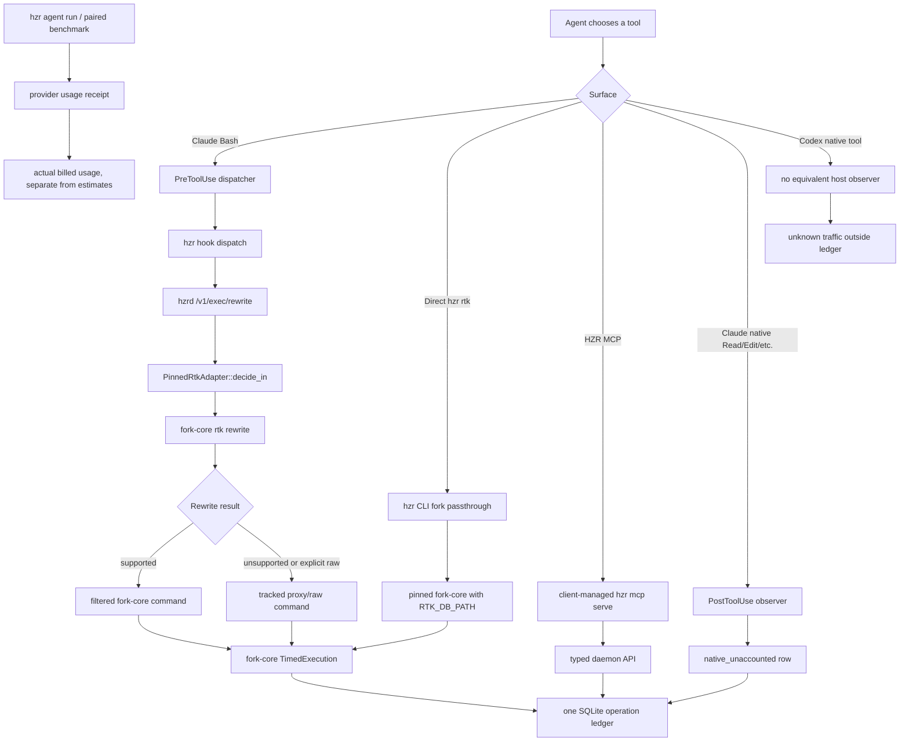

# HZR Token Economy and Agent Utilization — Product Requirements Document

**Status:** accepted; Phase A accounting integrity ships in HZR 0.4.0, provider-economy proof pending

**Date:** 2026-08-09

**Evidence scope:** cumulative HZR ledger history for
`/Users/andrew/Programming/hzr` and `/Users/andrew/Programming/anonymous_bot`,
current HZR 0.3.9 code, installed agent contracts, and current MCP/doctor state

**Product scope:** agent routing, fork-core read/write accounting, operation attribution,
`hzr stats`, instruction generation, native-tool observation, MCP adoption, and
provider-billed evaluation

**0.4.0 implementation boundary:** write counterfactual credit is removed for new and historical
rows; changed-read accounting uses a real never-worse baseline; default stats are bounded and
redacted with explicit `--all` recovery; MCP rows carry typed attribution; completeness is scoped
to observed channels. Automatic routing, client-specific contract compilation, batch-write
adoption, and paired provider benchmarks remain follow-up work and are not claimed complete.

## 1. Executive result

HZR is reducing local tool output, but the current evidence does not establish token-cost
savings. The two audited repositories have no provider-billed task receipts, so
`economic_claim_ready=false` in both. The product currently proves only an estimated reduction
in selected tool output.

The original suspicion is partly correct:

- Current attributed Codex and Claude Code sessions use many raw/proxy routes and mostly use
  plain `read`; outline/symbol modes are a small minority.
- Current attributed sessions almost never use `hzr rtk -- write`, and no current attributed
  session uses `write batch` in the audited rows.
- However, `anonymous_bot` already contains 3,120 optimized write rows and attributes 30.07M
  avoided tokens to them. Almost all of those rows are historical and unattributed. Therefore,
  "use write more" would improve the dashboard without proving economic benefit.
- The write baseline is not an observed native-tool counterfactual: fork-core counts the entire
  file content as what native Edit "would show". Removing this unvalidated write counterfactual
  from the `anonymous_bot` local estimate reduces its apparent output reduction from 68.9% to
  approximately 31.2%.
- `read --changed` has the opposite accounting defect. It records a short marker such as
  `[file:N bytes]` as its baseline and compares that marker with the full rendered diff. The
  audited histories therefore contain 214,050 tokens of artificial `read --changed` regression.
- `hzr stats --json` emits the complete `by_command` history, including long command payloads.
  During this audit it produced tens of thousands of output tokens and was truncated by the
  host. The observability command can itself become one of the largest avoidable context costs.

The product objective must therefore be provider-billed economy with preserved task quality,
not maximum local savings percentage and not maximum use of any one HZR verb.

## 2. How agent calls reach HZR today



Confirmed implementation points:

- `crates/hzr-cli/src/adoption.rs` installs `PreToolUse` for `Bash|Agent|Task` and
  `PostToolUse` for `Read|Grep|Glob|Edit|Write` on the supported Claude surface.
- `crates/hzr-cli/src/hook_runner.rs` sends shell commands to the daemon and records supported
  native responses as `native_unaccounted`.
- `crates/hzr-daemon/src/api.rs::exec_rewrite` delegates to
  `PinnedRtkAdapter::decide_in`.
- `crates/hzr-exec/src/adapter.rs` invokes the pinned fork-core and points
  `RTK_DB_PATH` at the canonical HZR ledger.
- `crates/hzr-cli/src/fork.rs` makes `hzr rtk -- ...` a direct managed fork-core invocation.
- `fork-core/rtk/src/tracking.rs` infers Codex from `CODEX_THREAD_ID`, Claude Code from
  `CLAUDE_SESSION_ID` or `CLAUDECODE`, and stores `agent` plus `session_id` when those values
  survive the process boundary.
- Provider usage remains empty unless an execution path returns an actual provider receipt.

## 3. Audit snapshot

The ledger is append-only and the audit itself generated HZR calls. Figures below are the
snapshot observed on 2026-08-09 before or during the audit; small increases after this timestamp
are audit traffic, not a product trend.

### 3.1 Workspace-level result

| Metric | `hzr` | `anonymous_bot` |
|---|---:|---:|
| Estimated baseline tool-output tokens | 18.15M | 54.91M |
| Estimated delivered tool-output tokens | 13.33M | 17.09M |
| Estimated net avoided tool-output tokens | 4.81M | 37.83M |
| Displayed local reduction | 26.5% | 68.9% |
| Bypass operations | 5.8K of 9.7K (60.1%) | 2,381 of 15,714 (15.2%) |
| Bypass delivered tokens | 9.68M of 13.33M (72.6%) | 5.77M of 21.01M observed (27.5%) |
| Native host operations observed | 0 | 163 |
| Native host delivered estimate | 0 | 3.92M |
| MCP operations | 0 | 0 |
| Provider-billed tasks | 0 | 0 |
| Economic claim ready | no | no |

The `anonymous_bot` denominator of 21.01M observed delivered tokens includes the measured HZR
set, native-host observations, and explicitly unmeasured operations. Its raw bypass plus native
host traffic is approximately 9.69M tokens, or 46.1% of observed delivered traffic. The 27.5%
bypass panel alone therefore understates the amount outside the optimizer.

`hzr` reports complete accounting because it has no observed native rows, but Codex has no
supported native PostToolUse observer. Complete means "all reported rows were accounted", not
"all model-visible tool traffic was observed". That distinction must become explicit.

### 3.2 Agent attribution

| Workspace | Ledger agent | Operations | Sessions | Bypass operations | Bypass delivered / agent delivered |
|---|---|---:|---:|---:|---:|
| `hzr` | unattributed | 7,620 | 0 | 4,553 | 8.34M / 11.11M (75.1%) |
| `hzr` | codex | 1,940 | 5 | 1,188 | 1.29M / 2.19M (58.7%) |
| `hzr` | claude-code | 129 | 0 | 67 | 57.4K / 64.5K (89.1%) |
| `anonymous_bot` | unattributed | 13,306 | 0 | 1,336 | 2.22M / 11.68M (19.0%) |
| `anonymous_bot` | codex | 1,472 | 10 | 578 | 2.70M / 4.38M (61.6%) |
| `anonymous_bot` | claude-code | 773 | 0 | 471 | 850.4K / 1.03M (82.3%) |
| `anonymous_bot` | claude native observer | 163 | 3 | 0 | 3.92M native/unoptimized |

Attribution is insufficient for an "all agents" utilization report:

- 78.6% of `hzr` rows and 84.7% of `anonymous_bot` rows are unattributed.
- Direct fork-core calls can inherit `CODEX_THREAD_ID`, but daemon-owned first-class operations
  often lose the originating agent and session because the long-lived daemon does not inherit a
  client thread environment.
- Claude shell rows use `claude-code`; native observer rows use `claude`. One logical client is
  split into two identities.
- Claude Code shell rows have no session id when only `CLAUDECODE` is present.

### 3.3 Read utilization

| Workspace / agent | Plain read | Outline | Symbols | Changed | Finding |
|---|---:|---:|---:|---:|---|
| `hzr` / codex | 642 | 69 | 8 | 36 | Only about 10% use structural modes; changed is strongly regressive. |
| `hzr` / claude-code | 10 | 0 | 0 | 0 | No bounded structural use observed. |
| `anonymous_bot` / codex | 804 | 69 | 2 | 18 | About 8% use structural modes; plain read is net regressive. |
| `anonymous_bot` / claude-code | 117 | 4 | 0 | 0 | About 3% use structural modes; plain read is net regressive. |

Structural modes work when selected:

- `hzr` Codex outline: 469,138 baseline to 33,718 delivered; 435,420 avoided.
- `anonymous_bot` Codex outline: 522,086 baseline to 21,599 delivered; 500,487 avoided.
- `hzr` Codex symbols: 97,166 baseline to 22,050 delivered; 75,116 avoided.

The default/plain path is not reliably beneficial:

- `anonymous_bot` Codex plain read: 1,555,196 baseline to 1,585,185 delivered; 29,989-token
  regression.
- `anonymous_bot` Claude Code plain read: 125,556 baseline to 141,570 delivered;
  16,014-token regression.
- `hzr` Codex plain read does reduce output, but far less than outline/symbol modes.

`read --changed` is currently an accounting defect rather than a usable optimization signal:

- `hzr` Codex: 180 baseline to 63,752 delivered; 63,572-token regression.
- `anonymous_bot` Codex: 89 baseline to 58,070 delivered; 57,981-token regression.
- Historical unattributed `anonymous_bot`: 269 baseline to 156,338 delivered;
  156,069-token regression.

### 3.4 Write and batch utilization

| Workspace / agent | Patch | Replace | Create | Set | Batch |
|---|---:|---:|---:|---:|---:|
| `hzr` / current attributed agents | 0 | 0 | 0 | 0 | 0 |
| `hzr` / unattributed history | 45 | 120 | 76 | 79 | 82 |
| `anonymous_bot` / codex | 1 | 0 | 0 | 0 | 0 |
| `anonymous_bot` / claude-code | 0 | 0 | 0 | 0 | 0 |
| `anonymous_bot` / unattributed history | 1,198 | 294 | 1,555 | 1 | 71 |

The current agents do underuse `write` and `batch`, but the existing savings claim cannot be
used to set a target. `fork-core/rtk/src/write_cmd.rs::write_tracking_args` defines baseline as
the complete file content (or batch plan) and delivered as the concise success message. It does
not observe the response that the same host would have delivered for native Edit/Write.

Sensitivity check for `anonymous_bot`:

- Reported measured baseline: 54,914,813 tokens.
- Reported measured delivered: 17,089,676 tokens.
- Write rows claim 30,081,147 baseline and deliver 15,932.
- Excluding those unvalidated write counterfactuals leaves 24,833,666 baseline and 17,073,744
  delivered, or approximately 31.2% local output reduction.

This is not proof that write saves nothing. It proves that the current 30.07M figure cannot
decide how much it saves.

### 3.5 Highest-cost bypasses

For `hzr`, the dominant bypass deliveries are `ps` (2.52M), `cargo` (1.19M), `tar` (1.07M),
`sed` (1.05M), nested `hzr` output (965.4K), `git` (566.2K), `gh` (430.3K), and shell wrappers
(408.6K). `sed` has a first-class read replacement; many of the others require a better filtered
equivalent or an explicit "raw is necessary" classification.

For `anonymous_bot`, the dominant bypass deliveries are `bun` (1.62M), `wget` (1.25M), `ssh`
(537.8K), `find` (477.8K), `rg` (392.0K), shell wrappers (299.5K), `git` (256.6K), and `sed`
(249.0K). Several costly commands embed another `hzr rtk -- raw` pipeline inside `/bin/sh`, so
the optimizer cannot reason about or bound each stage independently.

Current attributed behavior is worse than the historical aggregate:

- `hzr` Codex bypass is led by `ps` (663.6K), `cargo` (196.9K), `gh` (194.8K), and `git`
  (72.2K).
- `anonymous_bot` Codex bypass is led by `bun` (1.15M), `ssh` (487.6K), `find` (477.8K), and
  `rg` (262.9K).
- `anonymous_bot` Claude Code bypass is led by `/bin/sh` (295.1K), `bun` (246.5K), `rg`
  (99.6K), `head` (85.2K), and `grep` (63.5K).

## 4. Root causes

### RC1 — The agent contract is advisory and internally inconsistent

The installed HZR contract prefers first-class read/search/write paths, but surrounding agent
instructions still contain conflicting rules:

- the Codex instructions say to reach first for `rg`/`rg --files` and later say to use HZR
  instead;
- the Claude instructions allow native Edit for a trivial change and describe its savings as
  negligible, while the managed block prefers HZR write;
- the installed global managed blocks still say native file tools are absent from stats, while
  HZR 0.3.9 actually installs and uses a Claude PostToolUse observer;
- one Claude instruction names the legacy `write file` form while the current contract names
  `write create`.

An agent cannot reliably optimize against contradictory instructions, especially when the
conflict crosses host, user, managed, and repository priority levels.

### RC2 — Raw is cheap to choose and expensive to diagnose later

Unsupported commands automatically become tracked proxy/raw executions. The ledger can identify
a replacement for a few tools, but it does not preserve a typed reason such as
`no_equivalent`, `exact_output_required`, `rewrite_rejected`, `user_override`, or
`nested_shell_uninspectable`. Consequently the product cannot distinguish necessary bypass from
avoidable bypass.

### RC3 — Bounded modes require the agent to know the answer in advance

`--outline`, `--symbols`, ranges, heads, and tails save substantial output, but plain read remains
the habitual default. The agent must decide the correct bound before seeing file structure.
There is no policy that automatically performs outline-first discovery and escalates to the
smallest exact span.

### RC4 — The ledger measures unlike counterfactuals

Write, changed-read, native observation, and some search modes do not share a common definition
of baseline. A high aggregate can therefore be dominated by a modeled write baseline while a
real changed-read optimization appears catastrophically regressive.

### RC5 — Utilization cannot be closed-loop without reliable attribution

Most history is unattributed, MCP traffic is zero, daemon-owned rows lose client identity, and
Codex native traffic is unobservable. The product can show a workspace total but cannot tell an
agent what that agent should change next with trustworthy session-level evidence.

### RC6 — Local output reduction is not provider economy

Tool output is only one component of provider input. System instructions, conversation history,
cache behavior, retries, reasoning, and agent output also affect billed tokens. Neither audited
workspace contains a provider receipt, so no current percentage is an economic result.

## 5. Product goal

For supported agents and representative coding tasks, HZR must reduce provider-billed input
tokens and cost while preserving task acceptance and bounded latency. Every local optimization
metric must be traceable to a comparable baseline, and every utilization recommendation must
target avoidable delivered context rather than command-count compliance.

### 5.1 Primary KPI

For a matched task pair:

`provider_cost_delta = baseline_provider_cost - hzr_provider_cost`

HZR may claim economic savings only when all of the following hold:

- provider-reported input, output, cache, reasoning, and cost fields are present for both arms;
- the same model, model settings, repository revision, prompt, initial context, and tool
  permissions are used;
- task acceptance is equal or better in the HZR arm;
- retries and wall-clock time are reported;
- the confidence interval and trial count are published;
- local estimated output reduction remains a separate diagnostic, never added to provider usage.

### 5.2 Secondary KPIs

- Avoidable bypass delivered-token share, not total bypass share.
- Bounded-read adoption: outline/symbol/range operations divided by all read operations.
- Re-read rate: repeated reads of the same unchanged file/span in one session.
- Escalation efficiency: outline/symbol call followed by the minimum required exact span.
- Native-tool share by delivered tokens where the host exposes observation.
- Attribution coverage: operations and delivered tokens with workspace, client, and session.
- Negative-value commands: command families whose delivered output exceeds a valid baseline.
- MCP availability and use, reported separately from savings credit.
- Task quality, retries, latency, and provider cost.

### 5.3 Guardrail KPIs

- No regression in exact content, commands, paths, code, error text, or security text.
- No command content, credentials, or source payload stored when an aggregate or fingerprint is
  sufficient.
- No task acceptance loss beyond the agreed non-inferiority margin.
- No p95 hook latency regression beyond the existing host SLO.
- No false `COMPLETE` coverage claim for a client with an unobservable native channel.

## 6. Workstreams and requirements

### W1 — Repair measurement integrity (P0)

**FR-W1.1 — One counterfactual contract.** Every savings-bearing row must declare
`counterfactual_kind` as one of `observed_pair`, `deterministic_raw`, `modeled`, or `none`.
Only `observed_pair` and `deterministic_raw` enter direct local savings. `modeled` is displayed
separately and never enters the headline.

**FR-W1.2 — Fix write accounting.** `write patch|replace|set|create|batch` continues to record
utilization, latency, output, operation count, and correctness result, but complete file content
or plan size does not receive direct-savings credit without a validated host-specific native
counterfactual. A controlled paired benchmark may publish modeled write savings separately.

**FR-W1.3 — Fix changed-read accounting.** `read --changed/--since` compares delivered output
with the actual full-file output it replaces, not a marker string. Apply the never-worse guard or
return a bounded alternative when rendered hunks exceed the valid baseline.

**FR-W1.4 — Calibrate native observation.** Measure the bytes actually injected into model
context, not the complete hook JSON envelope. If the host does not expose that boundary, record
`measurement=unmeasured` or a separately named estimate with no savings credit.

**FR-W1.5 — Negative-value gate.** Any optimized command family with negative net output over a
minimum sample count fails an automated utilization gate. The initial targets are plain read,
`read --changed`, legacy `rtk rgai`, and `rgai (files)`.

**Acceptance:** a fixture containing a large file, a small diff, a native edit response, and a
batch plan produces comparable baselines; removing modeled rows from the headline is enforced by
schema and unit tests, not UI convention.

### W2 — Make every operation attributable (P0)

**FR-W2.1 — Typed origin context.** Add `client`, `client_version`, `session_id`, `thread_id`,
`workspace_id`, `channel`, and `capability_profile` to the typed operation request. Propagate them
through CLI, hook, daemon, MCP, and fork-core boundaries.

**FR-W2.2 — Stable client identity.** Use one canonical label for Claude Code shell and native
rows. Do not split `claude`, `claude-code`, and an empty agent for one session.

**FR-W2.3 — Honest legacy bucket.** Keep historical rows as `legacy_unattributed`; never use them
to evaluate current agent compliance or session-level targets.

**FR-W2.4 — Capability-aware completeness.** Coverage status is one of
`complete`, `complete_for_observable_channels`, or `incomplete`. Codex cannot report plain
`COMPLETE` while its native tool channel is unobservable.

**FR-W2.5 — First-class utilization query.** Add a bounded JSON API/CLI report by workspace,
client, session, route, subsystem, and command family. Audits must not require direct SQLite
queries or complete command history dumps.

**Acceptance:** a mixed Codex/Claude/MCP fixture produces one session-consistent identity per
client, no daemon-owned row loses its origin, and every completeness label names the channels it
can and cannot observe.

### W3 — Minimize avoidable bypass (P0)

**FR-W3.1 — Record bypass reason.** Every bypass stores a typed reason:
`exact_output_required`, `machine_data`, `no_equivalent`, `unsupported_arguments`,
`nested_shell`, `rewrite_failure`, `user_override`, or `policy_exception`.

**FR-W3.2 — Separate necessary from avoidable bypass.** The primary bypass KPI includes only
rows with a safe first-class replacement or a missing filter that the product explicitly owns.
Checksums, complete machine-readable artifacts, and authorized exact logs remain valid raw use.

**FR-W3.3 — Expand high-value filters from evidence.** Prioritize command families by delivered
tokens, not calls. Initial candidates are:

- bounded `ps` process summaries for HZR diagnostics;
- `cargo` and `bun` test failure summaries with explicit full-log recovery;
- bounded `gh run watch/view` summaries;
- structured `git show/diff` paths;
- bounded archive listings;
- remote `ssh` output filters that preserve command exit status and stderr;
- `find` replacements scoped to the canonical workspace.

**FR-W3.4 — Decompose nested shells.** When a shell consists only of inspectable display stages,
rewrite or propose each producer/consumer stage. Do not force raw merely because the agent used
`/bin/sh -c`.

**FR-W3.5 — Session budget feedback.** When avoidable bypass delivered tokens exceed a configurable
budget, inject one concise recommendation containing the costliest command family and a ready
replacement. Do not repeat the warning after acknowledgement in the same session.

**Acceptance:** replaying the audited top bypass patterns reduces avoidable bypass delivered
tokens by at least 50% without changing exact-output cases or exit semantics.

### W4 — Make bounded retrieval the default workflow (P0)

**FR-W4.1 — Outline first.** For files above a configurable size or when the requested symbol is
unknown, default to `--outline`/`--symbols`, then request the smallest exact span. Exact full reads
remain explicit.

**FR-W4.2 — Automatic span selection.** Exact search results and context-plan candidates expose a
ready bounded read command using the matched symbol span and a small context allowance.

**FR-W4.3 — Plain-read budget.** Plain reads have a delivered-token ceiling. Crossing it requires
an explicit `--level none` or a recovery command; default Markdown digest behavior is preserved.

**FR-W4.4 — Re-read suppression.** Cache identity includes workspace, file hash, mode, and span.
An unchanged repeated read returns a compact cache notice plus the exact recovery command unless
the caller explicitly requests the content again.

**FR-W4.5 — Correct mode guidance.** `--changed` is recommended only after W1 fixes its baseline
and never-worse behavior. Until then, contracts must not present it as an unqualified saving.

**Acceptance:** in a replay of attributed reads, structural/ranged retrieval exceeds 60% of read
operations and delivered read tokens fall by at least 40%, with no increase in recovery calls or
task failure.

### W5 — Use write and batch for operational value, not dashboard credit (P1)

**FR-W5.1 — Correct routing.** Agents use `write patch|replace|set|create` for retry-safe exact
mutations and `write batch` for two or more independent compatible edits when the host permits the
command surface.

**FR-W5.2 — No quota.** Do not set a target percentage of writes through HZR until W1 establishes
a valid counterfactual. Track adoption, conflicts, retries, no-ops, and failures independently of
savings.

**FR-W5.3 — Batch planner ergonomics.** Provide a typed plan builder or MCP write tool so agents do
not need to embed large JSON plans in a shell string. Preserve per-file atomicity, idempotency, and
independent file-group results.

**FR-W5.4 — Host-safe fallback.** If higher-priority host instructions require a native patch
tool, record the capability conflict and do not claim non-compliance. The product must adapt to
the actual host surface.

**Acceptance:** a multi-file mutation benchmark completes with one bounded result, preserves all
files under partial failure, and reports no savings until an accepted paired native result exists.

### W6 — Compile one truthful client-specific contract (P0)

**FR-W6.1 — Remove contradictions.** Installation audits instructions outside the managed block
for direct `rg`, native Edit, legacy write syntax, direct `rtk/grepai/icm`, and stale accounting
claims. User-owned text is not silently rewritten; `hzr doctor` reports the exact conflict and a
safe remediation.

**FR-W6.2 — Client-specific capability block.** Generate different instructions for Codex,
Claude Code, and Claude Desktop. Do not promise PostToolUse observation, MCP tools, or automatic
rewrites on a client that does not expose them.

**FR-W6.3 — Contract freshness test.** Installed `HZR.md`, generated Codex/Claude blocks, CLI
help, MCP schemas, and executable behavior are tested from one canonical capability model.

**FR-W6.4 — Availability-aware preference.** Prefer MCP only when the client actually exposes the
HZR tools. The current machine has Codex and Claude Desktop registrations, no Claude Code
registration, and zero MCP operation rows in both audited workspaces; instructions must surface
that difference.

**FR-W6.5 — Short routing table.** Keep the mandatory block compact. Move detailed explanations
to recoverable documentation so the contract itself does not erase the token savings it seeks.

**Acceptance:** a generated contract contains no contradictory tool preference, no stale native
observation claim, and no unavailable MCP recommendation for each supported client fixture.

### W7 — Bound stats and protect command history (P0)

**FR-W7.1 — Bounded JSON by default.** `hzr stats --json` returns aggregate fields and a bounded
top-N command list. Full history requires an explicit operator-only flag and supports cursor
pagination.

**FR-W7.2 — No raw command payload by default.** Store/display a normalized command family,
argument-shape fingerprint, and redacted bounded example. Do not place source code, SQL results,
commit bodies, credentials, or large inline scripts into routine stats output.

**FR-W7.3 — Recovery metadata.** Every omitted command/session list includes total, shown,
cursor, and exact recovery command.

**FR-W7.4 — Audit API.** Provide the agent/session summaries used in this PRD directly from the
typed ledger API. Direct SQLite access is an operator diagnostic, not the supported workflow.

**FR-W7.5 — Self-cost accounting.** Stats, doctor, context plan, memory recall, and other HZR
control-plane outputs receive delivered-size budgets. A diagnostic command must not emit more
context than the operation it is diagnosing without explicit `--all` intent.

**Acceptance:** the default JSON report stays below a fixed token ceiling on a ledger with one
million distinct commands, exposes no unredacted inline payload, and allows deterministic page
recovery.

### W8 — Prove provider-billed economy (P0 release gate for economic claims)

**FR-W8.1 — Paired corpus.** Build a versioned corpus of representative tasks from both
repositories: architecture discovery, exact bug location, single-file fix, multi-file refactor,
test diagnosis, large-log diagnosis, and review.

**FR-W8.2 — Matched execution.** Run baseline and HZR arms with identical model, revision,
prompt, system instructions except the HZR treatment, timeout, and tool permissions. Randomize arm
order and isolate caches where the provider contract requires it.

**FR-W8.3 — Provider receipts.** Persist actual input, output, cache read/write, reasoning,
retries, latency, and cost with a matching workspace/task identity. Estimated counters remain in
separate fields.

**FR-W8.4 — Quality acceptance.** Evaluate deterministic tests plus a blind task rubric. A shorter
run that fails the task is not a saving.

**FR-W8.5 — Claim threshold.** Publish an economic claim only after enough trials to report a
confidence interval and after the lower bound of savings remains positive within the accepted
quality margin.

**FR-W8.6 — Decompose the result.** Report which gains came from bounded reads, filtered tests,
lower retries, memory reuse, write routing, cache changes, and shorter agent answers. Do not
attribute the complete provider delta to local tool filtering.

**Acceptance:** `economic_claim_ready=true` is derived from immutable receipts, accepted task
results, and a versioned benchmark manifest; it cannot be manually toggled by a local estimate.

## 7. Product UX

The default `hzr stats --workspace ...` report should answer five questions in this order:

1. Did provider-billed tokens or cost decrease on accepted tasks?
2. What fraction of this client's traffic was actually observable?
3. How much model-visible tool output was locally reduced with a valid counterfactual?
4. Which avoidable route cost the most delivered tokens?
5. What one command or workflow should the agent use next?

Recommended summary shape:

```text
ECONOMIC RESULT       no paired provider receipts
OBSERVABILITY         complete for hook_cli; Codex native channel unknown
VALID LOCAL REDUCTION 31.2% estimated; modeled write effect shown separately
TOP AVOIDABLE BYPASS  rg: 262.9K delivered
NEXT ACTION           use hzr search ... --mode exact --path ...
```

Do not lead with a high local percentage when `economic_claim_ready=false`, attribution is low,
or the client has an unknown native channel.

## 8. Delivery sequence

### Phase A — Integrity before optimization

1. W1 counterfactual schema and accounting fixes.
2. W7 bounded/redacted stats.
3. W2 attribution and capability-aware completeness.
4. Recompute the two audit snapshots without modeled write credit.

Exit gate: no invalid counterfactual contributes to the headline; default stats are bounded and
safe to send to a model.

### Phase B — Correct utilization

1. W6 client-specific contract compiler and doctor conflicts.
2. W4 outline-first retrieval and re-read suppression.
3. W3 bypass reasons, top filters, and session feedback.
4. W5 typed batch ergonomics.

Exit gate: attributed replay reduces avoidable delivered context without higher task failure or
recovery rates.

### Phase C — Economic proof

1. W8 paired corpus and provider receipt pipeline.
2. Run baseline/HZR trials with cost authorization.
3. Publish the complete manifest, task acceptance, confidence interval, and limitations.

Exit gate: `economic_claim_ready=true` only if the provider-billed result passes the defined
quality and statistical gates.

## 9. Release and verification gates

Product-level changes must pass:

- `cargo fmt --all --check`
- `cargo clippy --workspace --all-targets --all-features -- -D warnings`
- `cargo test --workspace --all-targets --all-features`
- visualizer test, typecheck, and build when stats/reporting changes
- clean-install and upgrade smoke for generated instruction changes
- cross-client fixtures for Codex, Claude Code, and Claude Desktop capability profiles
- million-row bounded-stats and redaction fixtures
- paired-operation fixtures for baseline validity and negative-value command gates

Fork-core changes in `read.rs`, `write_cmd.rs`, or tracking require:

- current-engine identity refresh and parity documentation;
- `scripts/refresh-current-engine.sh`;
- `scripts/verify-fork-core.sh --test`;
- deterministic regression coverage for plain, bounded, changed, and write operations.

Provider-backed benchmarks are not part of ordinary CI. Run them only with explicit credential
and cost authorization, and preserve model, date, trial count, repository revision, prompt hash,
tool contract hash, tokenizer limitations, receipts, and task outcomes.

## 10. Explicit non-goals

- Eliminating all raw calls. Exact logs, checksums, machine data, and unsupported commands can
  require raw output.
- Maximizing the HZR write count or local reduction percentage.
- Counting estimated local savings as provider savings.
- Blocking all native tools regardless of host capability or task risk.
- Replacing the immutable v0.1.0 fork import baseline.
- Parsing human CLI output when a typed JSON/protocol structure can be added.

## 11. Decisions required

1. Should modeled write savings remain visible in a secondary panel or disappear until paired
   host benchmarks exist? Recommendation: keep a clearly labeled secondary panel.
2. What is the accepted non-inferiority margin for task quality in provider A/B trials?
3. Which client is the first economic-proof target: Codex, Claude Code, or managed
   `hzr agent run`? Recommendation: start with the managed path for receipts, then validate the
   interactive clients separately.
4. What delivered-token ceiling should default `hzr stats --json` enforce? Recommendation: a
   stable top-N response below 4,000 estimated tokens with cursor recovery.
5. May the product retain bounded redacted command examples, or should it store only normalized
   families and fingerprints for new rows? Recommendation: default to fingerprints and make
   examples explicit opt-in diagnostics.

## 12. Definition of done

This PRD is complete only when:

- the two audited workspaces can be reported by client and session without an unattributed
  current-operation majority;
- coverage labels account for unsupported client observation surfaces;
- write and changed-read rows use valid, typed counterfactuals;
- default stats output is bounded, redacted, and recoverable;
- avoidable bypass and plain-read delivery fall materially in replay tests;
- write/batch adoption is reported without unearned savings credit;
- an accepted paired benchmark records lower provider-billed tokens or cost with a published
  confidence interval;
- no documentation or UI converts local estimates into an economic claim.
