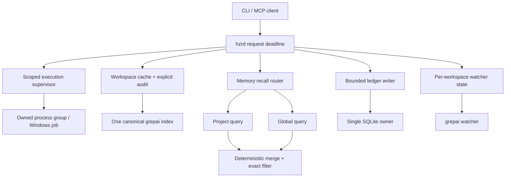

# PRD: повышение качества Rust-кода HZR

**Статус:** Approved, implemented, and locally verified for HZR 0.3.0  
**Дата аудита:** 2026-08-01 18:42:39 MSK  
**Снимок:** commit `eacc8ce41838` + незакоммиченные изменения пользователя  
**Объём:** first-party `crates/**` (26 451 строк Rust) и HZR-owned `fork-core/rtk`  
**Цель документа:** зафиксировать результаты аудита, одобренные решения, реализацию и оставшиеся границы проверки.

## 1. Резюме решения

Основной workspace имеет хорошую базовую дисциплину: нет production `unsafe`, включены строгие workspace-lints, процессы запускаются без shell-конкатенации, вывод ограничен по памяти, а полный набор Rust-тестов HZR проходит. При этом аудит нашёл три release-blocking дефекта на границах компонентов, четыре логические гонки/проблемы конкурентности и три алгоритмических узких места.

Рекомендуемый минимальный release gate:

1. **HZR-RUST-001:** исключить создание вложенного `.grepai` при поиске с `--path`.
2. **HZR-RUST-002:** гарантировать отмену процесса и его потомков при отмене HTTP request/future.
3. **HZR-RUST-003:** исправить upstream-семантику `global` и `project_and_global` memory recall.
4. После P0 — **HZR-RUST-004**, **005**, **008** как пакет корректности конкурентного состояния.

## 2. Цели и не-цели

### Цели

- Один canonical grepai index на worktree при любом path filter.
- Ни один дочерний процесс не переживает отменённый/истёкший HZR-запрос.
- Memory scope даёт полные и точные результаты без смешения kind/namespace.
- Circuit breaker и ICM lifecycle устойчивы к изменению порядка завершения futures.
- Стоимость hot path растёт близко к объёму фактического ответа, а не ко всему workspace или всему call graph.
- SQLite ledger имеет одного понятного владельца и мигрирует схему один раз.
- Все исправления подтверждаются детерминированными regression-тестами.

### Не-цели

- Переписывание HZR или fork-core целиком.
- Изменение публичных benchmark claims без отдельного измерения.
- Удаление обнаруженного `crates/.grepai` в рамках аудита.
- Автоматическое исправление текущих незакоммиченных изменений.

## 3. Карта проблем и решение владельца

| ID | Приоритет | Класс | Риск | Оценка размера | Можно делать отдельно |
|---|---:|---|---|---:|---|
| HZR-RUST-001 | P0 | Архитектура / state corruption | `--path` создаёт второй индекс и блокирует HZR | M | Да; затрагивает fork boundary |
| HZR-RUST-002 | P0 | Race / cancellation | отменённый HTTP-запрос оставляет выполняющийся процесс | M | Да |
| HZR-RUST-003 | P0 | Correctness / namespace | global recall может быть пустым, combined topic — неточным | M | Да |
| HZR-RUST-004 | P1 | Logical race | старый success/failure перезаписывает новое состояние breaker | S–M | Да |
| HZR-RUST-005 | P1 | Lifecycle race | `start/stop/restart` ICM могут интерливиться | M | Да |
| HZR-RUST-006 | P1 | Big-O / async blocking | полный `WalkDir` workspace на каждый discovery | M | Да |
| HZR-RUST-007 | P1 | Big-O | повторные полные сканы call graph/import graph | L | Да; fork gate обязателен |
| HZR-RUST-008 | P1 | Contention | глобальный mutex watcher удерживается через долгий `await` | M | Да |
| HZR-RUST-009 | P1 | DB architecture | connection + DDL + migrations на каждый usage request | M | Да |
| HZR-RUST-010 | P2 | Maintainability / gates | крупные модули и строгий Clippy fork-core не проходят | L | Да, поэтапно |

## 4. Требования

### HZR-RUST-001 — Разделить workspace root и search path

**Проблема.** `hzr-context` нормализует фильтр и передаёт его как `rgai --path <filter>` (`crates/hzr-context/src/planner.rs:394-425`). Fork-core принимает тот же аргумент одновременно как search root (`fork-core/rtk/src/rgai_cmd.rs:78-110`) и как grepai project directory (`fork-core/rtk/src/rgai_cmd.rs:421-473`, `1009-1014`). При `--path crates` grepai auto-init создал `crates/.grepai`; после этого HZR обнаружил два индекса и корректно отказал с HTTP 503.

**Требуемое поведение.** Workspace identity и grepai project root всегда равны canonical HZR workspace. Path — только относительный фильтр внутри него и не может влиять на размещение индекса.

**Предпочтительная реализация.** Ввести typed fork invocation с раздельными полями `workspace_root` и `path_filter`, либо отдельный HZR-owned semantic-search adapter. Не полагаться на двусмысленный публичный `rgai --path` для внутреннего протокола.

**Acceptance criteria.**

- В temp git repo инициализировать один managed index, выполнить semantic search с `path=crates` и `path=crates/hzr-core/src`.
- После каждого вызова существует только root `.grepai` symlink; вложенных `.grepai` нет.
- Search results ограничены path filter.
- Попытка абсолютного пути вне workspace отклоняется до запуска fork/grepai.
- Regression выполняется через реальный HZR -> fork-core boundary, не только unit parser.

**Release-ограничение.** Изменение `fork-core/rtk` требует обновления engine identity/checksums и полного `scripts/verify-fork-core.sh --test`.

### HZR-RUST-002 — Cancellation-safe execution ownership

**Проблема.** `ExecutionPipeline` запускает `run_process` через `tokio::spawn`, а `ExecutionHandle` не имеет `Drop` (`crates/hzr-exec/src/executor.rs:83-151`). Drop `JoinHandle` отсоединяет task. `kill_on_drop(true)` относится к `Child` внутри уже отсоединённой task (`executor.rs:209-231`) и не срабатывает при отмене внешнего handler. Tower timeout охватывает весь HTTP request (`crates/hzr-daemon/src/server.rs:17-38`), но внутренний process timeout начинается только после rewrite (`crates/hzr-daemon/src/api.rs:228-276`, `449-462`). Поэтому медленный rewrite + длинная команда может пережить 408 response.

**Требуемое поведение.** Отмена owner future, disconnect клиента, Tower timeout и shutdown daemon обязаны инициировать termination всей process group. Один абсолютный deadline должен охватывать rewrite, spawn, I/O и graceful termination.

**Предпочтительная реализация.**

- `ExecutionHandle::Drop` синхронно сигнализирует cancellation token.
- Supervisor task остаётся единственным владельцем `Child` и process-group guard; guard на Drop инициирует платформенно корректное уничтожение группы.
- API вычисляет deadline один раз на входе и передаёт оставшийся budget каждому этапу.
- На Windows определить и протестировать эквивалентное job/process-tree владение; не объявлять Unix process group кросс-платформенным решением.

**Acceptance criteria.**

- Drop `ExecutionHandle` без `wait()` останавливает прямой child и descendant.
- Route-level test задерживает rewrite, достигает Tower timeout и подтверждает отсутствие процесса/marker activity после grace period.
- Explicit cancel и internal timeout сохраняют typed `TerminationCause`.
- Тесты не используют фиксированные sleeps как единственный oracle; применить handshake/barrier/marker polling с bounded deadline.

### HZR-RUST-003 — Корректный global/project memory recall

**Проблема.** HZR хранит global topic как `<kind>-global` (`crates/hzr-memory/src/namespace.rs:38-48`), но любой recall отправляет ICM `project=<current SHA>` (`crates/hzr-daemon/src/api.rs:141-171`). Для `project_and_global + explicit topic` `exact_topic=None`, поэтому локальный filter проверяет только namespace и может вернуть другой kind (`api.rs:146-183`, `namespace.rs:108-129`). Oversampling `10x`, максимум 100 (`namespace.rs:132-136`) не гарантирует полноту после upstream ranking/filtering.

Официальный pinned ICM contract описывает project scoping через topic suffix и отдельные bare global topics: [ICM v0.10.61 README](https://github.com/rtk-ai/icm/blob/icm-v0.10.61/README.md). Вывод о несовместимости `project=<SHA>` и HZR topic `*-global` является архитектурной дедукцией из этого контракта и текущего HZR-кода; его нужно закрепить интеграционным тестом forwarded request.

**Требуемое поведение.** `project`, `global` и `project_and_global` должны иметь точную, документированную upstream-семантику. Explicit topic фильтрует kind во всех scope.

**Предпочтительная реализация.** Выполнять два ограниченных recall для combined scope: один с project SHA, второй с global namespace token/договорённым ICM global contract; затем deterministic merge, dedup, sort и final limit. Global-only запрос не должен посылать current project hint.

**Acceptance criteria.**

- Fake ICM проверяет exact JSON body каждого upstream запроса.
- Combined recall возвращает только запрошенный kind из текущего project + global и не возвращает другой project.
- Global-only результат доступен из двух разных workspaces.
- Merge детерминирован при одинаковых score; duplicate record возвращается один раз.
- Limit 1/10/100 соблюдается после merge без недетерминированной потери namespace.

### HZR-RUST-004 — Generation-aware circuit breaker

**Проблема.** `before_request()` возвращает только `Result<()>`, а `record_success()` безусловно переводит breaker в Closed (`crates/hzr-memory/src/circuit.rs:45-85`). Два запроса могут войти в Closed: новый failure откроет circuit, после чего старый success снова его закроет. Mutex исключает data race, но не stale-completion race. Такой паттерн используется в HTTP и MCP client (`crates/hzr-memory/src/client.rs:144-257`).

**Требуемое поведение.** Завершение старой операции не изменяет состояние более новой generation. Half-open допускает ровно один probe.

**Предпочтительная реализация.** `before_request()` выдаёт permit `{generation, mode}`; `record_success/failure(permit)` применяет переход только к совместимой generation.

**Acceptance criteria.** Barrier-тесты управляют порядками `A-start, B-start, B-fail, A-success` и обратным; итог соответствует более новой generation. Никаких timing-only тестов.

### HZR-RUST-005 — Сериализованный lifecycle ICM

**Проблема.** `start()` удерживает state mutex через verify/readiness/spawn (`crates/hzr-memory/src/supervisor.rs:92-161`), но `stop()` сначала выставляет `Stopped`, отпускает mutex и только затем disconnect/terminate/unlock (`164-188`). Параллельный `start()` видит `Stopped`, пока старый owner ещё жив. `restart()` — три независимых lock transaction (`191-197`).

**Требуемое поведение.** В каждый момент существует одна lifecycle transition; observable state отражает `Starting`, `Running`, `Stopping`, `Stopped`.

**Предпочтительная реализация.** Отдельный operation mutex сериализует полный lifecycle, а короткоживущий state mutex хранит явное состояние. I/O не удерживает mutex, который нужен read-only status, но start/stop/restart не интерливятся.

**Acceptance criteria.** Controlled fake ICM + barriers: concurrent start/start создаёт одного owner; start/stop, stop/start и restart/stop завершаются детерминированно без stale Attached и без оставшегося lock/PID.

### HZR-RUST-006 — Убрать O(U × F) workspace scan из hot path

**Проблема.** Каждый `IndexCoordinator::workspace()` заново делает discovery (`crates/hzr-index/src/coordinator.rs:44-53`). Discovery синхронно обходит всё дерево через `WalkDir`, исключая только `.git` (`crates/hzr-index/src/workspace.rs:100-157`, `577-607`). При `U` запросах и `F` filesystem entries стоимость — `O(U × F)`; синхронный обход выполняется внутри async request path и блокирует Tokio worker.

**Требуемое поведение.** Обычный request не выполняет рекурсивный duplicate audit. Проверка single-index остаётся строгой, но запускается при init/migrate/doctor или по bounded invalidation.

**Предпочтительная реализация.** Cache `Workspace` по canonical root + identity/generation. В request path проверять только известные canonical/project entries и ancestry. Полный аудит, если нужен, выполнять через `spawn_blocking`, с исключением build/vendor directories и явным лимитом.

**Acceptance criteria.** Instrumented fixture с 1k/10k/100k ignored entries показывает, что warm request не растёт линейно с `F`. Tokio heartbeat не задерживается во время audit. Создание nested `.grepai` инвалидирует cache или обнаруживается обязательным safety gate до использования.

### HZR-RUST-007 — Линеаризовать planner graph

**Проблема.** Tier B для каждого из top-20 seed снова сканирует все files/imports, несмотря на построенный, но неиспользованный `importers_of` (`fork-core/rtk/src/memory_layer/planner_graph.rs:182-270`). Затем для каждого file вызывается `caller_score`, который заново сканирует query tags, весь symbol index и caller vectors (`fork-core/rtk/src/memory_layer/call_graph.rs:114-131`). Build call graph после Aho-Corasick повторно сканирует весь file для каждого matched symbol и создаёт строки в line loop (`call_graph.rs:84-100`, `173-195`). Практическая стоимость приближается к `O(S × F × Q × E)` вместо `O(F + E)` на запрос после индексации.

**Требуемое поведение.** Reverse import/call indexes строятся один раз и реально используются. Query tags разрешаются в matched symbols один раз; scores по files аккумулируются проходом по подходящим edges.

**Acceptance criteria.** Benchmark fixtures 1k/10k files и sparse/dense edges; growth ratio близок к линейному и публикуется как измерение, а не оценка. Результаты и порядок кандидатов совпадают с reference implementation на golden fixtures.

### HZR-RUST-008 — Не держать глобальный watcher mutex через await

**Проблема.** `ensure_watcher()` удерживает общий `HashMap` mutex во время `grepai.start_watch().await` (`crates/hzr-index/src/coordinator.rs:100-111`). Один медленный workspace блокирует другие workspaces и shutdown.

**Требуемое поведение.** Startup одного watcher не блокирует lookup/start другого key и shutdown имеет bounded поведение.

**Предпочтительная реализация.** Под lock резервировать per-key state `Starting(shared future)`/`Ready`; I/O выполнять вне global lock; commit/rollback состояния — короткой секцией.

**Acceptance criteria.** Два workspace с controlled slow/fast startup: fast готов до release slow barrier. Повторный same-key start дедуплицируется. Shutdown во время Starting либо отменяет startup, либо дожидается его по явному bounded contract.

### HZR-RUST-009 — Один владелец SQLite ledger

**Проблема.** Каждый `/v1/usage` создаёт blocking task, открывает SQLite connection, выставляет WAL, выполняет DDL и проверяет legacy migrations (`crates/hzr-daemon/src/api.rs:375-400`, `crates/hzr-core/src/ledger.rs:110-190`, `655-763`). Два concurrent open могут оба увидеть незавершённую migration до `BEGIN IMMEDIATE`; второй после ожидания попытается вставить тот же migration key без `OR IGNORE`.

**Требуемое поведение.** Schema/migrations выполняются один раз при startup. Записи имеют bounded backpressure, idempotent `trace_id` и явную shutdown flush policy.

**Предпочтительная реализация.** AppState владеет `LedgerWriter`: bounded `mpsc` + один blocking thread/actor с одной connection. Reads идут через отдельную read connection либо тот же actor. Если multi-connection сохраняется, migration status перепроверяется внутри transaction и marker вставляется idempotently.

**Acceptance criteria.** 100 concurrent unique traces + concurrent summary: нет `SQLITE_BUSY`, потерь и duplicate migration errors. Shutdown подтверждает flush либо возвращает typed failure. Startup с legacy DB мигрирует ровно один раз.

### HZR-RUST-010 — Управляемый debt budget

**Проблема.** Несколько first-party модулей превышают 500 строк (`main.rs`, `planner.rs`, `ledger.rs`, `diagnostics.rs`, `adapter.rs`, `api.rs`, `cli.rs`). В `main.rs:848-849` присутствуют два одинаковых guarded match arm. Строгий Clippy для fork-core падает с 86 ошибками; полный fork test имеет 1700 passed / 1 failed / 1 ignored, где `test_load_churn_real_repo` зависит от истории/расположения реального репозитория. Текущий fork checksum gate также не проходит для двух изменённых файлов.

**Требуемое поведение.** Debt уменьшается без массового cosmetic churn импортированного engine. First-party новые/изменённые модули остаются warning-free; fork получает отдельный ratchet baseline и hermetic tests.

**Acceptance criteria.** Удалить дублированный arm. Разбивать только по ответственности при изменении соответствующей области. Fork Clippy baseline фиксирует точный набор разрешённых inherited warnings и не допускает новых; `git_churn` использует temp git fixture с известными commits; checksum/identity gate проходит после санкционированных fork-изменений.

## 5. Целевая архитектура

## 6. Порядок реализации

### Milestone A — release safety

- HZR-RUST-001, 002, 003.
- Exit: все acceptance tests P0 проходят; отсутствуют nested indexes; отмена request не оставляет процессы; memory contract проверен на wire level.

### Milestone B — deterministic concurrency

- HZR-RUST-004, 005, 008.
- Exit: все interleavings управляются barriers/permits, без flaky sleeps.

### Milestone C — scalable hot path

- HZR-RUST-006, 009, затем 007.
- Exit: benchmark fixtures и concurrency stress входят в CI с разумными ratio/upper bounds.

### Milestone D — debt ratchet

- HZR-RUST-010.
- Exit: hermetic fork tests, обновлённая provenance/checksum identity, нет новых Clippy warnings относительно принятого baseline.

## 7. Общий Definition of Done

- `cargo fmt --all --check`.
- `cargo clippy --workspace --all-targets --all-features -- -D warnings`.
- `cargo test --workspace --all-targets --all-features`.
- Для fork-core: `scripts/refresh-current-engine.sh` при санкционированном engine delta, затем `scripts/verify-fork-core.sh --test`.
- Все race tests используют контролируемое упорядочивание событий.
- Все performance claims сопровождаются fixture, командой, hardware/runtime context и raw result.
- Нет новых `.grepai`, процессов, PID/lock-файлов или SQLite writers вне canonical owner.
- Документация честно разделяет измеренную производительность и Big-O оценку.

## 8. Решения владельца

1. Владелец одобрил исправление всех десяти пунктов единым release gate.
2. HZR-RUST-001 реализован расширением typed fork invocation: canonical project root и path filter передаются раздельно.
3. HZR-RUST-003 сохраняет раздельные project/global namespaces и выполняет bounded upstream queries с deterministic merge.
4. HZR-RUST-009 реализован как bounded writer с одним владельцем SQLite connection.
5. `crates/.grepai` удалён из workspace восстанавливаемым перемещением в Trash; повторно созданный orphan-процессом индекс также перемещён, а старые orphan watchers остановлены.

## 9. Исторический checkpoint аудита

Таблица ниже сохранена как исходное состояние до реализации. Актуальный release
checkpoint приведён в разделе 10.

| Проверка | Результат |
|---|---|
| `cargo fmt --all --check` | PASS в основном checkpoint; FAIL в финальном moving-worktree checkpoint: `crates/hzr-cli/src/cli.rs:265` |
| `cargo clippy --workspace --all-targets --all-features -- -D warnings` | PASS в основном checkpoint; FAIL после параллельных изменений: отсутствует `json_hzr_registration` и не выводится тип в `crates/hzr-cli/src/client_config.rs:138-143` |
| `cargo test --workspace --all-targets --all-features` | PASS в основном checkpoint; после финальной compile regression не повторялся |
| `git diff --check` | PASS |
| `cargo fmt --manifest-path fork-core/rtk/Cargo.toml -- --check` | PASS |
| fork-core Clippy `-D warnings` | FAIL: 86 errors |
| fork-core full tests | FAIL: 1700 passed, 1 failed, 1 ignored |
| `scripts/verify-fork-core.sh --test` | FAIL before tests: checksum mismatch in `rtk/src/cargo_cmd.rs`, `rtk/src/find_cmd.rs` |
| `python3 tests/verify_repo.py` | NOT RUN: файл отсутствует в репозитории |

Основной workspace во время аудита активно изменялся пользователем. В 18:42 основной checkpoint прошёл fmt, Clippy и полный test suite. После создания документов в worktree появились новые параллельные изменения, и финальный read-only checkpoint обнаружил formatting diff и compile errors выше. Они не были внесены аудитом; release gate на момент handoff красный.

## 10. Реализация и release checkpoint

| ID | Результат |
|---|---|
| HZR-RUST-001 | Canonical project root отделён от semantic path filter; реальный `hzr context plan --path crates/hzr-core` не создал вложенный индекс. |
| HZR-RUST-002 | Drop/cancel/timeout владеют task и Unix process group; используется единый абсолютный request budget. Windows Job Object остаётся вне поддерживаемых платформ 0.3.0. |
| HZR-RUST-003 | Project/global/combined recall имеют точные upstream scopes, exact kind filtering, deterministic merge и dedup. |
| HZR-RUST-004 | Circuit permits содержат generation; stale completion не перезаписывает новое состояние, half-open допускает один probe. |
| HZR-RUST-005 | ICM lifecycle сериализован отдельным operation lock; concurrent starts создают ровно одного owner. |
| HZR-RUST-006 | Workspace discovery кэшируется, watcher/lifecycle locks разделены; строгий cold audit продолжает находить nested `.grepai`, включая `vendor`. Warm-path отсутствие полного обхода закреплено структурой кода и regression-тестами, но scale benchmark 1k/10k/100k не публиковался. |
| HZR-RUST-007 | Planner использует reverse import/caller indexes вместо повторных полных сканов. Golden/regression suite проходит; отдельное опубликованное scale-измерение не выполнялось. |
| HZR-RUST-008 | Глобальная watcher map не удерживается через startup I/O; операции сериализуются per workspace. |
| HZR-RUST-009 | Daemon владеет bounded single-connection ledger writer; stress на 100 concurrent traces проходит. |
| HZR-RUST-010 | Дублированный dispatch удалён, `git_churn` hermetic, inherited fork warnings защищены exact-hash ratchet. |

Финальная локальная проверка 2026-08-01:

- `cargo fmt --all -- --check` — PASS.
- `cargo clippy --workspace --all-targets --all-features -- -D warnings` — PASS.
- `cargo test --workspace --all-targets --all-features` — PASS.
- `scripts/verify-fork-core.sh --test` — PASS: основной fork suite 1702 passed, 1 ignored; все дополнительные suites прошли.
- Fork Clippy ratchet — PASS: 141 унаследованное предупреждение, baseline hash `c20d4c52337e3175b6d053ba5d92e563ee484ceb4eab732a005f2f04226c944d`.
- Fork provenance — PASS: immutable baseline `f4296ec404f461d6fc03c966c0dc79caee6c3118a73d1ed1a078ded5529f0a16`, current engine `50493a588561cf5fa269c6774b953c73b9fb8e6efd8eee4043bc649d16590ada`.
- `hzr release 0.3.0 --force --json` — PASS; global `current` переключён на `v0.3.0-darwin-arm64`, daemon отвечает версией 0.3.0, все pinned engines проверены.
- `hzr doctor --workspace /Users/andrew/Programming/hzr --json` — healthy; bundle attestations, duplicate-process и duplicate-index checks проходят.
- `python3 tests/verify_repo.py` — NOT RUN: такой файл отсутствует в репозитории.

Неизмеренные границы не превращены в claims: scale benchmark для HZR-RUST-006/007,
Windows process-tree cancellation и multi-platform release CI остаются отдельной проверкой.
