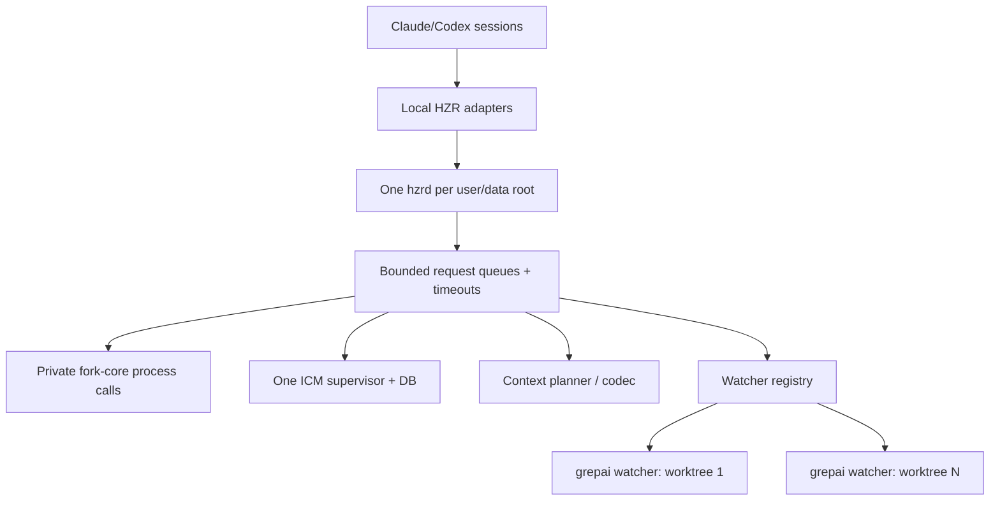

# Performance & Scalability Report: global HZR control plane

> Historical pre-release analysis captured before the 0.2.0 adoption fixes. It is retained as design evidence, not as the current release status. Current blockers and acceptance criteria live in `PRD.md` §13.1–13.2.

**Date**: 2026-07-31 22:47:33 MSK
**Current scale**: one user, several parallel Claude/Codex sessions and projects
**Target scale**: 3, 100 and 1000 simultaneously active agent sessions/worktrees

## Architecture Scalability Flow

## Database Analysis

### Schema Review

- HZR correctly separates usage ledger, fork structural cache and the only managed ICM DB.
- The actual machine simultaneously uses HZR ICM root and external `dev.icm.icm/memories.db`, so saving and recall semantics are bifurcated.
- grepai canonical store scoped by `(repository_id, worktree_id)` - correct isolation model. We need a global lifecycle registry so that stale worktree/watch does not remain active.

### Query Performance

|Pattern|Current effect|At 1000 sessions|Recommendation|
|---|---|---|---|
| Bash hook -> daemon probe |Up to 2 s before fallback when daemon is unavailable/foreign|Timeout storm and 1000 fork fallbacks|User service, short connection failure cache, bounded concurrency|
| Context plan -> grepai + ICM | Bounded limits 10/5 |Competition for watcher/SQLite and process spawning| Shared per-worktree coordinator, request coalescing, backpressure |
| ICM recall/store |One HZR DB in the target model| SQLite write contention |One supervisor, WAL tuning, bounded write queue, latency telemetry|
| Degraded rewrite ledger | Append timestamp per fallback |Hot append file and no task attribution|Batched crash-safe outbox with session/workspace ID|
| Global doctor process scan | Not implemented | Full process scan on every hook | Run only during explicit doctor checks; use a cached registry on the normal path |

### Indexing Strategy

- One grepai store on worktree is saved.
- One watcher **per active worktree**, and not one watcher for the entire machine: this is the correct scalable granularity.
- Need idle TTL, PID/start-time validation and garbage-collection plan for stale runtime, but not automatic deletion of canonical index data.

## Frontend Performance

HZR has no frontend-rendering path. Its latency comes from hook startup, daemon round trips, engine subprocesses and agent-instruction overhead.

### Bundle Analysis

- The current bundle is self-contained, but the lack of stable installation leads to launching from `target` and PATH fallback to external engines.
- Global installer must use immutable version directories and atomic current symlink; this eliminates repeated rebuild/probe and rollback costs.

### Rendering Performance

- Hook JSON is formed directly and is small in size.
- Agent context injection limits intent to 700 characters and results to 10/5, which limits prompt amplification.

### State Management

- The daemon token is tied to the data root, but the endpoint is fixed. Two daemons with different HOME/data roots conflict on the port and return HTTP 401 instead of a clear ownership error.
- You need endpoint ownership record: PID, executable digest, config/data root, protocol/version, start time.

## Backend Performance

### Request Handling

- Hook client has a hard timeout of 2 s and fail-open/fallback semantics - good UX protection.
- When the daemon is dead, each Bash call repeats the probe. A negative result should be cached for a short window (eg 250-1000 ms) without changing the policy decision.
- Daemon must have per-route concurrency limits: rewrite higher priority context/codec/agent requests.

### Resource Utilization

- Current direct ICM hooks generate a set of `icm serve`; eliminating duplicates will have a greater effect than micro-optimizing the Rust hook parser.
- Legacy grepai watchers in different projects can be valid, but unmanaged/stale watchers must be detected by registry/doctor.
- Fork fallback creates a subprocess for each rewrite. This is an acceptable degradation branch, but not a steady state.

### Caching Strategy

- Cache health/ownership briefly, but do not rewrite verdict for arbitrary shell commands.
- Coalesce identical concurrent context plans by `(workspace, normalized intent, engine generation)`.
- Do not cache user prompts/responses without an explicit privacy policy.

## Scalability Projections

|Metrics|3 sessions|100 sessions|1000 sessions|Mitigation|
|---|---|---|---|---|
| Hook requests/s |Low, current design is sufficient|Burst on shared daemon|Saturation without priority| Priority queue + bounded concurrency |
| Fork subprocesses |Rare when the daemon is alive|High at outage| Fork storm | Supervisor + negative-probe cache + circuit state |
|Active watchers| 1-3 |Up to the number of active worktrees|Hundreds of processes are unacceptable| Idle TTL, shared registry, lazy start/stop |
| ICM processes |Goal 1|Goal 1|Target 1 on user/data root|Remove direct hooks/MCP, singleton attestation|
| ICM DB writers |Small contention|Average|High| Serialized/batched write queue, WAL metrics |
| Instruction tokens/session |Small fixed block|Linear|Linear provider cost|One short canonical contract, no duplicates Claude/Codex/project|
| Context injection | Bounded | Bounded, shared engine pressure | Queue pressure | Hard budgets + coalescing + admission control |

## Risk Matrix

|Risk|Probability|Influence|Priority|Mitigation|
|---|---|---|---|---|
|2-second probe on each Bash with daemon outage|High|High| P1 | Managed service + circuit cache |
|Multiple ICM process/DB|Already happening|High| P0 |Central migration and hard doctor gate|
|Hooks point to remote `target`/temp release|High|High| P0 | Stable symlink + immutable releases |
|Fixed port is occupied by the daemon of another data root|Already happening|High| P0 |Ownership handshake and service-level singleton|
|Watcher leakage by worktrees|Average|Medium/High| P1 | Registry + idle lifecycle + explicit cleanup plan |
|Duplicate instruction blocks|High|Average| P1 |Managed markers and one included HZR contract|
|Global codec reduces fidelity|Average|High| P1 | Shadow/default exact, eval-gated opt-in profiles |

## Action Items

### Immediate (P1)

1. Implement stable bundle installer and singleton user service with ownership handshake.
2. Convert Claude/Codex direct ICM integrations to HZR and make duplicate DB/process a global doctor error.
3. Add Codex provider lifecycle and managed awareness blocks.

### Short-term (P2)

1. Add watcher registry, idle TTL and machine-wide audit.
2. Add short negative-probe cache and route priorities.
3. Measure p50/p95/p99 hook overhead for managed and degraded paths.

### Long-term (P3)

1. Run paired provider-billed benchmark HZR on/off with 9 metrics PRD.
2. Add crash-safe usage outbox and attribution for workspace/session.
3. Scale the ICM write pipeline only after measuring the real SQLite contention.
