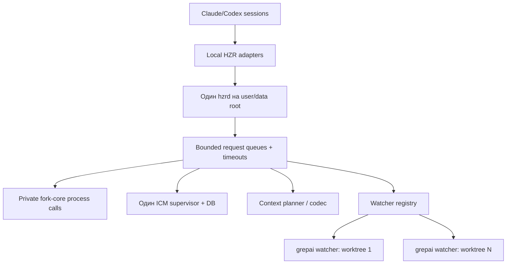

# Performance & Scalability Report: глобальный HZR control plane

> Historical pre-release analysis captured before the 0.2.0 adoption fixes. It is retained as design evidence, not as the current release status. Current blockers and acceptance criteria live in `PRD.md` §13.1–13.2.

**Дата**: 2026-07-31 22:47:33 MSK
**Текущий масштаб**: один пользователь, несколько параллельных Claude/Codex сессий и проектов
**Целевой масштаб**: 3, 100 и 1000 одновременно активных agent sessions/worktrees

## Architecture Scalability Flow

## Database Analysis

### Schema Review

- HZR правильно разделяет usage ledger, fork structural cache и единственную managed ICM DB.
- Фактическая машина одновременно использует HZR ICM root и внешний `dev.icm.icm/memories.db`, поэтому экономия и recall semantics раздваиваются.
- grepai canonical store scoped по `(repository_id, worktree_id)` — корректная модель изоляции. Нужен global registry жизненного цикла, чтобы stale worktree/watch не оставались активными.

### Query Performance

| Паттерн | Текущий эффект | При 1000 сессиях | Рекомендация |
|---|---|---|---|
| Bash hook -> daemon probe | До 2 s перед fallback при недоступном/чужом daemon | Timeout storm и 1000 fork fallbacks | User service, короткий connection failure cache, bounded concurrency |
| Context plan -> grepai + ICM | Bounded limits 10/5 | Конкуренция за watcher/SQLite и process spawning | Shared per-worktree coordinator, request coalescing, backpressure |
| ICM recall/store | Одна HZR DB в целевой модели | SQLite write contention | Один supervisor, WAL tuning, bounded write queue, latency telemetry |
| Degraded rewrite ledger | Append timestamp per fallback | Hot append file и нет task attribution | Батчированный crash-safe outbox с session/workspace ID |
| Global doctor process scan | Сейчас отсутствует | Полный scan дорог при каждом hook | Только explicit doctor; cached registry для обычного пути |

### Indexing Strategy

- Один grepai store на worktree сохраняется.
- Один watcher **на активный worktree**, а не один watcher на всю машину: это правильная масштабируемая гранулярность.
- Нужны idle TTL, PID/start-time validation и garbage-collection plan для stale runtime, но не автоматическое удаление canonical index data.

## Frontend Performance

HZR не имеет frontend-rendering path. Пользовательский latency формируется hook startup, daemon round-trip, engine subprocess и agent instruction overhead.

### Bundle Analysis

- Текущий bundle self-contained, но отсутствие stable installation приводит к запуску из `target` и PATH fallback на внешние engines.
- Global installer должен использовать immutable version directories и атомарный current symlink; это устраняет повторные rebuild/probe и rollback cost.

### Rendering Performance

- Hook JSON формируется напрямую и мал по размеру.
- Agent context inject ограничивает intent 700 символами и results 10/5, что сдерживает prompt amplification.

### State Management

- Токен daemon привязан к data root, однако endpoint фиксирован. Два daemon с разными HOME/data roots конфликтуют по порту и создают 401 вместо однозначного ownership error.
- Нужна endpoint ownership record: PID, executable digest, config/data root, protocol/version, start time.

## Backend Performance

### Request Handling

- Hook client имеет hard timeout 2 s и fail-open/fallback semantics — хорошая защита UX.
- При мёртвом daemon каждый Bash вызов повторяет probe. Следует кэшировать отрицательный результат на короткое окно (например, 250-1000 ms), не меняя policy decision.
- Daemon должен иметь per-route concurrency limits: rewrite выше приоритетом context/codec/agent requests.

### Resource Utilization

- Текущие прямые ICM hooks порождают множество `icm serve`; устранение дублей даст больший эффект, чем микрооптимизация Rust hook parser.
- Legacy grepai watchers в разных проектах могут быть валидными, но unmanaged/stale watchers должны выявляться registry/doctor.
- Fork fallback создаёт subprocess на каждый rewrite. Это приемлемая degradation branch, но не steady state.

### Caching Strategy

- Кэшировать health/ownership коротко, но не rewrite verdict для произвольных shell-команд.
- Coalesce одинаковые concurrent context plans по `(workspace, normalized intent, engine generation)`.
- Не кэшировать user prompts/responses без явной privacy policy.

## Scalability Projections

| Метрика | 3 сессии | 100 сессий | 1000 сессий | Митигация |
|---|---|---|---|---|
| Hook requests/s | Низкая, текущий design достаточен | Burst на shared daemon | Saturation без приоритета | Priority queue + bounded concurrency |
| Fork subprocesses | Редкие при живом daemon | Высокие при outage | Fork storm | Supervisor + negative-probe cache + circuit state |
| Активные watchers | 1-3 | До числа активных worktrees | Сотни процессов неприемлемы | Idle TTL, shared registry, lazy start/stop |
| ICM processes | Цель 1 | Цель 1 | Цель 1 на user/data root | Удалить direct hooks/MCP, singleton attestation |
| ICM DB writers | Малое contention | Среднее | Высокое | Serialized/batched write queue, WAL metrics |
| Instruction tokens/session | Малый fixed block | Линейный | Линейный provider cost | Один короткий canonical contract, без дублей Claude/Codex/project |
| Context injection | Bounded | Bounded, shared engine pressure | Queue pressure | Hard budgets + coalescing + admission control |

## Risk Matrix

| Риск | Вероятность | Влияние | Приоритет | Митигация |
|---|---|---|---|---|
| 2-second probe на каждом Bash при daemon outage | Высокая | Высокое | P1 | Managed service + circuit cache |
| Несколько ICM process/DB | Уже происходит | Высокое | P0 | Central migration и hard doctor gate |
| Hooks указывают на удалённый `target`/temp release | Высокая | Высокое | P0 | Stable symlink + immutable releases |
| Fixed port занят daemon другого data root | Уже происходит | Высокое | P0 | Ownership handshake и service-level singleton |
| Watcher leakage по worktrees | Средняя | Среднее/высокое | P1 | Registry + idle lifecycle + explicit cleanup plan |
| Дублированные instruction blocks | Высокая | Среднее | P1 | Managed markers и один included HZR contract |
| Global codec снижает fidelity | Средняя | Высокое | P1 | Shadow/default exact, eval-gated opt-in profiles |

## Action Items

### Immediate (P1)

1. Реализовать stable bundle installer и singleton user service с ownership handshake.
2. Перевести Claude/Codex direct ICM integrations в HZR и сделать duplicate DB/process ошибкой global doctor.
3. Добавить Codex provider lifecycle и managed awareness blocks.

### Short-term (P2)

1. Добавить watcher registry, idle TTL и machine-wide audit.
2. Добавить short negative-probe cache и route priorities.
3. Измерить p50/p95/p99 hook overhead для managed и degraded paths.

### Long-term (P3)

1. Провести paired provider-billed benchmark HZR on/off с 9 метриками PRD.
2. Добавить crash-safe usage outbox и attribution по workspace/session.
3. Масштабировать ICM write pipeline только после измерения реального SQLite contention.
