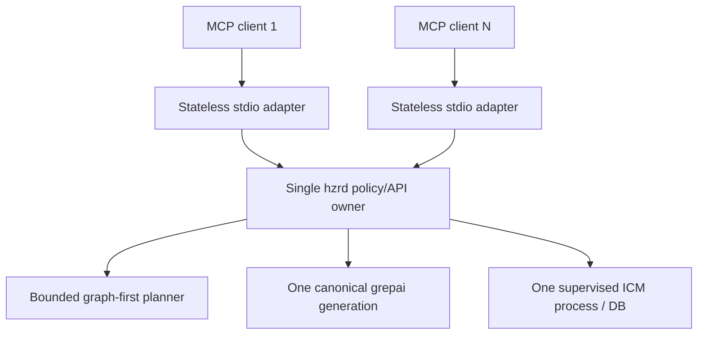

# Performance & Scalability Report: HZR MCP

**Дата**: 2026-08-01 18:36:27 +03:00  
**Текущая модель**: локальный desktop MCP, один активный call на adapter  
**Целевой масштаб**: 3, 100 и 1000 одновременных client adapters

## Architecture Scalability Flow

## Storage Analysis

### Schema Review

- MCP gateway не владеет БД и не создаёт новый index.
- Memory store остаётся единственным durable owner за `hzrd`.
- Limits 1–50 ограничивают объём recall/search/context candidates.

### Query Performance

| Pattern | Текущее влияние | При 1000 adapters | Рекомендация |
|---|---|---|---|
| `hzr_search` exact | Bounded fork-core scan | Очередь на daemon/CPU | Сохранять path narrowing и hard limits |
| `hzr_search` semantic | Может ждать warm index, затем degrade | Cold-start contention | Единственный background warmup, без повторных watchers |
| `hzr_context_plan` | Самый дорогой read path | Неподходящий multi-tenant bottleneck | Per-workspace coalescing и cancellation |
| memory recall/store | Один ICM owner сериализует durable semantics | Write queue и latency | Bounded queue, trace и измерение p95/p99 |

### Indexing Strategy

- Один canonical index generation на worktree — правильная граница владения.
- MCP adapter не должен запускать watcher или создавать fallback index.

## Client Performance

### Payload

- `structuredContent` и text дублируют JSON ради backward compatibility; это
  увеличивает wire bytes, но payload ограничен limits и локальным stdio.
- `include_content=false` по умолчанию снижает объём обычного search discovery.

### Rendering

Frontend отсутствует; стоимость находится в сериализации JSON и downstream
контексте модели.

### State

Session хранит только флаг initialization. Durable state остаётся вне adapter.
`hzr init` не запускает adapter; каждый процесс существует только в пределах
нативного stdio-соединения, которым владеет MCP-клиент.

## Backend Performance

### Request Handling

Один adapter выполняет не более одного call одновременно, что создаёт строгий
backpressure без неограниченной очереди. Несколько adapters могут обращаться к
одному `hzrd`; именно daemon должен оставаться центральной границей лимитов.

### Resource Utilization

- Adapter: O(1) session state плюс размер одного bounded response.
- Daemon/index/memory: общие ресурсы всех adapters.
- EOF закрывает adapter и исключает накопление orphan processes.

### Caching Strategy

Кэширование принадлежит HZR Context/Index. MCP gateway не должен добавлять
отдельный cache, иначе нарушится one-owner invariant.

## Scalability Projections

| Метрика | 3 adapters | 100 adapters | 1000 adapters | Mitigation |
|---|---:|---:|---:|---|
| MCP processes | 3 | 100 | 1000 | Adapter stateless; lifecycle принадлежит клиенту |
| In-flight calls | ≤3 | ≤100 | ≤1000 | Daemon concurrency limit и bounded queue |
| Durable stores | 1 | 1 | 1 | Не разрешать direct ICM MCP |
| Semantic watchers | 1/worktree | 1/worktree | 1/worktree | Canonical owner lock |
| Typical suitability | Отлично | Возможен desktop fleet | Не multi-tenant target | Для 1000 нужен отдельный service profile |

## Risk Matrix

| Риск | Вероятность | Влияние | Priority | Mitigation |
|---|---|---|---|---|
| Cancellation не прерывает текущий call | Medium | Medium | P1 | Bounded task registry + cancellation notification |
| Stampede cold semantic warmup | Low | High | P1 | Coalesced single watcher preparation |
| Ledger теряет MCP trace correlation | Medium | High | P1 | End-to-end trace ID в `_meta` и daemon API |
| Дублированный text/structured payload | Medium | Low | P3 | Оставить для compatibility; измерить реальные bytes |
| 1000 adapters исчерпывают daemon capacity | High | High | P2 | Явно не заявлять multi-tenant scale без отдельного профиля |

## Action Items

### Immediate (P1)

1. Реализовать cancellation с гарантированным cleanup при EOF.
2. Добавить common trace ID и latency/outcome accounting.

### Short-term (P2)

1. Добавить нагрузочный тест 3/100 adapters с p50/p95/p99.
2. Проверить coalescing cold index warmup и bounded daemon queue.

### Long-term (P3)

1. Оценить multi-tenant service profile только при появлении такого продуктового
   требования; не усложнять локальный desktop gateway заранее.
