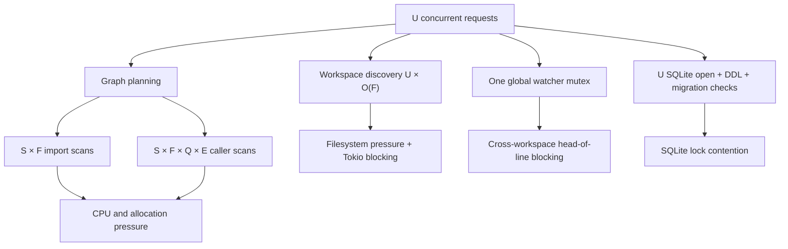
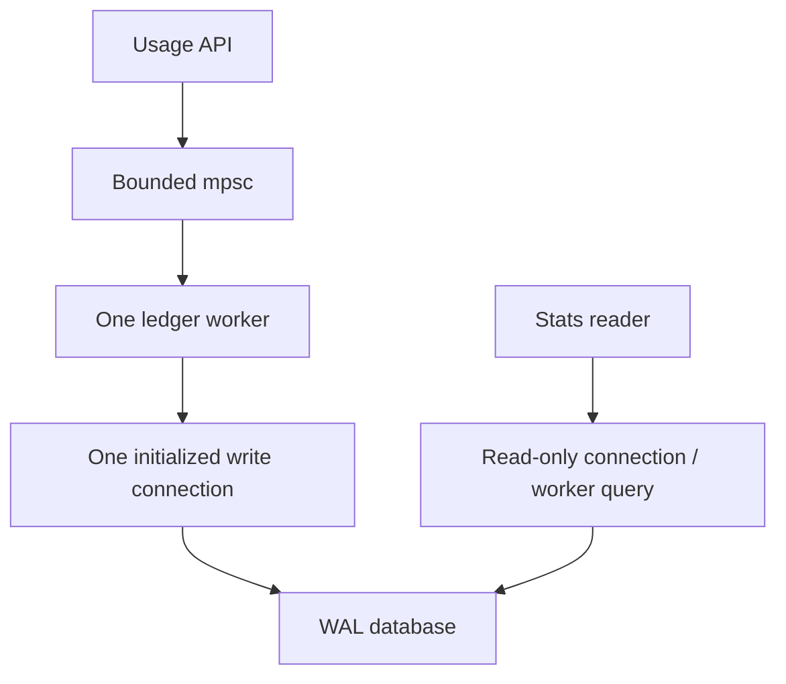

# Performance & Scalability Report: HZR Rust core

**Дата:** 2026-08-01 18:42:39 MSK  
**Снимок:** `eacc8ce41838` + активный dirty worktree  
**Связанный PRD:** `docs/PRD_RUST_QUALITY_AUDIT_20260801_184239.md`

## Executive Summary

Главные риски масштабирования находятся не в сетевом transport, а в повторной работе на hot path: recursive workspace scan `O(F)` для каждого запроса, nested graph scans, SQLite open/schema/migration на каждую usage write и глобальный watcher mutex через await. При burst concurrency они умножаются на число одновременных запросов и создают head-of-line blocking на Tokio/runtime и filesystem/SQLite.

Численные latency/throughput claims не делались: в репозитории нет релевантных воспроизводимых benchmark results для этих путей. Ниже приведены Big-O модели и обязательные измерения.

## Scalability Diagram

## Модель нагрузки

Обозначения:

- `U` — одновременные запросы.
- `F` — число filesystem entries в workspace.
- `S` — seed count planner, сейчас до 20.
- `Q` — число query tags.
- `E` — число call graph edges/symbol-caller entries.
- `L` — число ledger writes.

| Сценарий | 3 пользователя | 100 пользователей | 1000 пользователей |
|---|---|---|---|
| Workspace discovery | До `3 × F` sync visits на burst | До `100 × F`; заметный I/O amplification | До `1000 × F`; runtime starvation вероятен |
| Watcher startup | Редкий HOL, но один slow start блокирует остальные | Очередь разных workspaces под одним mutex | Один slow engine startup блокирует массовый shutdown/start |
| Ledger write | 3 connection/DDL/migration sequences | 100 blocking tasks и SQLite contenders | 1000 tasks без bounded backpressure |
| Graph plan | 3 повторных graph scans | CPU растёт почти линейно по users и сверхлинейно по graph size | Высокий tail latency и memory churn |
| Detached execution | До 3 orphan jobs при массовой отмене | Resource exhaustion становится реалистичным | Неограниченное накопление до internal timeout/process exit |

Это модель верхней границы, а не измеренный production forecast.

## Backend analysis

### 1. Workspace discovery

`IndexCoordinator::workspace()` вызывает discovery на каждый запрос (`crates/hzr-index/src/coordinator.rs:44-53`). `find_duplicate_indexes()` использует `WalkDir::new(root)` и исключает только `.git` (`crates/hzr-index/src/workspace.rs:577-607`).

**Текущая сложность:** `O(U × F)` directory entries, синхронно внутри async path.  
**Цель:** warm request `O(depth)`/`O(1)` для cached identity; полный `O(F)` audit только init/doctor/migrate или invalidation worker.

### 2. Planner/call graph

Tier B сканирует все files/imports для каждого seed и затем все files для call scores (`fork-core/rtk/src/memory_layer/planner_graph.rs:182-270`). Каждый `caller_score` проходит tags, весь caller index и vectors (`call_graph.rs:114-131`).

**Текущая модель:** до `O(S × F × Q × E)` в худшем представлении.  
**Цель:** reverse indexes и query-local accumulator дают `O(F + E + matches)` после build.

### 3. Watcher coordinator

`start_watch().await` удерживает общий mutex (`crates/hzr-index/src/coordinator.rs:100-111`).

**Текущая модель:** startup latency одного key добавляется ко всем конкурентным key.  
**Цель:** global lock только для reserve/commit; external I/O вне lock; same-key dedup через shared future.

### 4. SQLite ledger

Каждая write открывает connection и повторяет PRAGMA/DDL/migrations (`crates/hzr-daemon/src/api.rs:375-400`; `crates/hzr-core/src/ledger.rs:110-190`).

**Текущая модель:** `O(L)` connection/schema sequences плюс lock contention; очередь ограничена только executor capacity.  
**Цель:** `O(1)` initialized owner, `O(L)` коротких inserts, bounded channel и явная overload policy.

### 5. Request deadline и orphan work

Tower timeout может отменить request, но detached execution task продолжает work (`crates/hzr-exec/src/executor.rs:83-151`). Это превращает rejected requests в скрытую нагрузку.

**Цель:** workload lifetime не превышает request deadline + bounded termination grace.

## Database analysis

### Риски

- `PRAGMA journal_mode=WAL` выполняется до `busy_timeout` в одном batch (`ledger.rs:119-123`).
- DDL и legacy migration probes повторяются на каждый write.
- Migration check находится до `BEGIN IMMEDIATE`; два connection могут увидеть incomplete и второй получит conflict migration marker после ожидания.
- `spawn_blocking` создаётся на каждый request без application-level backpressure.

### Целевая схема

### Stress acceptance

- 100 simultaneous unique trace IDs + repeated duplicate IDs.
- Concurrent summary reads.
- Startup с двумя legacy DB fixtures.
- Assertions: no `SQLITE_BUSY`, exact unique row count, one migration marker, bounded queue behavior, deterministic shutdown flush.

## Frontend analysis

Frontend в scope отсутствует. CLI/MCP output уже bounded; риск находится в latency и unavailable responses backend. Дополнительная UI-оптимизация не требуется.

## Benchmark plan

| Benchmark | Fixture | Метрика | Acceptance |
|---|---|---|---|
| Workspace warm discovery | 1k/10k/100k ignored entries | elapsed + visited entries | warm visited count не зависит от `F` |
| Tokio responsiveness | full audit + 10 ms heartbeat | max heartbeat delay | bounded и задокументирован |
| Graph planner | 1k/10k files, sparse/dense edges | wall time, allocations, candidate equivalence | near-linear ratio; golden result parity |
| Ledger burst | 1/10/100 concurrent writers | throughput, p95, busy/errors | 0 lost/busy; bounded queue |
| Watcher startup | slow A + fast B barriers | B completion ordering | B не ждёт A |
| Cancellation | slow rewrite + descendant process | time to process-tree death | deadline + grace bound |

До выполнения benchmark нельзя публиковать конкретные проценты ускорения.

## Risk Matrix

| Риск | Вероятность | Влияние | Приоритет | Mitigation |
|---|---|---|---:|---|
| Nested grepai index от path filter | Подтверждено | HZR search unavailable | P0 | Separate workspace/filter protocol |
| Orphan process после request timeout | Высокая при cancel/timeout | Resource/security availability | P0 | Cancellation-on-drop + process-tree owner |
| Full-tree scan на burst | Высокая | Tail latency/runtime blocking | P1 | Cache + explicit audit worker |
| Graph repeated scans | Высокая на больших repo | CPU/latency | P1 | Reverse indexes + accumulator |
| Watcher HOL | Средняя | Cross-workspace stall | P1 | Per-key startup state |
| SQLite writer contention | Средняя/высокая | Failed usage records | P1 | One writer + bounded queue |
| Fork test/clippy drift | Подтверждено | Release gate ambiguity | P1 | Hermetic test + warning ratchet |

## Action Items

1. **[P0]** Исправить HZR/fork path boundary и добавить filesystem E2E.
2. **[P0]** Связать execution lifetime с request deadline.
3. **[P1]** Убрать recursive duplicate audit из request path.
4. **[P1]** Перенести ledger schema/migrations в startup и ввести одного writer.
5. **[P1]** Убрать global watcher lock через await.
6. **[P1]** Линеаризовать graph scoring и добавить ratio benchmarks.

## Verification snapshot

- First-party HZR в основном checkpoint: fmt PASS, Clippy `-D warnings` PASS, workspace tests PASS.
- Финальный moving-worktree checkpoint: fmt FAIL в `cli.rs:265`; compile/Clippy FAIL в `client_config.rs:138-143` после параллельных изменений.
- Fork-core: fmt PASS; Clippy FAIL (86); tests 1700 PASS / 1 FAIL / 1 ignored.
- Fork checksum gate: FAIL для `cargo_cmd.rs` и `find_cmd.rs` в активном dirty worktree.
- Численные performance benchmarks в этом аудите не запускались: сначала нужны hermetic fixtures и выбранная целевая реализация.
