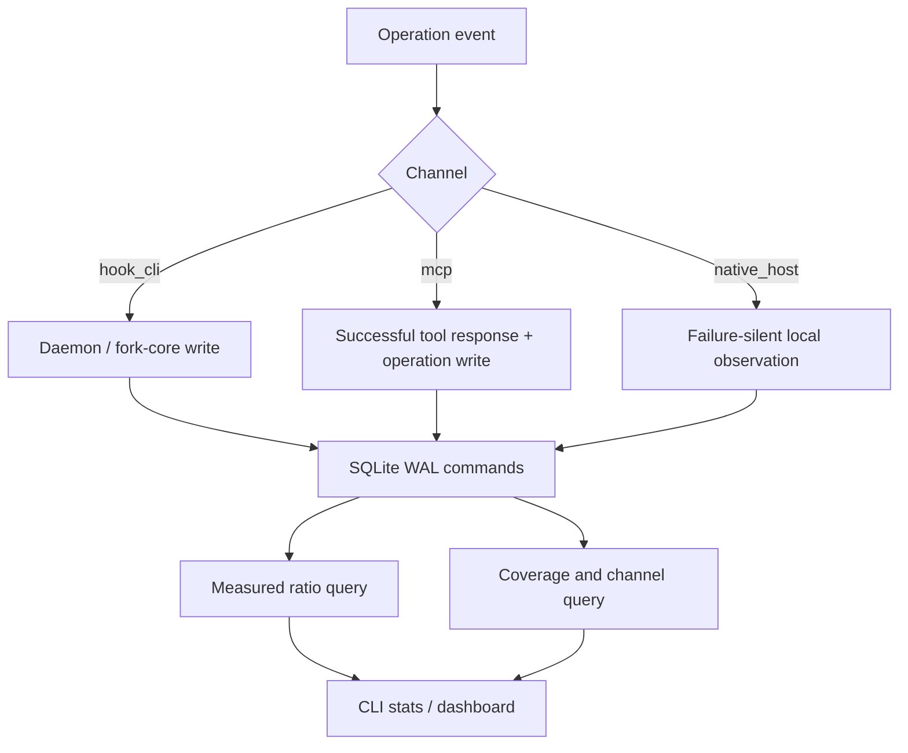

# HZR 0.3.7 — отчёт по производительности и масштабированию

**Дата:** 2026-08-05
**Scope:** honest accounting, native observation, MCP accounting, bounded output
**Статус:** release-safe для desktop/local-first профиля; рекомендации ниже не блокируют 0.3.7.

## Поток данных

## Стоимость новых путей

| Путь | Асимптотика | Практическая стоимость |
|---|---|---|
| Operation write | O(1) | Одна append-style SQLite transaction; WAL и busy timeout уже настроены. |
| MCP accounting | O(size(response)) | Одна JSON serialization для token estimate и один локальный authenticated write. |
| Native observation | O(size(serialized response)) | Контент сериализуется только для размера и не сохраняется; затем одна локальная ledger write. |
| Reduction stats | O(N) по scoped rows | Несколько aggregate queries; проектный индекс помогает path scope, global scope читает всю таблицу. |
| Symbol resolution | O(H × S) | Для каждого hit просматривается ограниченный symbol outline; лимиты search делают путь bounded. |
| Memory bound inventory | O(F + relations) | Строится второй unbounded-in-count view поверх уже загруженного artifact; память ограничена размером существующего artifact, без повторного filesystem scan. |

## Сценарии масштаба

### 3 проекта

Ожидаемый профиль: до десятков тысяч ledger rows, единичные одновременные агенты. SQLite aggregates и per-event writes не являются заметным bottleneck. Дополнительный MCP row и native observation существенно дешевле поискового или модельного вызова.

### 100 проектов

Ожидаемый профиль: сотни тысяч — около миллиона rows при длительном использовании. Project-scoped stats остаются поддержаны индексом `project_path,timestamp`; global stats становятся линейными и могут занимать заметные десятки/сотни миллисекунд на холодном cache. Рекомендуется добавить периодические rollups по channel/measurement/route до того, как global dashboard станет постоянно открытым telemetry surface.

### 1000 проектов

Ожидаемый профиль: много миллионов rows и конкурентные desktop/CI writers. Главные риски:

- полные global aggregates по `commands`;
- write contention между daemon и native observer processes;
- рост WAL/checkpoint latency;
- повторный SQLite open/schema check на частых native hooks;
- большой retained ledger без retention/compaction policy.

Для такого масштаба нужен отдельный storage milestone: daily/project rollups, composite indexes, bounded retention для raw operations, asynchronous observer spool и benchmark на Windows/macOS/Linux. Текущий релиз не заявляет multi-tenant telemetry scale.

## Рекомендации

1. Добавить benchmark `ledger_1m_rows` с отдельными project/global p50/p95 для `hzr stats`.
2. Измерить end-to-end latency `PostToolUse` на APFS, ext4 и NTFS; при p95 выше 10 ms перейти на append spool + daemon drain.
3. Рассмотреть индекс `(measurement, route, project_path)` только после `EXPLAIN QUERY PLAN` и реального benchmark: лишние индексы увеличивают стоимость каждого события.
4. Ввести агрегаты по суткам и проекту до поддержки 1000 активных workspaces.
5. Не смешивать latency оптимизатора с provider latency и не публиковать savings/cost claims на основе этого отчёта.

## Итог

На целевом локальном масштабе 0.3.7 изменения не создают архитектурного bottleneck. Риск начинается не в модели или fork-core, а в линейных lifetime aggregates и синхронной записи observer при многомиллионном ledger. Это измеримый P2 roadmap, не причина откладывать исправление честности учёта.
