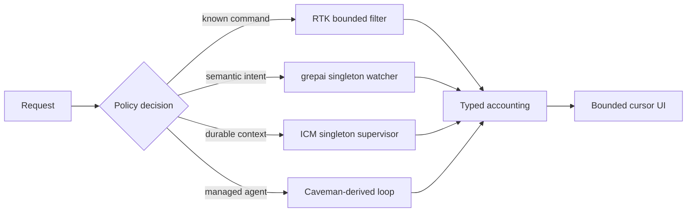

# HZR 0.6.0 Performance & Scalability Report

Дата: 2026-08-26  
Source commit: `47ab579b71e595d2d83a24ffacec35269127a699`
Статус: release evidence с отложенными broad benchmarks

## Performance topology

## Observed evidence

| Area | Observed result | Boundary |
|---|---|---|
| pinned command-output matrix | 44,400 estimated tokens vs 58,107 upstream RTK and 284,996 RAW | `ceil(bytes/4)`, not provider billing |
| bounded Markdown read | 265 vs 6,046 estimated tokens in recorded case | pinned 2026-08-01 fixture |
| UI release gate | 16 tests PASS; Vite build 130.17 kB app JS + 434.75 kB Cytoscape chunk | cold browser/runtime profiling deferred |
| Caveman runtime | 243 packages audited, 0 vulnerabilities | build-time npm audit only |
| release build | all 9 bundle stages PASS on darwin-arm64 | other native platforms delegated to release workflow |
| engine ownership | one watcher per worktree, one ICM supervisor, bounded tombstones/cache | long-duration soak deferred |

## Scalability corrections in 0.6.0

- grepai watcher registry has capacity, TTL and LRU bounds; polling cannot extend a failed tombstone forever.
- ICM restart/backoff and shutdown have one supervisor rather than client-owned orphan processes.
- RTK config uses a typed fingerprint and singleflight invalidation instead of stale indefinite reuse.
- observability uses bounded cursors/deltas and guarded project generations rather than full-page race-prone replacement.
- fidelity execution is durably reserved before spawn; unknown post-spawn state cannot create an unbounded retry loop.
- stats excludes final-delivery/control-plane duplication and preserves `unknown` replacement capability instead of converting missing evidence to `false`.

## Risk matrix

| Risk | Severity | Current control | Remaining action |
|---|---:|---|---|
| arbitrary prose filter drops a valid record | High | no generic semantic claim; exact/structured fallback | per-command completeness validators and differential fixtures |
| long-lived watcher/memory churn | Medium | cap, TTL/LRU, backoff, tombstones | multi-day soak and high-worktree simulation |
| UI project switch race | High | abort + generation + selected-worktree barrier | isolated browser A/B/C acceptance |
| accounting false green | High | receipts/estimates/unmeasured/excluded separated | provider-billed paired tasks and fleet audit |
| large graph bundle | Medium | separate Cytoscape chunk and bounded data | lazy load and browser performance budget |

## Decision

The architecture removes the major unbounded ownership and cache paths. No SoTA economic claim
is justified yet: provider tasks remain zero and `economic_claim_ready` must stay false. Release
performance is acceptable for a local-first 0.6.0 control plane, while deferred verification was
excluded from its claims.
