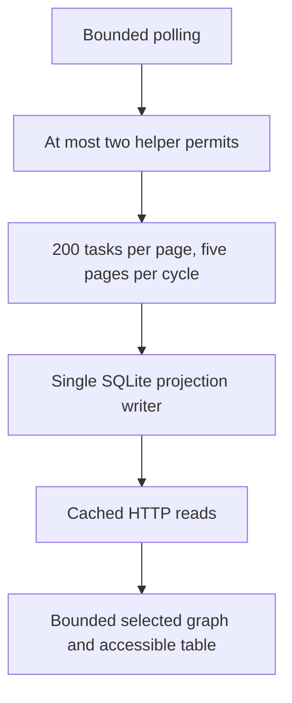

# Performance & Scalability Report: agtx Observatory

**Date:** 2026-09-08. **Host:** macOS 26.3 arm64.
**Deployment model:** one local control plane; user counts below are hypothetical
concurrent dashboard clients, not a supported multi-tenant deployment.

## Measured evidence

| Measurement | Result | Scope |
| --- | --- | --- |
| UI tests | 37 pass, 0 fail | Deterministic UI tests, not browser throughput |
| Production JS entry | 163.61 kB / 55.32 kB gzip | Vite build |
| Cytoscape chunk | 434.75 kB / 137.79 kB gzip | Separate graph chunk |
| CSS | 66.05 kB / 13.12 kB gzip | Vite build |
| Mobile width | 390 px document / 390 px viewport | Timeline, no horizontal overflow |
| Scoped board API p50 / p95 / maximum | 1.365 / 1.694 / 3.401 ms | 100 serial requests after 5 warmups; every response contained three tasks |
| Maximum scoped response | 3,121 bytes | Three-task fixture board |

The HTTP measurement used a debug daemon on 127.0.0.1:47918 with an explicit
project_id query. All 105 responses contained three tasks. An earlier unscoped
request measured an empty task selection (627 bytes, p95 1.329 ms); it was not
a populated-board measurement and is excluded from the table. The scoped figures
remain a tiny-fixture microbenchmark, not PRD-scale evidence.

The PRD target of 1,000 tasks / 5,000 edges / 10,000 runs / 100,000 events over
10 projects has NOT been load-tested here. No claim is made for p95 at that
scale, helper peak RSS <=128 MiB, idle CPU <=2%, or <=1 KiB durable growth over
100 polls.

## Data flow and limits

Subprocess output is now capped while reading (2 MiB snapshot; 4 KiB version
probe), stderr is discarded, and whole-call deadlines include input/output.
Per-project locks prevent concurrent manual/background snapshot application.
These are resource bounds verified by targeted tests, not CPU/RSS benchmarks.

## Database and query analysis

| Pattern | Current effect | Scale risk | Required next step |
| --- | --- | --- | --- |
| Five pages then restart at beginning | Bounded individual cycle | Tail tasks starve above 1,000 | Persist continuation, bind it to source generation, test interrupted scans |
| One transaction per helper page | Consistent page | Cross-page state may change | Snapshot-bound cursor/reconciliation epoch |
| Session economics gathers linked rows | Simple attribution and separate estimates | Work grows with session history | SQL aggregation and indexed bounded windows; benchmark 100k receipts |
| Single writer | Preserves ownership and ordering | Slow imports delay observation | Measure queue depth/latency; generation fence at commit |
| Public cached board reads | No helper spawned on read | Each client still serializes responses | Measure concurrency before adding a cache |
| Current-catalog repricing | Correctly labeled estimate | Historical values drift after catalog update | Persist original pricing basis and version repriced views |

## Projections for 3, 100 and 1,000 clients

These are qualitative risk projections; no invented throughput numbers.

| Area | 3 clients | 100 clients | 1,000 clients | Mitigation |
| --- | --- | --- | --- | --- |
| Polling | Same daemon work | Same daemon work | Same daemon work | Keep producer work independent of reads |
| HTTP serialization | Likely small | Could dominate CPU | Unsupported without measurement | Profile, bounded cached payloads, connection limits |
| SQLite read load | Low fixture risk | Contention possible | Capacity unknown | Query plans and concurrent benchmark |
| Browser graph | Per-client bounded | Per-client bounded | Per-client bounded | Preserve graph subset and accessible list |
| Privacy/auth | Local model | Not multi-user isolation | Not multi-tenant isolation | Separate authenticated product design before remote use |

## Risk matrix and actions

| Risk | Likelihood at target scale | Impact | Priority |
| --- | --- | --- | --- |
| Scan tail starvation | High above five full pages | Missing tasks/history | P1 |
| Unmeasured history query cost | Medium | Slow detail/economics | P2 |
| Missing catalog breaks detail | Certain when configured file absent | Monitoring detail unavailable | P2 |
| Combined upstream timing flake | Observed on this host | Optional helper gate unreliable | P2 |
| Treating stale state as productive time | Fixed prospectively | Incorrect efficiency | P1 fixed |

Before claiming PRD scale acceptance, generate the exact documented fixture,
record p50/p95/max across 100 warm requests and concurrent clients, measure helper
RSS/CPU and persistent growth, and include source hash, platform and polling
settings. First implement durable scan continuation; a benchmark of only the
first 1,000 tasks would conceal the completeness defect.
