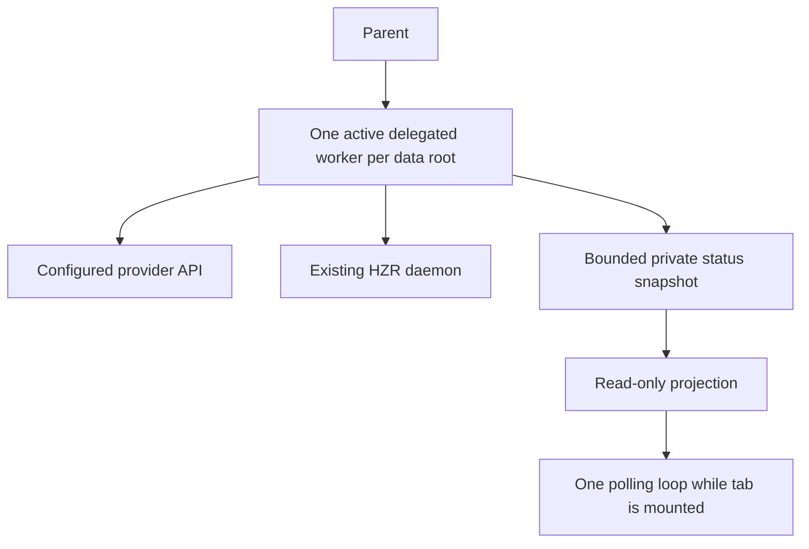

# Performance & Scalability Report

Date: 2026-09-20. Deployment model: one HZR per user's machine, not a shared SaaS.
Release target: 0.9.12. Measurements below are local observations, not load tests.

## Data flow

## Observed run

A six-test normalization fixture completed through OpenCode GO / DeepSeek V4.1
Flash in approximately 6.7 seconds between status timestamps. Four assistant
turns and three tool calls were observed. Provider usage: 6,647 uncached input,
311 output and 12,032 cache-read tokens. Parent review independently passed 6/6.
This is a functionality fixture, not an economic or quality benchmark. There is
no equivalent parent-only baseline.

## Storage and reads

Provider usage stays in the existing HZR ledger. The new status file is a bounded
projection within each existing private session directory: no prompts, reasoning
or tool output. History is capped at 30 tool names/timestamps. No second index,
memory database or long-lived agent engine is introduced.

The dashboard scans at most 100,000 session directory entries, retains the newest
200 candidate UUIDv7 paths, reads snapshots capped at 16 KiB, and returns at most
50 runs from the last 30 days. Reads run off the async executor. The bounded scan
is appropriate for current local use but not a scalable shared-server design.
At a very large per-user session count, move this projection into the existing
ledger with an index on update time; do not create another store.

Status updates occur on meaningful tool/message/terminal events and a five-second
heartbeat. The UI polls every two seconds only while mounted, has no overlapping
request loop, aborts on unmount, and retains the previous snapshot on failure.
A missing heartbeat is shown as interrupted rather than successful.

## Limits and economics

Default settings permit 12 turns and 600,000 ms per delegated task. Configuration
bounds are 1-100 turns and 1,000-1,800,000 ms. The existing bridge bounds input and
captured output. One worker slot per data root prevents ordinary recursive or
concurrent quota growth. These limits do not constitute a monetary spending cap.

## Scale scenarios

These are architectural projections, not measured throughput.

| Scenario | Expected placement | Main pressure | Mitigation |
|---|---|---|---|
| 3 users | Three independent HZR installations | Provider latency and quotas | Explicit credentials and per-user limits |
| 100 users | 100 independent installations | Aggregate provider limits; version consistency | Pinned bundles, opt-in settings, clear quota errors |
| 1000 users | 1000 independent installations | Provider capacity and supportability | No shared HZR database; release verification and bounded diagnostics |
| 1000 simultaneous users on one daemon | Unsupported deployment assumption | Global worker slot and directory reads | Design multi-tenant scheduling/auth before claiming support |

## Risk matrix and actions

| Risk | Priority | Response |
|---|---|---|
| Delegation overhead exceeds parent-only task cost | P1 | Parent chooses suitable bounded tasks; no blanket savings promise |
| Unexpected provider/model fallback | P1 | Explicit managed model identity; external Router excluded from runtime |
| Shared credentials or prompt leakage | P1 | Per-user private storage; strict public projection |
| Provider request retry/quota growth | P2 | Turn/deadline bounds and one slot; expose provider errors |
| Large per-user session history | P2 | Bounded scans now; indexed existing-ledger projection if measured need emerges |
| Unauthenticated Claude client | Environment | Report absent live host verification; do not alter root auth |

Final source/bundle/CI results belong in the release record, not inferred from this
report. No synthetic load benchmark or financial saving was run.
