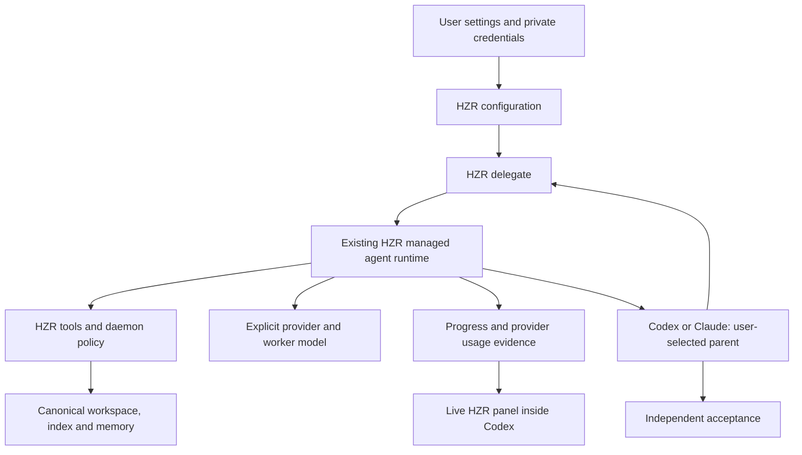

# Configurable delegation in HZR

Status: released as 0.9.12; local, CI and public artifact verification passed. Owner: HZR. Date: 2026-09-20.
Target: next release after 0.9.11; publish only after acceptance gates pass.

## Problem and desired result

A capable model selected by the user in Codex or Claude should retain planning,
architectural decisions, security decisions, review and final acceptance. When
delegation is enabled, it should send bounded execution tasks to an explicitly
selected cheaper worker provider/model through HZR. The initial live reference
is OpenCode GO with DeepSeek V4.1 Flash. No parent-model name is a prerequisite.

The existing astra-flash-orchestrator provides a useful native Codex workflow,
but its direct DeepSeek route, Astra-specific wording and router dependency do
not constitute a general cross-host HZR architecture. HZR already owns a
managed agent runtime, tool contracts, workspace binding and usage accounting.
Extend that runtime rather than introduce another independent tool/index owner.

## Scope

- Per-user delegation settings exposed through `hzr settings`.
- Provider presets: OpenCode GO, OpenRouter and DeepSeek; exact worker model
  configurable within the selected provider.
- Explicit opt-in; new installations do not spend inference quota automatically.
- Enable OpenCode GO / DeepSeek V4.1 Flash for the requesting user's installation.
- A host-independent `hzr delegate` execution surface, usable by Codex and Claude.
- Preserve pinned upstream source/provenance; adapt its workflow to the bundled HZR runtime.
- No additional end-user runtime downloads, package installation or external Router.
- Live, inspectable delegation evidence inside Codex.
- Architecture/security review, offline regression gates, real provider acceptance,
  local installation, version bump and published release verification.

Do not replace the user's parent model or root authentication. Do not promise
that every model supports tools or that delegation always reduces total cost.
Do not fabricate provider-billed savings or native Codex agent identity.

## Actors and flow

1. The user opens settings, selects a provider and exact worker model, enters
   their own key through a hidden prompt, chooses limits, and enables delegation.
2. A Codex or Claude parent reads the HZR contract and checks current settings.
3. The parent defines one bounded task: workspace, allowed change scope,
   acceptance criteria and context needed by the worker.
4. HZR rejects disabled delegation, missing credentials, invalid configuration,
   recursion, or incompatible runtime before inference.
5. HZR starts the selected worker with only managed HZR tools and bounded turns,
   deadline and output. The worker uses the canonical workspace/index/memory.
6. Progress identifies provider, model, task and state. No credentials or private
   capability URLs enter output, ledger, source, bundles or review documents.
7. The parent reviews the patch and runs independent acceptance checks. Worker
   completion alone is not accepted-task success. Failure returns evidence to
   the parent; no silent provider/model substitution.
8. Actual provider usage is recorded separately from cost estimates. Savings
   remain unproven without an equivalent accepted parent-only baseline.

## Architecture

Canonical configuration belongs to HZR's existing typed config loader, not a
second project-local settings file. Credentials are machine-local, excluded
from serializable configuration and passed only to the selected provider.
Use the existing managed agent bridge and its tool invariants; never spawn an
independent RTK, grepai or ICM instance. Preserve imported source provenance.

The shipped execution surface is HZR-managed delegation. A separate native
Codex Router adapter was evaluated but is excluded from the product runtime:
its external dependencies and service lifecycle violate the self-contained bundle
requirement. The managed worker uses the HZR progress panel inside Codex;
do not impersonate a native child or manufacture host metadata.

## Settings contract

- `hzr settings`: show current state and concise next steps; guided setup when
  used interactively if supported without ambiguous noninteractive behavior.
- `hzr settings delegation ...`: set provider, model, enabled state, maximum
  turns and timeout; deterministic flags for automation and JSON inspection.
- Credential login: hidden terminal input or explicitly selected private input
  source; never an API-key command-line argument.
- Disable: immediately blocks new delegated runs; does not erase credentials.
- Model changes preserve the root host configuration and require exact route
  validation at runtime. Unsupported model capabilities produce a clear error.
- Provider defaults are documented conveniences, not automatic fallback routes.
- Changes persist across bundle upgrades. Existing unrelated settings survive.

## Host contract and task boundaries

The parent delegates routine implementation, extraction, formatting, narrow
tests and well-specified investigations when doing so is useful. It retains
ambiguous architecture, security policy, final review and irreversible actions.
Delegation is optional and task-dependent, never an unconditional extra call.
A worker cannot recursively delegate. Context is bounded and avoids forwarding
the complete parent transcript by default.

Host permission restrictions remain meaningful. Explicit HZR daemon tool policy
must not be described as an OS sandbox. Validate paths and daemon authority,
and document the exact permission boundary. The first native sandbox test failed
because private HZR runtime files were outside writable roots; reproduce and
resolve this with scoped configuration, not blanket permission bypass.

## Visibility inside Codex

Minimum accepted visibility:
- Before execution: exact provider/model, workspace and task.
- During execution: running state and meaningful tool/progress activity.
- Terminal state: completed, failed, timed out or cancelled, with duration and
  available actual input/output/cache usage.
- Separate worker completion from parent acceptance; no implied success.
- A local live view openable in Codex's browser panel, using existing HZR
  visualizer/service ownership where practical, with no credential fields.
- Clear label identifying native Codex versus managed HZR execution.
- No extra inference request merely to render or refresh status.

Evaluate existing HZR agents/visualizer and usage records before adding a new
store. Prefer existing data ownership; define retention and stale-run behavior.
Opening a panel must not change host routing or expose a public server.

## Known GAP register

| ID | Observed gap | Required closure |
|---|---|---|
| G01 | Upstream names Astra and direct DeepSeek | Parent-model-neutral managed contract; explicit provider/model |
| G02 | Native router covers Codex only | Common HZR worker path callable from Codex and Claude |
| G03 | No `hzr settings` delegation surface | Typed config, CLI UX, persistence and tests |
| G04 | Worker selection is fixed in initial adapter | Configurable exact provider/model; no silent fallback |
| G05 | User credentials must not ship | Private per-user storage, redaction and release-content scan |
| G06 | Router initially hid selected worker and enabled fallback | Remove Router from product runtime; strict managed model identity |
| G07 | Upstream synthetic thinking replay lacks reasoning | Real reasoning-preserving tool roundtrip; retain fixture diagnosis |
| G08 | Native end-to-end sandbox test did not create file | Reproduce authority boundary and pass real bounded task |
| G09 | Static doctor is not inference evidence | Separate static, live API, tool execution and host acceptance |
| G10 | Managed worker model currently SDK-selected | Explicit runtime model, credential and fail-closed selection |
| G11 | Delegation visibility is absent | Provider-labeled progress and live local Codex panel |
| G12 | Savings could be overstated | Actual usage separated from estimates; no unmeasured claims |
| G13 | Install/bundle/rollback could drift | Canonical assets, checksum/provenance, isolated bundle installation tests |
| G14 | New behavior needs general-user validation | Fresh-HOME, disabled, missing-key, alternate config and model tests |
| G15 | Release remains unpublished | Required source/fork/bundle/CI gates and verified public assets |
| G16 | Additional Router/Python/npm installation | Bundle-only runtime and no-external-tools smoke |
| G17 | Concurrent settings could lose a field | Lock read-modify-write and reload under lock |
| G18 | Timeout/cancellation looked like active work | Parent-owned terminal receipt overriding heartbeat |
| G19 | Connection errors hid last known runs | Retain cards and show stale-connection warning |
| G20 | Provider redirect policy was implicit | Explicit redirect rejection for the worker origin |

The register is an acceptance checklist, not a claim that all gaps are closed.
Record discovered gaps and evidence as implementation proceeds.

## Security and failure behavior

- Secret files private to the OS user; reject unsafe file types and permissions.
- No keys in argv, environment inherited by execution tools, task prompts,
  diagnostic bodies, events, generated contracts, Git or release artifacts.
- Only the configured provider receives its key. No arbitrary custom endpoint
  accepts a preset provider credential. Redirect behavior must be verified.
- Runtime does not discover alternative credentials/models after explicit
  selection fails. Disable hidden fallback and accidental sidecar inference.
- Preserve the HZR managed-only tool guard, bounded outputs and deadline.
- Preserve existing provider usage accounting on success and failure.
- Failed setup reports actionable sanitized errors and leaves recoverable state.
- Provider quota, region restrictions and authentication errors are distinct
  from code defects and never reported as passed tests.

## Verification and acceptance

Offline:
1. Legacy HZR config loads with delegation disabled.
2. Settings roundtrip preserves unrelated fields; invalid provider, model and
   zero/oversized limits are rejected.
3. Secret read/write, permissions, symlink and output-redaction tests.
4. Exact selected model reaches bridge; SDK fallback rejected.
5. Managed-only tools, no recursive delegation, correct workspace, cancellation,
   timeout and failed-provider usage recording retain their guarantees.
6. Disabled/missing-key runs make no inference call.
7. Upstream inventory verification and self-contained bundle smoke pass.
   Public settings, private login, selection and bridge imports work with an
   empty external-tool PATH. No native-router setup command is shipped.
8. Progress view uses real events, handles stale/failed runs and exposes no key.

Live:
1. OpenCode GO DeepSeek V4.1 Flash basic, streaming and real tool-history replay.
2. Bounded implementation fixture: worker edits allowed file through HZR;
   parent independently runs assertions; verify observed provider/model.
3. Repeat common execution contract from Codex and Claude where host access is
   available; explicitly document any unverified host UI surface.
4. Settings disabled blocks execution; re-enable restores selected route.
5. Open live delegation view inside Codex and verify running/terminal evidence.

Release:
- Rust fmt, clippy all targets/features with warnings denied, all workspace tests.
- Complete source gate, fork parity gate, JavaScript/Python integration suites.
- Dependency audit and bundled installation smoke.
- Architecture and performance reports including unresolved issues.
- Version metadata and release notes aligned; commit/tag pushed.
- Required release Actions successful; complete platform assets and checksums.
- Install published local bundle; verify CLI, daemon and configured delegation.

## Implementation sequence

1. Lock this PRD and inspect existing managed runtime/visualizer contracts.
2. Add typed settings, credential lifecycle and explicit worker request.
3. Implement `hzr delegate`, integrate parent instructions and bounds.
4. Add progress/visibility from existing HZR data ownership.
5. Verify bundled runtime closure, generic wording and documentation.
6. Run offline and actual provider/host acceptance; resolve observed failures.
7. Configure requesting user's defaults without publishing their credentials.
8. Review, bump, release, verify installation and report exact evidence.

## GAP closure review before publication

| GAP | Implementation/evidence | Remaining gate |
|---|---|---|
| G01 | Parent-neutral managed contract and settings | None |
| G02 | Common CLI path and generated Codex/Claude contract | Live Claude UI unavailable: CLI unauthenticated |
| G03 | Typed config, CLI flags, private prompt, persistence tests | None |
| G04 | Three provider presets and exact model identity, no HZR fallback | Other provider live tests require their own credentials |
| G05 | Same-handle private credential reads, in-memory auth; source and 16,513 bundle files scanned clean | None |
| G06 | External Router removed from product runtime | None |
| G07 | Real reasoning-preserving tool replay and accepted managed task | None |
| G08 | Managed implementation task independently passed 6/6 twice | None |
| G09 | Static selection, live execution and acceptance separately reported | None |
| G10 | Explicit SDK registry/auth/model; fallback rejected | None |
| G11 | Working/completed states and failure/recovery tested; installed 0.9.12 panel inspected in Codex | None |
| G12 | Provider counters only; no baseline savings claim | None |
| G13 | All three public native bundles passed CI install smoke and downloaded SHA-256 verification | None |
| G14 | Fresh config, disabled/missing-key, limits, persistence and private login; bundle smoke passed with no external tools | None |
| G15 | 0.9.12 stable Latest published; full gates passed; published macOS bundle installed and daemon verified | None |
| G16 | Router setup removed; hidden input compiled into Rust; empty-PATH bundle smoke passed | None |
| G17 | Settings reload/modify/write under private lock | None |
| G18 | Parent terminal receipt overrides heartbeat; timeout/cancel tests terminate descendants | None |
| G19 | Browser 503 fixture retains cards and recovers automatically | None |
| G20 | Worker-origin redirects explicitly rejected | None |
| G21 | Explicit flock unlock before descriptor close; inherited-descriptor regression and full parallel gate passed | None |

G21 was discovered by the parallel workspace suite: another fork can temporarily
inherit the lock descriptor before exec. Closing the parent's descriptor alone
does not necessarily release flock. The lock guard now explicitly unlocks on
drop, and its test holds a duplicate descriptor to reproduce the condition
deterministically.

These closures are scoped evidence, not a claim of mathematically proving
absence of every race. The shipped bundle has no external native-router adapter.
The earlier local Router experiment was undone using its guarded receipts and
its service uninstalled; parent model and provider were preserved.

## Completion report

Report implemented behavior, canonical files, generated/bundled surfaces, exact
test results, live provider/model evidence, panel access, configuration commands,
release URL/version and any remaining limits. Never mark an unchecked GAP closed.
