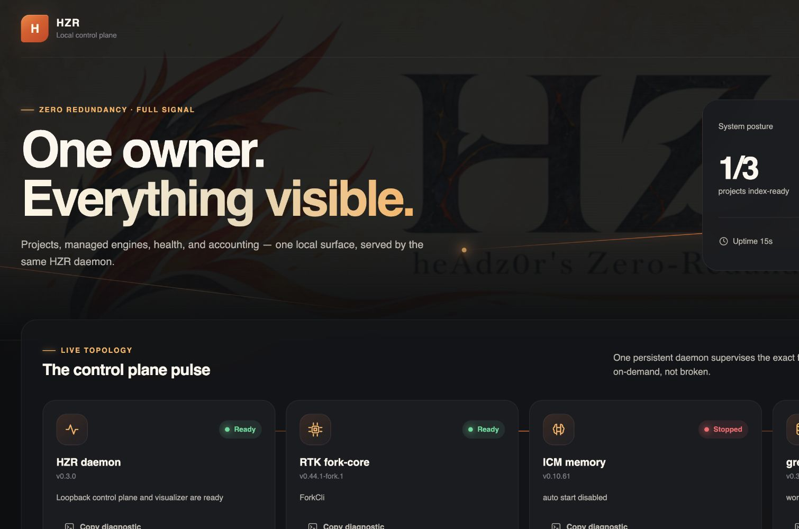

# HZR 0.3.0 — correctness and scalability release

HZR 0.3.0 strengthens the single-owner control plane across semantic indexing,
process execution, memory, lifecycle management, and accounting.

## Highlights

- `hzr release VERSION` now synchronizes current version surfaces, refreshes fork-core
  provenance, builds and installs the versioned bundle, restarts the service, and verifies
  the installed HZR binary plus every pinned engine.
- Release bundles carry a complete deterministic manifest. Installation verifies every
  shipped file before switching `current`, and the release command confirms that the
  restarted installed daemon reports the requested version.
- Pinned source archives use a SHA-256-verified download cache, so repeat releases do not
  depend on downloading unchanged runtimes again.
- Semantic `--path` is only a filter. grepai auto-initialization is pinned to the canonical
  workspace root and cannot create a nested index.
- Dropping an execution owner cancels the task and terminates its Unix process group;
  request budgets are absolute across rewrite and execution.
- Project, global, and combined memory recalls use explicit upstream scope hints, exact
  topic filtering, deterministic merging, and cross-project isolation.
- Circuit-breaker completions are generation-aware; ICM lifecycle operations are serialized;
  watcher startup uses per-workspace locks without holding the global watcher map over I/O.
- Workspace duplicate audits are cached, planner import/call lookups use reverse indexes,
  and the daemon writes usage through one bounded SQLite writer.
- Fork-core churn testing is hermetic and inherited Clippy warnings are protected by an
  exact hash ratchet, so new warnings cannot enter unnoticed.
- A Bun-built Vue visualizer now ships inside the versioned bundle and is served by the
  existing loopback-only daemon. It presents project registration and index readiness,
  `hzrd`, RTK fork-core, ICM, and grepai state, exact versions, observed usage, explicitly
  separate efficiency estimates, and copyable diagnostics without creating another
  service, index, or memory owner.

## Visual control plane

Default release installation initializes the current project and starts the user service;
the dashboard is then available at `http://127.0.0.1:47391/`. Source builds retain the
explicit `hzr daemon serve` workflow, and `HZR_INSTALL_SERVICE=0` disables service setup.
See the [visualizer PRD](../PRD_HZR_VISUALIZER.md) for state semantics, security boundaries,
accessibility requirements, and verification criteria.

## Compatibility and boundaries

Engine pins remain unchanged: RTK fork-core `0.44.1-fork.1`, grepai `0.35.0`, ICM
`0.10.61`, caveman-code `0.65.2`, and bundled Node.js `22.17.1`. Windows artifacts are
still outside this release; process-tree cancellation is verified on Unix platforms.

Historical `v0.1.0` and `v0.2.0` records remain immutable. Current version declarations
and runtime checks use `0.3.0`.
