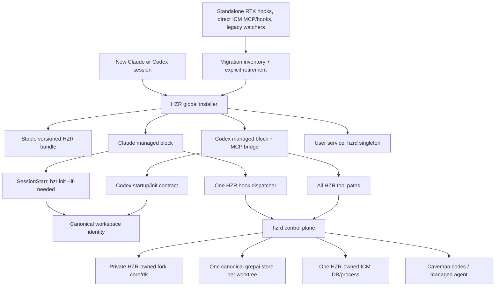

# Code Review: global replacement of RTK with HZR

> Historical pre-fix audit. The machine state and scores below are intentionally preserved as an audit trail and must not be read as the current release verdict. See `PRD.md` §13.1–13.2 and `PRD_STATUS_0.2.0.md` for the active gate.

**Date**: 2026-07-31 22:47:33 MSK
**Reviewer**: IT Architect Agent
**Area**: `hzr install`, `hzr init --if-needed`, Claude/Codex awareness, hook dispatcher, HZR/RTK/ICM/grepai ownership, actual worker machine configuration

## Executive Summary

The target mechanism is partially implemented and locally operational: isolated E2E confirmed the idempotent installation of two Claude-hooks, automatic `SessionStart -> hzr init --if-needed --quiet`, creation of canonical `.grepai` symlink and read-only repeated init. The strict requirement "HZR is globally the only entry point for Claude and Codex in all new projects" is currently **not met**.

On the production machine, `hzr` is missing from `PATH`; Claude uses 3 RTK-hooks and 4 direct ICM-hooks; `~/.claude/CLAUDE.md` requires `rtk`; Codex uses Caveman-specific `~/.codex/AGENTS.md` and direct MCP `icm serve`. The current `hzr install` only changes Claude `settings.json`: it does not install the bundle, awareness files, Codex contract, daemon service and does not centralize the external ICM.

## Architectural Diagram

## Requirements Compliance

|Requirement|Status|Proof|
|---|---|---|
|`hzr init` is automatically run in the new project| **PARTIAL** |The code registers `SessionStart` (`adoption.rs:287-301`); isolated E2E gave `initialized`, then `already_initialized` without changing mtime. The hook is not installed globally.|
| All Claude Bash requests go through HZR | **PARTIAL** | The dispatcher covers `Bash|Agent|Task` and provides daemon -> pinned fork fallback (`hook_runner.rs:20-87`). In practice, Claude still invokes `rtk-rewrite.sh`. |
|All Claude tool/prompt/response paths go through HZR| **FAIL** |There are no HZR handlers for `Read`, `Grep`, `Edit`, `Write`, `UserPromptSubmit`, `PostToolUse`, `PreCompact` or response/Stop. Bash and Agent/Task only.|
|Codex globally uses HZR| **FAIL** |There is only bundled markdown asset. There is no `~/.codex/AGENTS.md` mutation, Codex config/MCP bridge or startup-init mechanism.|
|Claude and Codex instructions require HZR| **FAIL** |Claude globally requires `rtk` and `@RTK.md`; Codex global `AGENTS.md` describes JuliusBrussee/caveman. HZR assets are not installed.|
|RTK is available only as private engine/compat alias HZR| **PARTIAL** |Bundle correctly contains `bin/rtk -> hzr` and private `engines/rtk`; on the machine the direct `/usr/local/bin/rtk` remains, but `hzr` is missing from `PATH`.|
|ICM centralized HZR| **FAIL** |Installer intentionally saves external ICM hooks (`adoption.rs:188-190,435-478`); Codex runs direct `icm serve`; Several processes with external DB were detected.|
|grepai/rgai use canonical HZR store without duplicates| **PARTIAL** |The current HZR workspace is correct; legacy/project-local watchers work globally, and `doctor` checks only one workspace.|
|Caveman saves Claude/Codex queries/responses globally| **FAIL** |Codec and bridge are available in the HZR daemon/managed `hzr agent run`, but external Claude/Codex requests and responses are not intercepted.|
|The global installation is reproducible and self-sufficient| **FAIL** |`build-bundle.sh` builds the bundle, but there is no deploy/upgrade/rollback installer. `hzr install` writes `current_exe()`, including mutable `target/release/hzr` (`adoption.rs:262-268`).|
|Diagnostics honestly reveals the current drift| **PASS** |`hzr doctor` returned unhealthy: hooks missing, ICM 0.10.57 instead of 0.10.61, Caveman runtime missing, daemon auth mismatch.|

Strict global-adoption gate: **1 PASS / 4 PARTIAL / 6 FAIL**. This is about **27%** with a weight of `PASS=1`, `PARTIAL=0.5`; the percentage applies only to this acceptance scope, and not to the entire HZR 0.2.

## Verified actual state

- `command -v hzr` - missing.
- `/usr/local/bin/rtk` - `0.44.1-fork.1` and remains a public independent entry point.
- Claude hook status: `HZR=0`, `RTK=3`, `external-ICM=4`.
- Dry-run correctly schedules `HZR=2`, `RTK=0`, but saves `external-ICM=4`; real settings did not change.
- ICM to `PATH`: `0.10.57`, pin HZR: `0.10.61`.
- Active `hzrd` launched from `target/debug` with temporary workspace/data context; main client gets HTTP 401 due to mismatched token/data root.
- Found several independent `icm serve` and several legacy `grepai watch` in different projects/temporary directories.
- The HZR workspace has the correct managed `.grepai` symlink and no nested duplicate index.

## Architectural Assessment

### Strengths

- Hook replacement removes known RTK handlers before adding HZR and passes the idempotent test.
- Settings are written through lock, compare-and-swap, full-SHA backup, atomic persist and `0600`.
- Bash fallback uses HZR engine resolver and preserves fork decision semantics without depending on the live daemon.
- `init --if-needed` safely distinguishes between missing, managed, legacy and foreign `.grepai`.
- The bundle retains 100% of fork-core and makes `bin/rtk` a compatibility alias rather than a second control plane.

### Problems

1. **[P0] Installer has an incorrect boundary of responsibility.** The command called `hzr install` installs only Claude hooks. It does not make HZR a global product.
2. **[P0] Codex is missing from runtime adoption.** Markdown asset without installation does not affect the behavior of the agent.
3. **[P0] ICM ownership defeats the purpose.** Direct Claude hooks and Codex MCP are preserved, so after HZR adoption two memory control planes and two DBs appear.
4. **[P0] Instructions remain RTK-owned.** User behavior continues to guide models past HZR.
5. **[P1] `current_exe()` creates fragile hooks.** Running installer from `target`, temp bundle or a removed release leaves a broken path after cleanup/upgrade.
6. **[P1] No user-level supervisor.** On the hot path, degraded fallback is almost always possible; there is no guarantee of a single daemon at a fixed endpoint and data root.
7. **[P1] Coverage is not equal to “all requests”.** Native file tools, user prompts and external LLM responses are outside HZR.
8. **[P1] Global doctor is missing.** The current workspace and Claude settings are checked, but not Codex, PATH precedence, all processes, all active indexes and stale runtime.
9. **[P2] PRD adoption contains deprecated commands `hzr read/write`.** The real contract correctly uses `hzr rtk -- read|write`; addendum lines 89, 97-99 diverge from CLI.
10. **[P2] Dry-run does not show the promised exact diff.** The output contains hashes/status, but `rendered_settings` is excluded from JSON and the diff is not printed.

## Target implementation

1. Divide `hzr install` into a transactional global installer with phases `plan -> apply -> verify -> rollback`: versioned bundle, stable symlink, service, Claude, Codex, memory/index migration.
2. Never write hook to `current_exe()`. The hook must reference a stable path, such as `~/.local/bin/hzr`, which atomically switches to the immutable release directory.
3. Add managed marker blocks and CAS-backups for:
- `~/.claude/CLAUDE.md` + installed `~/.claude/HZR.md`;
- `~/.codex/AGENTS.md` + installed `~/.codex/HZR.md`;
- Codex MCP: HZR proxy/adapter instead of direct `icm serve`.
4. Migrate known direct ICM handlers/MCP to HZR-owned routes. Unknown hooks are kept, known ICM entries are output to plan and replaced only with confirmation/backup.
5. Add a user service (`launchd` on macOS; systemd user on Linux; Windows service/task later) that runs exactly one `hzrd` with explicit `--config`/data root and versioned engine directory.
6. Enter `hzr doctor --global`: stable binary, bundle attestation, Claude/Codex managed blocks, direct RTK precedence, ICM MCP/hooks/processes/DB, grepai watchers/index roots, daemon endpoint/token owner.
7. For Claude, expand the policy to native tools through supported matchers or honestly leave instruction-driven routing; request/response codec should be issued as a separate opt-in contract, since the Bash hook does not intercept LLM transport.
8. For Codex, consider instructions soft enforcement. Where the platform hook is missing, HZR should give MCP/tools and startup bootstrap; The doctor must distinguish between enforced and instructed coverage.

## Quality Scores

|Criterion|Grade|Rationale|
|---|---:|---|
| Code Quality | 84/100 |Secure write settings, typed JSON hook results, good isolated tests; The adoption module is named too narrowly and classifies ownership by string suffix.|
| Extensibility/Modularity | 70/100 | Control-plane boundaries are strong, but the installer is tightly coupled to Claude settings and lacks a provider abstraction and transaction plan. |
| Security | 76/100 |CAS, lock, backups and `0600` are good; mutable `current_exe`, lack of binary attestation during adoption and daemon token/data root conflict require fixing.|
| Optimization/Performance | 68/100 |Hot hook is limited to 2 s and has a fallback; the absence of a supervisor gives an extra timeout/degraded path, external ICM hooks duplicate the work.|
| Architecture & Visualization | 72/100 |The internal HZR control plane is agreed upon, but the global ownership boundary is not implemented.|
| Deploy Cleanliness | 28/100 | The bundle is built, but there is no global deploy, upgrade, service, awareness or Codex lifecycle. |
|**Total**| **66/100** |A good kernel 0.2, but global replacement is not yet a product installer.|

## Critical Issues (Must Fix)

1. [CRITICAL] Implement a full-fledged stable global bundle installer and disable hooks on build/temp executable.
2. [CRITICAL] Add Codex adoption and replace global RTK Claude/Codex instructions with HZR managed blocks.
3. [CRITICAL] Centralize direct Claude/Codex ICM integrations via HZR; duplicate memory control plane must have a release-blocking error.
4. [CRITICAL] Add managed singleton `hzrd` service and global ownership/attestation gate.

## Recommendations (Should Fix)

1. [SHOULD] Add machine-wide inventory/migration for legacy RTK hooks, direct binary, ICM processes/DB and grepai watchers/indexes.
2. [SHOULD] Fix PRD commands and make dry-run a full-fledged diff-plan.
3. [SHOULD] Add E2E fixtures Claude + Codex + upgrade + rollback + stale binary/service.

## Minor Suggestions (Nice to Have)

1. [NICE] Show `coverage=enforced|instructed|unsupported` separately for each agent surface.
2. [NICE] Issue `hzr adoption status --json` with per-provider state instead of one common hooks counter.
