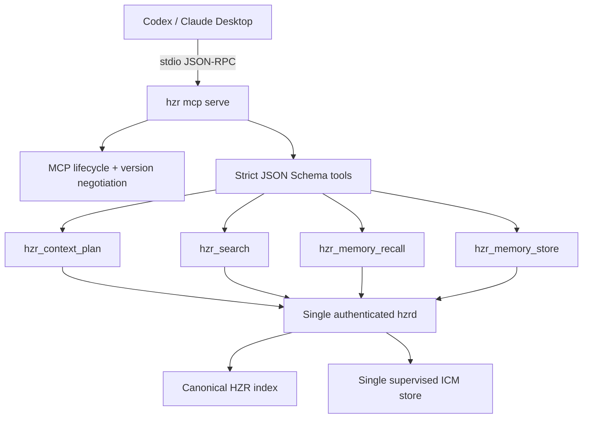

# Code Review: MCP surface

**Дата**: 2026-08-01 18:36:27 +03:00  
**Ревьюер**: IT Architect Agent  
**Scope**: `crates/hzr-cli/src/mcp.rs`, `crates/hzr-cli/src/mcp/*`,
`crates/hzr-cli/tests/mcp_stdio.rs`, MCP-контракты в `HZR.md`, `README.md`,
`PRD.md` и integration awareness

## Executive Summary

MCP-поверхность стала достаточной для model-facing задач HZR: graph-first
планирование, точечный поиск, recall и additive store памяти. Добавлять
`health`, `stats`, lifecycle engines или unrestricted exec как model tools не
следует: это операторские функции, которые увеличивают неоднозначность выбора и
права на мутацию.

Реализация теперь договаривается о stable MCP `2025-11-25`, сохраняет
совместимость с ранними ревизиями, строго проверяет аргументы и возвращает
`structuredContent`. Критических дефектов после исправлений не осталось.

## Architectural Diagram

## Requirements Compliance

| Требование | Статус | Примечание |
|---|---|---|
| Достаточный набор model tools | OK | Добавлен `hzr_context_plan`; четыре tool покрывают evidence и durable memory |
| Понятные описания | OK | У каждого tool есть title, сценарий применения, границы и описание каждого аргумента |
| Актуальный production MCP | OK | Stable `2025-11-25`; draft/RC `2026-07-28` сознательно не заявлен |
| Нативный lifecycle | OK | `init` не создаёт процесс; клиент запускает stdio server по регистрации, `mcp status` аудирует состояние |
| Машиночитаемые контракты | OK | JSON Schema 2020-12 input/output и `structuredContent` |
| Scope isolation | OK | Workspace берётся из launch directory; поля для подмены workspace отклоняются |
| Fail-closed mutation | OK | Нет fallback store; неопределённый transport outcome описан честно |
| Cancellation | WARN | Долгий вызов ограничен daemon timeout, но MCP cancellation пока не прерывает его немедленно |
| End-to-end trace/accounting | WARN | Общий MCP trace до `hzr stats` остаётся следующим инкрементом |

## Architectural Assessment

### Strengths

- Lifecycle и negotiation находятся в одном stdio gateway
  (`crates/hzr-cli/src/mcp.rs:104`).
- Tool schemas вынесены из protocol loop и остаются обозримыми
  (`crates/hzr-cli/src/mcp/tools.rs:1`).
- Неверные enum, типы, limits и неизвестные аргументы отклоняются до daemon
  dispatch (`crates/hzr-cli/src/mcp/arguments.rs:1`).
- `hzr_context_plan` отражает главную архитектурную ценность HZR, а не
  дублирует обычный filesystem tool.
- Store не объявлен read-only или idempotent; остальные annotations явно
  закрывают open-world семантику.
- Process-level тест проверяет negotiation, notification silence, tool list,
  typed schemas и завершение по EOF
  (`crates/hzr-cli/tests/mcp_stdio.rs:9`).
- `hzr mcp status` делает client-managed lifecycle и отсутствие запуска из
  `init` машиночитаемыми, не меняя сторонние конфиги.

### Concerns

- Loop обрабатывает запросы последовательно. Это даёт естественный backpressure,
  но `notifications/cancelled` будет прочитано только после завершения текущего
  daemon вызова.
- Output schemas строго описывают корневые поля, но вложенные memory/search/context
  records пока представлены общими object schemas.
- Собственный небольшой JSON-RPC слой требует следить за stable MCP changelog;
  переход на официальный Rust SDK оправдан только если его lifecycle не создаст
  второй owner или лишний runtime.

### Recommendations

1. Добавить bounded task registry и обработку `notifications/cancelled`, не
   нарушая EOF anti-orphan и single-owner invariants.
2. Пронести единый trace ID через MCP → daemon → ledger и вернуть его в
   `_meta`, не смешивая provider usage и оценки.
3. Постепенно уточнить nested output schemas либо генерировать их из protocol
   types с зафиксированным schema snapshot test.

## Quality Scores

| Критерий | Оценка | Обоснование |
|---|---:|---|
| Code Quality | 92/100 | Модули по ответственности, строгие errors, без suppressed lints |
| Extensibility | 90/100 | Tool schema/argument validation отделены от transport dispatch |
| Security | 93/100 | Fixed workspace, closed-world tools, strict inputs, no fallback owner |
| Performance | 84/100 | Bounded inputs и serial backpressure; cancellation ещё нет |
| Architecture | 94/100 | MCP остаётся facade над одним hzrd, index и memory owner |
| Deploy Cleanliness | 90/100 | stdio/EOF проверены; stable protocol заявлен явно |
| **TOTAL** | **91/100** | Production-grade local MCP с двумя известными P1-инкрементами |

## Critical Issues (Must Fix)

Критических проблем после выполненных изменений не обнаружено.

## Recommendations (Should Fix)

1. **[P1]** Cancellation для долгих calls без нарушения bounded backpressure.
2. **[P1]** Общий trace и MCP tool accounting до canonical ledger.
3. **[P2]** Полные nested output schemas и conformance snapshot.

## Minor Suggestions (Nice to Have)

1. Рассмотреть официальный Rust SDK после стабилизации его поддержки ревизии
   `2025-11-25`; миграция не должна добавлять отдельный daemon/store owner.
