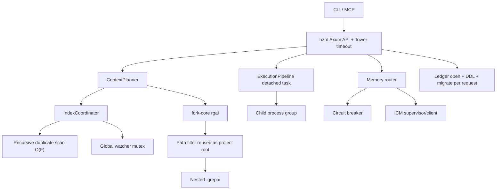

# Code Review: Rust quality, concurrency and architecture

**Дата:** 2026-08-01 18:42:39 MSK  
**Reviewer:** IT Architect + Rust Quality audit  
**Снимок:** `eacc8ce41838` + активный dirty worktree  
**Основной документ решений:** `docs/PRD_RUST_QUALITY_AUDIT_20260801_184239.md`

## Executive Summary

First-party HZR Rust workspace прошёл `fmt`, строгий `clippy -D warnings` и полный набор тестов в основном checkpoint аудита. Сильные стороны — запрет production `unsafe`, typed protocol boundaries, bounded capture, безопасный запуск процессов и хорошая изоляция paths/secrets. Worktree активно менялся параллельно: финальный checkpoint уже не форматируется и не компилируется из-за новых изменений `hzr-cli`; подробности приведены ниже.

Release readiness всё же блокируют три boundary-дефекта: path filter создаёт второй grepai index; отмена HTTP future не владеет жизненным циклом отсоединённой execution task; memory global/project scope не совпадает с upstream ICM project filtering. Дополнительно найдены stale-completion race в circuit breaker, interleaving ICM lifecycle и глобальный watcher mutex через долгий await.

## Architectural Diagram

## Requirements Compliance

| Требование проекта | Статус | Доказательство |
|---|---|---|
| Один canonical workspace/index owner | **FAIL** | `--path crates` воспроизводимо создал `crates/.grepai`; HZR затем вернул duplicate-index error. |
| ICM централизован и lifecycle безопасен | **PARTIAL** | Один lock owner реализован, но `stop()` публикует `Stopped` до terminate/unlock. |
| Typed internal protocol | **PASS / PARTIAL** | API typed; внутренний HZR -> fork `rgai --path` сохраняет двусмысленную CLI-семантику. |
| Production Rust gates | **PASS first-party / FAIL fork** | Workspace fmt/clippy/tests прошли; fork Clippy — 86 errors, fork tests — 1 failure. |
| Cross-project memory isolation | **PARTIAL** | Positive local filter защищает от другого SHA, но global upstream hint и exact kind в combined scope некорректны. |
| Process termination on timeout/cancel | **PARTIAL** | Explicit cancel/internal timeout тестируются; drop outer request/handle не отменяет detached task. |
| No new TODO/dead abstractions/suppressed lints | **PARTIAL** | First-party строгий Clippy чист; fork содержит значительный inherited dead-code/lint debt. |

## Сильные стороны

- Workspace запрещает `unsafe`, `unwrap`, `expect` и panic-паттерны в production.
- Execution capture имеет memory cap, spill и typed termination.
- Unix execution создаёт process group и explicit timeout завершает descendants.
- Path normalization и symlink escape проверки присутствуют на API boundary.
- Memory namespace filter положительный: запись сохраняется только при доказанной принадлежности project/global.
- SQLite `trace_id` idempotent через `ON CONFLICT DO NOTHING`.
- Полный HZR test suite прошёл после повторного запуска; изолированный flaky ICM test также прошёл.

## Критические проблемы

### [P0] HZR-RUST-001 — path filter нарушает one-index invariant

`ContextPlanner::search_in` передаёт relative filter как `rgai --path` (`crates/hzr-context/src/planner.rs:394-425`). Fork-core использует path как project root и разрешает auto-init (`fork-core/rtk/src/rgai_cmd.rs:98-115`, `421-500`, `1009-1014`). Фактический side effect: `crates/.grepai` создан 2026-08-01 18:27:41 MSK; HZR перестал выполнять semantic search из-за двух индексов.

Исправление: typed separate workspace/filter contract; E2E regression должен проверять filesystem после scoped search.

### [P0] HZR-RUST-002 — отмена owner future отсоединяет процесс

`tokio::spawn` хранится в `ExecutionHandle`, но Drop не вызывает cancel (`crates/hzr-exec/src/executor.rs:83-151`). Tower timeout (`crates/hzr-daemon/src/server.rs:17-38`) может удалить handler раньше внутреннего timeout, потому что rewrite не входит в process budget (`api.rs:228-276`, `449-462`).

Исправление: cancellation-on-drop, absolute request deadline и RAII process-tree owner.

### [P0] HZR-RUST-003 — memory scope теряет global и exact kind

Все recall отправляют `project=<current SHA>`; combined explicit topic снимает topic filter (`crates/hzr-daemon/src/api.rs:141-183`). HZR global topic имеет suffix `-global` (`namespace.rs:38-48`), тогда как pinned ICM документирует собственное project/topic scoping: [ICM v0.10.61 README](https://github.com/rtk-ai/icm/blob/icm-v0.10.61/README.md). Текущие unit tests проверяют готовый список records, но не forwarded ICM request и потому не ловят ошибку boundary.

Исправление: отдельные project/global recalls + exact filtering + deterministic merge.

## Существенные проблемы

1. **[P1] Stale circuit completion.** `record_success()` без permit/generation закрывает circuit после более нового failure (`circuit.rs:45-85`; `client.rs:144-257`).
2. **[P1] ICM lifecycle race.** `stop()` меняет state на `Stopped` до завершения kill/unlock; `restart()` не атомарен (`supervisor.rs:92-197`).
3. **[P1] O(U × F) workspace discovery.** Recursive `WalkDir` на каждый request, исключается только `.git` (`workspace.rs:100-157`, `577-607`; `coordinator.rs:44-53`).
4. **[P1] Call graph repeated scans.** `importers_of` строится и не используется; nested scans вызывают `caller_score`, который каждый раз проходит symbol/caller index (`planner_graph.rs:182-270`; `call_graph.rs:114-131`).
5. **[P1] Global watcher lock through await.** `start_watch().await` выполняется под общим mutex (`coordinator.rs:100-111`).
6. **[P1] Ledger per-request initialization.** Connection, WAL, DDL и legacy migration повторяются для каждой записи (`api.rs:375-400`; `ledger.rs:110-190`, `655-763`).
7. **[P1] Fork release gate красный.** Два checksum расходятся; строгий Clippy даёт 86 errors; real-repo-dependent test падает.

## Незначительные замечания

1. **[P2] Дублированный match arm** в `crates/hzr-cli/src/main.rs:848-849` — одинаковое guard и значение.
2. **[P2] Крупные модули.** `main.rs`, `planner.rs`, `ledger.rs`, `diagnostics.rs`, `adapter.rs`, `api.rs`, `cli.rs` превышают 500 строк. Разделять по ответственности при следующем изменении области, не отдельным массовым PR.
3. **[P2] Проверочный контракт расходится с деревом.** Инструкции требуют `python3 tests/verify_repo.py`, но файла нет.

## Quality Scores

| Критерий | Оценка | Обоснование |
|---|---:|---|
| Code Quality | 78/100 | First-party gates чисты; есть дублирование и крупные orchestration modules; fork debt значителен. |
| Extensibility/Modularity | 66/100 | Крейты разделены хорошо, но CLI boundary HZR -> fork двусмыслен, AppState/routes оркестрируют слишком много. |
| Security | 82/100 | Сильная path/token/process discipline; orphan execution после disconnect остаётся availability/resource risk. |
| Optimization/Performance | 53/100 | Full-tree scan, repeated graph scans, per-request SQLite init и lock-through-await. |
| Architecture & Visualization | 64/100 | Заявленные single-owner boundaries правильные, но несколько реализаций их нарушают. |
| Deploy Cleanliness | 57/100 | First-party green; fork checksum, Clippy и hermetic test gates не готовы. |
| **Итого** | **67/100** | Хорошая Rust-база, но boundary и concurrency defects блокируют уверенный release. |

## Critical Issues (Must Fix)

1. Исправить workspace/path semantic split и удалить возможность nested auto-init.
2. Сделать execution cancellation owner-scoped и покрыть route timeout.
3. Исправить memory global/combined wire contract.

## Recommendations (Should Fix)

1. Ввести generation permits в circuit breaker.
2. Сериализовать ICM lifecycle и watcher per-key startup.
3. Убрать recursive index audit из request path.
4. Ввести single-owner ledger writer.
5. Линеаризовать reverse graph scoring и добавить масштабные fixtures.

## Minor Suggestions (Nice to Have)

1. Удалить duplicated match arm.
2. Ввести debt ratchet для fork-core warnings вместо одномоментного cosmetic cleanup.
3. Заменить real-repository churn test на hermetic temp-git fixture.

## Финальный moving-worktree checkpoint

- `cargo fmt --all --check` — FAIL: форматирование `crates/hzr-cli/src/cli.rs:265`.
- `cargo clippy --workspace --all-targets --all-features -- -D warnings` — FAIL до Clippy analysis: `json_hzr_registration` не найден и тип `registration` не выводится в `crates/hzr-cli/src/client_config.rs:138-143`.
- Полный workspace test suite ранее прошёл; после появления compile regression повторно не запускался.
- Эти изменения появились параллельно и не принадлежат аудиту; в рамках read-only review они не исправлялись.
