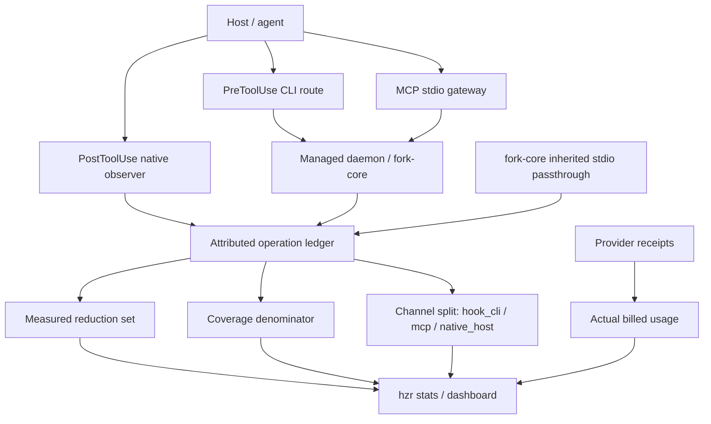

# Техническое ревью HZR Honest Accounting and Bounded Output

**Дата:** 2026-08-05
**Целевая версия:** 0.3.7
**Область:** PRD `PRD_HZR_HONEST_ACCOUNTING_AND_BOUNDS.md`, ledger, MCP, native hooks, context planner, fork-core, installer, visualizer
**Итог:** реализация готова к релизу после стандартного version/release workflow; блокирующих P0/P1-дефектов не найдено.

## Архитектурный вывод

Система теперь оркестрирует три фактических канала через один HZR control plane и одну схему учёта. Измеренный трафик участвует в reduction ratio, нативно наблюдаемый и явно неизмеримый трафик расширяет знаменатель coverage, но не получает выдуманных токенов или экономии. Provider usage остаётся отдельной величиной.

Ключевое свойство схемы: `measurement=unmeasured` запрещает ненулевые token counters, а `route=native_unaccounted` исключается из reduction aggregates. Это делает ошибочное приписывание экономии невозможным на уровне записи, а не только UI.

## Полнота PRD

| Поток | Статус | Проверенный результат |
|---|---|---|
| W1 | Выполнен | Inherited-stdio passthrough больше не записывает ложный `0/0`; он явно `unmeasured/bypassed`. Captured raw остаётся нейтральной строкой baseline=delivered. |
| W2 | Выполнен | Все восемь MCP tools дают ровно одну operation row после успешного ответа; codec не дублируется; validation errors не учитываются как успех. |
| W3 | Выполнен | Default-on failure-silent observer для `Read/Grep/Glob/Edit/Write`; контент не сохраняется, savings credit отсутствует. |
| W4 | Выполнен | Bounds у read, long lines, memory, recall и search содержат total/omitted и recovery. Пути recovery shell-safe. |
| W5 | Выполнен с исправлением ошибочного тезиса PRD | Search span получает smallest enclosing symbol; пустой symbol имеет typed reason. Dead types удалены, но реально используемый `Provenance` сохранён. MCP schemas описывают nested contract. |
| W6 | Выполнен | Effective mode, fallback и scan diagnostics видны даже при нулевом результате; exact сохраняет trailing whitespace. |
| W7 | Выполнен | Long operations имеют progress, heartbeat либо timeout. Пункт про бесконечный `hzr exec run` оказался устаревшим: daemon budget уже существовал. |
| W8 | Выполнен | Symlink swap унифицирован; reinstall с идентичными bytes не заменяет bundle links копиями. |

## Оценки

| Категория | Оценка | Заключение |
|---|---:|---|
| Архитектура | 9.3/10 | Типизированные channel/measurement/route отделяют coverage от savings и provider billing. |
| Корректность | 9.4/10 | Инварианты обеспечены схемой записи и SQL predicates; false-zero и false-credit paths закрыты. |
| Безопасность | 9.2/10 | Observer не сохраняет tool content; workspace/namespace guards не ослаблены; recovery paths экранируются. |
| Производительность | 8.4/10 | Текущий SQLite/WAL дизайн достаточен для desktop workloads; global stats пока линейны по ledger. |
| Тестируемость | 9.5/10 | Workspace clippy/tests и полный fork parity gate зелёные; добавлены regression tests для каждого нового контракта. |
| Документация | 9.3/10 | PRD превращён в verified implementation record; HZR contract и fork parity описывают новую семантику. |
| Итог | **9.2/10** | Release-ready для заявленного масштаба, без недоказанных экономических claims. |

## Замечания по приоритетам

P0/P1 замечаний нет.

P2 — масштабирование global stats: `efficiency_summary_scoped` и channel aggregation читают ledger rows при каждом полном отчёте. Для обычного локального использования это корректно и быстро, но на миллионах строк потребуется rollup table либо составные индексы по `(project_path, measurement, route, channel)`.

P2 — native observer открывает SQLite на каждый host tool event. Это failure-silent и не добавляет сетевого round trip, однако process startup + SQLite open следует измерить отдельно на Windows и на медленных дисках, если появится SLO для hook latency.

P2 — default-on native observation реализован для Claude hook surface. Клиенты без эквивалента `PostToolUse` честно остаются вне наблюдаемого denominator; это ограничение интеграции, не скрытая полнота.

## Проверки

- `cargo fmt --all -- --check` — passed.
- `cargo clippy --workspace --all-targets --all-features -- -D warnings` — passed.
- `cargo test --workspace --all-targets --all-features` — passed.
- `scripts/verify-fork-core.sh --test` — passed: 1717 tests passed, 1 ignored; 141 inherited warnings matched the reviewed ratchet; current engine manifest verified.
- `bun run typecheck` — passed.
- `bun test` — 7 passed, 0 failed.
- Release bundle build, bundle smoke, packaged clean-install, same-version re-attestation, tamper rejection, and upgrade/rollback smoke — passed.
- The clean-install gate caught and fixed a stale `doctor` invariant: the canonical installation now correctly requires three HZR hooks, including the default-on native observer.

Внешние provider-backed benchmarks не запускались: PRD меняет accounting coverage и contracts, но не даёт оснований пересчитывать модельные fidelity/quality claims без отдельной cost authorization.
