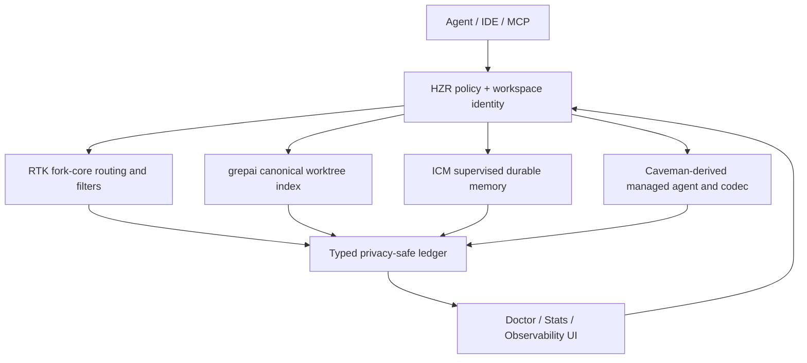

# Архитектурный review HZR 0.6.0

Дата: 2026-08-26  
Reviewed source commit: `47ab579b71e595d2d83a24ffacec35269127a699`
Dirty state reviewed: clean immediately after source commit  
Решение: **release_ready с явно отложенными full acceptance gates**  
Economic decision: **economic_claim_ready = false**

## Архитектура

## Acceptance matrix

| Gate | Priority | Result at reviewed source |
|---|---:|---|
| durable fidelity `Reserved → Executing → Executed` | P0/T0 | implemented; post-spawn unknown survives restart and requires explicit reconciliation |
| bypass enforcement and zero RAW savings credit | P0/T0 | implemented in current contracts and routing; fleet reconciliation remains deferred |
| truthful stats denominator and replacement tri-state | P0/T0 | implemented by source delta `a1a3d0a`; headline excludes control-plane/final-delivery duplicates |
| provider receipts vs estimates | P0/T0 | separated; no billed benchmark, economic gate false |
| project privacy/isolation | P0/T0 | keyed pseudonyms, positive workspace selection, A/B request guards |
| MCP capability coverage | P1/T1 | 13 tools, schema/handler SSOT, confined daemon read/write/exec, typed output validation |
| ICM/grepai lifecycle | P1/T1 | singleton supervision, restart/backoff, bounded TTL/LRU, failed tombstones |
| init/install/doctor convergence | P1/T1 | transactional journal and forward recovery; doctor exposes exact repair paths |
| UI observability | P2/T1 | lifecycle, trace, grepai, memory topology and accounting posture connected |
| generic prose semantic equivalence | P2 | intentionally not claimed; structured protocols fail back to raw, per-command validators remain debt |

## Критическая оценка

Сильнейшее изменение — переход от набора интеграций к единой модели владения. Команда,
workspace identity, индекс, память, lifecycle и ledger теперь сходятся в одном typed boundary.
Это устраняет системный класс разрывов: второй writer, «вечный» cache, исчезнувший watcher,
ложный savings denominator и MCP, который обходит daemon.

Оставшийся архитектурный риск не скрыт: semantic completeness произвольного prose невозможно
вывести из меньшего размера ответа. HZR 0.6.0 не усиливает этот факт до `never_worse` claim;
дальнейшая работа должна переносить каждое семейство фильтров на собственный completeness contract.

## Scores

| Dimension | Score / 10 | Comment |
|---|---:|---|
| architecture/cohesion | 9.2 | единое владение и typed protocol вместо соседних wrappers |
| security/privacy | 9.0 | project confinement, pseudonyms, fail-closed mutation/fidelity |
| operability | 8.8 | doctor, traces, lifecycle, reconciliation; browser gate отложен |
| accounting truthfulness | 9.1 | estimates/receipts/unknown/excluded разделены |
| test confidence | 7.2 | targeted и build gates пройдены, full immutable suite отложен пользователем |
| release confidence | 8.0 | local self-contained build/install green; remote native assets ещё проверяются после tag |

## Выполненные evidence gates

- `cargo fmt --all`
- `cargo check --release -p hzr-cli --bin hzr`
- полный fork parity в truthful-stats worktree
- real MCP confined read/write gate и schema/handler targeted gates
- durable post-spawn unknown/restart и public fidelity allowance targeted gates
- release bundle stages 1–9, visualizer 16/16, typecheck/build, npm audit, bundle smoke
- local atomic install switch and engine version parity

## Отложенные gates

В частности, не выполнялись frozen workspace clippy/test, browser A/B/C E2E, fleet-wide doctor и полный
host-to-ledger-to-UI acceptance. Это осознанный release debt, а не скрытый PASS.
