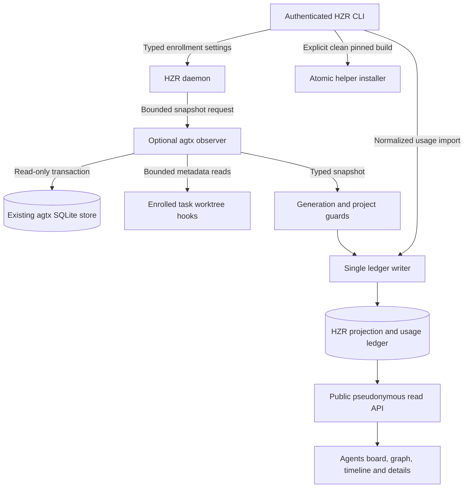

# Code Review: agtx Agent Observatory

**Date:** 2026-09-08
**Scope:** implementation commits `9c8dcad` and `862132f`, compared with
`docs/PRD_HZR_AGTX_AGENT_OBSERVATORY.md`; hotfixes for release 0.8.602.
**Method:** source review, fixture integration, deterministic Rust/UI tests,
real adapted helper, browser walkthrough and release gates. Public documents
are English as required by HZR engineering rules.

## Executive assessment

The architecture fits HZR: one daemon owns a read-only adapter and one projection
writer; the UI reads cached projections. The initial implementation was not ready
to be called the complete PRD. It contained privacy-default, process-bound,
installation, enrollment lifecycle and accounting defects. The hotfix addresses
the concrete defects below. The release is an opt-in monitoring slice, not a
certification that every PRD acceptance scenario is complete.

## Architecture

## Fixed findings

| ID | Severity | Trigger and original behavior | Hotfix and evidence |
| --- | --- | --- | --- |
| F01 | P1 | Upgrade with omitted privacy keys published workspace names, memory content and task titles through public endpoints. | Defaults false; explicit opt-in retained; legacy-config test and explicit-publication fixtures. |
| F02 | P1 | Default bundle omitted agtx but doctor required every manifest binary. | Honor optional/non-runtime components; missing enabled component is separately diagnosed. |
| F03 | P1 | Helper stdout/stderr could grow before a post-exit size check; nonzero exits could supply JSON. CLI version probe could hang. | Bounded stdout during read, closed stderr, whole-call timeout, kill/reap, exit validation and common CLI/daemon probe. Infinite-output and failed-exit tests. |
| F04 | P1 | Predictable build checkout and tolerated patch failure could build unrelated or unadapted source. Direct copy could leave a partial executable. | Private temporary checkout fetched at immutable commit; mandatory patch check/apply; validated closed staging file and atomic persist. Supplied source checkout remains untouched. |
| F05 | P1 | Clean installed CLI searched only repository ancestors for patches. | Discover packaged share/hzr before source fallback. |
| F06 | P1 | Snapshot producer commit defaulted to unknown; claimed transaction consistency lacked explicit transaction. | Patch identity -2; exact pinned commit and deferred read transaction. |
| F07 | P1 | Hook reads looked only at project root, missing nested task worktrees; directory symlinks escaped intended path. | Canonical contained task worktree selection, directory-symlink rejection and bounded reads. Added helper regressions. |
| F08 | P1 | Task-filter queries could resolve another project's task; shared session text created cross-project conflict flags. | API and ledger scope checks; conflict SQL constrained by project; cross-project regressions. |
| F09 | P1 | Namespaced agtx hashes did not match existing HZR session hashes, yielding zero reduction for real links. | Explicit mapping at import/hook/manual link; actual ledger regression preserves negative reduction. Legacy missing mappings require re-link/import rather than guessing. |
| F10 | P1 | Large money/token totals saturated into apparently valid amounts. | Checked arithmetic returns an error; overflow fixture. |
| F11 | P1 | Stale working records continued accumulating observed working time every poll. | Age/future/working-stale checks; unsupported intervals become gaps. Stale-evidence regression. Previously accrued historical totals cannot be reconstructed from source and are not silently rewritten. |
| F12 | P1 | Reload ignored CLI --config and loaded global settings; stop flag remained set after re-enable. | Authenticated typed enrollment body, validation, worker resume and awaited abort. Router regression plus isolated enable/disable/re-enable flow. |
| F13 | P2 | Concurrent sync and poll could ingest the same project concurrently; generation captured after probing. | Per-project try-lock and earlier generation capture/rechecks. |
| F14 | P2 | from_ms=0 bypassed the 31-day API bound. | All ranges enforce the bound; regression. |
| F15 | P2 | UI shortened session IDs to the shared hmac-sha256 prefix and implied timeless price reproducibility. | Distinct suffix labels; current-catalog and lifetime-session accounting labels. Protocol comment corrected. |

Canonical changes are under crates/hzr-cli, crates/hzr-core,
crates/hzr-daemon, crates/hzr-protocol, visualizer/src and the tracked agtx patch.
Patch pins agree in engines.lock.toml, scripts/build-bundle.sh, CLI constants,
engine tests and integrations/agtx/PROVENANCE.json. Version synchronization
updates the repository's canonical release surfaces and generated engine audit;
no unrelated user edits existed at review start.

## Source navigation

Hotfix anchors at review completion: `crates/hzr-core/src/config.rs:678`
(publication defaults), `crates/hzr-cli/src/diagnostics.rs:2683`
(optional component), `crates/hzr-cli/src/agents.rs:161` and `:245`
(atomic install and pinned build), `crates/hzr-daemon/src/agent_observer.rs:611`
(bounded subprocess IO), `crates/hzr-daemon/src/api/agents.rs:750`
(typed reload), `crates/hzr-daemon/src/state.rs:353` (worker lifecycle),
`crates/hzr-core/src/ledger/agents.rs:616` (freshness attribution) and `:2128`
(economics).

## Requirements compliance and remaining work

| PRD scenarios | Assessment |
| --- | --- |
| A01-A03 | Disabled/no-helper and fixture opt-in behavior verified. Doctor optional-component handling repaired. This is not a claim of zero dormant binary overhead. |
| A04-A05 | Read-only constructor/WAL fixture tests and explicit read transaction. Poll pages are separate transactions; a multi-page scan is not one frozen snapshot. |
| A06-A10 | Replay, partial reconciliation, stale evidence and observed transitions have deterministic coverage. Polling still misses transitions between polls. |
| A11-A13 | Graph accessible table, unresolved references and session ambiguity covered; full scale/cycle visual acceptance not comprehensively measured. |
| A14-A16 | Synthetic arithmetic, import conflicts, subscription/unknown-price and missing-acceptance behavior covered. No external provider verification. |
| A17 | Public content defaults, escaping and confined hook reads improved. Final leaf open still has a metadata/open race; descriptor-relative no-follow traversal is a follow-up. |
| A18 | Generation tests and worker abort/resume cover ordinary revocation. An already queued ledger write is not fenced by a transactional generation check; strict no-late-ingestion under a blocked writer still needs dedicated work. |
| A19 | Size, timeout, exit and compatibility checks covered. Version self-report is compatibility evidence, not independent binary integrity attestation. No prebuilt SHA verification flow has been delivered. |
| A20-A22 | Public read purity tests; UI unit tests; desktop board/detail/graph and 390 px timeline inspected. Complete keyboard/reduced-motion/error-state visual matrix remains unverified. |
| A23 | Generation fixtures exist. Cursor is not bound to a frozen snapshot/generation, and stores without generation metadata cannot prove reset continuity. |
| A24 | Legacy receipt counts remain separate and unresolved duplicates are disclosed; universal cross-pipeline request reconciliation is not implemented. |
| A25 | Default feature absence remains supported. Release matrix is linux-x64, linux-arm64 and darwin-arm64. |
| A26 | NOT COMPLETE: estimates are recomputed with the current catalog. UI now states this. Persisted original price/currency basis and explicitly versioned repricing require follow-up. |
| A27 | Unknown/incompatible fixtures covered; no arbitrary mapping to a successful known state. |

Additional scope limits: worktree hooks outside the enrolled canonical root are
not read. A scan processes at most five 200-task pages per cycle and starts
from the beginning next cycle; more than 1,000 tasks needs durable continuation,
otherwise tail tasks can starve. A missing configured pricing file can fail the
detail/economics request instead of degrading only the cost section. Lifetime
task durations and linked HZR accounting do not become windowed merely because
usage receipts have a date filter.

These are explicit remaining requirements, not silently revised PRD acceptance.
Prioritize durable pagination and the ledger generation fence before large
boards or strict revocation guarantees; add historical price snapshots before
advertising reproducible historical billing.

## License and distribution

Pin: upstream agtx 1.0.4 at
d307c4c182dff19a65370a50403185cb826f7f49.
Patched producer: hzr-agtx-readonly-observer-2.
Patch SHA-256:
13ca1bbb4406eae4406ce8da3f9258a547a907c30d6a39d590d1ab1558cd0ea8.

The pinned manifest says MIT while LICENSE contains Apache-2.0. The existing
PRD distribution gate remains unresolved; no dual license is inferred and no
prebuilt adapted binary is added to the default release. Local explicit builds
and provenance are available. Compatibility self-report does not replace a
trusted package hash.

## Verification evidence

- HZR focused daemon run before final lifecycle additions: 146 passed, 0 failed,
  1 ignored; final source gate is recorded separately below.
- Core regression set includes real negative ledger reduction, monetary overflow,
  project isolation, stale intervals and receipt import/deduplication.
- UI: 37 passed, 0 failed, 87 assertions; typecheck/build passed.
- npm audit: 0 vulnerabilities.
- Upstream final patched library: combined serial run 534 passed, 1 failed in
  pre-existing tmux slow-drain timing test. Running that unchanged test alone
  passed (1/1); remaining tests passed together (534/534). Do not describe this
  as a green full combined upstream gate. No timeout assertion was weakened.
- Real helper local build and isolated three-task snapshot succeeded.
- Browser: populated pseudonymous board, task details with unavailable costs,
  dependency graph with accessible table, timeline at 390 px; no horizontal
  overflow (scrollWidth=innerWidth=390).
- The scoped three-task HTTP microbenchmark (100 requests, p95 1.694 ms) is not a large-fixture performance gate;
  see the performance report.
- No paid model call, provider invoice check or live upstream agent operation
  was used.

## Final local release gate

For version 0.8.602, `RUST_TEST_THREADS=1 scripts/complete-gate.sh --source`
exited 0: 59 successful Rust test suites, 2,914 passed in aggregate, 0 failed,
3 ignored. This total includes HZR workspace and the complete fork-core
regression suites; it excludes the separately built upstream agtx workspace.
The immutable fork baseline and current-engine digest were verified.
Final fmt and all-target/all-feature clippy passed with warnings denied.

The additional atomic-install regression suite passed 5/5 after its final
test addition. `scripts/smoke-bundle.sh` passed for the assembled darwin-arm64
bundle. Packaged-archive `scripts/smoke-install.sh ... clean-only` passed under
isolated HOME/client directories without external engines. Optional-helper
local build and custom-config lifecycle were exercised separately.

Release CLI version synchronization and installation into a temporary version
root succeeded; its public-bin links were restored to the standard production
current pointer after verification. The production daemon was not restarted
during fixture testing. Native CI, published hashes and production installation
are verified as the subsequent release step.

## Quality scores

Scores are reviewer judgments, not benchmarks.

| Category | Score | Rationale |
| --- | --- | --- |
| Code Quality | 78/100 | Typed boundaries and regression coverage; lifecycle and aggregate defects repaired. |
| Extensibility/Modularity | 84/100 | Optional helper outside HZR workspace; single writer and reusable DTOs. |
| Security | 76/100 | Explicit publication and bounded subprocesses; descriptor race/integrity follow-ups remain. |
| Optimization/Performance | 64/100 | Bounded pages/graph, but durable scan continuation and target-scale measurements missing. |
| Architecture & Visualization | 82/100 | Clear ownership and useful graph/table; incomplete historical accounting semantics. |
| Deploy Cleanliness | 72/100 | Atomic pinned build and optional diagnostics fixed; prebuilt license gate and combined upstream timing failure remain. |

## Release decision

Publish the corrected default HZR bundle as 0.8.602 after its source and native
bundle gates pass. Do not publish the optional adapted helper artifact or claim
the entire PRD is finished. Keep the unresolved acceptance work visible.
