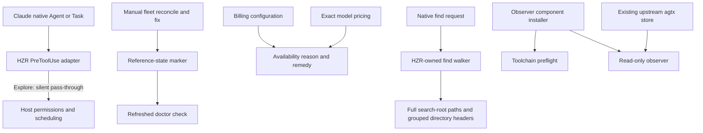

# Contributor issues and pull requests: critical review

Date: 2026-09-10. Base: a81b38ab8c6deed4b6655c28a2f92a2b445f2eba.
Contributor: aleksandr-podmoskovniy. Scope: issues #4–#8 and #11; PRs #9 and #10.

## Assessment

Both PRs identify real defects and preserve the intended ownership boundaries.
Integrate their original commits with the maintainer corrections below. All six issues have concrete implementation changes, including the pinned
agtx runtime/observer bundle after the repository owner's Apache-2.0 clarification.
Close them only after their delivery and validation requirements pass.

## Data flow

## Findings and disposition

| Priority | Item | Evidence and correction |
| --- | --- | --- |
| P1 | #11 | `hook_runner::task` denied Explore before checking any workspace. Return silently for Explore; no permission grant, prompt rewrite, planner request, or denial. Generic worker context enrichment is unchanged. |
| P1 | #7 / #10 | `collect_matches` stripped the search root. Accept root preservation. The downstream grouped renderer still shortened directories and sliced UTF-8 at a byte boundary; remove that shortening and add a long Unicode regression. |
| P2 | #4 / #9 | The manual remedy never recorded completion. Accept the manual completion path; refresh the emitted reference-state check/readiness after writing so the same invocation does not print the stale warning. Existing path validation and error aggregation remain. |
| P2 | #5 / #9 | An enabled, fully selected configuration still displayed setup steps. Accept suppression while retaining the specific unavailable reason. Add the missing Fable 5 row independently of Fable 5.1. |
| P2 | #6 / #9 | Missing Cargo was discovered after source fetch. Accept preflight and executable-name errors; add CARGO_HOME discovery, a missing-candidate test, and correct the misleading claim that --source-dir avoids Cargo. |
| P2 | #8 | The two-command UI omitted the existing-board prerequisite. Correct docs, UI and missing-store errors. Both binaries now build from the same patched source, install without source fallback, and are required by bundle smoke. An explicit board command initializes the store. |

## Pricing source verification

[Anthropic's official price table](https://platform.claude.com/docs/en/about-claude/pricing),
checked 2026-09-10, lists Fable 5 at USD 10 input / 50 output / 1 cache read
per million tokens. Fable 5.1 cache read is 0.25. Consequently a 5 → 5.1 alias
would underprice cache reads by four times. The new catalog has a new identity;
its oldest observation date stays 2026-09-05 so untouched rows are not falsely
refreshed. Prices remain public estimates, never subscription invoices or proof
of delivered savings.

## Bundled runtime and licensing

The repository owner confirmed on 2026-09-10 that the applicable upstream
license is Apache-2.0. Preserve the historical MIT manifest label as evidence,
correct the derivative manifest through a separate pinned patch, mark modified
source files and ship the Apache-2.0 text plus HZR modification notices.
`PROVENANCE.json` records the resolution and its source. No dual license is inferred.

Both agtx and hzr-agtx-observer now share a commit and both patches in the engine
lock, build/cache keys and archive manifest. Default bundles require both.
`component install` verifies the shipped observer without invoking Cargo/Git;
an incomplete bundle fails with a repair remedy instead of a network fallback.
`hzr agents board` runs the bundled runtime only on explicit request, preserving
project/store arguments and child exit status. Monitoring remains opt-in and
read-only. The upstream board's ordinary tmux/coding-agent prerequisites remain.

## Scope and verification limits

Native-hook tests exercise the real CLI adapter under isolated configuration,
including an unenrolled directory. They do not claim a live Claude session.
The find fix preserves the root and full directory headers; inherited walker
ignore rules and grouped output are not claimed to be byte-for-byte POSIX find.
No unrelated fork formatting was changed.

Targeted tests passed: pricing version separation, native hook policy, observer
installer/error tests. UI tests and production build passed.
Full source gate passed: 59 suites, 2,940 passed, 0 failed, 3 intentionally
ignored. This local run preceded the version-only bump to 0.9.5; release CI
must validate the exact published commit. The first attempt hit the existing
watcher tombstone timing test while a parallel bundle was compiling; its isolated
rerun and the serial full rerun both passed. No failed run is counted green.
All 535 patched upstream agtx library tests passed under isolated data/config/agent roots.
The UI suite passed 37 tests and the production build. The high-severity npm audit
gate passed, with one existing moderate adm-zip advisory (GHSA-vwc7-r8mq-g2x9)
remaining; this is not reported as a vulnerability-free dependency graph.
Native bundle and archive installation checks are enforced by the release workflow; the platform receipts and published artifact verification are linked in the issue closure comments.

An extra full-fork rustfmt check reports existing formatting drift in
`fork-core/rtk/src/git.rs` and `tests/git_cli_parity.rs`. Neither PR modifies
those files. The repository's mandatory gate formats the HZR workspace and
separately verifies fork identity, clippy ratchet and deterministic tests.

## Review scores

Subjective review scores, not measurements or acceptance substitutes:

| Category | Score | Rationale |
| --- | --- | --- |
| Code quality | 90/100 | Focused corrections and behavioral regressions; some contributor tests depend on the installed toolchain. |
| Extensibility/modularity | 92/100 | Existing CLI, pricing and inherited-engine boundaries retained. |
| Security | 92/100 | Explore preserves host permissions; no external runtime auto-install or real integration changes. |
| Optimization/performance | 88/100 | Full path fidelity costs output bytes; correctness takes precedence. Existing walker memory complexity remains. |
| Architecture and visualization | 92/100 | Data ownership and native delegation remain explicit. |
| Deploy cleanliness | 80/100 | Native bundle and release delivery must pass before closure; license text, notices and patches are now included. |
