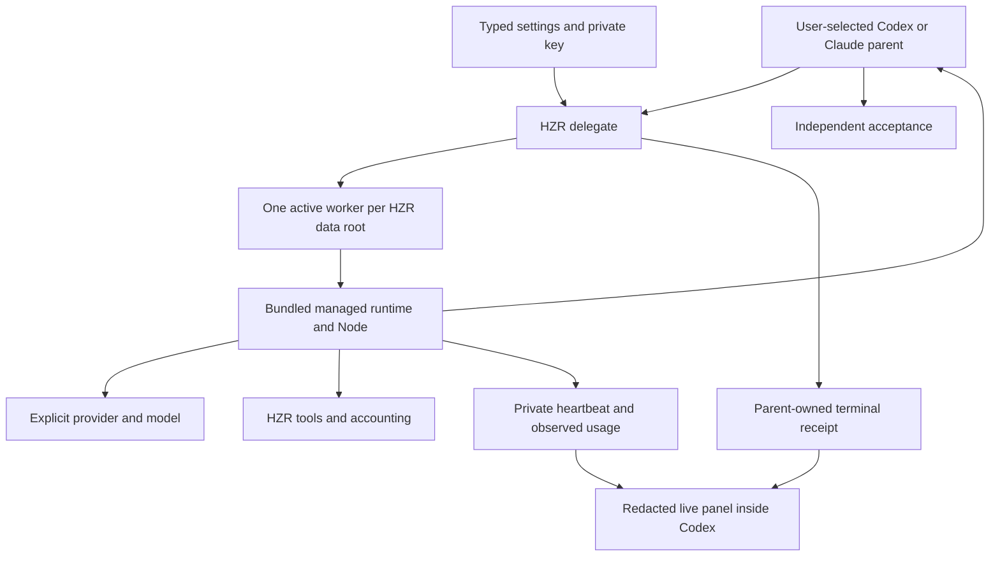

# Code review: configurable HZR delegation

Date: 2026-09-20. Target: 0.9.12. Scope: configuration, credentials, managed
runtime, cancellation, accounting, bundle closure and live visualization.

## Architecture and decision

The shipped path is `hzr settings` → `hzr delegate` → existing managed worker
bridge → the configured provider. Any user-selected Codex/Claude model remains
the parent. The pinned Astra Flash source provides the orchestration pattern and
retains its original provenance. Its external Router installer is not shipped as
an HZR command: it would introduce end-user downloads and a second service.

There is no runtime dependency on Git, npm, Python, pip, uv or Codex Router.
Hidden key entry is compiled Rust. Production JS dependencies and Node already
belong to the HZR bundle. Upstream Python files are archived provenance and
build-time regression inputs, not an end-user installer.

## Findings resolved

| Severity | Finding | Resolution and evidence |
|---|---|---|
| P1 | Bridge waited forever for stdin EOF | Drop ChildStdin after shutdown; fake bridge now waits for EOF; regression passed |
| P1 | Undefined runtime version in ready event | Use the verified package/runtime manifest version; live task passed |
| P1 | OpenCode GO session header missing | Stable x-opencode-session and HZR User-Agent; two real managed implementation tasks passed |
| P1 | External Router installation broke bundle closure | Remove external setup surface; use existing managed runtime; bundle smoke exercises an empty external-tool PATH |
| P1 | Fork temporarily inherited a lock descriptor | Explicit unlock on guard drop; regression holds a duplicate descriptor through parent release |
| P1 | Concurrent settings could overwrite a field | Private lock around reload/validate/atomic-write; stale-caller and worker-slot regression tests passed |
| P1 | Timeout/cancellation looked like running work | Separate parent-owned terminal receipt; timeout/drop tests verify descendants terminate and receipt status |
| P2 | Credential metadata and read used different path snapshots | Open nofollow, inspect and read the same file handle; private-file and symlink tests passed |
| P2 | Provider redirects relied on SDK defaults | Reject redirects for configured provider origin; local daemon transport stays separate |
| P2 | Late events could revive a finished worker | Closed terminal progress state ignores subsequent events; regression passed |
| P2 | Lost connection hid retained run cards | Render error banner independently of last snapshot |
| P2 | Project selector misleadingly appeared to scope global worker list | Delegation view explicitly says All workspaces and hides the project selector |
| P2 | HTTP provider failure looked like empty output | Bounded redacted error from failed assistant message |
| P2 | Missing usage appeared as measured zero | Null unless valid nonzero usage observed |
| P2 | New Rust syntax could exceed the supported MSRV | Avoid let chains; cargo check with Rust 1.85.0 passed |

## Evidence and limits

Two managed OpenCode GO / deepseek-v4.1-flash tasks created the requested file
through HZR read/write/exec, each with six independently repeated passing tests.
The second task was observed in the Codex browser panel while Working and after
Worker finished. Its final provider counters were 6,574 uncached input, 815 output
and 12,160 cache-read tokens; four turns and three tool calls, about 8.6 seconds.
These numbers are one observed fixture, not a performance or savings benchmark.

A separate native Codex Router experiment also passed earlier, but does not
validate the shipped path and is not a product runtime dependency. Claude CLI is
installed but unauthenticated, so live Claude-host acceptance is unverified.
OpenRouter/direct DeepSeek selection has offline coverage; no live keys were
supplied for those providers.

The complete source/fork gate passed before release version synchronization.
Workspace Rust formatting, strict clippy, tests, upstream 53 tests, JS bridge
11 tests, private login PTY, and Rust 1.85 checks passed. The release section
must be completed from final bundle/install/CI receipts, not inferred from these.

## Race and privacy boundaries

Settings updates through this command are serialized and reload after locking.
Each private HZR data root admits one delegated worker, releasing the lock on
exit. This is a quota/normal-recursion guard, not an adversarial sandbox.
Bridge progress uses one event-loop writer and atomic replacement. The parent
writes a separate final receipt, so late heartbeat writes cannot erase timeout
or cancellation. Dashboard projection prefers that receipt; abrupt machine or
process loss becomes No heartbeat after 30 seconds. Polls do not overlap,
abort on unmount, time out, and preserve last observed cards on errors.

File tools retain daemon workspace confinement; shell tools retain existing HZR
execution policy. Allowed-file lists are instructions, not filesystem ACLs.
Same-user malicious processes are outside this containment guarantee. Do not
use delegation to bypass host permissions.

The public local endpoint projects only opaque task ID, provider/model, state,
tool name, counters and timestamps. It omits paths, prompts, arguments, outputs,
reasoning and credentials. Keys remain private per user and in memory for the
provider request. Forced termination can leave usage partial; observed counters
are not a provider billing total. Parent acceptance is explicitly not recorded.

## Release gate

Local final-version acceptance passed: complete source/fork gate (2,974 passed,
3 ignored across 62 Rust suites), 53 upstream tests, 11 bridge tests, 38 visualizer
tests, typecheck/build, npm audit (zero vulnerabilities), assembled-bundle smoke
and isolated clean-install smoke. Empty-PATH bundle configuration/runtime checks
passed. The actual supplied key was absent from all 16,513 bundle files scanned.

Installed CLI and daemon report 0.9.12. After the experimental Router service was
removed, a third managed task passed six independently repeated tests through
the user's normal settings and production HZR daemon. The installed panel was
inspected inside Codex.

Public release verification passed on 2026-09-20. Release commit:
`266d4cd957382cdd1df53771abda3589c5cd4921`; immutable tag `v0.9.12`.
[Release workflow](https://github.com/heAdz0r/hzr/actions/runs/35509165382)
and [CI](https://github.com/heAdz0r/hzr/actions/runs/35509165467) succeeded.
All three native bundles passed their configured install smoke. All downloaded
archives matched published SHA256SUMS. The published macOS archive also passed
a separate local clean-install smoke and was installed for the user; CLI and
authenticated daemon report 0.9.12, private settings remained enabled, and the
Codex panel remained available. The installer service restart interrupted its
own managed execution; direct service installation recovered it, then the
installer completed with service restart disabled. No gate was bypassed.
[Stable Latest release](https://github.com/heAdz0r/hzr/releases/tag/v0.9.12).

## Local host diagnostics after installation

The published bundle and daemon checks passed, but the machine-wide doctor is
not fully green. It reports one grepai ownership error; process inspection showed
that watcher parent was the active HZR daemon. This discrepancy remains
unresolved and the post-upgrade reference marker therefore records errors.
No unrelated watcher was terminated. The isolated test daemon and UI proxy
created for this review were stopped.

Other warnings are explicit integration boundaries: Claude Desktop is selected
for a different workspace, and global response replacement/billing credit is
not confirmed for Codex or Claude. The fleet preview covered 118 workspaces,
with no workspace errors, owner conflicts or unresolved indexes. Reconciliation
did not clear the grepai diagnostic. These host diagnostics are not evidence of
failed release CI, nor grounds for claiming complete machine health.

## Reviewer assessment

The design reuses HZR's existing control plane and runtime, bounds work and
makes provider identity inspectable. The single-worker default deliberately
limits concurrency. Model/provider availability and tool compatibility remain
external constraints; no claim that every arbitrary model works or that every
delegated task saves tokens is made.
